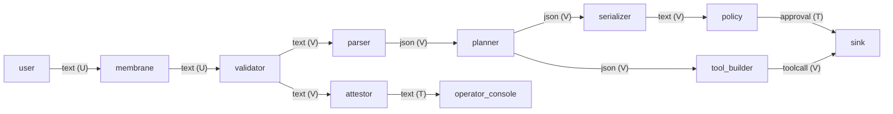

# Example 26: Guarded Toolchain

```mermaid
flowchart LR
  user[user] -->|"text (U)"| membrane[membrane]
  membrane -->|"text (U)"| validator[validator]
  validator -->|"text (V)"| parser[parser]
  parser -->|"json (V)"| planner[planner]
  planner -->|"json (V)"| serializer[serializer]
  serializer -->|"text (V)"| policy[policy]
  policy -->|"approval (T)"| sink[sink]
  planner -->|"json (V)"| tool_builder[tool_builder]
  tool_builder -->|"toolcall (V)"| sink
  validator -->|"text (V)"| attestor[attestor]
  attestor -->|"text (T)"| operator_console[operator_console]
```
