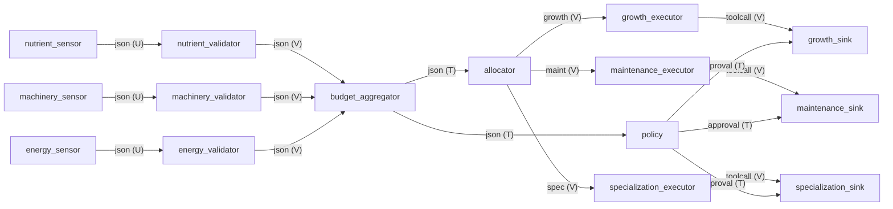

# Example 27: Resource Allocator

```mermaid
flowchart LR
  nutrient_sensor[nutrient_sensor] -->|"json (U)"| nutrient_validator[nutrient_validator]
  machinery_sensor[machinery_sensor] -->|"json (U)"| machinery_validator[machinery_validator]
  energy_sensor[energy_sensor] -->|"json (U)"| energy_validator[energy_validator]

  nutrient_validator -->|"json (V)"| budget_aggregator[budget_aggregator]
  machinery_validator -->|"json (V)"| budget_aggregator
  energy_validator -->|"json (V)"| budget_aggregator

  budget_aggregator -->|"json (T)"| allocator[allocator]
  budget_aggregator -->|"json (T)"| policy[policy]

  allocator -->|"growth (V)"| growth_executor[growth_executor]
  allocator -->|"maint (V)"| maintenance_executor[maintenance_executor]
  allocator -->|"spec (V)"| specialization_executor[specialization_executor]

  growth_executor -->|"toolcall (V)"| growth_sink[growth_sink]
  maintenance_executor -->|"toolcall (V)"| maintenance_sink[maintenance_sink]
  specialization_executor -->|"toolcall (V)"| specialization_sink[specialization_sink]

  policy -->|"approval (T)"| growth_sink
  policy -->|"approval (T)"| maintenance_sink
  policy -->|"approval (T)"| specialization_sink
```
