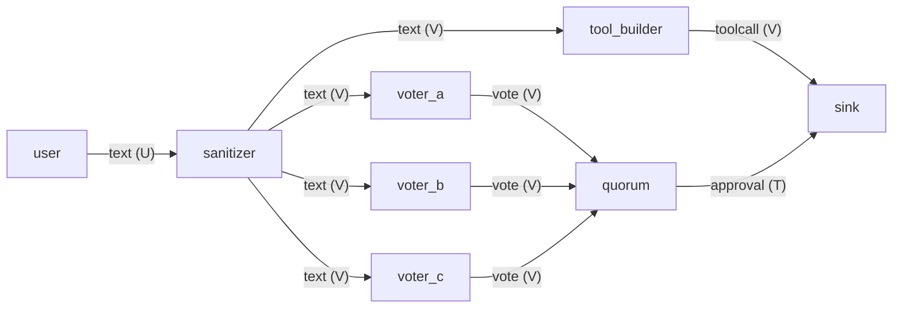

# Example 28: Quorum Consensus Gate

```mermaid
flowchart LR
  user[user] -->|"text (U)"| sanitizer[sanitizer]
  sanitizer -->|"text (V)"| voter_a[voter_a]
  sanitizer -->|"text (V)"| voter_b[voter_b]
  sanitizer -->|"text (V)"| voter_c[voter_c]

  voter_a -->|"vote (V)"| quorum[quorum]
  voter_b -->|"vote (V)"| quorum
  voter_c -->|"vote (V)"| quorum

  sanitizer -->|"text (V)"| tool_builder[tool_builder]
  tool_builder -->|"toolcall (V)"| sink[sink]
  quorum -->|"approval (T)"| sink
```
