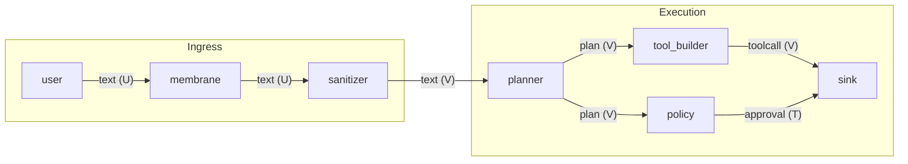

# Example 30: Composed System

```mermaid
flowchart LR
  subgraph ingress [Ingress]
    user[user] -->|"text (U)"| membrane[membrane]
    membrane -->|"text (U)"| sanitizer[sanitizer]
  end

  subgraph execution [Execution]
    planner[planner] -->|"plan (V)"| tool_builder[tool_builder]
    planner -->|"plan (V)"| policy[policy]
    tool_builder -->|"toolcall (V)"| sink[sink]
    policy -->|"approval (T)"| sink
  end

  sanitizer -->|"text (V)"| planner
```
