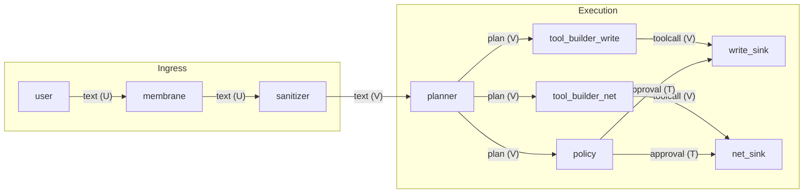

# Example 31: Composed Effects

```mermaid
flowchart LR
  subgraph ingress [Ingress]
    user[user] -->|"text (U)"| membrane[membrane]
    membrane -->|"text (U)"| sanitizer[sanitizer]
  end

  subgraph execution [Execution]
    planner[planner] -->|"plan (V)"| tool_builder_write[tool_builder_write]
    planner -->|"plan (V)"| tool_builder_net[tool_builder_net]
    planner -->|"plan (V)"| policy[policy]
    tool_builder_write -->|"toolcall (V)"| write_sink[write_sink]
    tool_builder_net -->|"toolcall (V)"| net_sink[net_sink]
    policy -->|"approval (T)"| write_sink
    policy -->|"approval (T)"| net_sink
  end

  sanitizer -->|"text (V)"| planner
```
