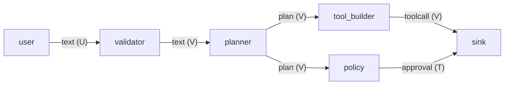

# Example 32: Wiring Diagram Execution

```mermaid
flowchart LR
  user[user] -->|"text (U)"| validator[validator]
  validator -->|"text (V)"| planner[planner]
  planner -->|"plan (V)"| tool_builder[tool_builder]
  planner -->|"plan (V)"| policy[policy]
  tool_builder -->|"toolcall (V)"| sink[sink]
  policy -->|"approval (T)"| sink
```
