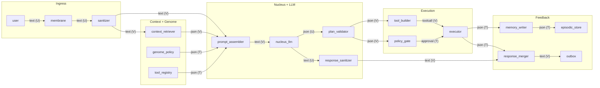

# Example 34: Nucleus LLM Integration

```mermaid
flowchart LR
  subgraph ingress [Ingress]
    user[user] -->|"text (U)"| membrane[membrane]
    membrane -->|"text (U)"| sanitizer[sanitizer]
  end

  subgraph context [Context + Genome]
    context_retriever[context_retriever]
    genome_policy[genome_policy]
    tool_registry[tool_registry]
  end

  subgraph nucleus [Nucleus + LLM]
    prompt_assembler[prompt_assembler]
    nucleus_llm[nucleus_llm]
    plan_validator[plan_validator]
    response_sanitizer[response_sanitizer]
  end

  subgraph execution [Execution]
    policy_gate[policy_gate]
    tool_builder[tool_builder]
    executor[executor]
  end

  subgraph feedback [Feedback]
    memory_writer[memory_writer]
    episodic_store[episodic_store]
    response_merger[response_merger]
    outbox[outbox]
  end

  sanitizer -->|"text (V)"| context_retriever
  sanitizer -->|"text (V)"| prompt_assembler
  context_retriever -->|"json (V)"| prompt_assembler
  genome_policy -->|"json (T)"| prompt_assembler
  tool_registry -->|"json (T)"| prompt_assembler

  prompt_assembler -->|"text (V)"| nucleus_llm
  nucleus_llm -->|"json (U)"| plan_validator
  nucleus_llm -->|"text (U)"| response_sanitizer

  plan_validator -->|"json (V)"| policy_gate
  plan_validator -->|"json (V)"| tool_builder

  tool_builder -->|"toolcall (V)"| executor
  policy_gate -->|"approval (T)"| executor

  executor -->|"json (T)"| memory_writer
  executor -->|"json (T)"| response_merger

  memory_writer -->|"json (T)"| episodic_store
  response_sanitizer -->|"text (V)"| response_merger
  response_merger -->|"text (V)"| outbox
```
