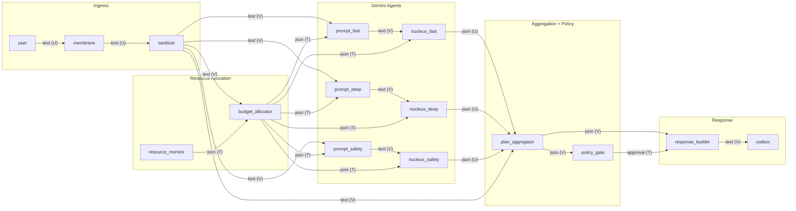

# Example 36: Multi-Gemini Resource Allocation

```mermaid
flowchart LR
  subgraph ingress [Ingress]
    user[user] -->|"text (U)"| membrane[membrane]
    membrane -->|"text (U)"| sanitizer[sanitizer]
  end

  subgraph allocation [Resource Allocation]
    resource_monitor[resource_monitor]
    budget_allocator[budget_allocator]
  end

  subgraph agents [Gemini Agents]
    prompt_fast[prompt_fast]
    nucleus_fast[nucleus_fast]
    prompt_deep[prompt_deep]
    nucleus_deep[nucleus_deep]
    prompt_safety[prompt_safety]
    nucleus_safety[nucleus_safety]
  end

  subgraph decision [Aggregation + Policy]
    plan_aggregator[plan_aggregator]
    policy_gate[policy_gate]
  end

  subgraph response [Response]
    response_builder[response_builder]
    outbox[outbox]
  end

  sanitizer -->|"text (V)"| budget_allocator
  resource_monitor -->|"json (T)"| budget_allocator

  sanitizer -->|"text (V)"| prompt_fast
  budget_allocator -->|"json (T)"| prompt_fast
  sanitizer -->|"text (V)"| prompt_deep
  budget_allocator -->|"json (T)"| prompt_deep
  sanitizer -->|"text (V)"| prompt_safety
  budget_allocator -->|"json (T)"| prompt_safety

  prompt_fast -->|"text (V)"| nucleus_fast
  budget_allocator -->|"json (T)"| nucleus_fast
  prompt_deep -->|"text (V)"| nucleus_deep
  budget_allocator -->|"json (T)"| nucleus_deep
  prompt_safety -->|"text (V)"| nucleus_safety
  budget_allocator -->|"json (T)"| nucleus_safety

  nucleus_fast -->|"json (U)"| plan_aggregator
  nucleus_deep -->|"json (U)"| plan_aggregator
  nucleus_safety -->|"json (U)"| plan_aggregator
  sanitizer -->|"text (V)"| plan_aggregator

  plan_aggregator -->|"json (V)"| policy_gate
  plan_aggregator -->|"json (V)"| response_builder
  policy_gate -->|"approval (T)"| response_builder
  response_builder -->|"text (V)"| outbox
```
