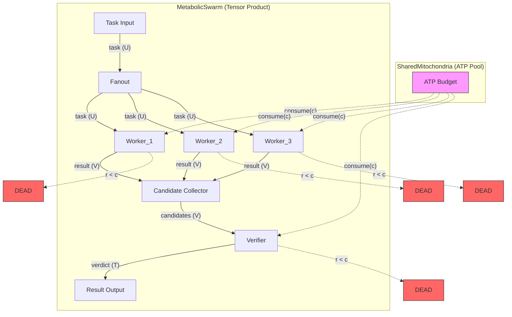

# Example 37: Metabolic Swarm Budgeting

This diagram illustrates the Metabolic Coalgebra formalism where agents share
a finite token budget. The structure map alpha: S -> P(S) + bot is partial,
returning bot (apoptosis) when resources are insufficient.



## Coalgebraic Interpretation

```
State S = L × R  (Logical State × Resource State)

Transition: alpha(l, r) = | (l', r - c)  if r >= c
                          | bot          if r < c  (Apoptosis)

Halting Guarantee: R is strictly decreasing, bounded below by 0
```

## Termination Conditions

| Condition | Cause | Description |
|-----------|-------|-------------|
| Solution verified | `solved` | Worker found solution, verifier confirmed |
| Budget exhausted | `ischemia` | Global ATP reached 0 |
| All workers dead | `swarm_collapse` | All workers starved before solution |
| Verifier dead | `verifier_death` | Verifier starved during verification |
| Cycle limit | `entropy_limit` | Max iterations reached (entropy check) |

Legend: U = UNTRUSTED, V = VALIDATED, T = TRUSTED, c = cost per step, r = remaining budget.
