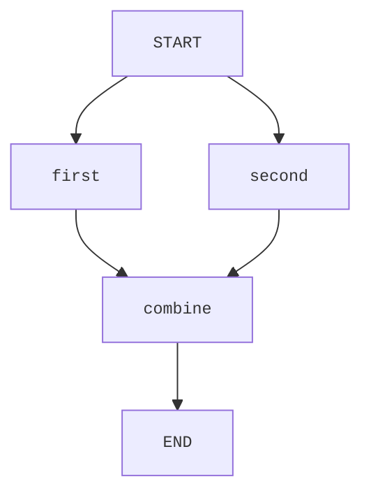

# Orcheo Python SDK

The Python SDK offers a strongly typed way to generate Orcheo workflow requests without forcing a specific HTTP client dependency.

## Server-side workflow execution

> **Breaking change:** The SDK no longer supports executing workflows locally within the client process. All executions now run on the
> Orcheo backend. To migrate, deploy your workflow as before and trigger runs via the HTTP API while streaming updates over a WebSocket
> connection. The new [`examples/quickstart/sdk_server_trigger.py`](../../examples/quickstart/sdk_server_trigger.py) script shows an end-to-end
> interaction pattern, including payload construction and streaming result handling.

High-level steps:

1. Model the workflow graph using the SDK types shown below.
2. Deploy the workflow to the Orcheo backend.
3. Trigger runs using `OrcheoClient.workflow_trigger_url()` or the `HttpWorkflowExecutor`.
4. Subscribe to live updates with `OrcheoClient.websocket_url()` and send the payload returned from `client.build_payload(...)`.

The sections that follow focus on authoring the graph configuration and preparing the payloads required by the server APIs.

## Workflow authoring

```python
from pydantic import BaseModel
from orcheo_sdk import OrcheoClient, Workflow, WorkflowNode


class UppercaseConfig(BaseModel):
    prefix: str


class UppercaseNode(WorkflowNode[UppercaseConfig]):
    type_name = "Uppercase"


workflow = Workflow(name="demo")
workflow.add_node(UppercaseNode("upper", UppercaseConfig(prefix="Result: ")))

# Prepare deployment request metadata for the Orcheo backend
client = OrcheoClient(base_url="http://localhost:8000")
request = client.build_deployment_request(workflow)
```

### Multi-node workflows

Edges between nodes are derived from the dependencies you provide when registering
each node. Every dependency is converted into an edge in the exported graph, so
you only need to describe how data should flow between nodes:



```python
workflow = Workflow(name="fan-in")

workflow.add_node(UppercaseNode("first", UppercaseConfig(prefix="A: ")))
workflow.add_node(UppercaseNode("second", UppercaseConfig(prefix="B: ")))
workflow.add_node(
    AppendNode("combine", AppendConfig(suffix="!")),
    depends_on=["first", "second"],
)

graph_config = workflow.to_graph_config()
assert graph_config["edges"] == [
    ("START", "first"),
    ("START", "second"),
    ("combine", "END"),
    ("first", "combine"),
    ("second", "combine"),
]
```

> **Note:** Workflows should be deployed to the managed Orcheo runtime for
> execution once you are happy with the authored graph configuration.

## Usage

### Python Client

```python
from orcheo_sdk import OrcheoClient

client = OrcheoClient(base_url="http://localhost:8000")
trigger_url = client.workflow_trigger_url("example-workflow")
ws_url = client.websocket_url("example-workflow")
payload = client.build_payload(graph_config, inputs={"name": "Ada"})
```

Refer to [`examples/quickstart/sdk_server_trigger.py`](../../examples/quickstart/sdk_server_trigger.py) for a complete async implementation
that streams updates, handles connection failures gracefully, and shuts down once the workflow run finishes.

### Command Line Interface

The SDK includes a comprehensive CLI for managing workflows, nodes, and credentials. All commands support caching and offline mode.

#### Global Options

Available on all commands:

- `--profile` - Profile name from the CLI config
- `--api-url` - Override the API URL
- `--service-token` - Override the service token
- `--offline` - Use cached data when network calls fail
- `--cache-ttl` - Cache TTL in hours for offline data (default: 24)

#### Commands Reference

##### Workflow Management

| Command | Description | Key Options |
|---------|-------------|-------------|
| `orcheo workflow list` | List workflows with metadata | `--archived` - Include archived workflows |
| `orcheo workflow show <id>` | Display workflow details, versions, and runs | - |
| `orcheo workflow run <id>` | Trigger a workflow execution | `--actor` - Actor name (default: "cli")<br>`--inputs` - JSON inputs payload<br>`--inputs-file` - Path to JSON inputs file |
| `orcheo workflow delete <id>` | Delete a workflow | `--force` - Skip confirmation prompt |
| `orcheo workflow upload <file>` | Upload workflow from Python or JSON file | `--id` - Workflow ID (for updates)<br>`--config` - JSON runnable config payload<br>`--config-file` - JSON runnable config file |
| `orcheo workflow download <id>` | Download workflow configuration | `-o, --output` - Output file path<br>`-f, --format` - Format: json or python (default: json) |

**Examples:**

```bash
# List all workflows including archived ones
orcheo workflow list --archived

# Show workflow details
orcheo workflow show my-workflow-id

# Run a workflow with inputs
orcheo workflow run my-workflow-id --inputs '{"name": "Ada"}'
orcheo workflow run my-workflow-id --inputs-file inputs.json

# Upload a workflow from Python file
orcheo workflow upload workflow.py

# Update existing workflow
orcheo workflow upload workflow.py --id my-workflow-id

# Upload with runnable config defaults (stored per version)
orcheo workflow upload workflow.py --config '{"tags": ["support"], "max_concurrency": 4}'

# Download workflow as JSON
orcheo workflow download my-workflow-id -o workflow.json

# Download workflow as Python template
orcheo workflow download my-workflow-id -o workflow.py -f python

# Delete a workflow
orcheo workflow delete my-workflow-id --force
```

Avoid putting secrets in runnable configs; use environment variables or credential vaults instead.

##### Node Management

| Command | Description | Key Options |
|---------|-------------|-------------|
| `orcheo node list` | List registered nodes | `--tag` - Filter by category keyword |
| `orcheo node show <name>` | Display node metadata and schema | - |

**Examples:**

```bash
# List all nodes
orcheo node list

# Filter nodes by tag
orcheo node list --tag ai

# Show node details
orcheo node show AINode
```

##### Credential Management

| Command | Description | Key Options |
|---------|-------------|-------------|
| `orcheo credential list` | List accessible credentials | `--workflow-id` - Filter by workflow |
| `orcheo credential create <name>` | Create a new credential | `--provider` - Provider identifier (required)<br>`--secret` - Secret value (required)<br>`--actor` - Actor name (default: "cli")<br>`--access` - Access level: private/shared/public<br>`--workflow-id` - Workflow scope<br>`--scope` - Scopes (repeatable)<br>`--kind` - Credential kind |
| `orcheo credential delete <id>` | Delete a credential | `--workflow-id` - Workflow scope<br>`--force` - Skip confirmation |

**Examples:**

```bash
# List all credentials
orcheo credential list

# List credentials for a workflow
orcheo credential list --workflow-id my-workflow-id

# Create a credential
orcheo credential create my-api-key \
  --provider openai \
  --secret sk-xxx \
  --access private

# Delete a credential
orcheo credential delete cred-id --force
```

##### Code Generation

| Command | Description | Key Options |
|---------|-------------|-------------|
| `orcheo code scaffold <id>` | Generate Python trigger snippet | `--actor` - Actor name (default: "cli") |

**Examples:**

```bash
# Generate Python code to trigger a workflow
orcheo code scaffold my-workflow-id
```

#### Configuration

##### Environment Variables

- `ORCHEO_PROFILE` - Default profile to use
- `ORCHEO_API_URL` - API base URL (default: `http://localhost:8000`)
- `ORCHEO_SERVICE_TOKEN` - Service authentication token
- `ORCHEO_CONFIG_DIR` - Override config directory (default: `~/.config/orcheo/`)
- `ORCHEO_CACHE_DIR` - Override cache directory (default: `~/.cache/orcheo/`)

##### Profile Configuration

Create `~/.config/orcheo/cli.toml`:

```toml
[profiles.default]
api_url = "http://localhost:8000"
service_token = "your-token-here"

[profiles.production]
api_url = "https://api.orcheo.example.com"
service_token = "prod-token"
```

Use profiles with `--profile`:

```bash
orcheo --profile production workflow list
```

## Development

```bash
uv sync --all-groups
uv run pytest tests/sdk -q
```
