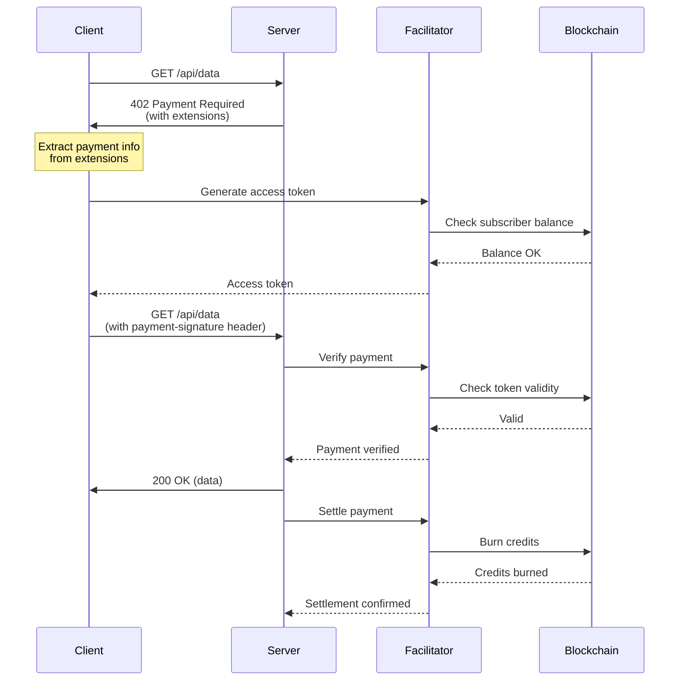
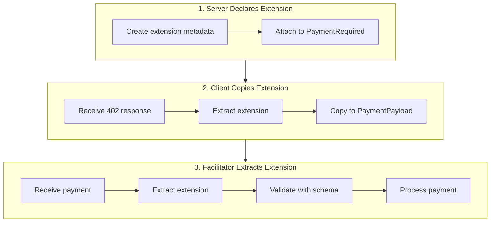
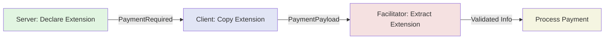

# X402 Payment Protocol with Nevermined

> **Python implementation of x402 v2 extensions** - Add credit-based payments to your AI agents in minutes.

This module enables AI agents to charge for services using Nevermined's credit system through the X402 payment protocol. It supports both simple HTTP APIs and agent-to-agent communication protocols (A2A/AP2).

## Table of Contents

- [Quickstart](#quickstart)
- [Usage Scenarios](#usage-scenarios)
  - [Without A2A/AP2 (Simple HTTP)](#without-a2aap2-simple-http)
  - [With A2A Protocol](#with-a2a-protocol)
  - [With AP2 Protocol](#with-ap2-protocol)
- [How X402 Works](#how-x402-works)
  - [Payment Flow](#payment-flow)
  - [Extensions System](#extensions-system)
  - [Nevermined Extension](#nevermined-extension)
- [V1 vs V2 Extensions](#v1-vs-v2-extensions)
- [API Reference](#api-reference)

---

## Quickstart

### Installation

```bash
pip install payments-py
```

### Server Side (Charging for Services)

```python
from payments_py.x402 import NeverminedFacilitator
from payments_py.x402.types_v2 import PaymentRequiredResponseV2, ResourceInfo
from payments_py.x402.extensions.nevermined import (
    declare_nevermined_extension,
    NEVERMINED
)

# Initialize facilitator
facilitator = NeverminedFacilitator(
    nvm_api_key="nvm:your-merchant-key",
    environment="sandbox"
)

# Declare payment requirements using v2 extension
extension = declare_nevermined_extension(
    plan_id="your-plan-id",
    agent_id="your-agent-id",
    max_amount="2",  # Credits to charge
    network="base-sepolia",
    scheme="contract"
)

# Return 402 Payment Required
payment_required = PaymentRequiredResponseV2(
    x402_version=2,
    resource=ResourceInfo(url="https://api.example.com/my-service"),
    accepts=[],  # Payment mechanisms accepted
    extensions={
        NEVERMINED: extension  # Attach Nevermined payment info
    }
)

# When payment received, verify and settle
verify_result = await facilitator.verify(payment_payload, requirements)
if verify_result.is_valid:
    # Provide service...
    settle_result = await facilitator.settle(payment_payload, requirements)
```

### Client Side (Paying for Services)

```python
from payments_py import Payments, PaymentOptions
from payments_py.x402.extensions.nevermined import extract_nevermined_info

# Initialize payments
payments = Payments.get_instance(
    PaymentOptions(
        nvm_api_key="nvm:your-subscriber-key",
        environment="sandbox"
    )
)

# Fetch resource, get 402 response with extension
response = fetch_protected_resource()  # Returns PaymentRequiredResponseV2

# Extract Nevermined payment info
nvm_info = extract_nevermined_info(response, None)

# Generate X402 access token
token = payments.x402.get_x402_access_token(
    plan_id=nvm_info["plan_id"],
    agent_id=nvm_info["agent_id"]
)["accessToken"]

# Create payment payload with extension
payment_payload = {
    "x402Version": 2,
    "scheme": "contract",
    "network": nvm_info["network"],
    "payload": {"session_key": token},
    "extensions": response["extensions"]  # Copy extensions from 402 response
}

# Retry request with payment
result = fetch_protected_resource(payment=payment_payload)
```

That's it! Your AI agent now charges credits for services.

---

## Usage Scenarios

### Without A2A/AP2 (Simple HTTP)

Use the x402 module directly with any HTTP framework (FastAPI, Flask, etc.).

#### FastAPI Example

```python
from fastapi import FastAPI, Header, HTTPException
from payments_py.x402 import NeverminedFacilitator
from payments_py.x402.types_v2 import PaymentRequiredResponseV2, ResourceInfo
from payments_py.x402.extensions.nevermined import (
    declare_nevermined_extension,
    NEVERMINED
)

app = FastAPI()

facilitator = NeverminedFacilitator(
    nvm_api_key="nvm:merchant-key",
    environment="sandbox"
)

@app.get("/api/data")
async def get_data(x_payment: str | None = Header(None)):
    if not x_payment:
        # Return 402 Payment Required with v2 extension
        extension = declare_nevermined_extension(
            plan_id="your-plan-id",
            agent_id="your-agent-id",
            max_amount="2"
        )

        payment_required = PaymentRequiredResponseV2(
            x402_version=2,
            resource=ResourceInfo(url="https://api.example.com/api/data"),
            accepts=[],
            extensions={NEVERMINED: extension}
        )

        raise HTTPException(
            status_code=402,
            detail=payment_required.model_dump(by_alias=True)
        )

    # Parse and verify payment
    import json
    payment = json.loads(x_payment)

    verify_result = await facilitator.verify(payment, requirements)
    if not verify_result.is_valid:
        raise HTTPException(status_code=403, detail="Invalid payment")

    # Provide service
    data = {"result": "your protected data"}

    # Settle payment
    await facilitator.settle(payment, requirements)

    return data
```

#### Flask Example

```python
from flask import Flask, request, jsonify
from payments_py.x402 import NeverminedFacilitator
import asyncio

app = Flask(__name__)

facilitator = NeverminedFacilitator(
    nvm_api_key="nvm:merchant-key",
    environment="sandbox"
)

@app.route("/api/data")
def get_data():
    payment_token = request.headers.get("payment-signature")

    if not payment_token:
        # Return 402 Payment Required
        return jsonify({
            "x402Version": 2,
            "resource": {"url": "https://api.example.com/api/data"},
            "accepts": [],
            "extensions": {
                "nevermined": declare_nevermined_extension(
                    plan_id="your-plan-id",
                    agent_id="your-agent-id",
                    max_amount="2"
                )
            }
        }), 402

    # Verify payment
    import json
    payment = json.loads(x_payment)
    verify_result = asyncio.run(facilitator.verify(payment, requirements))

    if not verify_result.is_valid:
        return jsonify({"error": "Invalid payment"}), 403

    # Provide service and settle
    data = {"result": "your protected data"}
    asyncio.run(facilitator.settle(payment, requirements))

    return jsonify(data)
```

### With A2A Protocol

The X402 module integrates seamlessly with [A2A (Agent-to-Agent) protocol](https://github.com/google-a2a/a2a) through [A2A x402](https://github.com/google-a2a/a2a-x402).

#### Server (Merchant Agent)

```python
from x402_a2a.server import x402ServerExecutor
from payments_py.x402 import NeverminedFacilitator

# Your base agent executor
async def my_agent_executor(task):
    # Your agent logic
    return {"result": "agent response"}

# Wrap with payment protection
facilitator = NeverminedFacilitator(
    nvm_api_key="nvm:merchant-key",
    environment="sandbox"
)

protected_executor = x402ServerExecutor(
    base_executor=my_agent_executor,
    facilitator=facilitator,
    payment_config={
        "plan_id": "your-plan-id",
        "agent_id": "your-agent-id",
        "max_amount": "2",
        "network": "base-sepolia",
        "scheme": "contract"
    }
)

# The executor automatically:
# 1. Checks for payment in incoming tasks
# 2. Returns payment-required response if no payment
# 3. Verifies payment before executing
# 4. Settles payment after execution
```

#### Client (Subscriber Agent)

```python
from x402_a2a.client import x402ClientAgent
from payments_py import Payments, PaymentOptions

# Initialize payments
payments = Payments.get_instance(
    PaymentOptions(
        nvm_api_key="nvm:subscriber-key",
        environment="sandbox"
    )
)

# Create payment token generator
def generate_token(plan_id: str, agent_id: str) -> str:
    result = payments.x402.get_x402_access_token(plan_id, agent_id)
    return result["accessToken"]

# Create x402-enabled client
client = x402ClientAgent(
    base_agent=your_base_agent,
    generate_token=generate_token
)

# The client automatically:
# 1. Detects payment-required responses
# 2. Generates payment tokens
# 3. Retries requests with payment
```

### With AP2 Protocol

[AP2 (Agent Protocol v2)](https://github.com/nevermined-io/agent-protocol) from Nevermined extends A2A with additional features. The x402 module works seamlessly with AP2:

```python
from ap2.server import AP2ServerExecutor
from payments_py.x402 import NeverminedFacilitator

facilitator = NeverminedFacilitator(
    nvm_api_key="nvm:merchant-key",
    environment="sandbox"
)

# AP2 server with payment protection
server = AP2ServerExecutor(
    base_executor=your_executor,
    facilitator=facilitator,
    payment_config={
        "plan_id": "your-plan-id",
        "agent_id": "your-agent-id",
        "max_amount": "2"
    }
)

# AP2 provides additional features:
# - Service discovery
# - Protocol negotiation
# - Enhanced metadata
# - Advanced payment orchestration
```

---

## How X402 Works

X402 is an HTTP-based payment protocol that allows servers to charge for resources using the HTTP 402 Payment Required status code.

### Payment Flow



**Key Points:**

1. **Server declares requirements** - Uses v2 extensions to communicate payment details
2. **Client detects and pays** - Extracts requirements, generates token, retries with payment
3. **Server verifies** - Checks payment validity before providing service
4. **Server settles** - Burns credits on-chain after service delivery

### Extensions System

Extensions are optional metadata that can be attached to payment-protected resources. They follow a structured pattern to enable communication between different participants in the payment flow.

#### The `info` + `schema` Pattern

All extensions follow the same two-part structure:

```python
{
    "info": {
        # The actual extension data
        "plan_id": "123",
        "agent_id": "456",
        "max_amount": "2"
    },
    "schema": {
        # JSON Schema that validates the info
        "$schema": "https://json-schema.org/draft/2020-12/schema",
        "type": "object",
        "properties": {
            "plan_id": {"type": "string"},
            "agent_id": {"type": "string"},
            "max_amount": {"type": "string"}
        },
        "required": ["plan_id", "agent_id", "max_amount"]
    }
}
```

**Why this pattern?**

- **Self-validating**: Schema validates info, ensuring consistency
- **Machine-readable**: Tools can understand structure automatically
- **Language-agnostic**: Same pattern in Python, TypeScript, Go

#### Extension Flow



**Participant Roles:**

1. **Servers** - Declare extensions to communicate requirements
2. **Clients** - Copy extensions from responses to payment payloads
3. **Facilitators** - Extract and process extension data

### Nevermined Extension

The Nevermined extension enables credit-based payments through the X402 protocol. It supports both single and multiple payment plans.

#### Single Plan Declaration (Server Side)

```python
from payments_py.x402.extensions.nevermined import declare_nevermined_extension, NEVERMINED

# Server declares: "This resource requires Nevermined payment"
extension = declare_nevermined_extension(
    plan_id="85917684554499762134516240562181895926019634254204202319880150802501990701934",
    agent_id="80918427023170428029540261117198154464497879145267720259488529685089104529015",
    max_amount="2",
    network="base-sepolia",
    scheme="contract"
)

# Attach to response
payment_required = {
    "x402Version": 2,
    "resource": {"url": "https://api.example.com/data"},
    "accepts": [...],
    "extensions": {
        NEVERMINED: extension  # Single plan
    }
}
```

#### Multiple Plans Declaration (Server Side)

Offer multiple payment options using **qualified extension keys**:

```python
from payments_py.x402.extensions.nevermined import (
    declare_nevermined_extension,
    nevermined_extension_key
)

# Create different plan extensions
credits_ext = declare_nevermined_extension(
    plan_id="credits-plan-id",
    agent_id="your-agent-id",
    max_amount="2"
)

payasyougo_ext = declare_nevermined_extension(
    plan_id="payasyougo-plan-id",
    agent_id="your-agent-id",
    max_amount="1"
)

# Attach multiple plans with qualified keys
payment_required = {
    "x402Version": 2,
    "resource": {"url": "https://api.example.com/data"},
    "accepts": [...],
    "extensions": {
        nevermined_extension_key("credits"): credits_ext,       # "nevermined:credits"
        nevermined_extension_key("payasyougo"): payasyougo_ext  # "nevermined:payasyougo"
    }
}
```

#### Extraction (Facilitator Side)

```python
from payments_py.x402.extensions.nevermined import (
    extract_nevermined_info,
    extract_all_nevermined_plans
)

# Extract single plan (from PaymentPayload with selected plan)
nvm_info = extract_nevermined_info(payment_payload, payment_requirements)

if nvm_info:
    # Access structured data
    plan_id = nvm_info["plan_id"]
    agent_id = nvm_info["agent_id"]
    max_amount = nvm_info["max_amount"]
    extension_key = nvm_info["extension_key"]  # e.g., "nevermined:credits"

    # Process payment based on extracted info
    # - Verify subscriber has credits
    # - Order more credits if needed
    # - Burn credits on settlement

# Extract all available plans (from PaymentRequired response)
all_plans = extract_all_nevermined_plans(payment_required_response)

for plan in all_plans:
    print(f"Plan: {plan['extension_key']}")
    print(f"  Plan ID: {plan['plan_id']}")
    print(f"  Max Amount: {plan['max_amount']}")
```

**What the Extension Provides:**

- ✅ **Declaration helpers** - Create properly formatted extension metadata
- ✅ **Extraction helpers** - Parse extension data from payloads (single or multiple)
- ✅ **Validation helpers** - JSON Schema validation
- ✅ **Type definitions** - TypedDict types for structure validation
- ✅ **Multiple plans support** - Qualified extension keys for multiple payment options
- ✅ **Backward compatibility** - Supports v1 (extra field) and v2 (extensions)

**Note:** Plan names are not included in extensions. Fetch them from the Nevermined API:

```python
plan_details = payments.plans.get_plan(plan_id=plan["plan_id"])
plan_name = plan_details.get("name", "Unnamed Plan")
```

**Example Data Flow:**



See [extensions/nevermined/README.md](extensions/nevermined/README.md) for detailed documentation.

---

## V1 vs V2 Extensions

### Key Differences

| Feature                | X402 v1                           | X402 v2                                                      |
| ---------------------- | --------------------------------- | ------------------------------------------------------------ |
| **Extension Location** | `PaymentRequirements.extra` field | `PaymentRequired.extensions` and `PaymentPayload.extensions` |
| **Structure**          | Freeform object                   | Structured `{info, schema}` pattern                          |
| **Validation**         | No standard                       | JSON Schema built-in                                         |
| **Self-documentation** | No                                | Yes (schema describes structure)                             |
| **Language support**   | Python only                       | Python, TypeScript, Go                                       |
| **Helpers**            | Manual parsing                    | Declare/extract helpers                                      |

### V1 Example (Legacy)

```python
# V1: Custom data in 'extra' field
payment_requirements = {
    "scheme": "contract",
    "network": "base-sepolia",
    "maxAmountRequired": "2",
    "extra": {
        # Nevermined-specific fields
        "plan_id": "123",
        "agent_id": "456",
        "subscriber_address": "0x..."
    }
}

# V1: Extract manually
extra = payment_requirements.get("extra", {})
plan_id = extra.get("plan_id")
```

### V2 Example (Current)

```python
# V2: Structured extension with schema
extension = {
    "info": {
        # Actual data
        "plan_id": "123",
        "agent_id": "456",
        "max_amount": "2"
    },
    "schema": {
        # Validates info structure
        "$schema": "https://json-schema.org/draft/2020-12/schema",
        "type": "object",
        "properties": {
            "plan_id": {"type": "string"},
            "agent_id": {"type": "string"},
            "max_amount": {"type": "string"}
        },
        "required": ["plan_id", "agent_id", "max_amount"]
    }
}

# V2: In PaymentRequired response
payment_required = {
    "x402Version": 2,
    "resource": {"url": "..."},
    "accepts": [...],
    "extensions": {
        "nevermined": extension  # Named extension
    }
}

# V2: Client copies to PaymentPayload
payment_payload = {
    "x402Version": 2,
    "scheme": "contract",
    "network": "base-sepolia",
    "payload": {...},
    "extensions": payment_required["extensions"]  # Copied by client
}

# V2: Extract with helper
from payments_py.x402.extensions.nevermined import extract_nevermined_info
nvm_info = extract_nevermined_info(payment_payload, payment_requirements)
```

### Migration Path

This implementation supports **both v1 and v2**, allowing for seamless migration:

```python
from payments_py.x402.extensions.nevermined import extract_nevermined_info

# Works with both formats!
nvm_info = extract_nevermined_info(payment_payload, payment_requirements)

# V2: Looks in payment_payload.extensions["nevermined"]
# V1 fallback: Looks in payment_requirements.extra
```

**When to use which:**

- **V1**: Simple use cases, backward compatibility, existing integrations
- **V2**: New implementations, multiple extensions, cross-language compatibility

---

## API Reference

### NeverminedFacilitator

High-level facilitator for payment verification and settlement.

```python
from payments_py.x402 import NeverminedFacilitator

facilitator = NeverminedFacilitator(
    nvm_api_key="nvm:your-key",
    environment="sandbox"  # or "live"
)
```

#### Methods

##### `async verify(payload, requirements) -> VerifyResponse`

Verify payment without settling.

```python
verify_result = await facilitator.verify(payment_payload, requirements)

if verify_result.is_valid:
    print("Payment valid")
else:
    print(f"Invalid: {verify_result.invalid_reason}")
```

**Returns:**

- `is_valid` (bool): Whether payment is valid
- `invalid_reason` (str | None): Reason if invalid

##### `async settle(payload, requirements) -> SettleResponse`

Settle payment by burning credits on-chain.

```python
settle_result = await facilitator.settle(payment_payload, requirements)

if settle_result.success:
    print(f"Settled! TX: {settle_result.transaction}")
else:
    print(f"Failed: {settle_result.error_reason}")
```

**Returns:**

- `success` (bool): Whether settlement succeeded
- `transaction` (str | None): Transaction hash
- `network` (str | None): Network ID
- `error_reason` (str | None): Error message if failed

---

### X402TokenAPI

API class for generating X402 access tokens.

```python
from payments_py import Payments, PaymentOptions

payments = Payments.get_instance(
    PaymentOptions(nvm_api_key="nvm:your-key", environment="sandbox")
)

# Access via payments instance
token_result = payments.x402.get_x402_access_token(plan_id, agent_id)
```

#### Methods

##### `get_x402_access_token(plan_id, agent_id) -> Dict[str, Any]`

Generate X402 access token.

```python
result = payments.x402.get_x402_access_token(
    plan_id="your-plan-id",
    agent_id="your-agent-id"
)

token = result["accessToken"]
```

**Returns:** Dictionary with `accessToken` key and metadata

---

### Extension Helpers (Nevermined)

Helper functions for working with Nevermined extensions.

#### `nevermined_extension_key()`

Generate a qualified extension key for multiple plan support.

```python
from payments_py.x402.extensions.nevermined import nevermined_extension_key

key = nevermined_extension_key("credits")       # "nevermined:credits"
key = nevermined_extension_key("payasyougo")    # "nevermined:payasyougo"
key = nevermined_extension_key("credits-basic") # "nevermined:credits-basic"
```

**Parameters:**

- `plan_type` (str): Plan type identifier

**Returns:** Qualified extension key string

#### `declare_nevermined_extension()`

Create a Nevermined extension for PaymentRequired responses.

```python
from payments_py.x402.extensions.nevermined import declare_nevermined_extension

extension = declare_nevermined_extension(
    plan_id="your-plan-id",
    agent_id="your-agent-id",
    max_amount="2",
    network="base-sepolia",  # optional
    scheme="contract",       # optional
    environment="sandbox"    # optional
)
```

**Parameters:**

- `plan_id` (str): Nevermined pricing plan ID
- `agent_id` (str): Nevermined AI agent ID
- `max_amount` (str): Maximum credits to burn
- `network` (str, optional): Blockchain network (default: "base-sepolia")
- `scheme` (str, optional): Payment scheme (default: "contract")
- `environment` (str, optional): Nevermined environment

**Returns:** `NeverminedExtension` (TypedDict with `info` and `schema`)

**Note:** Plan name is NOT included. Fetch it from the Nevermined API using `payments.plans.get_plan(plan_id)`.

#### `extract_nevermined_info()`

Extract Nevermined information from payment payloads (single plan).

```python
from payments_py.x402.extensions.nevermined import extract_nevermined_info

nvm_info = extract_nevermined_info(
    payment_payload,
    payment_requirements=None,  # optional, for v1 fallback
    validate=True               # optional, validate schema
)

if nvm_info:
    plan_id = nvm_info["plan_id"]
    agent_id = nvm_info["agent_id"]
    max_amount = nvm_info["max_amount"]
    extension_key = nvm_info["extension_key"]  # e.g., "nevermined:credits"
```

**Parameters:**

- `payment_payload` (dict): Payment payload from client
- `payment_requirements` (dict, optional): Payment requirements (for v1 fallback)
- `validate` (bool, optional): Validate against JSON Schema (default: True)

**Returns:** `NeverminedInfo` (TypedDict) or `None` if not found

**Backward Compatibility:** Automatically handles both v2 (extensions) and v1 (extra field) formats.

#### `extract_all_nevermined_plans()`

Extract all Nevermined plans from a payment response (multiple plans).

```python
from payments_py.x402.extensions.nevermined import extract_all_nevermined_plans

plans = extract_all_nevermined_plans(payment_required_response)

for plan in plans:
    print(f"Plan: {plan['extension_key']}")
    print(f"  Plan ID: {plan['plan_id']}")
    print(f"  Agent ID: {plan['agent_id']}")
    print(f"  Max Amount: {plan['max_amount']}")
```

**Parameters:**

- `payment_response` (dict): PaymentRequired response with extensions

**Returns:** `List[NeverminedInfo]` - List of all Nevermined plans found

**Use Case:** Present multiple payment options to users for selection.

#### `validate_nevermined_extension()`

Validate a Nevermined extension using JSON Schema.

```python
from payments_py.x402.extensions.nevermined import validate_nevermined_extension

result = validate_nevermined_extension(extension)

if result["valid"]:
    print("Valid extension")
else:
    print(f"Errors: {result['errors']}")
```

**Returns:** `ValidationResult` (TypedDict with `valid` bool and optional `errors` list)

---

### A2A Integration Utilities

Utilities for managing x402 payment state in A2A/AP2 tasks.

```python
from payments_py.x402 import X402A2AUtils

utils = X402A2AUtils()
```

#### Methods

##### `get_payment_status(task) -> Optional[str]`

Extract payment status from A2A task.

```python
status = utils.get_payment_status(task)
# Returns: "payment_required", "payment_verified", etc.
```

##### `get_payment_requirements(task) -> Optional[PaymentRequired]`

Extract payment requirements from task. Auto-detects v1/v2 format.

```python
requirements = utils.get_payment_requirements(task)
if requirements:
    # Use requirements to generate payment
    pass
```

##### `get_payment_payload(task) -> Optional[PaymentPayload]`

Extract payment payload from task.

```python
payload = utils.get_payment_payload(task)
if payload:
    # Verify the payment
    pass
```

##### `create_payment_required_task(task, payment_required) -> Task`

Create a payment-required task with proper metadata. Supports v1 and v2.

```python
payment_task = utils.create_payment_required_task(
    task,
    payment_required  # NvmPaymentRequiredResponse or PaymentRequiredResponseV2
)
```

##### `record_payment_verified(task) -> Task`

Record payment verification in task metadata.

##### `record_payment_success(task, settle_response) -> Task`

Record successful payment settlement.

##### `record_payment_failure(task, error_code, error_response) -> Task`

Record payment failure with error details.

---

### Type Definitions

#### V2 Types

```python
from payments_py.x402.types_v2 import (
    Extension,                      # Core extension structure
    ResourceInfo,                   # Resource metadata
    PaymentRequiredResponseV2,      # V2 payment required response
    PaymentPayloadV2,               # V2 payment payload
    Extensions                      # Type alias for extensions dict
)
```

#### V1 Types

```python
from payments_py.x402.types import (
    PaymentRequirements,            # Payment specification
    NvmPaymentRequiredResponse,     # V1 payment required response
    PaymentPayload,                 # V1 payment payload
    SessionKeyPayload,              # X402 access token wrapper
    VerifyResponse,                 # Verification result
    SettleResponse                  # Settlement result
)
```

#### Networks and Schemes

```python
from payments_py.x402 import SupportedNetworks, SupportedSchemes

# Networks: "base", "base-sepolia"
# Schemes: "contract" (Nevermined uses smart contract-based payments)
```

---

## Error Handling

All operations can raise `PaymentsError` on failure:

```python
from payments_py.common.payments_error import PaymentsError

try:
    token = payments.x402.get_x402_access_token(plan_id, agent_id)
except PaymentsError as e:
    print(f"Token generation failed: {e}")
```

---

## Environment Variables

```bash
# Merchant/server API key
export NVM_API_KEY_SERVER="nvm:your-merchant-key"

# Subscriber/client API key
export NVM_API_KEY_CLIENT="nvm:your-subscriber-key"

# Environment
export NVM_ENVIRONMENT="sandbox"  # or "live"
```

---

## See Also

- [Nevermined Documentation](https://docs.nevermined.app/) - Complete platform documentation
- [X402 Protocol Specification](https://github.com/coinbase/x402) - X402 payment protocol
- [A2A Protocol](https://github.com/google-a2a/a2a) - Agent-to-Agent communication
- [A2A X402 Specification](https://github.com/google-a2a/a2a-x402) - X402 with A2A
- [AP2 Protocol](https://github.com/nevermined-io/agent-protocol) - Nevermined's Agent Protocol v2
- [Nevermined Extension README](extensions/nevermined/README.md) - Detailed extension docs
