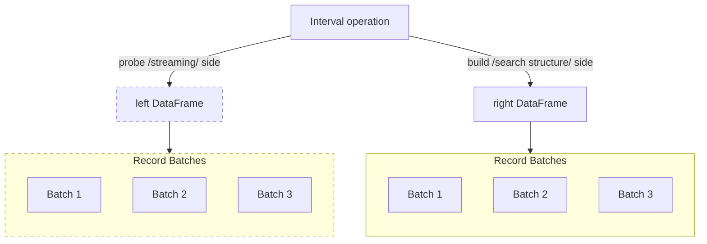

## Supplemental material
This document provides additional information about the algorithms, benchmarking setup, data, and results that were presented in the manuscript.

## Algorithm description
`polars-bio` implements a set of *binary* interval operations on genomic ranges, such as *overlap*, *nearest*, *count-overlaps*, and *coverage*. All these operations share the very similar algorithmic structure, which is presented in the diagram below.




The basic concept is that each operation consists of two sides: the **probe** side and the **build** side. The **probe** side is the one that is streamed, while the **build** side is the one that is implemented as a search data structure (for generic *overlap* operation the search structure can be changed using [algorithm](/polars-bio/api/#polars_bio.range_operations.overlap) parameter, for other operations is always [Cache Oblivious Interval Trees](https://github.com/dcjones/coitrees) as according to the [benchmark](https://github.com/dcjones/coitrees?tab=readme-ov-file#benchmarks) COITrees outperforms other data structures). In the case of *nearest* operation there is an additional sorted list of intervals used for searching for closest intervals in the case of non-existing overlaps.

!!! note
    Available search structure implementations for overlap operation:

    * [COITrees](https://github.com/dcjones/coitrees)
    * [IITree](https://github.com/rust-bio/rust-bio/blob/master/src/data_structures/interval_tree/array_backed_interval_tree.rs)
    * [AVL-tree](https://github.com/rust-bio/rust-bio/blob/master/src/data_structures/interval_tree/avl_interval_tree.rs)
    * [rust-lapper](https://github.com/sstadick/rust-lapper)
    * [superintervals](https://github.com/kcleal/superintervals/) - available since `polars-bio` version `0.12.0`
Once the **build** side data structure is ready, then records from the **probe** side are processed against the search structure organized as record batches. Each record batch can be processed independently. Search structure nodes contains identifiers of the rows from the **build** side that are then used to construct a new record that is returned as a result of the operation.

### Out-of-core (streaming) processing
This algorithm allows you to process your results without requiring **all** your data to be in memory at the same time. In particular, the **probe** side can be streamed from a file stored locally or on a cloud object storage, while the **build** side needs to be fully materialized in memory. In real applications, the **probe** side is usually a large file with genomic intervals, while the **build** side is a smaller file with annotations or other genomic features. This allows you to process large genomic datasets without running out of memory.

!!! note
    1. In this sense, the **order** of the sides is important, as the **probe** side is streamed and processed in batches, while the **build** side is fully materialized in memory.
    2. The **smaller** the *build* side and **larger** the number of overlaps are, the **higher** is the gain of memory efficiency. For instance, when we compare the real `8-7` (`10^7 vs. 1.2*10^6`) and synthetic (`10^7 vs. 10^7`) datasets, we can see that we benefit more from using streaming mode in the **former** benchmark.

### Parallelization
In the current implementation, the **probe** side can be processed in parallel using multiple threads on partitioned (implicitly or explicilty partitioned inputs - see [partitioning strategies](/polars-bio/performance/#parallel-execution-and-scalability)). The **build** side is predominantly single-threaded (with the notable exception of BGZF compressed or partitioned Parquet/CSV input data files reading, which can be parallelized).

### Implementation
`polars-bio` uses the following [Apache DataFusion](https://datafusion.apache.org/) extension points:

 * [DefaultPhysicalPlanner](https://docs.rs/datafusion/43.0.0/datafusion/physical_planner/struct.DefaultPhysicalPlanner.html) and [PhysicalOptimizerRule](https://docs.rs/datafusion/43.0.0/datafusion/physical_optimizer/trait.PhysicalOptimizerRule.html) for detecting and rewriting **generic** interval join operations (i.e. *overlap* and *nearest*) with optimizied execution strategies. This is implemented as a part of our another project [sequila-native](https://github.com/biodatageeks/sequila-native) that exposes optimized interval join operations for Apache DataFusion with both SQL and DataFrame APIs.
 * [TableProvider](https://docs.rs/datafusion/43.0.0/datafusion/catalog/trait.TableProvider.html) and [User-Defined Table Function](https://datafusion.apache.org/library-user-guide/functions/adding-udfs.html#adding-a-user-defined-table-function) mechanism for implementing **specialized** operations, such as *coverage* and *count-overlaps*.


## Comparison with existing tools

The table below compares `polars-bio` with other popular Python libraries for genomic ranges operations.

| Feature/Library                 | polars-bio | Bioframe        | PyRanges0       | PyRanges1  | pybedtools | PyGenomics | GenomicRanges |
|---------------------------------|-----------|-----------------|-----------------|------------|------------|------------|---------------|
| out-of-core processing          |   ✅          | ❌               | ❌               | ❌          | ❌          | ❌          | ❌          | ❌   |
| parallel processing             | ✅         | ❌               | ✅<sup>1</sup>   | ❌ | ❌          | ❌          | ❌             |
| vectorized execution engine     | ✅         | ❌               | ❌               | ❌          | ❌          | ❌          | ❌             |
| cloud object storage support    | ✅         | ✅/❌<sup>2</sup> | ❌               | ❌          | ❌          | ❌          | ✅             |
| Pandas/Polars DataFrame support | ✅/✅       | ✅/❌             | ✅/❌<sup>3</sup> |  ✅/❌<sup>4</sup>           | ❌/❌          | ❌/❌           | ✅/✅             |


!!! note
    <sup>1</sup> PyRanges0 supports parallel processing with [Ray](https://github.com/ray-project/ray), but it does not bring any performance benefits over single-threaded [execution](https://github.com/pyranges/pyranges/issues/363) and it is not recommended. *Overlap* and *nearest* operations benchmark (1,2,4,6,8 threads) on *8-7* on Apple M3 Max platfotm confirms this observation.

    | Library     |   Min (s) |   Max (s) |  Mean (s) | Speedup |
    |-------------|-----------|-----------|-----------|---------|
    | pyranges0   | 16.519153 | 17.889156 | 17.118936 |   1.00x |
    | pyranges0-2 | 32.539549 | 34.858773 | 33.762477 |   0.51x |
    | pyranges0-4 | 30.033927 | 30.367822 | 30.158362 |   0.57x |
    | pyranges0-6 | 27.711752 | 33.280867 | 30.089641 |   0.57x |
    | pyranges0-8 | 30.049501 | 33.257462 | 31.553328 |   0.54x |


    | Library     |  Min (s) |  Max (s) | Mean (s) | Speedup |
    |-------------|----------|----------|----------|---------|
    | pyranges0   | 1.580677 | 1.703093 | 1.630820 |   1.00x |
    | pyranges0-2 | 3.954720 | 4.032619 | 3.997087 |   0.41x |
    | pyranges0-4 | 3.716688 | 4.004058 | 3.847917 |   0.42x |
    | pyranges0-6 | 3.853526 | 3.942475 | 3.883337 |   0.42x |
    | pyranges0-8 | 3.861577 | 3.924950 | 3.902913 |   0.42x |

    <sup>2</sup> Some input functions, such as `read_table` support cloud object storage

    <sup>3</sup> Only export/import with data copying is [supported](https://pyranges.readthedocs.io/en/latest/tutorial.html#pandas-vs-pyranges)

    <sup>4</sup> RangeFrame class extends Pandas DataFrame


## Benchmark setup

### Code and  benchmarking scenarios
[Repository](https://github.com/biodatageeks/polars-bio-bench)


### Memory profiling
For memory profiling Python [memory-profiler](https://github.com/pythonprofilers/memory_profiler) `version 0.61.0` was used. A helper [run-memory-profiler.py](https://github.com/biodatageeks/polars-bio-bench/blob/master/src/run-memory-profiler.py) script was developed and a sample invocation was used to run the tests as it is presented in the snippet below:
```bash
PRFOF_FILE="polars_bio_1-2.dat"
mprof run --output $PRFOF_FILE python src/run-memory-profiler.py --bench-config conf/paper/benchmark-e2e-overlap.yaml --tool polars_bio --test-case 1-2
mprof plot $PRFOF_FILE
```

!!! note
    On each memory profile plot, the maximum memory is marked at the intersection of the two dashed lines.


### Operating systems and hardware configurations

#### macOS

- cpu architecture: `arm64`
- cpu name: `Apple M3 Max`
- cpu cores: `16`
- memory: `64 GB`
- kernel: `Darwin Kernel Version 24.2.0: Fri Dec  6 19:02:12 PST 2024; root:xnu-11215.61.5~2/RELEASE_ARM64_T6031`
- system: `Darwin`
- os-release: `macOS-15.2-arm64-arm-64bit`
- python: `3.12.4`
- polars-bio: `0.8.3`


#### Linux
[c3-standard-22](https://gcloud-compute.com/c3-standard-22.html) machine was used for benchmarking.

- cpu architecture: `x86_64`
- cpu name: `Intel(R) Xeon(R) Platinum 8481C CPU @ 2.70GHz`
- cpu cores: `22`
- memory: `88 GB`
- kernel: `Linux-6.8.0-1025-gcp-x86_64-with-glibc2.35`
- system: `Linux`
- os-release: `#27~22.04.1-Ubuntu SMP Mon Feb 24 16:42:24 UTC 2025`
- python: `3.12.8`
- polars-bio: `0.8.3`

### Software

- [Bioframe](https://github.com/open2c/bioframe)-0.7.2
- [PyRanges0](https://github.com/pyranges/pyranges)-0.0.132
- [PyRanges1](https://github.com/pyranges/pyranges_1.x)-[e634a11](https://github.com/mwiewior/pyranges1/commit/e634a110e7c00d7c5458d69d5e39bec41d23a2fe)
- [pybedtools](https://github.com/daler/pybedtools)-0.10.0
- [PyGenomics](https://gitlab.com/gtamazian/pygenomics)-0.1.1
- [GenomicRanges](https://github.com/BiocPy/GenomicRanges)-0.5.0


### Data
#### Real dataset
The [AIList](https://github.com/databio/AIList) dataset after transcoding into the Parquet file format (with the Snappy compression) was used for benchmarking.
This dataset was published with the AIList paper:

Jianglin Feng , Aakrosh Ratan , Nathan C Sheffield, *Augmented Interval List: a novel data structure for efficient genomic interval search*, Bioinformatics 2019.


| Dataset# | Name             | Size(x1000) | Description                                                                                 |
|:---------|:-----------------|:------------|---------------------------------------------------------------------------------------------|
| 0        | chainRn4         | 2,351       | [Source](https://hgdownload.soe.ucsc.edu/goldenPath/hg19/database/chainRn4.txt.gz)          |
| 1        | fBrain           | 199         | [Source](https://www.ncbi.nlm.nih.gov/geo/query/acc.cgi?acc=GSM595923)                      |
| 2        | exons            | 439         | Dataset used in the BEDTools tutorial.                                                      |
| 3        | chainOrnAna1     | 1,957       | [Source](https://hgdownload.soe.ucsc.edu/goldenPath/hg19/database/chainOrnAna1.txt.gz)      |
| 4        | chainVicPac2     | 7,684       | [Source](https://hgdownload.soe.ucsc.edu/goldenPath/hg19/database/chainVicPac2.txt.gz)      |
| 5        | chainXenTro3Link | 50,981      | [Source](https://hgdownload.soe.ucsc.edu/goldenPath/hg19/database/chainXenTro3Link.txt.gz)  |
| 6        | chainMonDom5Link | 128,187     | [Source](https://hgdownload.soe.ucsc.edu/goldenPath/hg19/database/chainMonDom5Link.txt.gz)  |
| 7        | ex-anno          | 1,194       | Dataset contains GenCode annotations with ~1.2 million lines, mixing all types of features. |
| 8        | ex-rna           | 9,945       | Dataset contains ~10 million direct-RNA mappings.                                           |

Source: [AIList Github](https://github.com/databio/AIList?tab=readme-ov-file#test-results)


| Rank | Dataset 1        | Dataset 2        | # of overlaps   |
  |------|------------------|------------------|-----------------|
| 1    | chainMonDom5Link | chainXenTro3Link | 416,157,506,000 |
| 2    | chainMonDom5Link | chainVicPac2     | 248,984,248,721 |
| 3    | chainVicPac2     | chainXenTro3Link | 117,131,343,532 |
| 4    | chainMonDom5Link | chainOrnAna1     | 52,992,648,116  |
| 5    | chainMonDom5Link | chainRn4         | 27,741,145,443  |
| 6    | chainXenTro3Link | chainOrnAna1     | 26,405,758,645  |
| 7    | chainRn4         | chainXenTro3Link | 18,432,254,632  |
| 8    | chainVicPac2     | chainOrnAna1     | 6,864,638,705   |
| 9    | chainMonDom5Link | ex-rna           | 4,349,989,219   |
| 10   | chainRn4         | chainVicPac2     | 3,892,115,928   |
| 11   | ex-rna           | chainXenTro3Link | 1,830,555,949   |
| ---  | ---------------- | ---------------- | --------------- |
| 12   | chainRn4         | chainOrnAna1     | 1,086,692,495   |
| 13   | ex-rna           | ex-anno          | 307,184,634     |
| 14   | ex-rna           | chainVicPac2     | 227,832,153     |
| 15   | ex-rna           | chainRn4         | 164,196,784     |
| 16   | chainMonDom5Link | exons            | 116,300,901     |
| 17   | ex-rna           | chainOrnAna1     | 109,300,082     |
| 18   | chainXenTro3Link | exons            | 52,395,369      |
| 19   | ex-rna           | exons            | 36,411,474      |
| 20   | chainMonDom5Link | ex-anno          | 33,966,070      |
| 21   | chainXenTro3Link | ex-anno          | 13,693,852      |
| 22   | chainVicPac2     | exons            | 10,566,462      |
| 23   | ex-rna           | fBrain           | 8,385,799       |
| 24   | chainVicPac2     | ex-anno          | 5,745,319       |
| 25   | chainOrnAna1     | ex-anno          | 4,408,383       |
| 26   | chainOrnAna1     | exons            | 3,255,513       |
| 27   | chainRn4         | ex-anno          | 2,761,621       |
| 28   | chainRn4         | exons            | 2,633,098       |
| 29   | chainMonDom5Link | fBrain           | 2,380,147       |
| 30   | fBrain           | chainXenTro3Link | 625,718         |
| 31   | fBrain           | chainOrnAna1     | 398,738         |
| 32   | fBrain           | chainVicPac2     | 357,564         |
| 33   | chainRn4         | fBrain           | 320,955         |
| 34   | ex-anno          | exons            | 273,500         |
| 35   | fBrain           | ex-anno          | 73,437          |
| 36   | fBrain           | exons            | 54,246          |


Source: Calculated with polars-bio (using 0-based coordinates) in streaming mode.


All Parquet files from this dataset shared the same schema:
```sql
  contig STRING
  pos_start INT32
  pos_end INT32
```

#### Synthetic dataset
Randomly generated intervals (100-10,000,000) inspired by [bioframe](http://bioframe.readthedocs.io/en/latest/guide-performance.html) performance analysis.
Generated with [generate_dataset.py](https://github.com/biodatageeks/polars-bio-bench/blob/bioframe-data-generator/src/generate_dataset.py)
```shell
poetry run python src/generate_dataset.py
```
All Parquet files from this dataset shared the same schema:
```sql
  contig STRING
  pos_start INT64
  pos_end INT64
```

!!! note
    Test datasets in the *Parquet* format can be downloaded from:

    * single thread benchmarks
        * [databio.zip](https://drive.google.com/uc?id=1lctmude31mSAh9fWjI60K1bDrbeDPGfm)
        * [random_intervals_20250622_221714-1p.zip](https://drive.google.com/uc?id=1qCkSozLN20B2l6EiYYGqwthZk3_RzYZW)
    * parallel benchmarks (partitioned)
        * [databio-8p.zip](https://drive.google.com/uc?id=1Sj7nTB5gCUq9nbeQOg4zzS4tKO37M5Nd)
        * [random_intervals_20250622_221714-8p.zip](https://drive.google.com/uc?id=1ZvpNAdNFck7XgExJnJm-dwhbBJyW9VAw)


#### Overlap summary

| Test case | polars_bio<sup>1</sup> - # of overlaps | bioframe<sup>2</sup> - # of overlaps | pyranges0 - # of overlaps | pyranges1 - # of overlaps |
|:----------|:---------------------------------------|--------------------------------------|---------------------------|---------------------------|
| 1-2       | 54,246                                 | 54,246                               | 54,246                    | 54,246                    |
| 8-7       | 307,184,634                            | 307,184,634                          | 307,184,634               | 307,184,634               |
| 100       | 781                                    | 781                                  | 781                       | 781                       |
| 1000      | 8,859                                  | 8,859                                | 8,859                     | 8,859                     |
| 10000     | 90,236                                 | 90,236                               | 90,236                    | 90,236                    |
| 100000    | 902,553                                | 902,553                              | 902,553                   | 902,553                   |
| 1000000   | 9,007,817                              | 9,007,817                            | 9,007,817                 | 9,007,817                 |
| 10000000  | 90,005,371                             | 90,005,371                           | 90,005,371                | 90,005,371                |


<sup>1</sup> bioframe and pyranges are zero-based. In polars-bio >= 0.19.0, coordinate system is managed via DataFrame metadata. Use `pb.scan_*(..., use_zero_based=True)` to read data in 0-based coordinates.

<sup>2</sup> bioframe `how` parameter is set to `inner` (`left` by default)


### Summary statistics


### Single-thread results
Results for `overlap`, `nearest`, `count-overlaps`, and `coverage` operations with single-thread performance on `apple-m3-max` and `gcp-linux` platforms.

!!! note
    Please note that in case of `pyranges0` we were unable to compute the results of *coverage* and *count-overlaps* operations for macOS and Linux in the synthetic benchmark, so the results are not presented here.


```python exec="true"
import pandas as pd
BRANCH="bioframe-data-generator"
BASE_URL=f"https://raw.githubusercontent.com/biodatageeks/polars-bio-bench/refs/heads/{BRANCH}/results/paper/"
test_datasets = ["1-2", "8-7", "100-1p", "1000-1p", "10000-1p", "100000-1p", "1000000-1p", "10000000-1p"]
test_operations = ["overlap", "nearest", "count-overlaps", "coverage"]
test_platforms = ["apple-m3-max", "gcp-linux"]


for p in test_platforms:
    print(f"#### {p}")
    for d in test_datasets:
        print(f"##### {d}")
        for o in test_operations:
            print(f"###### {o}")
            file_path = f"{BASE_URL}/{p}/{d}/{o}_{d}.csv"
            try:
                print(pd.read_csv(file_path).to_markdown(index=False, disable_numparse=True))
            except:
                pass
            print("\n")


```
### Parallel performance
Results for parallel operations with 1, 2, 4, 6 and 8 threads.

```python exec="true"
import pandas as pd
BRANCH="bioframe-data-generator"
BASE_URL=f"https://raw.githubusercontent.com/biodatageeks/polars-bio-bench/refs/heads/{BRANCH}/results/paper/"
test_platforms = ["apple-m3-max", "gcp-linux"]
parallel_test_datasets=["8-7-8p", "1000000-8p", "10000000-8p"]
test_operations = ["overlap", "nearest", "count-overlaps", "coverage"]
for p in test_platforms:
    print(f"#### {p}")
    for d in parallel_test_datasets:
        print(f"##### {d}")
        for o in test_operations:
            print(f"###### {o}")
            file_path = f"{BASE_URL}/{p}/{d}-parallel/{o}_{d}.csv"
            try:
                print(pd.read_csv(file_path).to_markdown(index=False, disable_numparse=True))
            except:
                pass
            print("\n")

```
### End to end tests
Results for an end-to-end test with calculating overlaps, nearest, coverage and count overlaps and saving results to a CSV file.

!!! note
    Please note that in case of `pyranges0` we were unable to export the results of *coverage* and *count-overlaps* operations to a CSV file, so the results are not presented here.

```python exec="true"
import pandas as pd
import logging
BRANCH="bioframe-data-generator"
BASE_URL=f"https://raw.githubusercontent.com/biodatageeks/polars-bio-bench/refs/heads/{BRANCH}/results/paper/"
e2e_tests = ["e2e-overlap-csv", "e2e-nearest-csv", "e2e-coverage-csv", "e2e-count-overlaps-csv"]
test_platforms = ["apple-m3-max", "gcp-linux"]
test_datasets = ["1-2", "8-7", "100-1p", "10000000-1p"]
for p in test_platforms:
    print(f"#### {p}")
    for d in test_datasets:
        print("#####", d)
        for o in e2e_tests:
            print(f"###### {o}")
            file_path = f"{BASE_URL}/{p}/{o}/{o}_{d}.csv"
            try:
                print(pd.read_csv(file_path).to_markdown(index=False, disable_numparse=True))
                print("\n")
            except:
                logging.warn(f"File not found: {file_path}\n")
```

#### Memory profiles

```python exec="1" html="1"
from io import StringIO
import pandas as pd
import matplotlib.pyplot as plt
import logging

BRANCH="bioframe-data-generator"
BASE_URL=f"https://raw.githubusercontent.com/biodatageeks/polars-bio-bench/refs/heads/{BRANCH}/results/paper/"
e2e_tests = ["e2e-overlap-csv", "e2e-nearest-csv", "e2e-coverage-csv", "e2e-count-overlaps-csv"]
test_platforms = ["apple-m3-max", "gcp-linux"]
test_datasets = ["1-2", "8-7", "100-1p", "10000000-1p"]
tools = ["polars_bio", "polars_bio_streaming", "bioframe", "pyranges0", "pyranges1"]
for p in test_platforms:
    print(f"### {p}")
    for d in test_datasets:
        print("####", d)
        for o in e2e_tests:
            operation_short= o.replace("e2e-", "").replace("-csv","")
            print(f"<h3>Operation: {operation_short} for dataset: {d} on platform: {p}</h3>")
            for t in tools:
                url = f"{BASE_URL}/{p}/{o}/memory_profile/{d}/{t}_{operation_short}_{d}.dat"
                if o in ["e2e-coverage-csv", "e2e-count-overlaps-csv"] and "pyranges0" in url:
                    #print(f"Skipping {o} for pyranges0 as it fails to CSV export")
                    continue
                try:
                    df = pd.read_csv(url, sep='\s+', header=None,skiprows=1, names=["Type", "Memory", "Timestamp"])
                    df["Time_sec"] = df["Timestamp"] - df["Timestamp"].iloc[0]

                    # Create figure and axis
                    fig, ax = plt.subplots(figsize=(10, 5))

                    # Plot the data (without error bars)
                    ax.plot(df["Time_sec"], df["Memory"], marker='x', color='black')
                    ax.grid(True, which='both', linestyle='--', linewidth=0.5, color='gray')

                    # Add dashed lines to mark the peak memory usage
                    max_memory = df["Memory"].max()
                    time_at_max = df.loc[df["Memory"].idxmax(), "Time_sec"]
                    ax.axhline(y=max_memory, color='red', linestyle='dashed')
                    ax.axvline(x=time_at_max, color='red', linestyle='dashed')

                    # Add labels and title
                    ax.set_xlabel("Time (seconds)", fontsize=12)
                    ax.set_ylabel("Memory used (MiB)", fontsize=12)
                    ax.set_title(f"Memory usage profile for {t} on {p} with {d} dataset", fontsize=14)
                    buffer = StringIO()
                    plt.savefig(buffer, format="svg")
                    print(buffer.getvalue())
                except:
                    logging.warn(f"Can't read memory profile for {t} on {p} with {d} dataset")
                print("\n")


# Read the data:
# The file has three columns: a label ("MEM"), memory usage, and a timestamp.

```

##### Comparison of the output schemas and data types

`polars-bio` tries to preserve the output schema of the `bioframe` package, `pyranges` uses its own internal representation that can be converted to a Pandas dataframe. It is also worth mentioning that `pyranges` always uses `int64` for start/end positions representation (*polars-bio* and *bioframe* determine it adaptively based on the input file formats/DataFrames datatypes used. *polars-bio* does not support interval operations on chromosomes longer than **2Gp**([issue](https://github.com/biodatageeks/polars-bio/issues/169))). However, in the analyzed test case (`8-7`) input/output data structures have similar memory requirements.
Please compare the following schema and memory size estimates of the input and output DataFrames for `8-7` test case:
```python
import bioframe as bf
import polars_bio as pb
import pandas as pd
import polars as pl
import pyranges0 as pr0


DATA_DIR="/Users/mwiewior/research/polars-bio-benchmarking/data/"
df_1 = f"{DATA_DIR}/ex-anno/*.parquet"
df_2 = f"{DATA_DIR}/ex-rna/*.parquet"
df1 = pd.read_parquet(df_1.replace("*.parquet", ""))
df2 = pd.read_parquet(df_2.replace("*.parquet", ""))
cols = ["contig", "pos_start", "pos_end"]

def df2pr0(df):
    return pr0.PyRanges(
        chromosomes=df.contig,
        starts=df.pos_start,
        ends=df.pos_end,
    )
```

###### Input datasets sizes and schemas

```python
df1.info()
```
```shell
<class 'pandas.core.frame.DataFrame'>
RangeIndex: 1194285 entries, 0 to 1194284
Data columns (total 3 columns):
#   Column     Non-Null Count    Dtype
---  ------     --------------    -----
0   contig     1194285 non-null  object
1   pos_start  1194285 non-null  int32
2   pos_end    1194285 non-null  int32
dtypes: int32(2), object(1)
memory usage: 18.2+ MB
```

```python
df2.info()
```
```shell
<class 'pandas.core.frame.DataFrame'>
RangeIndex: 9944559 entries, 0 to 9944558
Data columns (total 3 columns):
 #   Column     Dtype
---  ------     -----
 0   contig     object
 1   pos_start  int32
 2   pos_end    int32
dtypes: int32(2), object(1)
memory usage: 151.7+ MB
```
###### polars-bio output DataFrames schema and memory used (Polars and Pandas)
```python
# Note: In polars-bio >= 0.19.0, coordinate system is read from DataFrame metadata
# Set metadata on DataFrames before range operations:
df_1.config_meta.set(coordinate_system_zero_based=True)
df_2.config_meta.set(coordinate_system_zero_based=True)
df_pb = pb.overlap(df_1, df_2, cols1=cols, cols2=cols)
df_pb.count().collect()
```

```shell
307184634
```

```python
df_pb.collect_schema()
```
```shell
Schema([('contig_1', String),
        ('pos_start_1', Int32),
        ('pos_end_1', Int32),
        ('contig_2', String),
        ('pos_start_2', Int32),
        ('pos_end_2', Int32)])
```

```python
df_pb.collect().estimated_size("mb")
```
```shell
7360.232946395874
```

```python
df_pb.collect().to_pandas().info()
```

```shell
<class 'pandas.core.frame.DataFrame'>
RangeIndex: 307184634 entries, 0 to 307184633
Data columns (total 6 columns):
 #   Column       Dtype
---  ------       -----
 0   contig_1     object
 1   pos_start_1  int32
 2   pos_end_1    int32
 3   contig_2     object
 4   pos_start_2  int32
 5   pos_end_2    int32
dtypes: int32(4), object(2)
memory usage: 9.2+ GB

```


###### bioframe output DataFrame schema and memory used (Pandas)
```python
df_bf = bf.overlap(df1, df2, cols1=cols, cols2=cols, how="inner")
len(df_bf)
```
```shell
307184634
```

```python
df_bf.info()
```

```shell
<class 'pandas.core.frame.DataFrame'>
RangeIndex: 307184634 entries, 0 to 307184633
Data columns (total 6 columns):
 #   Column      Dtype
---  ------      -----
 0   contig      object
 1   pos_start   int32
 2   pos_end     int32
 3   contig_     object
 4   pos_start_  int32
 5   pos_end_    int32
dtypes: int32(4), object(2)
memory usage: 9.2+ GB
```

###### pyranges0 output DataFrame schema and memory used (Pandas)
```python
df_pr0_1 = df2pr0(df1)
df_pr0_2 = df2pr0(df2)
```

```python
df_pr0_1.df.info()
```

```shell
<class 'pandas.core.frame.DataFrame'>
RangeIndex: 1194285 entries, 0 to 1194284
Data columns (total 3 columns):
 #   Column      Non-Null Count    Dtype
---  ------      --------------    -----
 0   Chromosome  1194285 non-null  category
 1   Start       1194285 non-null  int64
 2   End         1194285 non-null  int64
dtypes: category(1), int64(2)
memory usage: 19.4 MB
```

```python
df_pr0_2.df.info()
```

```shell
<class 'pandas.core.frame.DataFrame'>
RangeIndex: 9944559 entries, 0 to 9944558
Data columns (total 3 columns):
 #   Column      Dtype
---  ------      -----
 0   Chromosome  category
 1   Start       int64
 2   End         int64
dtypes: category(1), int64(2)
memory usage: 161.2 MB
```

```python
df_pr0 = df_pr0_1.join(df_pr0_2)
len(df_pr0)
```
```shell
307184634
```

```python
df_pr0.df.info()
```

```shell
<class 'pandas.core.frame.DataFrame'>
RangeIndex: 307184634 entries, 0 to 307184633
Data columns (total 5 columns):
 #   Column      Dtype
---  ------      -----
 0   Chromosome  category
 1   Start       int64
 2   End         int64
 3   Start_b     int64
 4   End_b       int64
dtypes: category(1), int64(4)
memory usage: 9.4 GB
```

!!! Note
    Please note that `pyranges` unlike *bioframe* and *polars-bio* returns only one chromosome column but uses `int64` data types for encoding start and end positions even if input datasets use `int32`.

