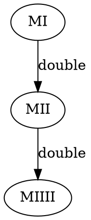

# Post Canonical Systems

A Python implementation of Emil Post's formal string rewriting systems for computation and formal language exploration.


## What is this?

Post Canonical Systems are a foundational model of computation developed by mathematician Emil Post in the 1920s. They define formal languages through string rewriting: starting from initial words (axioms) and repeatedly applying production rules to generate new strings. Despite their simplicity, Post systems are Turing-complete and serve as an elegant framework for exploring computability, formal grammars, and proof derivations.

## Features

| Feature | Description |
|---------|-------------|
| Pattern Matching | Variable kinds: `ANY` (empty or more), `NON_EMPTY` (1+), `SINGLE` (exactly 1) |
| Multi-Antecedent Rules | Combine multiple words in a single production |
| Derivation Tracking | Full proof traces showing how each word was derived |
| Visualization Exports | DOT/GraphViz, LaTeX, Mermaid diagrams, ASCII trees |
| Interactive CLI | REPL interface via the `pcs` command |
| JSON Serialization | Save and load system definitions |
| SystemBuilder DSL | Ergonomic fluent API for system construction |
| Preset Systems | MU Puzzle, Binary Doubler, Palindrome Generator |

## Installation

```bash
pip install post-canonical
```

Or with uv:

```bash
uv add post-canonical
```

## Quick Start

```python
from post_canonical import (
    PostCanonicalSystem,
    Alphabet,
    Variable,
    Pattern,
    ProductionRule,
)

# Define alphabet and variable
alphabet = Alphabet("ab")
x = Variable.any("x")

# Create rules: x -> xa and x -> xb (append a or b)
rules = frozenset({
    ProductionRule(
        antecedents=[Pattern([x])],
        consequent=Pattern([x, "a"]),
        name="append_a",
    ),
    ProductionRule(
        antecedents=[Pattern([x])],
        consequent=Pattern([x, "b"]),
        name="append_b",
    ),
})

# Build the system
system = PostCanonicalSystem(
    alphabet=alphabet,
    axioms=frozenset({"a", "b"}),
    rules=rules,
    variables=frozenset({x}),
)

# Generate words up to 3 derivation steps
words = system.generate_words(max_steps=3)
print(sorted(words, key=lambda w: (len(w), w)))
# ['a', 'b', 'aa', 'ab', 'ba', 'bb', 'aaa', 'aab', 'aba', 'abb', ...]
```

## Using the CLI

The package includes an interactive REPL for exploring systems without writing code:

```
$ pcs
Post Canonical Systems REPL v2.0.0
Type 'help' for commands.

pcs> alphabet MIU
Alphabet set: {I, M, U}

pcs> axiom MI
Axiom added: MI

pcs> var x
Variable added: x (ANY)

pcs> rule "$xI -> $xIU"
Rule added: $xI -> $xIU

pcs> rule "M$x -> M$x$x"
Rule added: M$x -> M$x$x

pcs> generate 3
Generated 8 words:
  MI, MII, MIU, MIII, MIIU, MIIII, MIIIU, MIUIU

pcs> query "MU"
'MU' NOT_FOUND after exploring 10000 words

pcs> exit
Goodbye.
```

### CLI Commands

| Command | Description |
|---------|-------------|
| `alphabet <symbols>` | Set the alphabet (e.g., `alphabet MIU`) |
| `var <name> [kind]` | Add a variable (`any`, `non_empty`, `single`) |
| `axiom <word>` | Add an axiom (starting word) |
| `rule "<pattern>"` | Add a production rule |
| `show` | Display current system configuration |
| `generate <steps>` | Generate words up to N derivation steps |
| `query "<word>"` | Check if a word is reachable |
| `trace "<word>"` | Show the derivation path for a word |
| `save <file>` | Save system to JSON |
| `load <file>` | Load system from JSON |
| `clear` | Reset configuration |

## SystemBuilder DSL

For ergonomic system construction, use the fluent builder API:

```python
from post_canonical.builder import SystemBuilder

# Build the MU puzzle system
system = (SystemBuilder("MIU")
    .var("x")
    .var("y")
    .axiom("MI")
    .rule("$xI -> $xIU", name="add_U")
    .rule("M$x -> M$x$x", name="double")
    .rule("$x III $y -> $x U $y", name="III_to_U")
    .rule("$x UU $y -> $x$y", name="delete_UU")
    .build())

# Generate and explore
words = system.generate_words(max_steps=5)
print(f"Generated {len(words)} words")
```

### Variable Syntax

Variables in rule patterns use `$` prefix:

- `$name` - Short form (ends at non-alphanumeric)
- `${name}` - Explicit form (for clarity)

Whitespace in patterns is ignored, so `$x III $y` is equivalent to `${x}III${y}`.

### Variable Kinds

```python
builder = (SystemBuilder("abc")
    .var("x")                      # ANY: matches "" or "a" or "abc"...
    .var("y", kind="non_empty")    # NON_EMPTY: matches "a" or "abc"...
    .var("z", kind="single")       # SINGLE: matches exactly one symbol
    # ...
)
```

## Visualization

Export derivations in multiple formats for documentation and analysis:

```python
from post_canonical import create_mu_puzzle
from post_canonical.visualization import to_dot, to_latex, to_mermaid, to_ascii_tree

# Create system and generate words with derivations
system = create_mu_puzzle()
derived_words = system.generate(max_steps=3)

# Find a specific word's derivation
for dw in derived_words:
    if dw.word == "MIIII":
        # GraphViz DOT format
        print(to_dot(dw.derivation))

        # LaTeX proof format
        print(to_latex(dw.derivation))

        # Mermaid diagram
        print(to_mermaid(dw.derivation))

        # ASCII tree for terminal
        print(to_ascii_tree(dw.derivation))
        break
```

### Example Output

**ASCII Tree:**
```
MIIII
+-- MII (double)
    +-- MI (axiom)
```

**Mermaid Diagram:**
```
graph TD
  MI -->|double| MII
  MII -->|double| MIIII
```

**GraphViz DOT:**


## Preset Systems

Ready-to-use example systems:

| System | Import | Description |
|--------|--------|-------------|
| MU Puzzle | `create_mu_puzzle()` | Hofstadter's famous puzzle from GEB |
| Binary Doubler | `create_binary_doubler()` | Doubles binary strings: 1 -> 11 -> 1111 |
| Palindrome Generator | `create_palindrome_generator()` | Generates all binary palindromes |

### Preset Alphabets

| Alphabet | Symbols |
|----------|---------|
| `BINARY` | `01` |
| `DECIMAL` | `0123456789` |
| `HEXADECIMAL` | `0123456789ABCDEF` |
| `ENGLISH_LOWERCASE` | `a-z` |
| `ENGLISH_UPPERCASE` | `A-Z` |
| `ENGLISH_LETTERS` | `a-zA-Z` |
| `MIU` | `MIU` |

```python
from post_canonical import create_mu_puzzle, BINARY
from post_canonical.query import ReachabilityQuery

# Use the MU puzzle
mu = create_mu_puzzle()
print(mu.describe())

# Check if MU is derivable (spoiler: it's not!)
query = ReachabilityQuery(mu)
result = query.is_derivable("MU", max_words=10000)
print(result)  # 'MU' NOT_FOUND after exploring 10000 words
```

## API Reference

### Core Classes

| Class | Description |
|-------|-------------|
| `PostCanonicalSystem` | Main system class with generation and iteration methods |
| `Alphabet` | Defines valid symbols for the system |
| `Variable` | Pattern variables with matching constraints |
| `VariableKind` | Enum: `ANY`, `NON_EMPTY`, `SINGLE` |
| `Pattern` | Sequence of literals and variables |
| `ProductionRule` | Transformation rule with antecedents and consequent |

### Derivation Classes

| Class | Description |
|-------|-------------|
| `DerivedWord` | A word paired with its derivation history |
| `Derivation` | Complete chain of derivation steps |
| `DerivationStep` | Single rule application with bindings |

### Query Classes

| Class | Description |
|-------|-------------|
| `ReachabilityQuery` | Check if words are derivable from axioms |
| `ReachabilityResult` | Query result with status and derivation |
| `QueryResult` | Enum: `DERIVABLE`, `NOT_FOUND` |

### Serialization

| Class | Description |
|-------|-------------|
| `PCSJsonCodec` | Save/load systems to JSON files |

### Builder

| Class | Description |
|-------|-------------|
| `SystemBuilder` | Fluent DSL for constructing systems |

## Requirements

- Python 3.12+
- No external dependencies

## License

MIT
