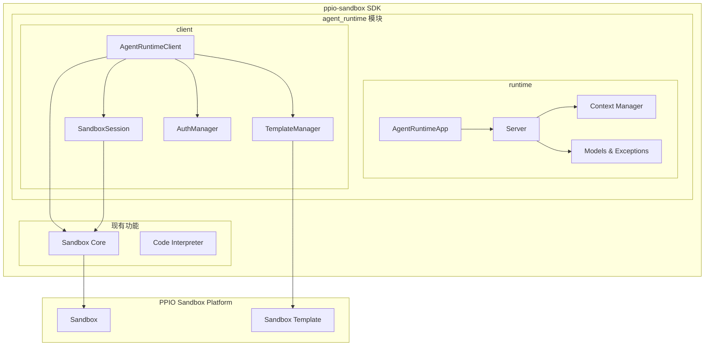

# PPIO Agent Runtime SDK 最终设计文档

## I. 概述

PPIO Agent Runtime SDK 是一个轻量级的 AI 智能体运行时框架，专为 PPIO Agent Sandbox 生态设计。

### 1.1 系统定位

- **目标**：让开发者方便地将 Agent 应用部署到 Agent Sandbox 中运行，并对外提供服务
- **架构**：SDK + CLI 方案，分离构建时和运行时流程
- **核心价值**：极简改造、零配置启动、容器化就绪、流式响应、健康监控

### 1.2 工作流程

1. **开发阶段**：Agent 开发者使用 Agent Runtime 模块将 Agent 逻辑包装为标准 HTTP 服务
2. **部署阶段**：使用 CLI 将 Agent 项目构建为版本化的 Sandbox 模板
3. **调用阶段**：后端开发者使用 Agent Client 模块从模板 ID 启动 Sandbox 并调用 Agent

## II. 总体架构

### 2.1 模块架构图



### 2.2 包结构

**集成到 ppio-sandbox SDK 中**：

```
ppio-sandbox/
├── __init__.py                 # 主入口
├── core/                       # 现有 Sandbox 核心功能
│   └── ...
├── code_interpreter/           # 现有 Code Interpreter 功能
│   └── ...
└── agent_runtime/              # 新增 Agent Runtime 模块
    ├── __init__.py             # Agent Runtime 入口
    ├── exceptions.py           # 基础异常定义
    ├── runtime/                # Agent Runtime 核心
    │   ├── __init__.py
    │   ├── app.py              # AgentRuntimeApp 主类
    │   ├── server.py           # HTTP 服务器实现
    │   ├── context.py          # 请求上下文管理
    │   └── models.py           # 数据模型定义
    └── client/                 # Agent Client 模块
        ├── __init__.py
        ├── client.py           # AgentRuntimeClient 主类
        ├── session.py          # SandboxSession 实现
        ├── auth.py             # 认证管理
        ├── template.py         # 模板管理
        └── exceptions.py       # 客户端专用异常
```

**导入方式**：
```python
# Agent 开发者
from ppio_sandbox.agent_runtime import AgentRuntimeApp, RequestContext

# 后端开发者  
from ppio_sandbox.agent_runtime import AgentRuntimeClient, SandboxSession

# 或者从子模块导入
from ppio_sandbox.agent_runtime.runtime import AgentRuntimeApp
from ppio_sandbox.agent_runtime.client import AgentRuntimeClient

# 与现有 Sandbox 功能协同使用
from ppio_sandbox import Sandbox  # 现有功能
from ppio_sandbox.agent_runtime import AgentRuntimeClient  # 新功能
```

**集成优势**：
- **统一体验**：用户只需安装一个 `ppio-sandbox` 包
- **功能协同**：Agent Runtime 可以复用现有 Sandbox 核心功能
- **版本一致**：所有相关功能使用统一的版本管理
- **模块独立**：Agent Runtime 作为独立模块，不影响现有功能
- **向后兼容**：现有 ppio-sandbox 用户可以无缝升级

**模块入口设计**：
```python
# ppio_sandbox/agent_runtime/__init__.py
"""
PPIO Agent Runtime 模块

提供 AI Agent 的运行时包装和客户端调用功能
"""

# Runtime 模块导出（面向 Agent 开发者）
from .runtime.app import AgentRuntimeApp
from .runtime.models import (
    AgentConfig,
    AgentMetadata,
    AgentSpec,
    AgentStatus,
    RuntimeSpec,
    SandboxSpec,
    RuntimeConfig,
    DeploymentPhase,
    InvocationRequest,
    InvocationResponse,
    PingStatus,
    RequestContext,
)

# Client 模块导出（面向后端开发者）
from .client.client import AgentRuntimeClient
from .client.session import SandboxSession
from .client.auth import AuthManager
from .client.template import TemplateManager

# 异常导出
from .exceptions import PPIOAgentRuntimeError, ValidationError, RuntimeError
from .client.exceptions import (
    AgentClientError,
    AuthenticationError,
    InvocationError,
    SandboxCreationError,
    SessionNotFoundError,
    TemplateNotFoundError,
)

__version__ = "1.0.0"

__all__ = [
    # Runtime 核心类
    "AgentRuntimeApp",
    
    # Client 核心类
    "AgentRuntimeClient",
    "SandboxSession",
    "AuthManager", 
    "TemplateManager",
    
    # 数据模型
    "AgentConfig",
    "AgentMetadata",
    "AgentSpec",
    "AgentStatus",
    "RuntimeSpec",
    "SandboxSpec",
    "RuntimeConfig",
    "DeploymentPhase",
    "InvocationRequest",
    "InvocationResponse",
    "PingStatus",
    "RequestContext",
    
    # 异常类
    "PPIOAgentRuntimeError",
    "ValidationError",
    "RuntimeError",
    "AgentClientError",
    "AuthenticationError",
    "InvocationError",
    "SandboxCreationError",
    "SessionNotFoundError",
    "TemplateNotFoundError",
]
```

## III. Agent Runtime 模块详细设计

### 3.1 AgentRuntimeApp 类

**功能**：面向 Agent 开发者的核心应用类，提供装饰器 API 包装 Agent 逻辑

**接口设计**：

```python
class AgentRuntimeApp:
    """PPIO Agent Runtime 应用类"""
    
    def __init__(
        self, 
        config: Optional[RuntimeConfig] = None, 
        debug: bool = False
    ) -> None:
        """初始化应用
        
        Args:
            config: 运行时配置，如果不提供则使用默认配置
            debug: 启用调试模式（向后兼容）
        """
        
    def entrypoint(self, func: Callable) -> Callable:
        """注册主入口点函数 - 核心装饰器
        
        支持的函数签名：
        - func(request: dict) -> Any
        - func(request: dict, context: RequestContext) -> Any
        - async func(request: dict) -> Any
        - async func(request: dict, context: RequestContext) -> Any
        
        支持的返回类型：
        - 基础类型：str, dict, list, int, float, bool
        - 生成器：Generator[str, None, None] (同步流式)
        - 异步生成器：AsyncGenerator[str, None] (异步流式)
        
        Args:
            func: 要注册的函数
            
        Returns:
            装饰后的函数
        """
        
    def ping(self, func: Callable) -> Callable:
        """注册自定义健康检查函数（可选）
        
        支持的函数签名：
        - func() -> PingStatus
        - func() -> dict
        - async func() -> PingStatus
        - async func() -> dict
        
        Args:
            func: 健康检查函数
            
        Returns:
            装饰后的函数
        """
        
    def middleware(self, middleware_func: Callable) -> Callable:
        """注册中间件函数
        
        中间件函数签名：
        - async func(request: Request, call_next: Callable) -> Response
        
        Args:
            middleware_func: 中间件函数
            
        Returns:
            装饰后的函数
        """
        
    def run(
        self, 
        port: Optional[int] = None, 
        host: Optional[str] = None
    ) -> None:
        """启动服务器
        
        Args:
            port: 端口号，如果不提供则使用配置中的端口（默认8080）
            host: 主机地址，如果不提供则使用配置中的地址（默认0.0.0.0）
        """
        
    @property
    def context(self) -> Optional[RequestContext]:
        """获取当前请求上下文"""
        return AgentRuntimeContext.get_current_context()
```

**实现特点**：
- 基于装饰器的简洁 API 设计
- 自动检测同步/异步函数类型
- 支持流式响应（Generator/AsyncGenerator）
- 集成请求上下文管理
- 支持自定义中间件
- 配置驱动的灵活性

### 3.2 AgentRuntimeServer 类

**功能**：HTTP 服务器实现，处理 `/invocations` 和 `/ping` 端点

**接口设计**：

```python
class AgentRuntimeServer:
    """Agent Runtime 服务器"""
    
    def __init__(self, config: RuntimeConfig):
        """初始化服务器
        
        Args:
            config: 运行时配置
        """
        
    def set_entrypoint_handler(self, func: Callable) -> None:
        """设置入口点处理函数"""
        
    def set_ping_handler(self, func: Optional[Callable]) -> None:
        """设置健康检查处理函数"""
        
    def add_middleware(self, middleware_func: Callable) -> None:
        """添加中间件"""
        
    def run(self, port: int, host: str) -> None:
        """启动服务器"""
        
    async def handle_invocations(self, request: Request) -> Response:
        """处理 /invocations 端点"""
        
    async def handle_ping(self, request: Request) -> Response:
        """处理 /ping 端点"""
```

**核心功能**：
- 基于 Starlette 的高性能异步 Web 框架
- 自动内容类型检测和序列化
- 流式响应支持（Server-Sent Events）
- CORS 支持
- 请求验证和错误处理
- 性能监控和日志记录

### 3.3 Context 管理

**功能**：线程安全的请求上下文管理

**接口设计**：

```python
class RequestContext(BaseModel):
    """请求上下文模型"""
    
    sandbox_id: Optional[str] = None
    request_id: Optional[str] = None
    headers: Dict[str, str] = Field(default_factory=dict)
    
    # 向后兼容的属性
    @property
    def session_id(self) -> Optional[str]:
        """会话ID（等同于sandbox_id，向后兼容）"""
        return self.sandbox_id
    
    class Config:
        extra = "allow"

class AgentRuntimeContext:
    """运行时上下文管理器"""
    
    @classmethod
    def get_current_context(cls) -> Optional[RequestContext]:
        """获取当前请求上下文"""
        
    @classmethod
    def set_current_context(cls, context: RequestContext) -> None:
        """设置当前请求上下文"""
        
    @classmethod
    def clear_current_context(cls) -> None:
        """清除当前请求上下文"""
```

### 3.4 数据模型

**核心模型**：

**配置文件结构**：新的 `AgentConfig` 采用 Kubernetes 风格的配置格式，与 CLI 工具的配置文件结构保持一致：

```yaml
# agent.yaml - Agent 配置文件示例
apiVersion: v1
kind: Agent
metadata:
  name: my-langgraph-agent          # Agent名称（小写字母数字和连字符）
  version: "1.0.0"                  # Agent版本
  author: "developer@example.com"   # 作者邮箱（必填）
  description: "A LangGraph-based AI agent"  # Agent描述
  created: "2024-01-15T10:30:00Z"   # 创建时间（ISO 8601格式）

spec:
  entrypoint: "agent.py"            # Python入口文件（必须是.py文件）
  
  # 运行时配置 - 影响模板构建的资源参数
  runtime:
    timeout: 60                     # 启动超时秒数（1-3600）
    memory_limit: "1Gi"             # 内存限制（支持 "512Mi", "1Gi" 等格式）
    cpu_limit: "1"                  # CPU限制（支持 "1", "1000m" 等格式）
  
  sandbox:
    template_id: "tmpl_abc123"      # 部署后的模板ID

# 状态字段 - 用于跟踪部署和构建状态（由系统维护）
status:
  phase: "deployed"                 # 当前部署阶段
  template_id: "tmpl_abc123"        # 构建成功后的实际模板ID
  last_deployed: "2024-01-15T11:00:00Z"  # 最后部署时间
  build_id: "build_xyz789"          # 部署的唯一标识符
```

**Python 使用示例**：

```python
from ppio_sandbox.agent_runtime import AgentConfig, AgentMetadata, AgentSpec, RuntimeSpec, SandboxSpec

# 创建 Agent 配置
agent_config = AgentConfig(
    apiVersion="v1",
    kind="Agent",
    metadata=AgentMetadata(
        name="my-langgraph-agent",
        version="1.0.0",
        author="developer@example.com",
        description="A LangGraph-based AI agent",
        created="2024-01-15T10:30:00Z"
    ),
    spec=AgentSpec(
        entrypoint="agent.py",
        runtime=RuntimeSpec(
            timeout=60,
            memory_limit="1Gi",
            cpu_limit="1"
        ),
        sandbox=SandboxSpec(
            template_id="tmpl_abc123"
        )
    )
)

# 访问配置信息
print(f"Agent Name: {agent_config.metadata.name}")
print(f"Entrypoint: {agent_config.spec.entrypoint}")
print(f"Memory Limit: {agent_config.spec.runtime.memory_limit}")

# 序列化为字典（用于 API 调用）
config_dict = agent_config.dict()

# 从字典创建配置（用于从配置文件加载）
loaded_config = AgentConfig.parse_obj(config_dict)
```

```python
from enum import Enum
from typing import Optional, List, Dict, Any, Literal

class DeploymentPhase(str, Enum):
    """部署阶段枚举"""
    PENDING = "pending"
    BUILDING = "building"
    DEPLOYED = "deployed"
    FAILED = "failed"

class AgentMetadata(BaseModel):
    """Agent 元数据"""
    name: str = Field(..., description="Agent名称，必须小写字母数字和连字符")
    version: str = Field(..., description="Agent版本")
    author: str = Field(..., description="作者邮箱（必填）")
    description: Optional[str] = Field(None, description="Agent描述")
    created: Optional[str] = Field(None, description="创建时间（ISO 8601格式）")

class RuntimeSpec(BaseModel):
    """运行时规格配置"""
    timeout: Optional[int] = Field(None, ge=1, le=3600, description="启动超时秒数（1-3600）")
    memory_limit: Optional[str] = Field(None, description="内存限制，如'512Mi','1Gi'")
    cpu_limit: Optional[str] = Field(None, description="CPU限制，如'1','1000m'")

class SandboxSpec(BaseModel):
    """Sandbox 规格配置"""
    template_id: Optional[str] = Field(None, description="部署后的模板ID")

class AgentSpec(BaseModel):
    """Agent 规格配置"""
    entrypoint: str = Field(..., regex=r".*\.py$", description="Python入口文件，必须是.py文件")
    runtime: Optional[RuntimeSpec] = Field(None, description="运行时配置")
    sandbox: Optional[SandboxSpec] = Field(None, description="Sandbox配置")

class AgentStatus(BaseModel):
    """Agent 状态信息（由系统维护）"""
    phase: Optional[DeploymentPhase] = Field(None, description="当前部署阶段")
    template_id: Optional[str] = Field(None, description="构建成功后的实际模板ID")
    last_deployed: Optional[str] = Field(None, description="最后部署时间")
    build_id: Optional[str] = Field(None, description="部署的唯一标识符")

class AgentConfig(BaseModel):
    """Agent 配置类 - Kubernetes 风格的配置结构"""
    apiVersion: Literal["v1"] = Field("v1", description="API版本")
    kind: Literal["Agent"] = Field("Agent", description="资源类型")
    metadata: AgentMetadata = Field(..., description="Agent元数据")
    spec: AgentSpec = Field(..., description="Agent规格配置")
    status: Optional[AgentStatus] = Field(None, description="Agent状态信息（由系统维护）")

class RuntimeConfig(BaseModel):
    """运行时配置类 - 用于Agent Runtime服务器配置"""
    host: str = "0.0.0.0"
    port: int = 8080
    debug: bool = False
    timeout: int = 300
    max_request_size: int = 1024 * 1024  # 1MB
    cors_origins: List[str] = Field(default_factory=lambda: ["*"])
    enable_metrics: bool = True
    enable_middleware: bool = True

class InvocationRequest(BaseModel):
    """调用请求模型"""
    prompt: Optional[str] = None
    data: Optional[Dict[str, Any]] = None
    sandbox_id: Optional[str] = None  # 可选，通常由系统自动填充
    timeout: Optional[int] = None
    stream: bool = False
    metadata: Optional[Dict[str, Any]] = None

class InvocationResponse(BaseModel):
    """调用响应模型"""
    result: Any
    status: str = "success"
    duration: float
    metadata: Optional[Dict[str, Any]] = None
    error: Optional[str] = None

class PingStatus(str, Enum):
    """健康状态枚举"""
    HEALTHY = "Healthy"
    HEALTHY_BUSY = "HealthyBusy"

class PingResponse(BaseModel):
    """健康检查响应模型"""
    status: PingStatus
    message: Optional[str] = None
    timestamp: Optional[str] = None
```

## IV. Agent Client 模块详细设计

### 4.1 AgentRuntimeClient 类

**功能**：面向后端开发者的客户端，管理 Sandbox 会话和 Agent 调用

**架构设计**：
- **一对一映射**：每个 SandboxSession 对应一个独立的 Sandbox 实例
- **统一标识**：使用 Sandbox ID 作为会话标识，简化概念模型
- **轻量化设计**：Sandbox 实例快速启动和销毁，按需创建
- **任务隔离**：每个任务在独立的 Sandbox 环境中执行，确保安全隔离
- **生命周期管理**：支持 Sandbox 的暂停、恢复、销毁操作

**接口设计**：

```python
class AgentRuntimeClient:
    """Agent Runtime 客户端"""
    
    def __init__(
        self,
        api_key: Optional[str] = None,
        base_url: Optional[str] = None,
        timeout: int = 300,
        config: Optional[ClientConfig] = None
    ):
        """初始化客户端
        
        Args:
            api_key: API 密钥，如果不提供则从环境变量 PPIO_API_KEY 读取
            base_url: Sandbox 平台基础 URL，如果不提供则从环境变量
            timeout: 默认超时时间
            config: 客户端配置
            
        Environment Variables:
            PPIO_API_KEY: API 密钥
            
        Raises:
            AuthenticationError: API Key 未提供且环境变量不存在时抛出
        """
    
    # === 会话管理 ===
    async def create_session(
        self,
        template_id: str,
        timeout_seconds: int = 300,
        config: Optional[SandboxConfig] = None
    ) -> SandboxSession:
        """创建新的 Sandbox 会话
        
        每次调用都会：
        1. 从模板创建一个新的 Sandbox 实例
        2. 在 Sandbox 中启动 Agent 服务
        3. 返回对应的 SandboxSession 对象
        
        Args:
            template_id: Agent 模板 ID
            timeout_seconds: 会话超时时间
            config: Sandbox 配置
            
        Returns:
            SandboxSession 对象
            
        Raises:
            SandboxCreationError: 创建失败时抛出
            AuthenticationError: 认证失败时抛出
            TemplateNotFoundError: 模板不存在时抛出
        """
        
    async def get_session(self, sandbox_id: str) -> Optional[SandboxSession]:
        """获取现有会话
        
        Args:
            sandbox_id: Sandbox/会话 ID
            
        Returns:
            会话对象，如果不存在则返回 None
        """
        
    async def list_sessions(self) -> List[SandboxSession]:
        """列出所有活跃会话
        
        Returns:
            会话列表
        """
        
    async def close_session(self, sandbox_id: str) -> None:
        """关闭指定会话
        
        Args:
            sandbox_id: Sandbox/会话 ID
            
        Raises:
            SessionNotFoundError: 会话不存在时抛出
        """
        
    async def close_all_sessions(self) -> None:
        """关闭所有会话"""
    
    # === 模板管理 ===
    async def list_templates(
        self, 
        tags: Optional[List[str]] = None,
        name_filter: Optional[str] = None
    ) -> List[AgentTemplate]:
        """列出可用的 Agent 模板
        
        Args:
            tags: 标签过滤
            name_filter: 名称过滤
        
        Returns:
            模板列表
        """
        
    async def get_template(self, template_id: str) -> AgentTemplate:
        """获取特定模板信息
        
        Args:
            template_id: 模板 ID
            
        Returns:
            模板对象
            
        Raises:
            TemplateNotFoundError: 模板不存在时抛出
        """
    
    # === 便捷调用方法 ===
    async def invoke_agent(
        self,
        template_id: str,
        request: Union[InvocationRequest, Dict[str, Any], str],
        create_session: bool = True,
        sandbox_id: Optional[str] = None,
        timeout: Optional[int] = None
    ) -> InvocationResponse:
        """便捷方法：直接调用 Agent（自动管理会话）
        
        Args:
            template_id: 模板 ID
            request: 调用请求（支持多种格式）
            create_session: 是否自动创建新会话
            sandbox_id: 指定使用的 Sandbox/会话 ID
            timeout: 调用超时时间
            
        Returns:
            调用响应
            
        Raises:
            SessionNotFoundError: 指定会话不存在时抛出
            InvocationError: 调用失败时抛出
        """
    
    async def invoke_agent_stream(
        self,
        template_id: str,
        request: Union[InvocationRequest, Dict[str, Any], str],
        create_session: bool = True,
        sandbox_id: Optional[str] = None
    ) -> AsyncIterator[str]:
        """便捷方法：流式调用 Agent
        
        Args:
            template_id: 模板 ID
            request: 调用请求
            create_session: 是否自动创建新会话
            sandbox_id: 指定使用的 Sandbox/会话 ID
            
        Yields:
            流式响应数据
        """
    
    # === 上下文管理器支持 ===
    async def __aenter__(self) -> "AgentRuntimeClient":
        """异步上下文管理器入口"""
        
    async def __aexit__(self, exc_type, exc_val, exc_tb) -> None:
        """异步上下文管理器出口"""
```

### 4.2 SandboxSession 类

**功能**：管理单个 Sandbox 实例的生命周期和 Agent 调用

**设计理念**：
- **一对一关系**：每个 SandboxSession 对应一个独立的 Sandbox 实例
- **完整生命周期**：从创建、运行、暂停/恢复到销毁的完整管理
- **状态管理**：跟踪 Sandbox 和 Agent 的运行状态
- **资源控制**：确保 Sandbox 资源的正确分配和释放
- **简洁操作**：避免复杂的重启逻辑，需要清除状态时直接创建新会话

**接口设计**：

```python
class SandboxSession:
    """Sandbox 会话管理"""
    
    def __init__(
        self,
        template_id: str,
        sandbox: Any,  # PPIO Sandbox 实例
        client: AgentRuntimeClient
    ):
        """初始化会话
        
        Args:
            template_id: 模板 ID
            sandbox: PPIO Sandbox 实例（一对一关系）
            client: Agent Runtime 客户端引用
        """
    
    # === 核心调用方法 ===
    async def invoke(
        self,
        request: Union[InvocationRequest, Dict[str, Any], str],
        stream: bool = False
    ) -> Union[Dict[str, Any], AsyncIterator[str]]:
        """调用 Agent
        
        Args:
            request: 调用请求（支持多种格式）
            stream: 是否使用流式响应
            
        Returns:
            响应对象或流式迭代器
            
        Raises:
            InvocationError: 调用失败时抛出
            SessionNotFoundError: 会话不存在时抛出
            NetworkError: 网络错误时抛出
        """
    
    # === Sandbox 生命周期管理 ===
    async def pause(self) -> None:
        """暂停 Sandbox 实例
        
        暂停后：
        - Sandbox 进入休眠状态，保留内存状态
        - 停止 CPU 计算，节省资源
        - 可以通过 resume() 恢复执行
        
        Raises:
            SandboxOperationError: 暂停失败时抛出
        """
        
    async def resume(self) -> None:
        """恢复 Sandbox 实例
        
        恢复后：
        - Sandbox 从暂停状态恢复
        - 保持之前的内存状态和上下文
        - 可以继续处理请求
        
        Raises:
            SandboxOperationError: 恢复失败时抛出
        """
    
    # === 会话管理 ===
    # 注意：没有提供 restart() 方法，因为：
    # 1. Sandbox 轻量化设计，重启不如重新创建干净
    # 2. 如需清除状态，推荐 close() + create_session() 的方式
    # 3. 避免潜在的状态残留问题，确保完全隔离
    async def ping(self) -> PingResponse:
        """健康检查
        
        Returns:
            健康检查响应
            
        Raises:
            NetworkError: 网络错误时抛出
            InvocationError: 检查失败时抛出
        """
        
    async def get_status(self) -> SessionStatus:
        """获取会话状态
        
        Returns:
            会话状态（ACTIVE, PAUSED, INACTIVE, CLOSED, ERROR）
        """
        
    async def refresh(self) -> None:
        """刷新会话（重置超时时间）"""
        
    async def close(self) -> None:
        """关闭会话并销毁 Sandbox
        
        执行步骤：
        1. 停止 Agent 服务
        2. 销毁 Sandbox 实例
        3. 释放所有资源
        4. 更新会话状态为 CLOSED
        """
    
    # === 属性 ===
    @property
    def host_url(self) -> str:
        """获取 Sandbox 主机 URL"""
        if not self._host_url:
            if self.sandbox and hasattr(self.sandbox, 'get_host'):
                # 使用实际的 Sandbox API
                host = self.sandbox.get_host(8080)
                self._host_url = f"https://{host}"
            else:
                # 模拟 URL（用于测试）
                self._host_url = f"https://session-{self.sandbox_id}.ppio.sandbox"
        return self._host_url
        
    @property
    def is_active(self) -> bool:
        """检查会话是否活跃"""
        return self.status == SessionStatus.ACTIVE
        
    @property
    def is_paused(self) -> bool:
        """检查会话是否已暂停"""
        return self.status == SessionStatus.PAUSED
        
    @property
    def sandbox_id(self) -> str:
        """获取 Sandbox 实例 ID（同时也是会话 ID）"""
        return self.sandbox.id if hasattr(self.sandbox, 'id') else f"sandbox-{id(self.sandbox)}"
        
    @property
    def session_id(self) -> str:
        """获取会话 ID（等同于 sandbox_id）"""
        return self.sandbox_id
        
    @property
    def age_seconds(self) -> float:
        """获取会话存在时间（秒）"""
        return (datetime.now() - self.created_at).total_seconds()
        
    @property
    def idle_seconds(self) -> float:
        """获取会话空闲时间（秒）"""
        return (datetime.now() - self.last_activity).total_seconds()
```

### 4.3 AuthManager 类

**功能**：管理客户端认证，使用 API Key 进行 Bearer Token 认证

**设计简化**：
- **单一认证方式**：仅支持 API Key Bearer Token 认证
- **环境变量支持**：自动从环境变量 `PPIO_API_KEY` 读取
- **简洁实现**：避免复杂的认证协议，专注核心功能

**接口设计**：

```python
class AuthManager:
    """认证管理器 - 简化版本，仅支持 API Key"""
    
    def __init__(self, api_key: Optional[str] = None):
        """初始化认证管理器
        
        Args:
            api_key: API 密钥，如果不提供则从环境变量 PPIO_API_KEY 读取
            
        Raises:
            AuthenticationError: API Key 未提供且环境变量不存在时抛出
        """
    
    def validate_credentials(self) -> bool:
        """验证凭据有效性
        
        Returns:
            凭据是否有效（检查 API Key 是否存在且格式正确）
        """
    
    def get_auth_headers(self) -> Dict[str, str]:
        """获取认证头
        
        Returns:
            包含 Bearer Token 的认证头字典
            
        Example:
            {"Authorization": "Bearer your-api-key"}
        """
    
    @property
    def api_key(self) -> str:
        """获取当前使用的 API Key"""
```

### 4.4 TemplateManager 类

**功能**：管理 Agent 模板的查询，专注核心功能

**设计简化**：
- **直接查询**：每次都从 Sandbox 平台获取最新模板信息
- **无缓存机制**：第一版实现简化，避免缓存带来的复杂性
- **基础过滤**：支持按标签和名称过滤模板

**接口设计**：

```python
class TemplateManager:
    """模板管理器 - 简化版本"""
    
    def __init__(self, auth_manager: AuthManager):
        """初始化模板管理器
        
        Args:
            auth_manager: 认证管理器
        """
    
    async def list_templates(
        self, 
        tags: Optional[List[str]] = None,
        name_filter: Optional[str] = None
    ) -> List[AgentTemplate]:
        """列出模板
        
        Args:
            tags: 标签过滤
            name_filter: 名称过滤
            
        Returns:
            模板列表，每个模板的 metadata 字段包含 Agent 元信息
        """
    
    async def get_template(self, template_id: str) -> AgentTemplate:
        """获取特定模板
        
        Args:
            template_id: 模板 ID
            
        Returns:
            模板对象，包含完整的 Agent 元信息
            
        Raises:
            TemplateNotFoundError: 模板不存在时抛出
        """
    
    async def template_exists(self, template_id: str) -> bool:
        """检查模板是否存在
        
        Args:
            template_id: 模板 ID
            
        Returns:
            模板是否存在
        """
```

## V. 数据模型完整定义

### 5.1 客户端专用模型

```python
class SessionStatus(str, Enum):
    """会话状态"""
    ACTIVE = "active"      # 正在运行，可以处理请求
    PAUSED = "paused"      # 已暂停，保留状态但不处理请求
    INACTIVE = "inactive"  # 非活跃状态
    CLOSED = "closed"      # 已关闭，资源已释放
    ERROR = "error"        # 错误状态

class AgentTemplate(BaseModel):
    """Agent 模板信息"""
    template_id: str
    name: str
    version: str
    description: Optional[str] = None
    author: Optional[str] = None
    tags: List[str] = Field(default_factory=list)
    created_at: datetime
    updated_at: datetime
    status: str
    
    # Agent 元信息（核心字段）
    metadata: Dict[str, Any] = Field(default_factory=dict)
    """
    Agent 元信息，包含完整的 AgentConfig 数据结构，与 CLI 工具的配置文件格式保持一致。
    
    典型结构示例（遵循 Kubernetes 风格的 YAML 配置格式）：
    {
      agent: {
        apiVersion: 'v1';
        kind: 'Agent';
        metadata: {
          name: string;              // Agent 名称
          version: string;           // Agent 版本
          author: string;            // 作者邮箱 (必填)
          description?: string;      // Agent 描述
          created?: string;         // 创建时间 (ISO 8601 格式)
        };
        spec: {
          entrypoint: string;       // Python 入口文件，如 "agent.py" (必须是 .py 文件)
          runtime?: {
            timeout?: number;          // 启动超时秒数，转换为 readyCmd 的超时参数 (1-3600)
            memory_limit?: string;     // 内存限制，转换为 memoryMb (支持 "512Mi", "1Gi" 等格式)
            cpu_limit?: string;        // CPU 限制，转换为 cpuCount (支持 "1", "1000m" 等格式)
          };
          
          sandbox?: {
            template_id?: string;    // 部署后的模板ID
          };
        };
        
        // 状态字段 - 用于跟踪部署和构建状态 (由系统维护，用户不应手动修改)
        status?: {
          phase?: 'pending' | 'building' | 'deployed' | 'failed';  // 当前部署阶段
          template_id?: string;       // 构建成功后的实际模板ID (用于后续更新)
          last_deployed?: string;     // 最后部署时间
          build_id?: string;         // 部署的唯一标识符
        };
      }
    }
    """
    
    # 扩展字段
    size: Optional[int] = None  # 模板大小（字节）
    build_time: Optional[float] = None  # 构建时间（秒）
    dependencies: List[str] = Field(default_factory=list)
    runtime_info: Optional[Dict[str, Any]] = None

class SandboxConfig(BaseModel):
    """Sandbox 配置"""
    timeout_seconds: int = 300
    memory_limit: Optional[str] = None  # 如 "512Mi", "1Gi"
    cpu_limit: Optional[str] = None     # 如 "500m", "1"
    env_vars: Dict[str, str] = Field(default_factory=dict)
    volumes: List[Dict[str, str]] = Field(default_factory=list)
    ports: List[int] = Field(default_factory=lambda: [8080])
    
class ClientConfig(BaseModel):
    """客户端配置"""
    base_url: Optional[str] = None
    timeout: int = 300
    max_retries: int = 3
    retry_delay: float = 1.0
    
    # 连接池配置
    max_connections: int = 100
    max_keepalive_connections: int = 20
    keepalive_expiry: float = 30.0
```

### 5.2 增强的请求/响应模型

```python
class InvocationRequest(BaseModel):
    """增强的调用请求模型"""
    # 基础字段
    prompt: Optional[str] = None
    data: Optional[Dict[str, Any]] = None
    sandbox_id: Optional[str] = None  # 可选，通常由系统自动填充
    
    # 控制字段
    timeout: Optional[int] = None
    stream: bool = False
    max_tokens: Optional[int] = None
    temperature: Optional[float] = None
    
    # 元数据
    metadata: Optional[Dict[str, Any]] = None
    user_id: Optional[str] = None
    request_id: Optional[str] = None
    
    # 流式控制
    stream_options: Optional[Dict[str, Any]] = None
    
    # 向后兼容的属性
    @property
    def session_id(self) -> Optional[str]:
        """会话ID（等同于sandbox_id，向后兼容）"""
        return self.sandbox_id

class InvocationResponse(BaseModel):
    """增强的调用响应模型"""
    result: Any
    status: str = "success"
    duration: float
    
    # 元数据
    metadata: Optional[Dict[str, Any]] = None
    error: Optional[str] = None
    error_type: Optional[str] = None
    
    # 性能信息
    processing_time: Optional[float] = None
    queue_time: Optional[float] = None
    
    # 使用统计
    tokens_used: Optional[int] = None
    cost: Optional[float] = None
```

## VI. 异常处理体系

### 6.1 基础异常

```python
class PPIOAgentRuntimeError(Exception):
    """SDK 基础异常类"""
    def __init__(self, message: str, error_code: Optional[str] = None):
        super().__init__(message)
        self.message = message
        self.error_code = error_code

class ValidationError(PPIOAgentRuntimeError):
    """数据验证错误"""
    pass

class RuntimeError(PPIOAgentRuntimeError):
    """运行时错误"""
    pass
```

### 6.2 客户端异常

```python
class AgentClientError(PPIOAgentRuntimeError):
    """客户端基础异常"""
    pass

class AuthenticationError(AgentClientError):
    """认证错误"""
    pass

class TemplateNotFoundError(AgentClientError):
    """模板未找到错误"""
    pass

class SandboxCreationError(AgentClientError):
    """Sandbox 创建错误"""
    pass

class SessionNotFoundError(AgentClientError):
    """会话未找到错误"""
    pass

class InvocationError(AgentClientError):
    """调用错误"""
    pass

class NetworkError(AgentClientError):
    """网络错误"""
    pass

class RateLimitError(AgentClientError):
    """限流错误"""
    pass

class QuotaExceededError(AgentClientError):
    """配额超限错误"""
    pass

class SandboxOperationError(AgentClientError):
    """Sandbox 操作错误（暂停、恢复、重启等）"""
    pass
```

## VII. 使用示例

### 7.1 Agent Runtime 使用示例

#### 基础使用

```python
from ppio-agent-sandbox import AgentRuntimeApp, RequestContext

app = AgentRuntimeApp(debug=True)

@app.entrypoint
def my_agent(request: dict, context: RequestContext) -> dict:
    """基础 Agent 实现"""
    query = request.get("query", "")
    sandbox_id = context.sandbox_id
    
    # Agent 处理逻辑
    result = f"处理查询: {query}, Sandbox: {sandbox_id}"
    
    return {
        "response": result,
        "sandbox_id": context.sandbox_id,
        "metadata": {"processed_at": datetime.now().isoformat()}
    }

@app.ping
def health_check() -> dict:
    """自定义健康检查"""
    return {"status": "healthy", "dependencies": check_dependencies()}

if __name__ == "__main__":
    app.run(port=8080)
```

#### 异步流式 Agent

```python
import asyncio
from ppio-agent-sandbox import AgentRuntimeApp, RuntimeConfig

# 自定义配置
config = RuntimeConfig(
    port=8080,
    timeout=600,
    max_request_size=2 * 1024 * 1024,  # 2MB
    cors_origins=["https://my-frontend.com"]
)

app = AgentRuntimeApp(config=config)

@app.entrypoint
async def streaming_agent(request: dict, context: RequestContext):
    """异步流式 Agent"""
    query = request.get("query", "")
    max_tokens = request.get("max_tokens", 1000)
    
    # 模拟 LLM 流式响应
    for i in range(max_tokens // 10):
        await asyncio.sleep(0.1)  # 模拟处理时间
        yield f"Token {i}: 处理 '{query}' 的部分结果...\n"
    
    yield f"完成对 '{query}' 的处理。"

@app.middleware
async def logging_middleware(request, call_next):
    """日志中间件"""
    start_time = time.time()
    response = await call_next(request)
    process_time = time.time() - start_time
    logger.info(f"请求处理时间: {process_time:.4f}s")
    return response

if __name__ == "__main__":
    app.run()
```

#### LangGraph Agent 集成

```python
from langgraph import StateGraph
from ppio-agent-sandbox import AgentRuntimeApp

app = AgentRuntimeApp()

# 假设已有的 LangGraph Agent
def create_langgraph_agent():
    # 构建 LangGraph 流程
    workflow = StateGraph(AgentState)
    # ... 添加节点和边
    return workflow.compile()

agent = create_langgraph_agent()

@app.entrypoint
async def langgraph_agent(request: dict) -> dict:
    """LangGraph Agent 包装"""
    query = request.get("query", "")
    
    # 调用 LangGraph Agent
    result = await agent.ainvoke({"input": query})
    
    return {
        "response": result["output"],
        "metadata": {
            "agent_type": "langgraph",
            "steps": len(result.get("steps", []))
        }
    }

if __name__ == "__main__":
    app.run()
```

### 7.2 Agent Client 使用示例

#### 环境变量配置（推荐）

```bash
# 设置环境变量
export PPIO_API_KEY=your-api-key-here
```

#### 基础客户端使用

```python
import asyncio
from ppio-agent-sandbox.client import AgentRuntimeClient, InvocationRequest

async def main():
    # 方式一：直接传入 API Key
    async with AgentRuntimeClient(api_key="your-api-key") as client:
        pass  # 使用客户端...
        
    # 方式二：使用环境变量（推荐）
    # 设置环境变量：export PPIO_API_KEY=your-api-key
    async with AgentRuntimeClient() as client:
        
        # 自动管理会话（适合简单场景）
        request = InvocationRequest(
            prompt="请帮我分析这个数据",
            data={"dataset": "sales_data.csv"},
            timeout=300
        )
        
        response = await client.invoke_agent(
            template_id="data-analysis-agent-v1.0",
            request=request
        )
        
        print(f"分析结果: {response.result}")
        print(f"处理时间: {response.duration}s")

if __name__ == "__main__":
    asyncio.run(main())
```

#### 模板管理和元信息

```python
async def template_management_example():
    """演示模板管理和 Agent 元信息获取"""
    async with AgentRuntimeClient() as client:
        
        # 列出所有可用模板
        templates = await client.list_templates()
        print(f"找到 {len(templates)} 个模板:")
        
        for template in templates:
            print(f"\n模板ID: {template.template_id}")
            print(f"名称: {template.name}")
            print(f"版本: {template.version}")
            print(f"作者: {template.author}")
            
            # 获取 Agent 元信息
            metadata = template.metadata
            agent_info = metadata.get("agent", {})
            agent_metadata = agent_info.get("metadata", {})
            agent_name = agent_metadata.get("name", "未知")
            agent_version = agent_info.get("apiVersion", "未知")
            agent_description = agent_metadata.get("description", "未知")
            agent_author = agent_metadata.get("author", "未知")
            spec = agent_info.get("spec", {})
            entry_point = spec.get("entrypoint", "app.py")
            
            print(f"Agent 信息:")
            print(f"  - Agent 名称: {agent_name}")
            print(f"  - Agent 版本: {agent_version}")
            print(f"  - Agent 作者: {agent_author}")
            print(f"  - 入口文件: {entry_point}")
        
        # 按标签过滤模板
        data_agents = await client.list_templates(tags=["data-analysis", "ai"])
        print(f"\n数据分析相关 Agent: {len(data_agents)} 个")
        
        # 按名称过滤
        chat_agents = await client.list_templates(name_filter="chat")
        print(f"聊天相关 Agent: {len(chat_agents)} 个")
        
        # 获取特定模板的详细信息
        if templates:
            template_id = templates[0].template_id
            detailed_template = await client.get_template(template_id)
            
            print(f"\n模板 {template_id} 详细信息:")
            print(f"创建时间: {detailed_template.created_at}")
            print(f"更新时间: {detailed_template.updated_at}")
            print(f"模板大小: {detailed_template.size} 字节")
            print(f"构建时间: {detailed_template.build_time} 秒")
            
            # 检查模板是否存在
            exists = await client.template_manager.template_exists(template_id)
            print(f"模板存在: {exists}")

if __name__ == "__main__":
    asyncio.run(template_management_example())
```

#### 会话管理和多轮对话

```python
async def conversation_example():
    # 使用环境变量中的 API Key
    async with AgentRuntimeClient() as client:
        
        # 创建独立的 Sandbox 会话
        session = await client.create_session(
            template_id="conversation-agent-v2.0",
            timeout_seconds=1800  # 30分钟
        )
        
        print(f"创建会话，Sandbox ID: {session.sandbox_id}")
        
        try:
            conversation_history = []
            
            # 多轮对话
            questions = [
                "你好，我是新用户",
                "我想了解你的功能",
                "能帮我生成一份商业计划书吗？",
                "计划书要包含财务预测"
            ]
            
            for i, question in enumerate(questions):
                print(f"\n第 {i+1} 轮对话:")
                print(f"用户: {question}")
                
                request = InvocationRequest(
                    prompt=question,
                    metadata={
                        "conversation_turn": i + 1,
                        "history": conversation_history[-3:]  # 保留最近3轮
                    }
                )
                
                response = await session.invoke(request)
                
                print(f"Agent: {response['result']}")
                print(f"会话状态: {await session.get_status()}")
                
                # 更新对话历史
                conversation_history.append({
                    "user": question,
                    "agent": response['result'],
                    "turn": i + 1
                })
                
        finally:
            # 关闭会话会自动销毁对应的 Sandbox
            await session.close()
            print("会话已关闭，Sandbox 已销毁")
```

#### Sandbox 生命周期管理

```python
async def sandbox_lifecycle_example():
    """演示 Sandbox 的暂停、恢复功能，以及如何重新开始处理"""
    async with AgentRuntimeClient() as client:
        
        # 创建会话
        session = await client.create_session("data-processing-agent")
        print(f"创建会话，Sandbox ID: {session.sandbox_id}")
        
        try:
            # 第一次调用
            response1 = await session.invoke({
                "prompt": "开始处理数据集",
                "data": {"dataset": "large_dataset.csv"}
            })
            print(f"第一次调用结果: {response1['result']}")
            
            # 暂停会话（保留内存状态，节省资源）
            print("暂停 Sandbox...")
            await session.pause()
            assert await session.get_status() == SessionStatus.PAUSED
            print("Sandbox 已暂停，内存状态已保留")
            
            # 模拟一段时间后恢复
            await asyncio.sleep(2)
            
            # 恢复会话
            print("恢复 Sandbox...")
            await session.resume()
            assert await session.get_status() == SessionStatus.ACTIVE
            print("Sandbox 已恢复，可以继续处理")
            
            # 继续处理（状态保持）
            response2 = await session.invoke({
                "prompt": "继续处理数据",
                "context": "resume_processing"
            })
            print(f"恢复后调用结果: {response2['result']}")
            
            # 如果需要清除状态重新开始，建议关闭当前会话并创建新会话
            print("关闭当前会话...")
            old_sandbox_id = session.sandbox_id
            await session.close()
            print(f"会话 {old_sandbox_id} 已关闭")
            
            # 创建新的会话
            print("创建新会话...")
            session = await client.create_session("data-processing-agent")
            print(f"新会话已创建，Sandbox ID: {session.sandbox_id}")
            
            # 重新开始处理
            response3 = await session.invoke({
                "prompt": "重新开始处理",
                "data": {"dataset": "new_dataset.csv"}
            })
            print(f"新会话调用结果: {response3['result']}")
            
        except Exception as e:
            print(f"操作失败: {e}")
        finally:
            await session.close()
```

#### 流式响应处理

```python
async def streaming_example():
    async with AgentRuntimeClient() as client:
        
        # 流式调用
        async for chunk in await client.invoke_agent_stream(
            template_id="creative-writing-agent",
            request={
                "prompt": "写一个关于未来科技的科幻故事",
                "max_tokens": 2000,
                "stream_options": {
                    "include_metadata": True
                }
            }
        ):
            # 实时处理流式数据
            print(chunk, end="", flush=True)
```

#### Django/FastAPI 集成

```python
# Django 视图示例
from django.http import JsonResponse
from django.views import View
from ppio-agent-sandbox.client import AgentRuntimeClient

class AgentService:
    def __init__(self):
        # API Key 从环境变量自动读取
        self.client = AgentRuntimeClient()
    
    async def process_user_request(self, user_id: str, query: str) -> dict:
        """处理用户请求"""
        try:
            request = InvocationRequest(
                prompt=query,
                metadata={"user_id": user_id},
                timeout=60
            )
            
            response = await self.client.invoke_agent(
                template_id="customer-service-agent",
                request=request
            )
            
            return {
                "success": True,
                "result": response.result,
                "duration": response.duration
            }
            
        except Exception as e:
            logger.error(f"Agent 调用失败: {e}")
            return {
                "success": False,
                "error": str(e)
            }

agent_service = AgentService()

class ChatView(View):
    async def post(self, request):
        data = json.loads(request.body)
        user_id = request.user.id
        query = data.get("query", "")
        
        result = await agent_service.process_user_request(user_id, query)
        return JsonResponse(result)

# FastAPI 示例
from fastapi import FastAPI, HTTPException
from pydantic import BaseModel

app = FastAPI()
agent_service = AgentService()

class ChatRequest(BaseModel):
    query: str
    template_id: Optional[str] = "default-agent"

@app.post("/chat")
async def chat(request: ChatRequest, user_id: str = Header(...)):
    try:
        result = await agent_service.process_user_request(user_id, request.query)
        if result["success"]:
            return result
        else:
            raise HTTPException(status_code=500, detail=result["error"])
    except Exception as e:
        raise HTTPException(status_code=500, detail=str(e))
```

## VIII. 性能和最佳实践

### 8.1 性能优化

**客户端连接池**：
```python
# 自定义连接池配置
config = ClientConfig(
    max_connections=200,
    max_keepalive_connections=50,
    keepalive_expiry=60.0,
    timeout=300
)

client = AgentRuntimeClient(
    api_key="your-key",
    config=config
)
```

**批量处理**：
```python
async def batch_process(client: AgentRuntimeClient, requests: List[str]):
    """批量处理请求"""
    # 并发创建多个会话
    sessions = await asyncio.gather(*[
        client.create_session("batch-agent")
        for _ in range(len(requests))
    ])
    
    try:
        # 并发调用
        results = await asyncio.gather(*[
            session.invoke({"prompt": req})
            for session, req in zip(sessions, requests)
        ])
        return results
    finally:
        # 并发关闭会话
        await asyncio.gather(*[
            session.close() for session in sessions
        ])
```

### 8.2 错误处理最佳实践

```python
from ppio-agent-sandbox.client import (
    AgentRuntimeClient, 
    InvocationError, 
    NetworkError,
    RateLimitError
)

async def robust_agent_call(template_id: str, request: dict):
    """健壮的 Agent 调用"""
    max_retries = 3
    retry_delay = 1.0
    
    for attempt in range(max_retries):
        try:
            async with AgentRuntimeClient() as client:
                return await client.invoke_agent(template_id, request)
                
        except RateLimitError:
            # 限流时等待更长时间
            await asyncio.sleep(retry_delay * (2 ** attempt))
            
        except NetworkError as e:
            # 网络错误时重试
            if attempt < max_retries - 1:
                await asyncio.sleep(retry_delay)
                continue
            raise
            
        except InvocationError as e:
            # Agent 调用错误通常不重试
            logger.error(f"Agent 调用失败: {e}")
            raise
            
    raise Exception("重试次数耗尽")
```

### 8.3 监控和日志

```python
import structlog
from ppio-agent-sandbox import AgentRuntimeApp

logger = structlog.get_logger()

app = AgentRuntimeApp()

@app.middleware
async def monitoring_middleware(request, call_next):
    """监控中间件"""
    start_time = time.time()
    
    try:
        response = await call_next(request)
        duration = time.time() - start_time
        
        logger.info(
            "request_completed",
            method=request.method,
            path=request.url.path,
            duration=duration,
            status_code=response.status_code
        )
        
        return response
        
    except Exception as e:
        duration = time.time() - start_time
        
        logger.error(
            "request_failed",
            method=request.method,
            path=request.url.path,
            duration=duration,
            error=str(e)
        )
        
        raise

@app.entrypoint
async def monitored_agent(request: dict) -> dict:
    """带监控的 Agent"""
    with logger.bind(sandbox_id=request.get("sandbox_id")):
        logger.info("agent_invocation_started", request_size=len(str(request)))
        
        try:
            result = await process_request(request)
            logger.info("agent_invocation_completed", result_size=len(str(result)))
            return result
            
        except Exception as e:
            logger.error("agent_invocation_failed", error=str(e))
            raise
```

## IX. 部署和集成

### 9.1 与 CLI 集成

CLI 命令设计：

```bash
# 初始化 Agent 项目
ppio-sandbox-cli agent init --name my-agent --entrypoint app.py

# 配置 Agent 元信息
ppio-sandbox-cli agent configure

# 部署 Agent 到 Sandbox
ppio-sandbox-cli agent deploy

# 测试已部署的 Agent
ppio-sandbox-cli agent invoke --template-id abc123 --input "test query"

```

### 9.2 Docker 部署

**Dockerfile 模板**：
```dockerfile
FROM python:3.12-slim

WORKDIR /app

# 安装依赖
COPY requirements.txt .
RUN pip install -r requirements.txt

# 复制应用代码
COPY . .

# 暴露端口
EXPOSE 8080

# 启动应用
CMD ["python", "app.py"]
```

**环境变量配置**：
```bash
# Agent Runtime 配置
PPIO_AGENT_HOST=0.0.0.0
PPIO_AGENT_PORT=8080
PPIO_AGENT_DEBUG=false
PPIO_AGENT_TIMEOUT=300

# 客户端配置
PPIO_API_KEY=your-api-key
```

### 9.3 包分发策略

建议保持单一包 `ppio-agent-sandbox`，但支持按需导入：

```python
# Agent 开发者
from ppio-agent-sandbox.agent_runtime import AgentRuntimeApp, RequestContext

# 后端开发者  
from ppio-agent-sandbox.client import AgentRuntimeClient, SandboxSession

# 完整导入
from ppio-agent-sandbox import *

# 使用示例
import os

# 方式一：环境变量（推荐）
client = AgentRuntimeClient()

# 方式二：直接传入
client = AgentRuntimeClient(api_key="your-api-key")

# 方式三：从其他配置源
api_key = os.getenv("CUSTOM_API_KEY") or load_from_config()
client = AgentRuntimeClient(api_key=api_key)
```

## X. 总结

### 10.1 核心特性

1. **简洁的 API 设计**：装饰器风格，最小化学习成本
2. **完整的异步支持**：原生 async/await，高性能处理
3. **灵活的流式响应**：支持同步/异步生成器
4. **健壮的会话管理**：自动会话生命周期管理
5. **完善的错误处理**：分层异常体系，详细错误信息
6. **生产就绪**：监控、日志、性能优化、容器化支持

### 10.2 技术优势

1. **解耦设计**：Runtime 和 Client 模块分离，职责清晰
2. **可扩展性**：中间件机制，插件化架构
3. **类型安全**：完整的类型注解和 Pydantic 验证
4. **标准兼容**：遵循 HTTP 标准，易于集成
5. **性能优良**：连接池、缓存、并发优化

### 10.3 实现计划

**第一阶段（已完成）**：
- ✅ 基础 Runtime 模块实现
- ✅ 核心 Client 模块实现  
- ✅ 基础数据模型和异常体系

**第二阶段（优化完善）**：
- 🔄 增强错误处理和重试机制
- 🔄 添加性能监控和指标收集
- 🔄 完善文档和使用示例

**第三阶段（生产就绪）**：
- ⏳ CLI 工具集成
- ⏳ 部署优化和容器化
- ⏳ 端到端测试和性能测试
- ⏳ 安全性审查和优化

## XI. 集成实施指南

### 11.1 在 ppio-sandbox 中的集成步骤

1. **创建 agent_runtime 模块目录**：
   ```bash
   mkdir -p ppio_sandbox/agent_runtime/{runtime,client}
   ```

2. **添加必要依赖**：
   ```toml
   # 在 ppio-sandbox 的 pyproject.toml 中添加
   dependencies = [
       # ... 现有依赖
       "starlette>=0.46.2",
       "uvicorn>=0.34.2",
       "httpx>=0.28.1",
   ]
   ```

3. **更新主包的 __init__.py**：
   ```python
   # ppio_sandbox/__init__.py
   # ... 现有导出
   
   # 可选地导出 Agent Runtime 功能
   try:
       from .agent_runtime import AgentRuntimeApp, AgentRuntimeClient
       __all__.extend(["AgentRuntimeApp", "AgentRuntimeClient"])
   except ImportError:
       # Agent Runtime 依赖不满足时优雅降级
       pass
   ```

4. **保持模块独立性**：
   - agent_runtime 模块不依赖 ppio-sandbox 的其他功能
   - 可以独立安装和使用
   - 通过 Sandbox 类与现有功能协同

### 11.2 用户迁移指导

**现有 ppio-sandbox 用户**：
```python
# 升级后，新增 Agent Runtime 功能
from ppio_sandbox import Sandbox  # 现有功能继续可用
from ppio_sandbox.agent_runtime import AgentRuntimeClient  # 新功能

# 或者独立使用
from ppio_sandbox.agent_runtime import AgentRuntimeApp
```

**新用户**：
```bash
# 安装统一的包
pip install ppio-sandbox

# 使用 Agent Runtime 功能
from ppio_sandbox.agent_runtime import AgentRuntimeApp, AgentRuntimeClient
```

这个设计能够满足 AWS AgentCore 对标的需求，同时通过集成到现有 ppio-sandbox 生态，为开发者提供统一、强大的 AI Agent 运行时解决方案。
