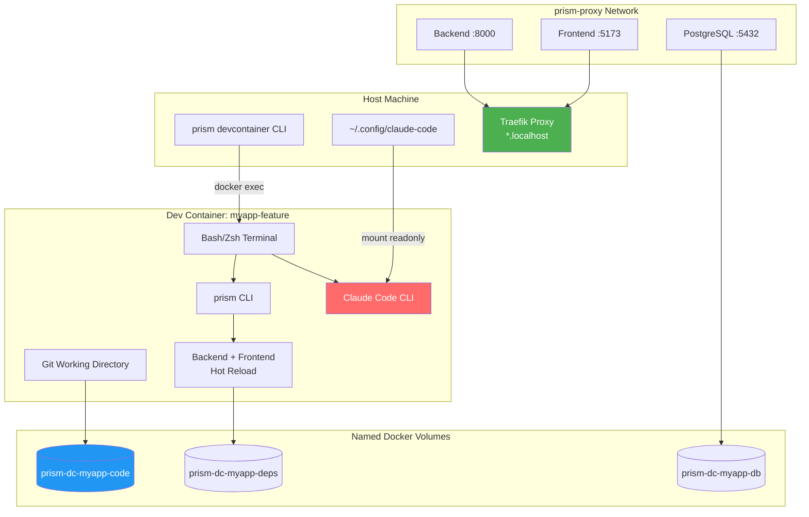
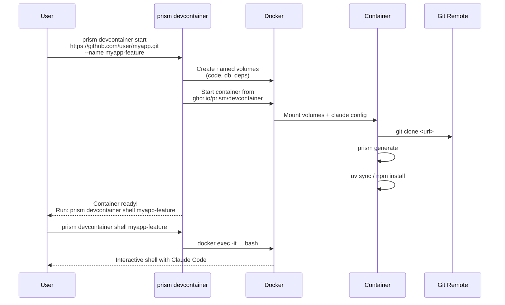

# Plan: Dev Container with Claude Code

**Status**: In Progress (~85% Complete)
**Author**: Prism Core Team
**Created**: 2026-01-26
**Updated**: 2026-01-27
**Priority**: P1 (High)
**Roadmap Reference**: Priority 18

## Overview

Add a CLI-first dev container experience with Claude Code pre-installed, enabling Prism app developers to spin up fully isolated, reproducible development environments with AI-assisted coding built-in. This is essentially a self-hosted Codespaces/Gitpod alternative tailored for Prism projects.

## Goals

- Launch isolated dev containers with a single CLI command
- Pre-install Claude Code in the container image (zero setup)
- Clone project from git inside container (reproducibility)
- Persist all data (code, database, dependencies) in named volumes
- Support multiple concurrent dev containers for different branches/projects
- Integrate with existing Traefik proxy for service access
- Provide explicit cleanup command to remove containers and volumes

## Non-Goals

- VS Code Remote Containers integration (existing `--devcontainer` flag handles this)
- Web-based terminal (SSH/ttyd) - CLI exec is sufficient for MVP
- Auto-scaling or remote deployment (local Docker only)
- Collaborative/multi-user dev containers

## Architecture

### Container Stack



### CLI Command Flow



### Volume Naming Convention

```
prism-dc-{container-name}-code     # Git working directory
prism-dc-{container-name}-db       # PostgreSQL data
prism-dc-{container-name}-deps     # node_modules + .venv
prism-dc-{container-name}-cache    # pip/npm cache (optional, shared)
```

## Design

### Technical Approach

#### 1. Pre-built Docker Image

Host on GitHub Container Registry (`ghcr.io/prism/devcontainer`).

Base: `nikolaik/python-nodejs:python3.13-nodejs22`

Additional layers:
- Claude Code (`npm install -g @anthropic-ai/claude-code`)
- Prism CLI (`pip install prisme`)
- Git, curl, jq, common dev tools
- Shell configuration (bash/zsh with helpful aliases)

```dockerfile
# Dockerfile.devcontainer
FROM nikolaik/python-nodejs:python3.13-nodejs22

# System dependencies
RUN apt-get update && apt-get install -y \
    git curl jq postgresql-client \
    && rm -rf /var/lib/apt/lists/*

# Claude Code
RUN npm install -g @anthropic-ai/claude-code

# Prism CLI
RUN pip install prisme

# UV for fast Python package management
RUN pip install uv

# Shell configuration
COPY .bashrc /root/.bashrc
COPY .zshrc /root/.zshrc

# Working directory
WORKDIR /workspace

# Entry point keeps container running
CMD ["sleep", "infinity"]
```

#### 2. CLI Commands

```python
# src/prism/cli.py

@main.group(name="devcontainer")
def devcontainer_group() -> None:
    """Claude Code dev container commands."""
    pass


@devcontainer_group.command(name="start")
@click.argument("repo_url", required=False)
@click.option("--name", "-n", help="Container name (auto-generated if not provided)")
@click.option("--branch", "-b", default="main", help="Git branch to checkout")
@click.option("--no-generate", is_flag=True, help="Skip prism generate after clone")
def devcontainer_start(
    repo_url: str | None,
    name: str | None,
    branch: str,
    no_generate: bool,
) -> None:
    """Start a new dev container with Claude Code.

    If REPO_URL is not provided and current directory is a git repo,
    uses the remote origin URL.
    """
    ...


@devcontainer_group.command(name="shell")
@click.argument("name")
@click.option("--root", is_flag=True, help="Open shell as root user")
def devcontainer_shell(name: str, root: bool) -> None:
    """Open interactive shell in dev container."""
    ...


@devcontainer_group.command(name="list")
def devcontainer_list() -> None:
    """List all Prism dev containers."""
    ...


@devcontainer_group.command(name="destroy")
@click.argument("name")
@click.option("--volumes", "-v", is_flag=True, help="Also remove data volumes")
@click.confirmation_option(prompt="This will stop the container. Continue?")
def devcontainer_destroy(name: str, volumes: bool) -> None:
    """Stop and remove a dev container."""
    ...


@devcontainer_group.command(name="stop")
@click.argument("name")
def devcontainer_stop(name: str) -> None:
    """Stop a running dev container (preserves state)."""
    ...


@devcontainer_group.command(name="restart")
@click.argument("name")
def devcontainer_restart(name: str) -> None:
    """Restart a stopped dev container."""
    ...
```

#### 3. Container Manager

```python
# src/prism/devcontainer/manager.py

@dataclass
class DevContainerConfig:
    """Configuration for a dev container."""
    name: str
    repo_url: str
    branch: str = "main"
    image: str = "ghcr.io/prism/devcontainer:latest"


class DevContainerManager:
    """Manage Prism dev containers."""

    VOLUME_PREFIX = "prism-dc"
    CONTAINER_PREFIX = "prism-devcontainer"
    NETWORK = "prism-proxy"  # Shared with Traefik

    def __init__(self, console: Console | None = None):
        self.console = console or Console()
        self.claude_config_path = Path.home() / ".config" / "claude-code"

    def create(self, config: DevContainerConfig) -> None:
        """Create and start a new dev container."""
        # Create named volumes
        volumes = self._create_volumes(config.name)

        # Create container with mounts
        container_name = f"{self.CONTAINER_PREFIX}-{config.name}"

        docker_cmd = [
            "docker", "run", "-d",
            "--name", container_name,
            "--network", self.NETWORK,
            # Mount volumes
            "-v", f"{volumes['code']}:/workspace",
            "-v", f"{volumes['db']}:/var/lib/postgresql/data",
            "-v", f"{volumes['deps']}:/workspace/.deps",
            # Mount Claude Code config (readonly)
            "-v", f"{self.claude_config_path}:/root/.config/claude-code:ro",
            # Labels for Traefik
            "-l", f"traefik.enable=true",
            "-l", f"traefik.http.routers.{config.name}.rule=Host(`{config.name}.localhost`)",
            # Environment
            "-e", f"PRISM_PROJECT_NAME={config.name}",
            "-e", f"PRISM_REPO_URL={config.repo_url}",
            "-e", f"PRISM_BRANCH={config.branch}",
            config.image,
        ]

        subprocess.run(docker_cmd, check=True)

        # Initialize the container (clone, generate, install)
        self._initialize_container(config)

    def _create_volumes(self, name: str) -> dict[str, str]:
        """Create named volumes for the container."""
        volumes = {
            "code": f"{self.VOLUME_PREFIX}-{name}-code",
            "db": f"{self.VOLUME_PREFIX}-{name}-db",
            "deps": f"{self.VOLUME_PREFIX}-{name}-deps",
        }
        for vol in volumes.values():
            subprocess.run(["docker", "volume", "create", vol], check=True)
        return volumes

    def _initialize_container(self, config: DevContainerConfig) -> None:
        """Clone repo and set up the project inside the container."""
        container = f"{self.CONTAINER_PREFIX}-{config.name}"

        # Clone repository
        self._exec(container, f"git clone -b {config.branch} {config.repo_url} /workspace")

        # Generate and install
        self._exec(container, "cd /workspace && prism generate")
        self._exec(container, "cd /workspace && uv sync")

        if (Path("/workspace/packages/frontend").exists()):
            self._exec(container, "cd /workspace/packages/frontend && npm install")

    def shell(self, name: str, root: bool = False) -> None:
        """Open interactive shell in container."""
        container = f"{self.CONTAINER_PREFIX}-{name}"
        user_flag = [] if root else ["-u", "1000"]
        subprocess.run(
            ["docker", "exec", "-it", *user_flag, container, "/bin/bash"],
            check=True,
        )

    def list_containers(self) -> list[dict]:
        """List all Prism dev containers."""
        result = subprocess.run(
            ["docker", "ps", "-a", "--filter", f"name={self.CONTAINER_PREFIX}",
             "--format", "{{json .}}"],
            capture_output=True, text=True
        )
        # Parse JSON lines
        ...

    def destroy(self, name: str, remove_volumes: bool = False) -> None:
        """Stop and remove a dev container."""
        container = f"{self.CONTAINER_PREFIX}-{name}"
        subprocess.run(["docker", "stop", container], check=True)
        subprocess.run(["docker", "rm", container], check=True)

        if remove_volumes:
            for suffix in ["code", "db", "deps"]:
                vol = f"{self.VOLUME_PREFIX}-{name}-{suffix}"
                subprocess.run(["docker", "volume", "rm", vol])
```

#### 4. Traefik Integration

Dev containers join the existing `prism-proxy` network and use labels for automatic routing:

```yaml
# Container labels (set via docker run -l)
traefik.enable: true
traefik.http.routers.{name}.rule: Host(`{name}.localhost`)
traefik.http.services.{name}.loadbalancer.server.port: 8000
```

When user runs `prism dev` inside the container, services become accessible at:
- `http://{name}.localhost` - Frontend (proxied via Traefik)
- `http://{name}.localhost/api` - Backend API

#### 5. Claude Code Configuration

Mount the host's Claude Code config directory read-only:

```
~/.config/claude-code → /root/.config/claude-code (readonly)
```

This includes:
- API keys (ANTHROPIC_API_KEY)
- User preferences
- Project settings

The user doesn't need to reconfigure Claude Code inside each container.

### File Structure

```
src/prism/
├── devcontainer/
│   ├── __init__.py
│   ├── manager.py          # DevContainerManager
│   ├── image.py            # Image build/push utilities
│   └── config.py           # DevContainerConfig dataclass
├── templates/jinja2/
│   └── devcontainer/
│       ├── Dockerfile.jinja2
│       └── docker-compose.devcontainer.yml.jinja2
```

## Development Workflow

### Git Branch Strategy

All work happens on a feature branch. Create PR at the end using `gh` CLI.

```bash
# Start feature branch
git checkout -b feature/devcontainer-claude-code
git push -u origin feature/devcontainer-claude-code
```

### Phase-by-Phase Implementation

Each phase follows this workflow:
1. Implement the feature
2. Write tests for the feature
3. Run full regression test suite
4. Commit with descriptive message
5. Push to remote

---

### Phase 1: Docker Image & Dockerfile ✅ COMPLETE

**Implement:**
- [x] Create `Dockerfile.dev.jinja2` in `src/prism/templates/jinja2/devcontainer/`
- [x] Base on `nikolaik/python-nodejs:python3.13-nodejs22`
- [x] Install Claude Code, Prism CLI, dev tools
- [x] Create devcontainer.json template for VS Code integration

**Tests:**
- [x] `tests/devcontainer/test_dockerfile.py` - Dockerfile template renders correctly
- [x] `tests/devcontainer/test_generator.py` - Generator creates correct file structure

**Workflow:**
```bash
# Run tests
pytest tests/devcontainer/test_dockerfile.py -v

# Run full regression
pytest tests/ -v --ignore=tests/e2e

# Commit and push
git add src/prism/templates/jinja2/devcontainer/ tests/devcontainer/
git commit -m "feat(devcontainer): add Dockerfile template and image build workflow"
git push
```

---

### Phase 2: Core Manager Class ✅ COMPLETE

**Implement:**
- [x] Create `src/prism/devcontainer/__init__.py`
- [x] Create `src/prism/devcontainer/config.py` - `WorkspaceConfig` dataclass
- [x] Create `src/prism/devcontainer/manager.py` - `WorkspaceManager` class
- [x] Implement volume/network creation methods
- [x] Implement container lifecycle methods (up, down, shell, logs, status)

**Tests:**
- [x] `tests/devcontainer/test_config.py` - Config dataclass validation
- [x] `tests/devcontainer/test_manager.py` - Manager methods with mocked Docker

**Workflow:**
```bash
# Run tests
pytest tests/devcontainer/test_config.py tests/devcontainer/test_manager.py -v

# Run full regression
pytest tests/ -v --ignore=tests/e2e

# Commit and push
git add src/prism/devcontainer/ tests/devcontainer/
git commit -m "feat(devcontainer): add DevContainerManager with volume and lifecycle management"
git push
```

---

### Phase 3: CLI Commands (up, shell, generate) ✅ COMPLETE

**Implement:**
- [x] Add `prism devcontainer` group to `src/prism/cli.py`
- [x] Implement `prism devcontainer up` command (with --build, --redis flags)
- [x] Implement `prism devcontainer shell` command (with --root flag)
- [x] Implement `prism devcontainer generate` command (auto-generates .devcontainer/)

**Tests:**
- [x] `tests/devcontainer/test_cli.py` - CLI command parsing and validation (250+ lines)

**Workflow:**
```bash
# Run tests
pytest tests/devcontainer/test_cli*.py -v

# Run full regression
pytest tests/ -v --ignore=tests/e2e

# Commit and push
git add src/prism/cli.py tests/devcontainer/
git commit -m "feat(devcontainer): add 'prism devcontainer start' and 'shell' commands"
git push
```

---

### Phase 4: CLI Commands (down, logs, status, list) ✅ COMPLETE

**Implement:**
- [x] Implement `prism devcontainer list` command
- [x] Implement `prism devcontainer down` command (with --volumes flag)
- [x] Implement `prism devcontainer logs` command (with --follow flag)
- [x] Implement `prism devcontainer status` command

**Tests:**
- [x] `tests/devcontainer/test_cli.py` - All CLI commands tested with mocked manager

**Workflow:**
```bash
# Run tests
pytest tests/devcontainer/ -v

# Run full regression
pytest tests/ -v --ignore=tests/e2e

# Commit and push
git add src/prism/cli.py tests/devcontainer/
git commit -m "feat(devcontainer): add list, destroy, stop, restart commands"
git push
```

---

### Phase 5: Traefik Integration ✅ COMPLETE

**Implement:**
- [x] Add Traefik labels in docker-compose.yml.jinja2 template
- [x] Configure network joining (`prism_proxy_network`)
- [x] Handle routing for frontend (port 5173) and backend (port 8000, /api)

**Tests:**
- [x] `tests/devcontainer/test_manager.py` - Network creation tests

**Workflow:**
```bash
# Run tests
pytest tests/devcontainer/test_traefik.py -v

# Run full regression
pytest tests/ -v --ignore=tests/e2e

# Commit and push
git add src/prism/devcontainer/ tests/devcontainer/
git commit -m "feat(devcontainer): add Traefik integration for service routing"
git push
```

---

### Phase 6: Integration Tests ✅ COMPLETE

**Implement:**
- [x] `tests/devcontainer/test_integration.py` - Container lifecycle integration tests
- [x] Test container creation via docker-compose
- [x] Test volume persistence (code, db, deps, node_modules)

**Tests:**
```bash
# Run integration tests
pytest tests/devcontainer/ -v

# Run full regression
pytest tests/ -v --ignore=tests/e2e
```

---

### Phase 7: Documentation ✅ COMPLETE

**Implement:**
- [x] Add `docs/user-guide/devcontainer.md` - User documentation (250 lines)
- [x] Includes: Quick start, command reference, volumes, Traefik routing
- [x] Includes: Claude Code config mounting, troubleshooting

**Tests:**
```bash
# Build docs to verify no broken links
mkdocs build --strict
```

---

### Phase 8: Final Review & PR 🔴 NOT STARTED

**Remaining tasks:**
- [ ] Run full test suite and fix any issues
- [ ] E2E testing with real Docker
- [ ] Create PR to merge into main

**Final checks:**
```bash
# Run full test suite
pytest tests/ -v

# Run linting
ruff check src/prism/devcontainer/
ruff format --check src/prism/devcontainer/

# Build docs
mkdocs build --strict
```

---

## Testing Strategy

### Test Categories

| Category | Location | Run Command | CI Stage |
|----------|----------|-------------|----------|
| Unit Tests | `tests/devcontainer/test_*.py` | `pytest tests/devcontainer/ -v` | `test` |
| Integration | `tests/devcontainer/test_integration.py` | `pytest ... --run-docker` | `e2e-docker` |
| E2E | `tests/e2e/test_devcontainer_e2e.py` | `pytest tests/e2e/ -v` | `e2e` |

### Test Coverage Requirements

- **Unit tests**: Config validation, volume naming, command generation, error handling
- **Integration tests**: Full container lifecycle with real Docker daemon
- **E2E tests**: Clone actual repo, verify services accessible via Traefik

### Regression Testing

Before each commit, run:
```bash
# Fast regression (unit + existing tests)
pytest tests/ -v --ignore=tests/e2e -x

# Full regression (including E2E, slower)
pytest tests/ -v
```

## Rollout Plan

1. Build and publish initial Docker image to GHCR
2. Release `prism devcontainer` commands as experimental
3. Gather feedback on workflow and defaults
4. Document common workflows and troubleshooting
5. Consider auto-update mechanism for container image

## Open Questions

- Should we support custom Dockerfiles for project-specific dependencies?
- How to handle container image updates (pull on start vs manual)?
- Should there be a `prism devcontainer attach` for VS Code Remote integration?
- How to handle multiple services (e.g., separate backend/frontend containers)?

## Example Workflow

```bash
# Start a new dev container for a feature branch
$ prism devcontainer start https://github.com/myorg/myapp.git --name myapp-feature --branch feature/new-ui

Creating dev container 'myapp-feature'...
  ✓ Created volumes (code, db, deps)
  ✓ Started container
  ✓ Cloned repository (branch: feature/new-ui)
  ✓ Generated code (prism generate)
  ✓ Installed dependencies

Dev container ready!
  Run: prism devcontainer shell myapp-feature

# Enter the container
$ prism devcontainer shell myapp-feature

# Inside container - Claude Code is ready
root@prism-devcontainer-myapp-feature:/workspace# claude --version
Claude Code v1.x.x

# Start development servers
root@...:/workspace# prism dev
Starting development servers...
  Backend:  http://myapp-feature.localhost/api
  Frontend: http://myapp-feature.localhost

# Use Claude Code for AI-assisted development
root@...:/workspace# claude
? What would you like to do?
> Help me implement the new UI component...

# Exit when done
root@...:/workspace# exit

# Later: clean up
$ prism devcontainer destroy myapp-feature --volumes
Stopping container...
Removing container...
Removing volumes...
  ✓ Dev container 'myapp-feature' destroyed
```
