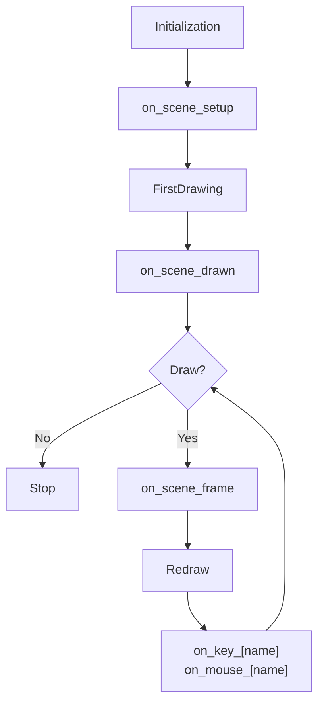

# PsychoPy-Scene


English | [简体中文](README-zh.md)

Lightweight experimental framework based on [PsychoPy](https://github.com/psychopy/psychopy), with only **200 lines** of source code.

> [!NOTE]
> The project is in early development. Please pin the version when using it.

## Features

- Lightweight: only one file, no extra dependencies
- Type-safe: all parameters use type annotations
- Beginner-friendly: only requires understanding `Context` and `Scene`

## Installation

```bash
pip install psychopy-scene
```

## Quick Start

### Experiment Context

The experiment context `Context` represents the global parameters of the experiment, including environment parameters and task parameters.  
The first step of writing an experiment is to create the experiment context:

```python
from psychopy import visual, data
from psychopy_scene import Context

win = visual.Window()
ctx = Context(win, exp=data.ExperimentHandler())
```

### Scenes

An experiment can be considered as a sequence of scenes. Writing an experiment involves two steps:

1. Creating scenes
2. Writing scene presentation logic

Scenes provide configuration parameters such as:

- `duration`: duration in seconds
- `close_on`: names of [events](#events) that close the scene (e.g., `key_f` closes the scene on F key press)
- `on_key_[name]`: callback on specific keyboard key press
- `on_mouse_[name]`: callback on specific mouse button press
- `on_scene_[name]`: callback at specific phases of the scene lifecycle

Creating a scene only requires a function that receives parameters and returns stimuli:

```python
from psychopy import visual

# create stimulus
stim_1 = visual.TextStim(ctx.win, text="Hello")
stim_2 = visual.TextStim(ctx.win, text="World")

# create scene
@ctx.scene(
    duration=1,
    close_on=["key_f", "mouse_right"],
    on_key_escape=lambda: print("escape key was pressed"),
    on_mouse_left=lambda: print("left mouse button was pressed"),
    on_scene_drawn=lambda: print("it will be called after first drawing"),
    on_scene_frame=lambda: print("it will be called each frame"),
)
def demo(color: str, ori: float): # used as on_scene_setup
    print('it will be called before first drawing')
    stim_1.color = color
    stim_2.ori = ori
    return stim_1, stim_2

# show scene
demo.show(color="red", ori=45)
```

Scenes can also be configured dynamically, useful for cases where the display duration is not fixed:

```python
@ctx.scene()
def demo():
    return stim
demo.config(duration=0.5).show()
```

`demo.config` is equivalent to calling `ctx.scene` with the same parameters.

### Events

Events represent specific runtime moments, such as key presses or mouse clicks.  
To perform operations on events, callbacks must be registered:

```python
demo = ctx.scene(close_on="key_f") # or
demo = ctx.scene(on_key_f=lambda: demo.close()) # or
demo = ctx.scene().on("key_f", lambda: demo.close())
```

> [!WARNING]
> Each event can have only one callback. Adding a duplicate will raise an error.

Callback naming follows `on_[type]_[name]`.  
Currently supported event types:

| Type  | Name                                 |
| ----- | ------------------------------------ |
| scene | setup, drawn, frame                  |
| key   | any, values from `keyboard.KeyPress` |
| mouse | left, right, middle                  |

After calling `show`, events are triggered in the following order:



### Data

During scene presentation, data are collected automatically:

| Name      | Description                                  |
| --------- | -------------------------------------------- |
| show_time | timestamp of first flip                      |
| events    | list of interaction events: keyboard & mouse |

Data can be accessed via `scene.get`:

```python
@ctx.scene(close_on=["key_f", "key_j"])
def demo():
    return stim
demo.show()

close_event = demo.get("events")[-1]
close_key = close_event.data # keyboard.KeyPress
close_time = demo.get("show_time") + close_event.rt
```

Manual data logging is also supported:

```python
@ctx.scene(
    on_key_f=lambda: demo.set('pressed_duration', demo.get('events')[-1].data.duration)),
)
def demo():
    return stim
demo.show()

duration = demo.get('pressed_duration')
```

## Shortcuts

`Context` provides shortcuts to simplify experiment writing:

```python
ctx.text('Welcome to the experiment!', pos=(0, 0)).show() # show static text
ctx.record(a='', b=1, c=True) # record a row to ExperimentHandler
```

## Examples

### Trial

```python
from psychopy_scene import Context
from psychopy import visual

def task(ctx: Context, duration = 1):
    stim = visual.TextStim(ctx.win, text="")
    scene = ctx.scene(duration, on_scene_setup=lambda: stim)
    scene.show()
    ctx.record(time=scene.get('show_time'))
```

### Block

```python
from psychopy_scene import Context
from psychopy import visual

def task(ctx: Context):
    stim = visual.TextStim(ctx.win, text="")
    scene = ctx.scene(1, on_scene_setup=lambda: stim)
    scene.show()
    ctx.record(time=scene.get('show_time'))

win = visual.Window()
data = []
for block_index in range(10):
    ctx = Context(win)
    ctx.exp.extraInfo['block_index'] = block_index
    task(ctx)
    block_data = ctx.exp.getAllEntries()
    data.extends(block_data)
```
