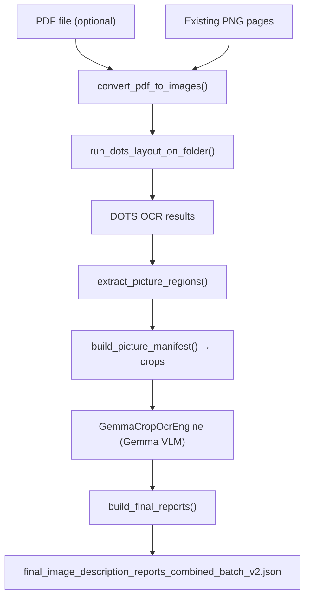

# efficient_llm

[](https://www.python.org/downloads/)
[](https://opensource.org/licenses/MIT)

Local-first OCR and layout understanding pipeline for technical PDF and image documents. Combines **DOTS layout OCR** with **Gemma-based picture-region OCR** to produce structured, high-quality JSON outputs — without relying on external APIs.

This module is part of the [`pure_visual_grounding`](https://github.com/CRAI-KI-Reallabor/pure_visual_grounding) project and is distributed as an **optional extra**.

## Overview

The pipeline performs the following steps:

1. **PDF → PNG conversion** using PyMuPDF  
2. **Layout-aware OCR** using DOTS (layout elements + text; also detects `Picture` regions)  
3. **Picture-region cropping and OCR** using Gemma  
4. **Final combined JSON report generation**  

Designed for reproducible, GPU-accelerated, fully local inference.

## Features

- Multi-page PDF → PNG conversion with configurable DPI
- DOTS-based layout extraction (per-page JSON)
- Automatic detection of `Picture` regions
- Picture-region cropping with configurable padding
- Gemma OCR on cropped technical drawing regions
- Final merged JSON report: DOTS layout + Gemma picture OCR
- Memory-safe batched inference with explicit GPU cleanup
- CLI entrypoint for running without code modifications
- Hugging Face authentication supported where required

## Architecture (Mermaid)



## Installation

### Prerequisites

**CUDA Toolkit Required**: Flash-Attention (required for this pipeline) needs CUDA 11.8 or later.

Download and install CUDA from:
- **Official CUDA Downloads**: https://developer.nvidia.com/cuda-downloads
- **Tested versions**: CUDA 12.1, CUDA 13.0
- **Minimum version**: CUDA 11.8

Verify CUDA installation:
```bash
nvcc --version
```

Expected output (example for CUDA 13.0):
```
nvcc: NVIDIA (R) Cuda compiler driver
Copyright (c) 2005-2025 NVIDIA Corporation
Built on Wed_Aug_20_01:58:59_PM_PDT_2025
Cuda compilation tools, release 13.0, V13.0.88
Build cuda_13.0.r13.0/compiler.36424714_0
```

### Install via pip (recommended)

```bash
pip install "pure-visual-grounder[efficient-llm]"
```

Make sure you have a **CUDA-enabled PyTorch build** installed. See [PyTorch installation guide](https://pytorch.org/get-started/locally/).

Example for CUDA 12.1:
```bash
pip install torch torchvision torchaudio --index-url https://download.pytorch.org/whl/cu121
```

For CUDA 13.0, use CUDA 12.4 or 12.6 wheels (PyTorch doesn't have separate CUDA 13 builds yet, but these are forward-compatible):
```bash
# CUDA 12.6 wheel (tested with CUDA 13.0)
pip install torch torchvision torchaudio --index-url https://download.pytorch.org/whl/cu126

# Or CUDA 12.4 wheel
pip install torch torchvision torchaudio --index-url https://download.pytorch.org/whl/cu124
```

### Development installation

If working directly in the repository:

```bash
pip install -r efficient_llm/requirements.txt
```

## Flash-Attention Setup (Required)

**Flash-Attention is required** for this pipeline to function properly.

**Official Resources:**
- GitHub: https://github.com/Dao-AILab/flash-attention
- Installation Guide: https://github.com/Dao-AILab/flash-attention#installation-and-features

**Important**: Please review the official installation documentation before proceeding, especially if you encounter build issues.

Install Flash-Attention:

```bash
pip install "flash-attn==2.8.0.post2" --no-build-isolation
```

**Installation Notes**: 
- Use `--no-build-isolation` for correct installation
- Compilation requires CUDA toolkit and may take several minutes
- **Warning**: Building the Flash-Attention wheel from source can take significant time (up to 2 hours on some systems)
- Ensure your CUDA version matches PyTorch CUDA version

### Verify Flash-Attention Installation

Check if Flash-Attention is working with CUDA:

```python
import torch
import flash_attn
import transformers

print("PyTorch version:", torch.__version__)
print("CUDA available:", torch.cuda.is_available())
print("CUDA version:", torch.version.cuda)
print("Transformers:", transformers.__version__)
print("Flash-Attention version:", flash_attn.__version__)
print("Flash-Attention with CUDA:", hasattr(flash_attn, 'flash_attn_func'))

# Test on GPU
if torch.cuda.is_available():
    device = torch.device('cuda')
    print(f"GPU: {torch.cuda.get_device_name(0)}")
    print("Flash-Attention is ready!")
else:
    print("WARNING: CUDA not available, Flash-Attention requires GPU")
```

Expected output:
```
PyTorch version: 2.7.0+cu126
CUDA available: True
CUDA version: 12.6
Transformers: 4.57.3
Flash-Attention version: 2.8.0.post2
Flash-Attention with CUDA: True
GPU: NVIDIA RTX 5000 Ada Generation
Flash-Attention is ready!
```

## Download DOTS OCR Model

The DOTS OCR weights are required but not distributed with the package. Download using the CLI helper:

```bash
pvg-download-ocr
# Or specify custom directory:
# pvg-download-ocr --dir "./weights/DotsOCR"
```

This downloads from [rednote-hilab/dots.ocr](https://huggingface.co/rednote-hilab/dots.ocr) and applies necessary patches for modern `transformers` compatibility.

### Manual download

Alternatively, download from:
- GitHub: [rednote-hilab/dots.ocr](https://github.com/rednote-hilab/dots.ocr)  
- Hugging Face: [rednote-hilab/dots.ocr](https://huggingface.co/rednote-hilab/dots.ocr)

## Quick Start

### CLI Usage

Process a PDF with smart defaults:

```bash
python -m efficient_llm.run_pipeline \
  --dots-model "/path/to/DotsOCR" \
  --pdf "./input.pdf"
```

This automatically creates `./input_pngs/`, `./input_crops/`, and `./input_reports/` directories.

### Custom paths:

```bash
python -m efficient_llm.run_pipeline \
  --dots-model "/path/to/DotsOCR" \
  --pdf "./input.pdf" \
  --image-folder "./my_pngs" \
  --crops-dir "./my_crops" \
  --reports-dir "./my_reports"
```

### Process existing PNGs (skip PDF conversion):

```bash
python -m efficient_llm.run_pipeline \
  --dots-model "/path/to/DotsOCR" \
  --image-folder "./existing_pngs" \
  --crops-dir "./crops" \
  --reports-dir "./reports"
```

## Programmatic Usage

### Minimal usage (only 2 parameters required!)

**Option 1: Process a PDF**
```python
from efficient_llm import PipelineConfig, run_pipeline

cfg = PipelineConfig(
    dots_model_path="/path/to/DotsOCR",
    pdf_path="samples/document.pdf"
    # That's it! Output directories auto-generated as:
    # - document_pngs/ (converted images)
    # - document_crops/ (cropped picture regions)
    # - document_reports/ (final JSON output)
)

out_path = run_pipeline(cfg)
print(f"Report saved to: {out_path}")
```

**Option 2: Process existing PNG images**
```python
from efficient_llm import PipelineConfig, run_pipeline

cfg = PipelineConfig(
    dots_model_path="/path/to/DotsOCR",
    image_folder="./my_pngs"
    # Output directories auto-generated as:
    # - my_pngs_crops/
    # - my_pngs_reports/
)

out_path = run_pipeline(cfg)
```

### Custom configuration with all options

```python
from efficient_llm import PipelineConfig, run_pipeline

cfg = PipelineConfig(
    # Required: DOTS model
    dots_model_path="/path/to/DotsOCR",
    
    # Required: ONE of these
    pdf_path="samples/document.pdf",  # OR
    image_folder="./run/pngs",
    
    # Optional: Override auto-generated paths
    crops_dir="./run/crops",
    reports_dir="./run/reports",
    
    # Optional: Performance tuning
    attn_impl="flash_attention_2",
    batch_size=18,
    base_max_new_tokens=4000,
    
    # PDF rendering
    pdf_dpi=100,
    max_long_edge_px=2048,
    
    # Gemma configuration
    gemma_model_id="google/gemma-3n-e4b-it",
    crop_upscale=2.0,
    
    # Device settings
    device_map="auto",
    torch_dtype="bfloat16",
)

out_path = run_pipeline(cfg)
```

## CLI Options

### Required
- `--dots-model`: Path to DOTS model directory
- **ONE of these**:
  - `--pdf`: PDF file to process (auto-generates image folder)
  - `--image-folder`: Existing folder with PNG images

### Optional (paths with smart defaults)
- `--crops-dir`: Directory to store cropped picture regions (auto-generated if not specified)
- `--reports-dir`: Directory to store final report JSON (auto-generated if not specified)

### Optional (common)
- `--pdf-dpi`: DPI for PDF rendering (default: 200)
- `--max-long-edge-px`: Max pixel size for long edge (optional downscaling)
- `--batch-size`: DOTS inference batch size (default: 18)
- `--base-max-new-tokens`: DOTS generation tokens (default: 12000)
- `--gemma-model-id`: Gemma model ID (default: `google/gemma-3n-e4b-it`)
- `--crop-upscale`: Image upscale factor before Gemma OCR (default: 2.0)
- `--padding`: Padding around picture bboxes (default: 12)

### Performance examples

Reduce batch size to avoid OOM:

```bash
python -m efficient_llm.run_pipeline \
  --dots-model "/path/to/DotsOCR" \
  --pdf "./doc.pdf" \
  --batch-size 6 \
  --base-max-new-tokens 4000
```

Reduce image size for lower memory:

```bash
python -m efficient_llm.run_pipeline \
  --dots-model "/path/to/DotsOCR" \
  --pdf "./doc.pdf" \
  --pdf-dpi 150 \
  --max-long-edge-px 1536
```

## Output Files

### DOTS OCR output
```text
<image-folder>/dots_ocr_result_combined.json
```
Combined DOTS layout OCR for all processed pages.

### Final combined report
```text
<reports-dir>/final_image_description_reports_combined_batch_v2.json
```

Structure:
```json
{
  "pdf_name": "document",
  "pages": [
    {
      "page_image": "document_page_1.png",
      "OCR_Result": {
        "ocr_pass_result": [...],
        "picture_ocr_result": [...]
      },
      "Generated_Report": {
        "summary": "..."
      }
    }
  ],
  "errors": []
}
```

## Performance Tips

For best performance with Flash-Attention enabled:

- **Batch size**: 18 on 32GB VRAM (RTX 5000 Ada)
- **DOTS tokens**: 4000 (reduces retries)
- **VRAM usage**: ~13-14 GB
- **DOTS speed**: ~10-11 seconds per page
- **Gemma crop OCR**: ~4-5 seconds per crop
- **Gemma summaries**: ~30-40 seconds per page (slowest component)
- **Overall pipeline**: ~50-60 seconds per page total

**Note**: Gemma summary generation takes ~80% of total pipeline time due to full-resolution image processing and 2048 token generation per page.

If you encounter **CUDA out-of-memory** errors:
- Lower `--batch-size` (try 6 or 9)
- Lower `--base-max-new-tokens` (try 4000)
- Reduce image DPI: `--pdf-dpi 150`
- Add downscaling: `--max-long-edge-px 1536`

## Gemma Authentication

Some Gemma models require Hugging Face authentication:

```bash
huggingface-cli login
```

## Troubleshooting

### `ModuleNotFoundError: qwen_vl_utils`

Ensure `qwen_vl_utils` is available:

```bash
python -c "from qwen_vl_utils import process_vision_info; print('OK')"
```

### DOTS model not found

Verify the path points to the DOTS model directory containing `config.json` and model weights.

### Transformer compatibility

The DOTS processor has been patched for modern `transformers` versions. If you downloaded DOTS manually, you may need to apply the patch. Use `pvg-download-ocr` for automatic patching.

## Repository Structure

```text
efficient_llm/
  __init__.py           # Package initialization
  config.py             # PipelineConfig and settings
  engine.py             # DotsLayoutEngine, GemmaCropOcrEngine
  pipeline.py           # Main pipeline logic
  prompts.py            # DOTS and Gemma prompts
  run_pipeline.py       # CLI entrypoint
  utils.py              # PDF conversion, JSON parsing, cropping
  requirements.txt      # Dependencies
```

## License

MIT License. See root `LICENSE`.

**Note**: DOTS OCR and Gemma models are subject to their own licenses. This repository only provides pipeline orchestration and does not redistribute model weights.

## Author

**Strategion** (<development@strategion.de>)

---

For detailed API reference, advanced configuration options, and performance benchmarks, see [ADVANCED.md](ADVANCED.md).
