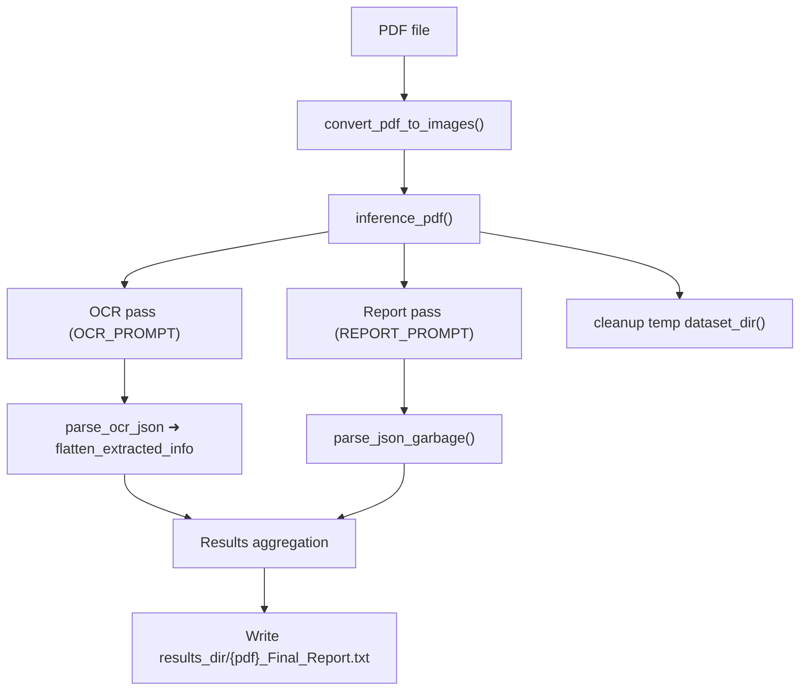

# Local Dual LLM

[](https://www.python.org/downloads/release/python-380/)
[](https://opensource.org/licenses/MIT)

Local-first PDF processing pipeline built around the Qwen2.5-VL vision language model. It converts PDFs to images, performs OCR with a heavily structured prompt, and generates page-level reports — all without external APIs.

## Overview

Local Dual LLM brings the pure-visual-grounding workflow fully on-device using Qwen2.5-VL. It is suited for:

- **Technical Document Processing**: Extract structured data from engineering PDFs
- **OCR with Context**: Strict JSON-constrained OCR with rich schema enforcement
- **Local-Only Runs**: Cache models to disk and avoid remote calls
- **Automated Analysis**: Batch or recursive processing of large PDF sets

## Features

- 🔍 **Two-Pass Vision Flow**: OCR JSON extraction followed by a report-generation pass
- 📄 **Multi-page Support**: Converts each PDF page to PNG and processes sequentially
- 🏗️ **Strict JSON Outputs**: Robust parsers to recover fenced or messy JSON
- 🎯 **Configurable Generation**: Tunable token limits and pixel budgets
- 📊 **Debug Logging**: Failed OCR outputs saved to a debug folder
- 🛠️ **Local Caching**: Reuse model weights via a configurable cache dir

## Architecture (Mermaid)



## Function Flow: `inference_pdf`

- Convert PDF to page images (`utils.convert_pdf_to_images`)
- For each page: run OCR prompt, parse JSON, flatten info; run report prompt with flattened OCR context
- Collect per-page results and write `<pdf>_Final_Report.txt`
- Cleanup temp dataset folder; close engine if created locally

## Function Flow: `batched_inference`

- Scan a folder for PDFs
- Optionally create a shared `QwenEngine`, then call `inference_pdf` per file
- Track processed/failed lists and emit batch summary
- Close the shared engine if this function created it

## Function Flow: `recursive_batched_inference`

- Walk an input root directory for PDFs (respecting subfolders)
- Mirror directory structure under `results_dir` with `_Final_Report` suffixes
- Reuse a shared engine while invoking `inference_pdf` per discovered PDF
- Return processed/failed counts and close the engine if locally created

## Installation

Install from the local folder (editable):

```bash
pip install pure-visual-grounder[local-dual-llm]
```

## Quick Start

### Basic Usage

```python
from local_dual_llm import inference_pdf

result = inference_pdf("samples/document.pdf")
print(result["pages"][0]["Generated_Report"])
```

### Custom Processing

```python
from local_dual_llm.pipeline import inference_pdf
from local_dual_llm.config import LocalDualLLMConfig
from local_dual_llm.engine import QwenEngine

cfg = LocalDualLLMConfig(cache_dir="./Qwen_cache", results_dir="./results_custom")
with QwenEngine(config=cfg) as engine:
    result = inference_pdf("samples/document.pdf", config=cfg, engine=engine)
    print(result["pages"][0]["OCR_Result"])
```

## Advanced Usage

### Batch Processing

```python
from local_dual_llm.pipeline import batched_inference

summary = batched_inference("./pdf_folder")
print(summary)
```

### Integration with Different Models

```python
from local_dual_llm.engine import QwenEngine
from local_dual_llm.config import LocalDualLLMConfig

# Override model_id and device
cfg = LocalDualLLMConfig(model_id="Qwen/Qwen2.5-VL-7B-Instruct", device="cuda")
engine = QwenEngine(config=cfg, cache_dir="./Qwen_cache")
```

## Output Format

Per-PDF file saved as `<pdf_name>_Final_Report.txt` containing:

```json
{
  "pdf_name": "document",
  "pages": [
    {
      "page_image": "document_page_1.png",
      "OCR_Result": {...},
      "Generated_Report": {...}
    }
  ],
  "errors": []
}
```

## Configuration Options

### Function Parameters

- **pdf_path** (str): Path to a PDF file
- **config** (`LocalDualLLMConfig`): Controls paths, pixel limits, token budgets, model id/device
- **engine** (`QwenEngine`): Optional preloaded engine; created if absent
- **custom_output_dir** (str): Override results directory for a single call

### Recommended Pixel Settings

- **min_pixels** / **max_pixels** in `LocalDualLLMConfig` govern image scaling hints to the model.

## Use Cases

### Technical Documentation

OCR + reporting for engineering drawings, parts catalogs, and schematics.

### Financial Documents

Process PDF statements locally when you supply finance-tailored prompts.

### Research Papers

High-DPI rendering plus structured OCR for figures, tables, and captions.

## Error Handling

- Failed OCR parses are logged to `results/debug_logs/ocr_fail_<page>.txt`
- Temporary dataset folders are cleaned even on exceptions
- Batch flows keep `processed` and `failed` lists

## Requirements

- Python 3.8+
- torch==2.9.1
- torchvision==0.24.1
- pymupdf==1.26.6
- transformers==4.57.3
- accelerate==1.12.0
- qwen_vl_utils==0.0.14

## Performance Tips

1. Prefer a GPU (`device="cuda"`) for faster generation
2. Keep `cache_dir` on fast storage to speed model load
3. Adjust `gen_max_new_tokens_*` to balance speed vs. completeness
4. Reuse a shared `QwenEngine` for batches to avoid reloads
5. Clean `results` regularly if disk is constrained

## Contributing

PRs welcome. Please align with the existing prompt structures and keep outputs strictly JSON.

## License

MIT License (see root `LICENSE`).

---

**Author**: Strategion (development@strategion.de)

**Keywords**: PDF, OCR, Vision, Qwen2.5-VL, Document Processing, Technical Documents
