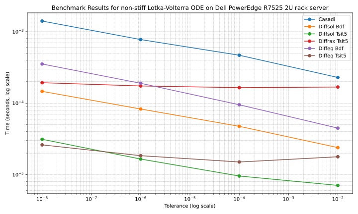
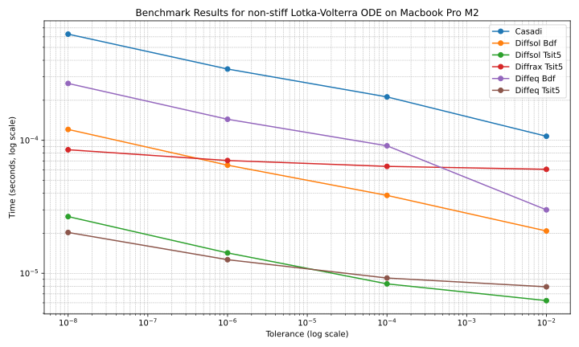

Lotka-Volterra ODE Benchmark
============================

We benchmark ODE solvers on the Lotka-Volterra predator-prey model. This is a non-stiff system of equations defined as:

.. math::

   \frac{dx}{dt} = a x - b xy

   \frac{dy}{dt} = c xy - d y

where :math:`x` is the number of prey, :math:`y` is the number of predators, and :math:`a`, :math:`b`, :math:`c`, and :math:`d` are positive real parameters that describe the interaction between the two species.

We will benchmark the following solvers against different tolerances:

- Diffsol's BDF & TSIT45 methods
- CasADi's CVODE solver
- Diffrax's Tsit5 solvers
- Julia's DifferentialEquations.jl FBDF & Tsit5 methods

The following solvers are similar so should be compared against each other:

- Diffsol BDF, CasADi CVODE & DifferentialEquations.jl FBDF methods.
- Diffsol's TSIT45, DifferentialEquations.jl Tsit5 and Diffrax's Tsit5 methods are all explicit Runge-Kutta methods with identical tableaus.

Benchmark Setup
---------------

For each solver, we perform as much initial setup as possible outside of the timing loop to ensure a fair comparison, using a function called `setup`.
The actual benchmark is performed in a function called `bench`.

The code for the Diffsol solvers is shown below:

.. literalinclude:: ../../bench/diffsol_lotka_volterra.py
   :encoding: latin-1
   :language: python

.. literalinclude:: ../../bench/diffsol_models.py
   :encoding: latin-1
   :language: python

The code for the CasADi solver is shown below:

.. literalinclude:: ../../bench/casadi_lotka_volterra.py
   :encoding: latin-1
   :language: python

.. literalinclude:: ../../bench/casadi_models.py
   :encoding: latin-1
   :language: python

The code for the Diffrax solver is shown below:

.. literalinclude:: ../../bench/diffrax_lotka_volterra.py
   :encoding: latin-1
   :language: python

.. literalinclude:: ../../bench/diffrax_models.py
   :encoding: latin-1
   :language: python

The code for the DifferentialEquations.jl solvers is shown below:

.. literalinclude:: ../../bench/diffeq_lokta_volterra.jl
   :encoding: latin-1
   :language: julia

.. literalinclude:: ../../bench/diffeq_models.jl
   :encoding: latin-1
   :language: julia

Differences between implementations
-----------------------------------

There are a few key differences between the Diffrax, Casadi, Diffsol and DifferentialEquations.jl implementations that may affect the performance of the solvers. The main differences are:

- **JIT compilation & Function evaluation overhead:** The Diffsol implementation uses the DiffSL JIT compiler to compile the model equations to optimised native code.
  Diffrax uses JAX to JIT compile the model equations and solvers to XLA optimised code. Julia is a JIT compiled language so the DifferentialEquations.jl implementation is also JIT compiled to native code using LLVM.
  Casadi is the only implementation that does not use JIT compilation, instead it builds a computational graph of operations to evaluate the model equations, which adds additional overhead to each function evaluation.

Results
-------

The benchmarks were run on:
   - A Dell PowerEdge R7525 2U rack server, with dual AMD EPYC 7343 3.2Ghz 16C CPU and 128GB Memory
   - A Macbook M2 Pro (14-inch, 2023) with 16GB Memory, 12 (8 performance and 4 efficiency) cores

The results are shown below:

The Diffsol and DifferentialEquations.jl implementations of the TSIT45 method perform the best across all tolerances and hardware setups, with Diffsol being slightly faster at larger tolerances and DifferentialEquations.jl being slightly faster at smaller tolerances.
Diffrax's Tsit5 implementation is slowest, perhaps due to the use of double precision, which is not a common use case for ML libraries.

For the BDF/FBDF methods, the Diffsol implementation outperforms both the Casadi and DifferentialEquations.jl implementations across all tolerances and hardware setups.
The Casadi implementation is the slowest of the three, likely due to the overhead of evaluating the function using the computational graph.