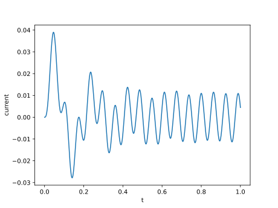

Example: Electrical Circuits
============================

Lets consider the following low-pass LRC filter circuit::

      +---L---+---C---+
      |       |       |
  V_s =       R       |
      |       |       |
      +-------+-------+

The circuit consists of a resistor \\(R\\), an inductor \\(L\\), and a capacitor \\(C\\) connected to a voltage source \\(V_s\\). The voltage across the resistor \\(V\\) is given by Ohm's law:

.. math:: V = R i_R

where \\(i_R\\) is the current flowing through the resistor. The voltage across the inductor is given by:

.. math:: \frac{di_L}{dt} = \frac{V_s - V}{L}

where \\(di_L/dt\\) is the rate of change of current with respect to time. The voltage across the capacitor is the same as the voltage across the resistor and the equation for an ideal capacitor is:

.. math:: \frac{dV}{dt} = \frac{i_C}{C}

where \\(i_C\\) is the current flowing through the capacitor. The sum of the currents flowing into and out of the top-center node of the circuit must be zero according to Kirchhoff's current law:

.. math:: i_L = i_R + i_C

Thus we have a system of two differential equations and two algebraic equation that describe the evolution of the currents through the resistor, inductor, and capacitor; and the voltage across the resistor. We can write these equations in the general form:

.. math:: M \frac{d\mathbf{y}}{dt} = \mathbf{f}(\mathbf{y}, t)

where

.. math:: \mathbf{y} = \begin{bmatrix} i_R \\\\ i_L \\\\ i_C \\\\ V \end{bmatrix}

and

.. math:: \mathbf{f}(\mathbf{y}, t) = \begin{bmatrix} V - R i_R \\\\ \frac{V_s - V}{L} \\\\ i_L - i_R - i_C \\\\ \frac{i_C}{C} \end{bmatrix}

The mass matrix \\(M\\) has one on the diagonal for the differential equations and zero for the algebraic equation.

.. math:: M = \begin{bmatrix} 0 & 0 & 0 & 0 \\\\ 0 & 1 & 0 & 0 \\\\ 0 & 0 & 0 & 0 \\\\ 0 & 0 & 0 & 1 \end{bmatrix}

Instead of providing the mass matrix explicitly, the DiffSL language specifies the multiplication of the mass matrix with the derivative term, \\(M \frac{d\mathbf{y}}{dt}\\), which is given by:

.. math:: M \frac{d\mathbf{y}}{dt} = \begin{bmatrix} 0 \\\\ \frac{di_L}{dt} \\\\ 0 \\\\ \frac{dV}{dt} \end{bmatrix}

The initial conditions for the system are:

.. math:: \mathbf{y}(0) = \begin{bmatrix} 0 \\\\ 0 \\\\ 0 \\\\ 0 \end{bmatrix}

The voltage source \\(V_s\\) acts as a forcing function for the system, and we can specify this as sinusoidal function of time.

.. math::

  V_s(t) = V_0 \sin(\omega t)

where \\(\omega\\) is the angular frequency of the source. Since this is a low-pass filter, we will choose a high frequency for the source, say \\(\omega = 200\\), to demonstrate the filtering effect of the circuit.

We can solve this system of equations using Diffsol and plot the current and voltage across the resistor as a function of time.

.. literalinclude:: ../../examples/4_1_electrical_circuits.py
  :encoding: latin-1
  :lines: 1-48
  :language: python

