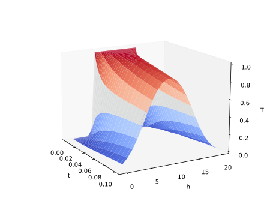
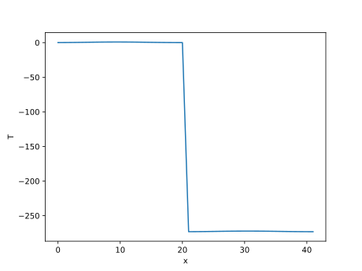

Example: Heat Equation
======================

We will now consider the heat equation as an example for a simple PDE. The heat equation is a PDE that describes how the temperature of a material changes over time. In one dimension, the heat equation is:

.. math:: \frac{\partial u}{\partial t} = D \frac{\partial^2 u}{\partial x^2}

where \\(u(x, t)\\) is the temperature of the material at position \\(x\\) and time \\(t\\), and \\(D\\) is the thermal diffusivity of the material. Please refer to
the `Diffsol heat equation example <https://martinjrobins.github.io/diffsol/primer/heat_equation.html>`_ for the derivation of the diffsol model.

We can solve the one-dimensional heat equation using Diffsol with the following code:

.. literalinclude:: ../../examples/5_1_heat_equation.py
  :encoding: latin-1
  :lines: 1-55
  :language: python

The plot of the solution is:

Let's demonstrate calculating two variables by adding the temperature in celcius to the output of the model. This can be done by adding one line to the `out_i` section in the model::

  out_i {
      u_i,
      u_i - 273.15
  }

If we change to a regular 2D plot and render just the last column::

  ax.plot(ys[:,-1], label="x")

The plot shows the output from the two values concatenated. Instead of having 21 values it has doubled to 42, with celcius on the left and kelvin on the right:

When working with multiple outputs, be mindful the solve result is always a 2D array and one must manually split the array to separate the variables.
