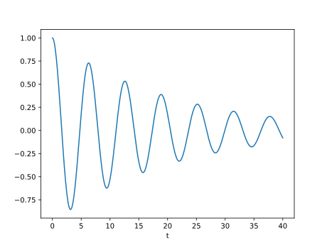

Example: Spring-mass systems
============================

We will model a `damped spring-mass system <https://en.wikipedia.org/wiki/Mass-spring-damper_model>`_ using a second order ODE. The system consists of a mass \\(m\\) attached to a spring with spring constant \\(k\\), and a damping force proportional to the velocity of the mass with damping coefficient \\(c\\).

.. image:: ../images/mass_spring_damper.png
  :width: 320
  :height: 240
  :alt: mass_spring_damper.png

The equation of motion for the mass can be written as:

.. math:: m \frac{d^2x}{dt^2} = -k x - c \frac{dx}{dt}

where \\(x\\) is the position of the mass, \\(t\\) is time, and the negative sign on the right hand side indicates that the spring force and damping force act in the opposite direction to the displacement of the mass.

We can convert this to a system of two first order ODEs by introducing a new variable for the velocity of the mass:

.. math::
  \begin{align*}
  \frac{dx}{dt} &= v \\\\
  \frac{dv}{dt} &= -\frac{k}{m} x - \frac{c}{m} v
  \end{align*}

where \\(v = \frac{dx}{dt}\\) is the velocity of the mass.

We can solve this system of ODEs using Diffsol with the following code:

.. literalinclude:: ../../examples/2_1_spring_mass_system.py
  :encoding: latin-1
  :lines: 4,6-9,11-33
  :language: python

