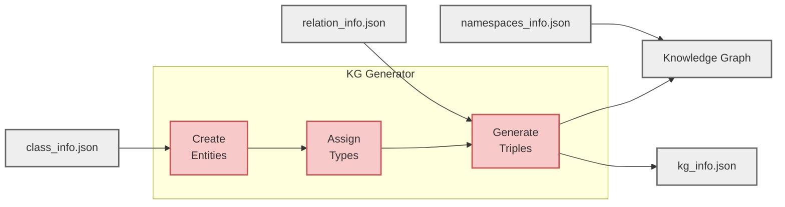
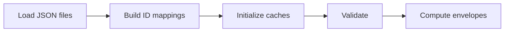
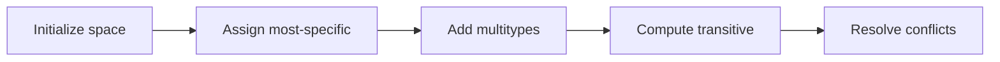
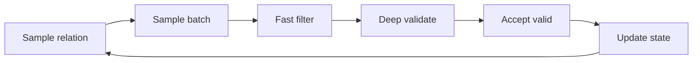
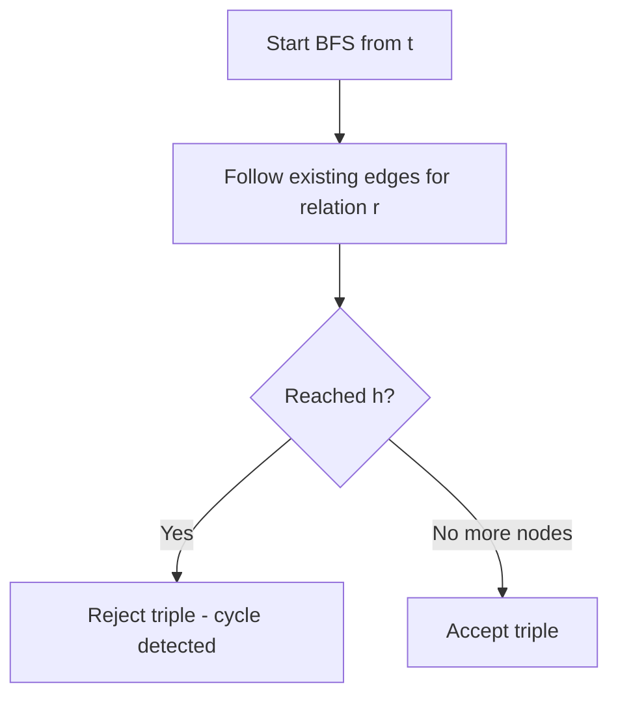

# KG Generation

KG generation creates synthetic Knowledge Graph instances from extracted ontology metadata. Entities are created, assigned types, and connected with triples that respect ontology constraints.

!!! note "Why This Page is Detailed"
    The KG generator is the core of PyGraft-gen's architecture — it's what enables generation at scales previously impractical (1M+ entities, 10M+ triples). This page is intentionally exhaustive because understanding these internals is essential for troubleshooting, performance tuning, and future extensions.

**On this page:**

- [Overview](#overview) — What KG generation does
- [How Constraints Are Enforced](#how-constraints-are-enforced) — The rules PyGraft-gen respects
- [The Generation Pipeline](#the-generation-pipeline) — Four phases at a glance
- [Algorithm and Complexity](#algorithm-and-complexity) — Deep dive into how it works
- [Performance Characteristics](#performance-characteristics) — Runtime and memory expectations
- [Configuration Parameters](#configuration-parameters) — Tuning generation behavior
- [Fast Generation Mode](#fast-generation-mode) — Speed optimization for large KGs
- [FAQ](#faq) — Common questions and troubleshooting
- [Limitations](#limitations) — Known constraints

---

## Overview

KG generation takes the three metadata files from [ontology extraction](ontology-extraction.md) and produces a Knowledge Graph:



**Output files:**

- :fontawesome-solid-project-diagram: `kg.{ttl|rdf|nt}` — The complete Knowledge Graph in your chosen RDF format
- :fontawesome-solid-chart-bar: `kg_info.json` — Statistics and parameters documenting what was generated

!!! warning "Extraction Scope"
    The generator can only enforce constraints from the extracted metadata but cannot enforce constructs that weren't captured during extraction.

    :material-fire: See [What's Supported](../getting-started/quickstart.md/#whats-supported)

---

## How Constraints Are Enforced

The generator enforces constraints extracted from the ontology during generation. Every triple generated satisfies the schema's explicit constraints.

!!! tip "Detailed Explanations"
    For detailed explanations with examples, see [OWL Constraints](owl-constraints.md).

### Enforced Constraints

**Class Constraints:**

| Constraint                                                                                              | Property           | Enforcement                         |
|---------------------------------------------------------------------------------------------------------|--------------------|-------------------------------------|
| [**Hierarchy**](https://www.w3.org/TR/rdf-schema/#ch_subclassof){target="_blank" rel="noopener"}        | `rdfs:subClassOf`  | Entities inherit all superclasses   |
| [**Disjointness**](https://www.w3.org/TR/owl2-syntax/#Disjoint_Classes){target="_blank" rel="noopener"} | `owl:disjointWith` | Entities cannot have disjoint types |

**Property Characteristics:**

| Constraint                                                                                                                        | Property                        | Enforcement                               |
|-----------------------------------------------------------------------------------------------------------------------------------|---------------------------------|-------------------------------------------|
| [**Functional**](https://www.w3.org/TR/owl2-syntax/#Functional_Object_Properties){target="_blank" rel="noopener"}                 | `owl:FunctionalProperty`        | At most one outgoing edge per subject     |
| [**Inverse functional**](https://www.w3.org/TR/owl2-syntax/#Inverse-Functional_Object_Properties){target="_blank" rel="noopener"} | `owl:InverseFunctionalProperty` | At most one incoming edge per object      |
| [**Symmetric**](https://www.w3.org/TR/owl2-syntax/#Symmetric_Object_Properties){target="_blank" rel="noopener"}                   | `owl:SymmetricProperty`         | Stores only one direction per entity pair |
| [**Asymmetric**](https://www.w3.org/TR/owl2-syntax/#Asymmetric_Object_Properties){target="_blank" rel="noopener"}                 | `owl:AsymmetricProperty`        | Rejects if reverse edge exists            |
| [**Transitive**](https://www.w3.org/TR/owl2-syntax/#Transitive_Object_Properties){target="_blank" rel="noopener"}                 | `owl:TransitiveProperty`        | Prevents cycles with irreflexive closure  |
| [**Irreflexive**](https://www.w3.org/TR/owl2-syntax/#Irreflexive_Object_Properties){target="_blank" rel="noopener"}               | `owl:IrreflexiveProperty`       | No self-loops                             |
| [**Reflexive**](https://www.w3.org/TR/owl2-syntax/#Reflexive_Object_Properties){target="_blank" rel="noopener"}                   | `owl:ReflexiveProperty`         | Not materialized (reasoners infer)        |

**Relational Constraints:**

| Constraint                                                                                                                 | Property                     | Enforcement                                |
|----------------------------------------------------------------------------------------------------------------------------|------------------------------|--------------------------------------------|
| [**Domain/range**](https://www.w3.org/TR/rdf-schema/#ch_range){target="_blank" rel="noopener"}                             | `rdfs:domain` / `rdfs:range` | Triples respect class restrictions         |
| [**Property disjointness**](https://www.w3.org/TR/owl2-syntax/#Disjoint_Object_Properties){target="_blank" rel="noopener"} | `owl:propertyDisjointWith`   | Entity pairs cannot use disjoint relations |
| [**Inverse relationships**](https://www.w3.org/TR/owl2-syntax/#Inverse_Object_Properties){target="_blank" rel="noopener"}  | `owl:inverseOf`              | Validates inverse triples would be valid   |
| [**Subproperty inheritance**](https://www.w3.org/TR/rdf-schema/#ch_subpropertyof){target="_blank" rel="noopener"}          | `rdfs:subPropertyOf`         | Constraints inherited from superproperties |

### Forbidden Characteristic Combinations

Some characteristic combinations are logically inconsistent and prohibited by [OWL 2](https://www.w3.org/TR/owl2-overview/){target="_blank" rel="noopener"}:

**:fontawesome-solid-circle-xmark: Direct Contradictions (Generation Stops):**

| Combination                                                                                                                                                                                                                           | Why Forbidden                                           |
|---------------------------------------------------------------------------------------------------------------------------------------------------------------------------------------------------------------------------------------|---------------------------------------------------------|
| [**Reflexive**](https://www.w3.org/TR/owl2-syntax/#Reflexive_Object_Properties){target="_blank" rel="noopener"} + [**Irreflexive**](https://www.w3.org/TR/owl2-syntax/#Irreflexive_Object_Properties){target="_blank" rel="noopener"} | Reflexive requires self-loops; Irreflexive forbids them |
| [**Symmetric**](https://www.w3.org/TR/owl2-syntax/#Symmetric_Object_Properties){target="_blank" rel="noopener"} + [**Asymmetric**](https://www.w3.org/TR/owl2-syntax/#Asymmetric_Object_Properties){target="_blank" rel="noopener"}   | Symmetric requires bidirectional; Asymmetric forbids it |

**:fontawesome-solid-triangle-exclamation: Problematic Combinations (Warnings, Relation Excluded):**

| Combination                                                                                                                                                                                                                                          | Issue                                                                                                            |
|------------------------------------------------------------------------------------------------------------------------------------------------------------------------------------------------------------------------------------------------------|------------------------------------------------------------------------------------------------------------------|
| [**Asymmetric**](https://www.w3.org/TR/owl2-syntax/#Asymmetric_Object_Properties){target="_blank" rel="noopener"} + [**Functional**](https://www.w3.org/TR/owl2-syntax/#Functional_Object_Properties){target="_blank" rel="noopener"}                | Creates inconsistency in [OWL 2](https://www.w3.org/TR/owl2-overview/){target="_blank" rel="noopener"} reasoning |
| [**Asymmetric**](https://www.w3.org/TR/owl2-syntax/#Asymmetric_Object_Properties){target="_blank" rel="noopener"} + [**InverseFunctional**](https://www.w3.org/TR/owl2-syntax/#Inverse-Functional_Object_Properties){target="_blank" rel="noopener"} | Creates inconsistency in [OWL 2](https://www.w3.org/TR/owl2-overview/){target="_blank" rel="noopener"} reasoning |
| [**Transitive**](https://www.w3.org/TR/owl2-syntax/#Transitive_Object_Properties){target="_blank" rel="noopener"} + [**Functional**](https://www.w3.org/TR/owl2-syntax/#Functional_Object_Properties){target="_blank" rel="noopener"}                | Can lead to unintended inference chains and explosions                                                           |

When detected during schema loading, the generator either stops (SEVERE errors) or excludes the problematic relation (WARNING errors).

---

## The Generation Pipeline

Generation happens in four sequential phases, each building on the previous one.

### :fontawesome-solid-1: Schema Loading

The first phase prepares everything needed for efficient generation by converting metadata into optimized internal structures.

**:fontawesome-solid-fingerprint: ID mappings:**

Convert class/relation names to integer IDs and create bidirectional lookups (string &harr; ID). This enables fast array-based operations throughout generation.

**:fontawesome-solid-database: Constraint caches (pre-computed):**

All constraint data is computed once upfront to avoid repeated lookups during generation:

- Domain/range entity pools for each relation
- Disjoint envelopes (classes disjoint with each relation's domain/range)
- Transitive superclass closures for all classes
- Property characteristics sets (functional, symmetric, transitive, etc.)
- Inverse mappings and subproperty chains

**:fontawesome-solid-shield-halved: Schema validation:**

Checks for logical contradictions before generation begins:

- **SEVERE errors** stop generation immediately (e.g., reflexive + irreflexive, symmetric + asymmetric)
- **WARNING errors** exclude problematic relations (e.g., transitive + functional, asymmetric + functional)


### :fontawesome-solid-2: Entity Creation and Typing

With the schema loaded, entities are created and assigned types according to the class hierarchy.

**:fontawesome-solid-users: Entity creation:**

- Allocates entity ID space (E1, E2, ..., En)
- Splits entities into typed vs untyped based on `prop_untyped_entities`

**:fontawesome-solid-tags: Type assignment:**

Typed entities receive classes sampled from the hierarchy:

- Uses power-law distribution (mimics real-world data where a few classes are very common and most are rare)
- Target depth controlled by `avg_specific_class_depth`
- Transitive superclasses added automatically
- Optional multityping adds additional most-specific classes

**:fontawesome-solid-ban: Disjointness enforcement:**

If an entity receives disjoint classes, one is removed deterministically to maintain logical consistency.

**:fontawesome-solid-list: Reverse indices:**

Builds lookup tables for the next phase:

- `class2entities[Person] = [E1, E5, E12, ...]` — All entities of each class
- `class2unseen[Person] = [E5, E12, ...]` — Entities not yet used in triples

These enable fast candidate pool construction during triple generation.


### :fontawesome-solid-3: Triple Generation

The core phase where relational triples are created using batch sampling with constraint filtering.

#### Setup Phase (One-Time)

Before generating any triples, the system prepares relation-specific data:

**:fontawesome-solid-filter: Build candidate entity pools per relation:**

- Domain pool: Entities satisfying ALL domain classes (intersection)
- Range pool: Entities satisfying ALL range classes (intersection)
- Relations with empty pools are excluded from generation

**:fontawesome-solid-balance-scale: Distribute triple budget across relations:**

- Controlled by `relation_usage_uniformity`
- 0.0 = power-law distribution (few relations dominate)
- 1.0 = uniform distribution (all relations equal)

**:fontawesome-solid-clipboard-check: Initialize tracking structures:**

- Duplicate detection: `seen_pairs[relation] = {(h1,t1), (h2,t2), ...}`
- Functional constraints: `functional_heads[relation] = {h1, h2, ...}`
- Inverse-functional: `invfunctional_tails[relation] = {t1, t2, ...}`


#### Generation Loop

Sample batches of candidate triples and filter them through two phases:

??? info ":fontawesome-solid-bolt: Fast Filtering (Batch)"
    Applied to all candidates using vectorized NumPy operations. Checks that don't need current graph state:
    
    - **Irreflexive**: `head != tail`
    - **Duplicate**: `(head, tail)` not already generated
    - **Functional**: `head` not already used for this relation
    - **Inverse-functional**: `tail` not already used for this relation
    - **Asymmetric**: reverse edge doesn't exist
    - **Symmetric duplicates**: reverse direction not already generated

??? info ":fontawesome-solid-magnifying-glass: Deep Validation (Per-Triple)"
    Applied during generation as each triple is added. These checks require type information or graph traversal:
    
    - **Domain/range typing**: Entity types satisfy all constraints
    - **Disjoint envelopes**: Entities not instances of classes disjoint with domain/range
    - **Inverse validation**: Inverse triple would be valid
    - **Property disjointness**: Entity pair doesn't exist for disjoint property
    - **Transitive cycles**: No reflexive cycles created
    - **Subproperty inheritance**: Constraints from superproperties satisfied

#### Adaptive Mechanisms

The generator adjusts dynamically to maintain efficiency:

- **Oversample multiplier**: Constrained relations (functional, inverse-functional) oversample 4x to compensate for higher rejection rates
- **Batch sizing**: Increases dynamically as valid candidates become scarce
- **Stall detection**: Relations producing 20 consecutive empty batches are dropped (candidate pool exhausted)
- **Weight recomputation**: Redistributes budget from dropped relations to active ones

!!! info "Target vs Actual"
    `num_triples` is a target. Actual count may be lower due to constraint exhaustion and is reported in `kg_info.json`.


### :fontawesome-solid-4: Serialization

The final phase writes the generated Knowledge Graph to disk with proper formatting.

**:fontawesome-solid-project-diagram: RDF graph (`kg.ttl`, `.rdf`, or `.nt`):**

- Instance triples (head, relation, tail)
- Type assertions for **most-specific classes only** (reasoners infer superclasses)
- Namespace bindings from `namespaces_info.json`

**:fontawesome-solid-chart-bar: Statistics (`kg_info.json`):**

- User parameters (requested counts, configuration)
- Actual statistics (generated counts, averages, proportions)

---

## Algorithm and Complexity

This section provides a detailed look at how the generation algorithm works and its computational complexity. Understanding this helps you predict performance and troubleshoot slow generation.

!!! info "Notation"

    Throughout this section, we use shorthand notation for readability. Here is what each symbol means:

    | Symbol               | Full name                     | Source                                 |
    |----------------------|-------------------------------|----------------------------------------|
    | $n_\text{entities}$  | Number of entities            | `num_entities` config parameter        |
    | $n_\text{triples}$   | Number of triples             | `num_triples` config parameter         |
    | $n_\text{classes}$   | Number of classes             | From the schema (`class_info.json`)    |
    | $n_\text{relations}$ | Number of relations           | From the schema (`relation_info.json`) |
    | $\text{avg_depth}$   | Average class hierarchy depth | Depends on schema structure            |
    | $\text{avg_types}$   | Average types per entity      | When multityping is enabled            |
    | $\text{batch}$       | Batch size                    | 1K to 100K depending on KG scale       |

    We express complexity using Big-O notation. For example, $O(n_\text{entities})$ means the operation's runtime grows linearly with the number of entities.

### :fontawesome-solid-cubes: Design Philosophy

PyGraft-gen uses an **integer-ID model with batch sampling and two-phase filtering** to achieve scalability:

- **Integer-based identifiers:** Entities, classes, and relations use integer IDs internally. Strings only appear during serialization. This eliminates string overhead and enables efficient NumPy array operations.

- **Pre-computed constraint caches:** Domain/range pools, disjointness sets, and property characteristics computed once before generation. No repeated set intersections or dictionary lookups during sampling.

- **Batch sampling with vectorized filtering:** Sample large batches of candidate triples, then apply constraints in two phases — fast filtering eliminates most invalid candidates before expensive deep validation.

- **Incremental constraint tracking:** Functional and inverse-functional properties maintain sets of used heads/tails. Constraint checks become constant-time set membership tests, i.e., $O(1)$, instead of scanning all existing triples which would cost $O(n_\text{triples})$.

!!! success "Performance Impact"
    - Naive approach: 10M triples = 10M sampling operations, each with $O(n_\text{triples})$ validation cost
    - PyGraft-gen: 10M triples ≈ 1,000 batch operations with $O(1)$ constraint checks
    - Result: Hours reduced to minutes for large-scale generation


### :fontawesome-solid-1: Schema Loading

Schema loading converts JSON metadata into optimized internal structures.



**Complexity breakdown:**

| Step               | Operation                                   | Complexity                                                                             |
|--------------------|---------------------------------------------|----------------------------------------------------------------------------------------|
| Load JSON          | Parse class_info, relation_info             | Linear in schema size: $O(n_\text{classes} + n_\text{relations})$                      |
| ID mappings        | Build bidirectional dictionaries            | Linear in schema size: $O(n_\text{classes} + n_\text{relations})$                      |
| Class caches       | Layer mappings, transitive closures         | Linear in classes times hierarchy depth: $O(n_\text{classes} \times \text{avg_depth})$ |
| Relation caches    | Domain/range sets, property characteristics | Linear in relations: $O(n_\text{relations})$                                           |
| Validation         | Check forbidden combinations                | Linear in relations: $O(n_\text{relations})$                                           |
| Disjoint envelopes | Union disjoint classes per relation         | Worst case relations times classes: $O(n_\text{relations} \times n_\text{classes})$    |

!!! abstract "Total Complexity"
    $O(n_\text{classes} \times \text{avg_depth} + n_\text{relations} \times n_\text{classes})$ in the worst case, but typically much faster because disjointness declarations are sparse in real ontologies.


### :fontawesome-solid-2: Entity Typing

Entity typing assigns classes to entities while respecting hierarchy and disjointness constraints.



**Complexity breakdown:**

| Step                            | Operation                                | Complexity                                                                                   |
|---------------------------------|------------------------------------------|----------------------------------------------------------------------------------------------|
| Initialize                      | Allocate arrays, select typed subset     | Linear in entities: $O(n_\text{entities})$                                                   |
| Most-specific assignment        | Power-law sampling per entity            | Linear in entities: $O(n_\text{entities})$                                                   |
| Multityping                     | Add additional classes per entity        | Linear in entities times avg types: $O(n_\text{entities} \times \text{avg_types})$           |
| Transitive closure              | Add superclasses for each specific class | Linear in entities times hierarchy depth: $O(n_\text{entities} \times \text{avg_depth})$     |
| Conflict resolution             | Check and repair disjoint violations     | Linear in entities times avg types squared: $O(n_\text{entities} \times \text{avg_types}^2)$ |
| Profile replication (fast mode) | Copy profiles round-robin                | Linear in entities: $O(n_\text{entities})$                                                   |

!!! abstract "Total Complexity"
    $O(n_\text{entities} \times (\text{avg_depth} + \text{avg_types}^2))$, dominated by transitive closure computation and disjoint conflict resolution.


### :fontawesome-solid-3: Triple Generation

Triple generation is the performance-critical phase. It uses a batch sampling pipeline with two-phase filtering.

#### :fontawesome-solid-screwdriver-wrench: Setup (One-Time)

Before the main loop, the generator prepares per-relation data structures:

| Step                | Operation                       | Complexity                                                                            |
|---------------------|---------------------------------|---------------------------------------------------------------------------------------|
| Class-entity index  | Build reverse mapping           | Linear in entities times avg types: $O(n_\text{entities} \times \text{avg_types})$    |
| Candidate pools     | Intersect entities per relation | Worst case relations times entities: $O(n_\text{relations} \times n_\text{entities})$ |
| Budget distribution | Compute weights and quotas      | Linear in relations: $O(n_\text{relations})$                                          |
| Tracking init       | Create empty sets               | Linear in relations: $O(n_\text{relations})$                                          |

!!! abstract "Setup Total Complexity"
    $O(n_\text{relations} \times n_\text{entities})$ in the worst case, though typically faster when domain/range constraints are selective and filter out most entities.


#### :fontawesome-solid-rotate: Main Loop

The generation loop runs until the target triple count is reached:



Each iteration processes a batch of candidates (typically 1K-100K depending on KG size):

| Step              | Operation                             | Complexity per batch                                            |
|-------------------|---------------------------------------|-----------------------------------------------------------------|
| Sample relation   | Weighted random choice                | Constant time: $O(1)$                                           |
| Sample candidates | Random from pools with freshness bias | Linear in batch size: $O(\text{batch})$                         |
| Fast filtering    | Vectorized constraint masks           | Linear in batch size: $O(\text{batch})$                         |
| Deep validation   | Per-survivor constraint checks        | Survivors times validation cost: $O(\text{survivors} \times V)$ |
| Accept and record | Update tracking structures            | Linear in accepted count: $O(\text{accepted})$                  |

**Number of iterations:** In the best case, approximately $\left\lceil \frac{n_{\text{triples}}}{\text{batch}} \right\rceil$ iterations. More iterations are needed when rejection rates are high due to tight constraints.

!!! abstract "Loop Total Complexity"
    $O(n_\text{triples} \times V)$ where $V$ is the average validation cost per triple. For most constraints, $V$ is constant, i.e., $O(1)$. The exception is transitive cycle detection, which requires graph traversal.


##### :fontawesome-solid-filter: Two-Phase Filtering Details

The two-phase approach separates cheap batch operations from expensive per-triple checks:

=== ":fontawesome-solid-bolt: Fast Filtering (Phase 1)"

    Applied to the entire batch using vectorized NumPy operations. Each check runs in linear time over the batch with constant-time lookups:

    | Constraint          | Check                      | Cost per candidate                              |
    |---------------------|----------------------------|-------------------------------------------------|
    | Irreflexive         | `head != tail`             | Constant time via vectorized comparison: $O(1)$ |
    | Duplicate           | `(h,t) in seen_pairs`      | Constant time via hash set lookup: $O(1)$       |
    | Functional          | `h in functional_heads`    | Constant time via hash set lookup: $O(1)$       |
    | Inverse-functional  | `t in invfunctional_tails` | Constant time via hash set lookup: $O(1)$       |
    | Asymmetric          | `(t,h) in kg_pairs`        | Constant time via hash set lookup: $O(1)$       |
    | Symmetric duplicate | `(t,h) in seen_pairs`      | Constant time via hash set lookup: $O(1)$       |

    Fast filtering catches most constraint violations before deep validation begins, ensuring expensive checks only run on candidates that pass the cheap tests.

=== ":fontawesome-solid-magnifying-glass: Deep Validation (Phase 2)"

    Applied to each survivor individually. Most checks are constant-time thanks to pre-computed caches:

    | Constraint              | Check                                | Cost per triple                                              |
    |-------------------------|--------------------------------------|--------------------------------------------------------------|
    | Domain/range typing     | Entity has required classes          | Constant time via set membership: $O(1)$                     |
    | Disjoint envelope       | Entity not in forbidden classes      | Constant time via set intersection: $O(1)$                   |
    | Inverse validation      | Inverse triple would be valid        | Constant time via recursive check: $O(1)$                    |
    | Property disjointness   | No conflict with disjoint relations  | Linear in disjoint set size: $O(\vert\text{disjoints}\vert)$ |
    | Subproperty inheritance | Super-property constraints satisfied | Linear in super-property count: $O(\vert\text{supers}\vert)$ |
    | **Transitive cycle**    | No path from tail to head            | BFS traversal of relation subgraph: $O(V + E)$               |

    Most constraints are constant-time, i.e., $O(1)$, due to pre-computed caches. The exception is **transitive cycle detection**, which requires graph traversal and can be expensive for dense transitive relations.


##### :fontawesome-solid-circle-nodes: Transitive Cycle Detection

For relations that are both transitive and (irreflexive or asymmetric), adding a triple $(h, r, t)$ could create a cycle in the transitive closure. The generator uses breadth-first search (BFS) to detect this:



!!! abstract "Cycle Detection Complexity"
    The cost is proportional to the number of vertices and edges reachable from $t$ in the relation's subgraph, i.e., $O(V + E)$ where $V$ is vertices visited and $E$ is edges traversed. This is typically much smaller than the full graph because only edges of one specific relation are considered, the search stops as soon as $h$ is found, and most transitive relations have sparse connectivity.


##### :fontawesome-solid-chart-line: Incremental Tracking

Instead of scanning all existing triples to check constraints (which would cost linear time in the number of triples, i.e., $O(n_\text{triples})$), the generator maintains incremental tracking structures:

| Structure                 | Purpose             | Update cost                       | Query cost                   |
|---------------------------|---------------------|-----------------------------------|------------------------------|
| `seen_pairs[r]`           | Duplicate detection | Constant time to add: $O(1)$      | Constant time lookup: $O(1)$ |
| `functional_heads[r]`     | Functional property | Constant time to add: $O(1)$      | Constant time lookup: $O(1)$ |
| `invfunctional_tails[r]`  | Inverse-functional  | Constant time to add: $O(1)$      | Constant time lookup: $O(1)$ |
| `transitive_adjacency[r]` | Cycle detection     | Constant time to add edge: $O(1)$ | BFS traversal: $O(V + E)$    |

!!! success "Key Optimization"
    This is the key optimization that makes PyGraft-gen scale. In naive implementations, checking functional constraints requires scanning all existing triples for that relation, costing $O(n_\text{triples})$ per check. With incremental tracking, the same check costs constant time, i.e., $O(1)$.


### :fontawesome-solid-4: Serialization

Serialization writes the generated KG to disk:

| Step                | Operation                 | Complexity                                                                        |
|---------------------|---------------------------|-----------------------------------------------------------------------------------|
| Build RDF graph     | Add triples to RDFLib     | Linear in triples: $O(n_\text{triples})$                                          |
| Add type assertions | One per entity-class pair | Linear in entities times types: $O(n_\text{entities} \times \text{avg_types})$    |
| Serialize           | Write to file             | Linear in output size: $O(n_\text{triples} + n_\text{entities})$                  |
| Statistics          | Compute and write kg_info | Linear in triples: $O(n_\text{triples})$                                          |

!!! abstract "Total Complexity"
    $O(n_\text{triples} + n_\text{entities} \times \text{avg_types})$, dominated by type assertion generation when multityping is enabled. Linear in output size.


### :fontawesome-solid-list-check:  Overall Complexity Summary


| Phase                   | Complexity                                                                                            | What dominates                          |
|-------------------------|-------------------------------------------------------------------------------------------------------|-----------------------------------------|
| Schema loading          | $O(n_\text{classes} \times \text{avg_depth} + n_\text{relations} \times n_\text{classes})$            | Disjoint envelope computation           |
| Entity typing           | $O(n_\text{entities} \times (\text{avg_depth} + \text{avg_types}^2))$                                 | Transitive closure, conflict resolution |
| Triple generation setup | $O(n_\text{relations} \times n_\text{entities})$                                                      | Candidate pool construction             |
| Triple generation loop  | $O(n_\text{triples} \times V)$                                                                        | Validation cost $V$ per triple          |
| Serialization           | $O(n_\text{triples} + n_\text{entities} \times \text{avg_types})$                                     | Linear scan of outputs                  |

**In practice**, the triple generation loop dominates runtime for large KGs. The validation cost $V$ is constant, i.e., $O(1)$, for most constraints, but becomes a graph traversal cost, i.e., $O(V + E)$, for transitive relations with cycle detection.

---

## Performance Characteristics

Understanding performance helps you plan generation runs and troubleshoot issues.

### Constraint Impact on Performance

Some constraints are more expensive to validate than others:

| Constraint Type              | Cost   | Complexity                                              | Notes                                   |
|------------------------------|--------|---------------------------------------------------------|-----------------------------------------|
| Irreflexive                  | Low    | Constant: $O(1)$                                        | Simple equality check                   |
| Functional                   | Low    | Constant: $O(1)$                                        | Set membership via incremental tracking |
| Inverse-functional           | Low    | Constant: $O(1)$                                        | Set membership via incremental tracking |
| Domain/Range                 | Low    | Constant: $O(1)$                                        | Pre-filtered pools                      |
| Symmetric                    | Low    | Constant: $O(1)$                                        | Duplicate check in seen_pairs           |
| Asymmetric                   | Medium | Constant: $O(1)$                                        | Reverse edge lookup                     |
| Disjointness                 | Medium | Linear in disjoint set: $O(\vert\text{disjoints}\vert)$ | Intersection with disjoint set          |
| Inverse validation           | Medium | Constant: $O(1)$                                        | Recursive validation of inverse         |
| Subproperty                  | Medium | Linear in supers: $O(\vert\text{supers}\vert)$          | Check inherited constraints             |
| **Transitive + Irreflexive** | High   | BFS traversal: $O(V + E)$                               | Cycle detection in relation subgraph    |


### Scale Expectations

??? example ":fontawesome-solid-clock: Relative Scale Expectations"
    - **Small** (1K-10K entities): Seconds
    - **Medium** (10K-100K entities): Minutes
    - **Large** (100K-1M entities): Tens of minutes
    - **Very large** (1M+ entities): Hours

??? info ":fontawesome-solid-gauge: Performance Factors"
    **What affects speed:**
    
    - Hardware (CPU, RAM)
    - Schema complexity (number of constraints, hierarchy depth)
    - Configuration (`relation_usage_uniformity`, `enable_fast_generation`)
    - Constraint density (how many relations have expensive properties like transitivity)

??? warning ":material-speedometer-slow: What Slows Generation Down"
    - **Transitive cycle detection**: Requires BFS graph traversal costing $O(V + E)$ for each candidate triple
    - **Deep validation**: Each surviving candidate requires type checking against current state
    - **Inverse relation validation**: Must validate both the triple and its inverse
    - **Small candidate pools**: Tight constraints mean more sampling attempts per accepted triple


### Memory Usage

Memory requirements scale with graph size and schema complexity.

**:fontawesome-solid-memory: Memory components:**

- Entity structures: Linear in entities, i.e., $O(n_\text{entities})$
- Triple storage: Linear in triples, i.e., $O(n_\text{triples})$
- Constraint caches: Linear in schema size, i.e., $O(n_\text{classes} + n_\text{relations})$
- Candidate pools: Linear in relations times average pool size, i.e., $O(n_\text{relations} \times \text{avg_pool_size})$

??? info ":fontawesome-solid-chart-line: What Affects Memory"
    - Number of entities and triples (primary drivers)
    - Schema size (classes, relations, constraints)
    - Number of active relations being tracked
    - Whether consistency checking is enabled (reasoner memory overhead)

??? tip ":fontawesome-solid-download: Memory-Saving Strategies"
    **During generation:**
    
    - Use fast generation mode for large KGs
    - Reduce `relation_usage_uniformity` (smaller pool tracking)
    
    **Post-generation:**
    
    Consistency checking runs as a separate step after the KG is serialized. It uses the [HermiT](http://www.hermit-reasoner.com/){target="_blank" rel="noopener"} reasoner via [Owlready2](https://owlready2.readthedocs.io/){target="_blank" rel="noopener"} which:

    - Runs in its own JVM subprocess with independent memory
    - Can be extremely memory-intensive on large KGs
    - May exhaust Java heap space on very large graphs
    
    For large KGs (1M+ entities), disable `check_kg_consistency` to avoid memory issues and long validation times. 

    See [Consistency Checking](consistency-checking.md) for details.

---

## Configuration Parameters

Now that you understand how the generation pipeline works, you can fine-tune it using the configuration parameters in the `kg` section of your [config file](../reference/files/config.md/#kg).

| Parameter                   |   | Controls                                                |
|-----------------------------|:--|---------------------------------------------------------|
| `num_entities`              |   | Total entity count                                      |
| `num_triples`               |   | Target triple count                                     |
| `prop_untyped_entities`     |   | Proportion without class assignment (0.0-1.0)           |
| `avg_specific_class_depth`  |   | Target hierarchy depth for assigned classes             |
| `multityping`               |   | Allow multiple most-specific classes per entity         |
| `avg_types_per_entity`      |   | Target average class count when multityping enabled     |
| `relation_usage_uniformity` |   | Triple distribution evenness across relations (0.0-1.0) |
| `enable_fast_generation`    |   | Generate small prototype then scale up                  |
| `check_kg_consistency`      |   | Run reasoner validation after generation                |

!!! tip "Complete Reference"
    See [Configuration Reference](../reference/files/config.md) for detailed parameter descriptions.

### Key Parameters Explained

??? example "`relation_usage_uniformity` (0.0-1.0)"
    Controls triple distribution across relations. Example with 10 relations, 1000 triples:

    | uniformity | R1  | R2  | R3  | R4  | R5  | R6  | R7  | R8  | R9  | R10 |
    |------------|-----|-----|-----|-----|-----|-----|-----|-----|-----|-----|
    | 0.0        | 400 | 200 | 150 | 100 | 50  | 40  | 30  | 20  | 5   | 5   |
    | 0.5        | 180 | 150 | 130 | 110 | 95  | 85  | 75  | 65  | 60  | 50  |
    | 1.0        | 100 | 100 | 100 | 100 | 100 | 100 | 100 | 100 | 100 | 100 |

??? example "`avg_specific_class_depth`"
    Controls type specificity. Example hierarchy:
    ```
    owl:Thing (depth 0)
    ├── Person (depth 1)
    │   ├── Student (depth 2)
    │   │   └── GraduateStudent (depth 3)
    │   └── Professor (depth 2)
    └── Organization (depth 1)
    ```

    - depth 1.0 → Person, Organization
    - depth 2.0 → Student, Professor
    - depth 3.0 → GraduateStudent

---

## Fast Generation Mode

For large-scale generation, fast mode offers a speed-optimized alternative to the standard pipeline.

When `enable_fast_generation: true`, the generator creates a small prototype KG then replicates entity profiles to reach target size.

!!! abstract "How It Works"
    Fast generation trades entity typing diversity for speed by reusing type profiles:

    1. :fontawesome-solid-seedling: **Generate seed batch** (10-20% of target size) with full constraint pipeline
    2. :fontawesome-solid-camera: **Capture entity type profiles** from seed batch
    3. :fontawesome-solid-copy: **Replicate profiles** round-robin to create remaining entities
       - Each new entity gets a copy of a seed entity's type assignments
       - Profiles are shuffled to maintain distribution
    4. :fontawesome-solid-link: **Generate triples** for all entities (seed + replicated)

!!! success "Benefits"
    - :fontawesome-solid-gauge-high: **Significantly faster** for large KGs (100K+ entities)
    - :fontawesome-solid-chart-pie: **Preserves type distribution** and hierarchy characteristics
    - :fontawesome-solid-forward: **Avoids recomputing** hierarchy sampling and disjointness resolution

!!! warning "Trade-offs"
    - :fontawesome-solid-clone: **Less diverse entity typing patterns** (profiles are copied, not unique)
    - :fontawesome-solid-equals: **Type distribution matches seed batch exactly**

!!! tip "When to Use"
    - Large KGs (1M+ entities) where full generation is slow
    - Heavily constrained schemas
    - Testing configurations before full-scale runs

---

## FAQ

Here are answers to common questions and troubleshooting tips based on generation behavior.

??? question "Why did I get fewer triples than I requested?"
    Constraints are too restrictive (small domain/range pools, many functional properties) or relations exhausted their candidate space early and were dropped.

??? question "Why is generation taking hours?"
    Expensive constraints (transitive properties, deep subproperty hierarchies, complex inverse validations) or small candidate pools slow down validation.

??? question "Why are many relations excluded or dropped?"
    Empty candidate pools (domain/range constraints have no satisfying entities) or forbidden characteristic combinations (Asymmetric + Functional, Transitive + Functional). Check logs for specific exclusion reasons.

---

## Limitations

The generator enforces only constraints captured during [Ontology extraction](./ontology-extraction.md). This creates some important limitations to be aware of like some unsupported OWL constructs not being enforced during generation but being validated during consistency checking.

This creates a **generation vs validation gap**: A KG can be generated "correctly" according to extracted metadata but still fail consistency checking against the full ontology.

**Why this matters:**

- Generated KG respects extracted constraints
- Consistency checking validates against full ontology (including unsupported constructs)
- Result: KG may be marked inconsistent due to constraints not enforced during generation

!!! tip "Learn More"
    See [Consistency Checking](consistency-checking.md) for details on this gap and [What's Supported](../getting-started/quickstart.md/#whats-supported) for unsupported constructs.

---

## What's Next

- :fontawesome-solid-shield-halved: **[OWL Constraints](owl-constraints.md)** — Detailed constraint explanations
- :fontawesome-solid-check-circle: **[Consistency Checking](consistency-checking.md)** — Validating generated KGs
- :fontawesome-solid-sliders: **[Configuration Reference](../reference/files/config.md)** — All generation parameters
- :fontawesome-solid-chart-simple: **[KG Info Reference](../reference/files/kg-info.md)** — Output statistics format
