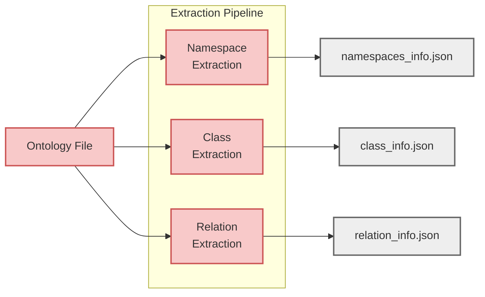

# Ontology Extraction

Ontology extraction analyzes existing [RDFS](https://www.w3.org/TR/rdf-schema/){target="_blank" rel="noopener"}/[OWL](https://www.w3.org/TR/owl2-overview/){target="_blank" rel="noopener"} ontologies and extracts structured metadata that PyGraft-gen uses to generate synthetic Knowledge Graphs.

**On this page:**

- [Overview](#overview) - Understanding the extraction process
- [Design Philosophy](#design-philosophy) - Core principles guiding extraction
- [What Gets Extracted](#what-gets-extracted) - The three metadata files
- [Technical Details](#technical-details) - Implementation and supported formats

## Overview

Extraction converts an ontology file into three JSON metadata files:

These files capture the ontology structure in a format the KG generator can use. Extraction is deterministic, read-only, and operates purely on explicit axioms without reasoning.

!!! warning "Extraction Scope"
    Extraction captures only OWL constructs that PyGraft-gen can enforce during generation.  

    :material-fire: See [What's Supported](../getting-started/quickstart.md/#whats-supported)

---

## Design Philosophy

Extraction is built on three core principles that ensure predictable, debuggable results:

!!! abstract ":fontawesome-solid-file-lines: Explicit-First, No Inference"
    The extractor answers one question: **"What does this ontology explicitly declare?"**

    It operates purely on axioms present in the ontology file. No OWL reasoning, RDFS entailment, or semantic expansion is performed.

    **What this means:**

    - Declared relationships like `foaf:Person rdfs:subClassOf foaf:Agent` are captured
    - Implied relationships are only captured if explicitly stated
    - Transitive relationships (like `rdfs:subClassOf*`) are computed via [SPARQL](https://www.w3.org/TR/sparql11-query/){target="_blank" rel="noopener"} property paths over explicit axioms, not semantic inference
    - External ontologies (FOAF, Dublin Core, etc.) are not loaded or traversed

!!! abstract ":fontawesome-solid-lock: Read-Only and Schema-Focused"
    Extraction is read-only. The original ontology is never modified.

    The focus is purely structural: class hierarchies, property characteristics, and explicit constraints that can be enforced during generation.

!!! abstract ":fontawesome-solid-rotate: Deterministic and Reproducible"
    Running extraction on the same ontology always produces identical output. All derived structures are computed using fixed [SPARQL](https://www.w3.org/TR/sparql11-query/){target="_blank" rel="noopener"} queries that execute in the same order every time.

    This matters for debugging extraction issues, reproducing generation runs, and understanding exactly what the generator sees.

---

## What Gets Extracted

Extraction produces three JSON files, each capturing a different aspect of your ontology's structure.

!!! abstract ":fontawesome-solid-tag: Namespaces &rarr; `namespaces_info.json`"
    Prefix-to-namespace mappings and ontology metadata. All IRIs are normalized to `prefix:LocalName` format.

    **Requirements:** Your ontology must include an `owl:Ontology` declaration. ([VANN](http://vocab.org/vann/){target="_blank" rel="noopener"} annotations are recommended but optional)

    :material-fire: Learn more &rarr; [Reference - Namespaces Info](../reference/files/namespaces-info.md)

!!! abstract ":fontawesome-solid-sitemap: Classes &rarr; `class_info.json`"
    Class hierarchy and constraints including named classes, direct and transitive [`rdfs:subClassOf`](https://www.w3.org/TR/rdf-schema/#ch_subclassof){target="_blank" rel="noopener"} relationships, [`owl:disjointWith`](https://www.w3.org/TR/owl2-syntax/#Disjoint_Classes){target="_blank" rel="noopener"} declarations, hierarchy layers, and statistics.

    **What counts as a class?** Any named IRI appearing as an `rdf:type` target, `rdfs:subClassOf` participant, or property domain/range. Blank nodes are filtered out.

    :material-fire: Learn more &rarr; [Reference - Class Info](../reference/files/class-info.md)

!!! abstract ":fontawesome-solid-link: Relations &rarr; `relation_info.json`"
    Object property characteristics and constraints including [OWL characteristics](https://www.w3.org/TR/owl2-syntax/#Object_Property_Expressions){target="_blank" rel="noopener"} (symmetric, transitive, functional, reflexive, irreflexive, asymmetric, inverse functional), domain/range constraints, inverse relationships, subproperty hierarchies, and disjointness.

    **Note:** Datatype properties are excluded.

    :material-fire: Learn more &rarr; [Reference - Relation Info](../reference/files/relation-info.md)

---

## Technical Details

!!! info "Implementation & Supported Formats"
    **SPARQL-based extraction:**

    Extraction uses [SPARQL](https://www.w3.org/TR/sparql11-query/){target="_blank" rel="noopener"} queries executed through Python's [rdflib library](https://github.com/RDFLib/rdflib){target="_blank" rel="noopener"}. Queries are organized by domain and stored as `.rq` files.

    **No reasoning:**

    Extraction captures only explicit assertions. Transitive closures are computed via [SPARQL](https://www.w3.org/TR/sparql11-query/){target="_blank" rel="noopener"} property paths over explicit axioms, not OWL reasoning.

    **Supported formats:**

    - [Turtle](https://www.w3.org/TR/turtle/){target="_blank" rel="noopener"} (`.ttl`) - Recommended
    - [RDF/XML](https://www.w3.org/TR/rdf-syntax-grammar/){target="_blank" rel="noopener"} (`.rdf`, `.owl`, `.xml`)

    [N-Triples](https://www.w3.org/TR/n-triples/){target="_blank" rel="noopener"} and other RDF serializations are not supported.

---

## What's Next

- :fontawesome-solid-database: **[KG Generation](kg-generation.md)** - How instances are created from extracted metadata
- :fontawesome-solid-check-circle: **[Consistency Checking](consistency-checking.md)** - Validating generated KGs

**Reference:**

- :fontawesome-solid-book: **[Namespaces Info](../reference/files/namespaces-info.md)**
- :fontawesome-solid-book: **[Class Info](../reference/files/class-info.md)**
- :fontawesome-solid-book: **[Relation Info](../reference/files/relation-info.md)**
