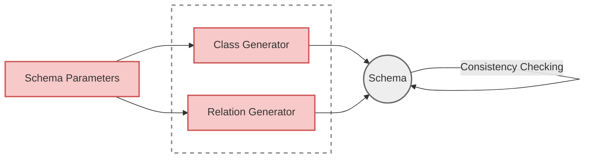

# Schema Generation

Schema generation creates synthetic [RDFS](https://www.w3.org/TR/rdf-schema/){target="_blank" rel="noopener"}/[OWL](https://www.w3.org/TR/owl2-overview/){target="_blank" rel="noopener"} ontologies from statistical parameters. You define constraints like hierarchy depth and number of relations, and PyGraft-gen generates a valid ontology.

**On this page:**

- [The Generation Pipeline](#the-generation-pipeline) - Understanding the three-phase process
- [Class Hierarchy Generation](#class-hierarchy-generation) - Building the taxonomy
- [Relation Generation](#relation-generation) - Defining property characteristics
- [Schema Building & Validation](#schema-building-validation) - Serialization and consistency checking

!!! info "About Schema Generation"
    **Schema generation is the original PyGraft algorithm preserved**.  
    The only changes are code modernization and the addition of seeded RNG for deterministic generation.

## The Generation Pipeline



Schema generation happens in three phases: building the class hierarchy, generating relations between classes, and validating the result for logical consistency.

---

## Class Hierarchy Generation

The class hierarchy defines the taxonomy of entity types in your ontology.

**Configuration parameters:**

| Parameter                 | Description                                   |
|---------------------------|-----------------------------------------------|
| `num_classes`             | Total number of classes                       |
| `max_hierarchy_depth`     | Maximum levels in the class tree              |
| `avg_class_depth`         | Average depth of classes                      |
| `avg_children_per_parent` | Branching factor                              |
| `avg_disjointness`        | Proportion of sibling classes marked disjoint |

**:fontawesome-solid-sitemap: What gets generated:**

- Classes with `rdfs:subClassOf` relationships
- `owl:disjointWith` declarations between siblings
- Metadata tracking class depth and relationships

**Example output:**
```turtle
sc:C50 a owl:Class ;
    rdfs:subClassOf owl:Thing .

sc:C41 a owl:Class ;
    rdfs:subClassOf sc:C50 .

sc:C49 a owl:Class ;
    rdfs:subClassOf sc:C50 ;
    owl:disjointWith sc:C35 .
```


## Relation Generation

Once the class hierarchy exists, relations define how classes connect in the Knowledge Graph.

**Configuration parameters:**

| Parameter                           | Description                                                                                    |
|-------------------------------------|------------------------------------------------------------------------------------------------|
| `num_relations`                     | Total number of object properties                                                              |
| `relation_specificity`              | How precisely relations target specific classes (higher = more specific)                       |
| `prop_profiled_relations`           | Proportion with domain/range restrictions                                                      |
| `profile_side`                      | Whether profiled relations have both domain and range (`"both"`) or at least one (`"partial"`) |
| `prop_symmetric_relations`          | Proportion of symmetric properties                                                             |
| `prop_inverse_relations`            | Proportion with inverse property pairs                                                         |
| `prop_transitive_relations`         | Proportion of transitive properties                                                            |
| `prop_asymmetric_relations`         | Proportion of asymmetric properties                                                            |
| `prop_reflexive_relations`          | Proportion of reflexive properties                                                             |
| `prop_irreflexive_relations`        | Proportion of irreflexive properties                                                           |
| `prop_functional_relations`         | Proportion of functional properties                                                            |
| `prop_inverse_functional_relations` | Proportion of inverse functional properties                                                    |
| `prop_subproperties`                | Proportion in subproperty hierarchies                                                          |

**:fontawesome-solid-link: What gets generated:**

- Object properties with `rdfs:domain` and `rdfs:range`
- OWL characteristics (`owl:SymmetricProperty`, `owl:TransitiveProperty`, etc.)
- Inverse property pairs (`owl:inverseOf`)
- Property hierarchies (`rdfs:subPropertyOf`)

**Example output:**
```turtle
sc:R1 a owl:ObjectProperty ;
    rdfs:domain sc:C32 ;
    rdfs:range sc:C18 .

sc:R15 a owl:ObjectProperty,
        owl:SymmetricProperty ;
    rdfs:domain sc:C6 ;
    rdfs:range sc:C6 .

sc:R10 a owl:ObjectProperty ;
    rdfs:domain sc:C41 ;
    rdfs:range sc:C4 ;
    owl:inverseOf sc:R14 .

sc:R6 a owl:ObjectProperty,
        owl:ReflexiveProperty ;
    rdfs:subPropertyOf sc:R11 .
```


## Schema Building & Validation

After generating classes and relations, PyGraft-gen combines everything into a complete ontology and validates it for logical consistency.

**:fontawesome-solid-file-code: Serialization:**

1. Namespace prefixes are defined
2. Classes written with hierarchy and disjointness axioms
3. Relations written with constraints and characteristics
4. Output serialized to your chosen RDF format

**:fontawesome-solid-check-circle: Consistency Checking:**

The HermiT reasoner validates the schema for logical consistency. It checks for:

- Conflicting disjointness declarations
- Incompatible property characteristics (e.g., a property that's both symmetric and asymmetric)
- Unsatisfiable classes

If inconsistencies are found, PyGraft-gen reports the schema as inconsistent. HermiT cannot provide details about which specific axioms are problematic, only whether the schema is Consistent or Inconsistent.

**Output files:**

```
output_pygraft/2026-01-16_14-30-22/
├── schema.ttl          # The complete ontology
├── class_info.json     # Class hierarchy metadata
└── relation_info.json  # Relation constraints metadata
```

---

## What's Next

- :fontawesome-solid-database: **[KG Generation](kg-generation.md)** - How instance data is generated from schemas
- :fontawesome-solid-check-circle: **[Consistency Checking](consistency-checking.md)** - How validation works
- :fontawesome-solid-sliders: **[Configuration Reference](../reference/files/config.md)** - Complete parameter documentation
