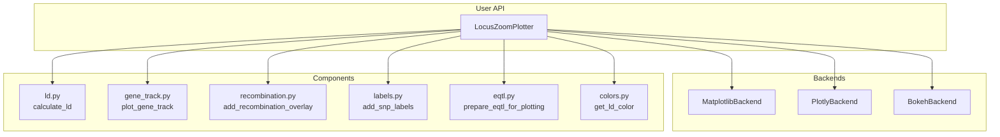
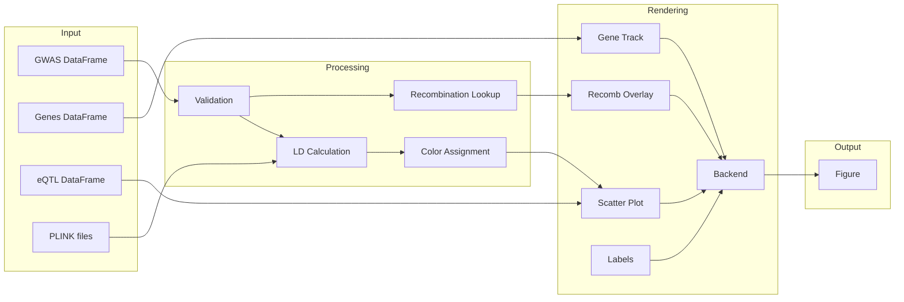
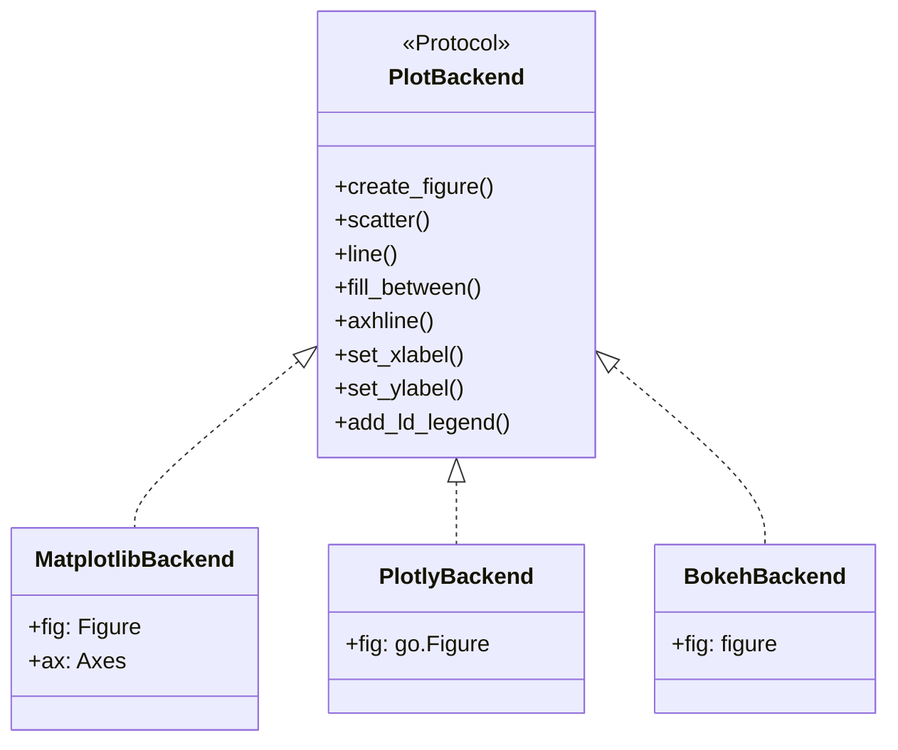

# pyLocusZoom Architecture

## Project Structure

```
pyLocusZoom/
├── .github/workflows/
│   ├── ci.yml                    # CI pipeline (tests, lint)
│   └── publish.yml               # PyPI publish (Trusted Publishing)
│
├── src/pylocuszoom/
│   ├── __init__.py               # Public API exports
│   ├── plotter.py                # LocusZoomPlotter - main entry point
│   │                             #   plot(), plot_stacked(), plot_manhattan(), etc.
│   ├── backends/
│   │   ├── __init__.py           # Backend registry, get_backend()
│   │   ├── base.py               # PlotBackend protocol
│   │   ├── matplotlib_backend.py # Static plots
│   │   ├── plotly_backend.py     # Interactive with hover
│   │   └── bokeh_backend.py      # Dashboard-friendly
│   │
│   ├── colors.py                 # LD color palettes
│   ├── gene_track.py             # Gene/exon rendering
│   ├── labels.py                 # SNP label positioning
│   ├── ld.py                     # PLINK LD calculation
│   ├── eqtl.py                   # eQTL data handling
│   ├── recombination.py          # Recomb map loading/liftover
│   ├── logging.py                # Loguru configuration
│   ├── utils.py                  # Validation, PySpark support
│   └── reference_data/           # Cached recomb maps location
│
├── tests/                        # pytest suite
├── examples/
│   └── getting_started.ipynb     # Tutorial notebook
│
├── pyproject.toml                # Build config, dependencies
├── README.md                     # Documentation
└── LICENSE.md                    # GPL-3.0-or-later
```

## Architecture Diagram



## Data Flow



## Key Entry Points

| Function | Location | Purpose |
|----------|----------|---------|
| `LocusZoomPlotter()` | `plotter.py` | Main constructor |
| `.plot()` | `plotter.py` | Single regional plot |
| `.plot_stacked()` | `plotter.py` | Multi-GWAS stacked plot |
| `.plot_manhattan()` | `plotter.py` | Genome-wide Manhattan plot |
| `.plot_qq()` | `plotter.py` | QQ plot |
| `get_backend()` | `backends/__init__.py` | Backend factory |

## Backend Protocol

All backends implement the `PlotBackend` protocol defined in `backends/base.py`:



## Module Responsibilities

| Module | Responsibility |
|--------|----------------|
| `plotter.py` | Orchestrates plot creation, manages backends |
| `backends/` | Rendering abstraction for matplotlib/plotly/bokeh |
| `ld.py` | PLINK subprocess for LD calculation |
| `gene_track.py` | Gene/exon rectangle rendering |
| `recombination.py` | Load/cache/liftover recombination maps |
| `colors.py` | LD-to-color mapping with standard palette |
| `labels.py` | Non-overlapping SNP label placement |
| `eqtl.py` | eQTL data validation and preparation |
| `utils.py` | DataFrame validation, PySpark conversion |
| `logging.py` | Loguru configuration |

## Dependencies

### Required
- matplotlib >= 3.5.0
- pandas >= 1.4.0
- numpy >= 1.21.0
- loguru >= 0.7.0
- plotly >= 5.0.0
- bokeh >= 3.8.2
- kaleido >= 0.2.0
- pyliftover >= 0.4
- adjustText >= 0.8

### Optional
- pyspark >= 3.0.0 (for large-scale data)

### External
- PLINK 1.9 (for LD calculations)
