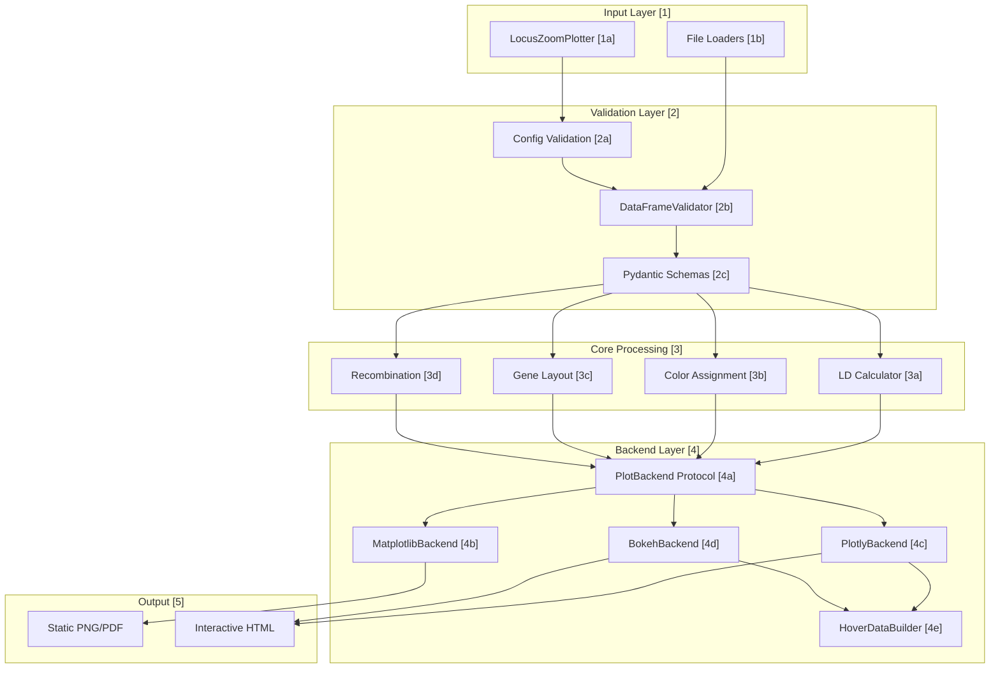
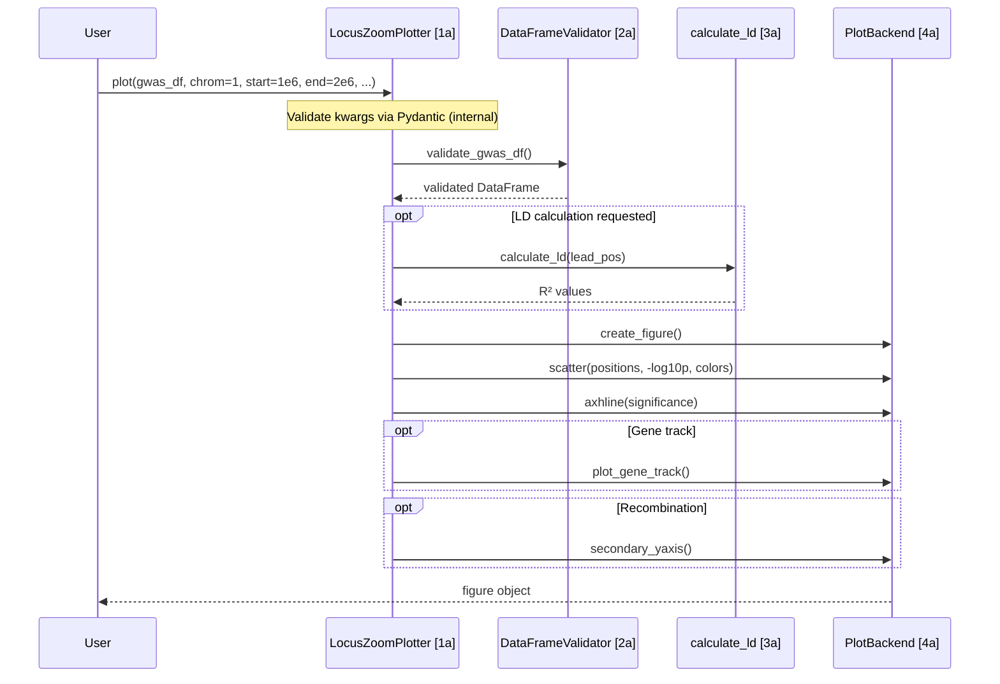

# pyLocusZoom Code Map

Bidirectional navigation between architecture diagram and source code.

## System Overview



---

## [1] Input Layer (Entry Points)

User-facing API for creating plots.

| ID | Component | Description | File:Line |
|----|-----------|-------------|-----------|
| 1a | LocusZoomPlotter | Main plotter class with plot methods | [plotter.py:62](../src/pylocuszoom/plotter.py#L62) |
| 1b | load_gwas | Auto-detect GWAS format loader | [loaders.py:45](../src/pylocuszoom/loaders.py#L45) |
| 1b | load_susie | SuSiE fine-mapping loader | [loaders.py:520](../src/pylocuszoom/loaders.py#L520) |
| 1b | load_gtex_eqtl | GTEx eQTL loader | [loaders.py:380](../src/pylocuszoom/loaders.py#L380) |

### File Loaders [1b]

| Module | Formats | File |
|--------|---------|------|
| GWAS | PLINK, REGENIE, BOLT-LMM, GEMMA, SAIGE | [loaders.py](../src/pylocuszoom/loaders.py) |
| eQTL | GTEx, eQTL Catalogue, MatrixEQTL | [loaders.py](../src/pylocuszoom/loaders.py) |
| Fine-mapping | SuSiE, FINEMAP, CAVIAR, PolyFun | [loaders.py](../src/pylocuszoom/loaders.py) |
| Genes | GTF, BED, Ensembl | [loaders.py](../src/pylocuszoom/loaders.py) |

---

## [2] Validation Layer

Input validation and schema enforcement.

| ID | Component | Description | File:Line |
|----|-----------|-------------|-----------|
| 2a | DataFrameValidator | Fluent builder for DataFrame checks | [validation.py:15](../src/pylocuszoom/validation.py#L15) |
| 2b | GWASRowModel | Pydantic model for GWAS rows | [schemas.py:20](../src/pylocuszoom/schemas.py#L20) |
| 2b | EQTLRowModel | Pydantic model for eQTL rows | [schemas.py:65](../src/pylocuszoom/schemas.py#L65) |
| 2b | FinemappingRowModel | Pydantic model for fine-mapping | [schemas.py:95](../src/pylocuszoom/schemas.py#L95) |

### DataFrameValidator Methods [2a]

```python
validator = DataFrameValidator(df, "gwas_df")
validator.require_columns(["chr", "pos", "p"])
        .require_numeric(["pos", "p"])
        .require_range("p", min_val=0, max_val=1)
        .validate()  # Raises ValidationError
```

---

## [3] Core Processing

Data transformation and enrichment.

| ID | Component | Description | File:Line |
|----|-----------|-------------|-----------|
| 3a | calculate_ld | PLINK wrapper for LD calculation | [ld.py:120](../src/pylocuszoom/ld.py#L120) |
| 3a | find_plink | Locate PLINK executable | [ld.py:25](../src/pylocuszoom/ld.py#L25) |
| 3b | get_ld_color | Map R² to hex color | [colors.py:45](../src/pylocuszoom/colors.py#L45) |
| 3b | get_credible_set_color | CS index to color | [colors.py:120](../src/pylocuszoom/colors.py#L120) |
| 3c | assign_gene_positions | Layout genes to rows | [gene_track.py:85](../src/pylocuszoom/gene_track.py#L85) |
| 3c | plot_gene_track_generic | Render gene track | [gene_track.py:180](../src/pylocuszoom/gene_track.py#L180) |
| 3d | get_recombination_rate_for_region | Load recomb data | [recombination.py:150](../src/pylocuszoom/recombination.py#L150) |
| 3d | download_canine_recombination_maps | Auto-download maps | [recombination.py:85](../src/pylocuszoom/recombination.py#L85) |

### LD Color Scheme [3b]

```python
LD_BINS = [
    (0.8, "0.8 - 1.0", "#FF0000"),  # red
    (0.6, "0.6 - 0.8", "#FFA500"),  # orange
    (0.4, "0.4 - 0.6", "#00CD00"),  # green
    (0.2, "0.2 - 0.4", "#00EEEE"),  # cyan
    (0.0, "0.0 - 0.2", "#4169E1"),  # blue
]
LEAD_SNP_COLOR = "#7D26CD"  # purple
```

---

## [4] Backend Layer

Rendering implementations.

| ID | Component | Description | File:Line |
|----|-----------|-------------|-----------|
| 4a | PlotBackend | Protocol defining backend interface | [base.py:11](../src/pylocuszoom/backends/base.py#L11) |
| 4b | MatplotlibBackend | Static publication plots | [matplotlib_backend.py:25](../src/pylocuszoom/backends/matplotlib_backend.py#L25) |
| 4c | PlotlyBackend | Interactive HTML (hover) | [plotly_backend.py:30](../src/pylocuszoom/backends/plotly_backend.py#L30) |
| 4d | BokehBackend | Dashboard integration | [bokeh_backend.py:28](../src/pylocuszoom/backends/bokeh_backend.py#L28) |
| 4e | HoverDataBuilder | Construct hover tooltips | [hover.py:25](../src/pylocuszoom/backends/hover.py#L25) |

### Backend Protocol Methods [4a]

| Method | Purpose |
|--------|---------|
| `create_figure()` | Initialize figure & axes |
| `scatter()` | Plot points with LD colors |
| `axhline()` | Significance threshold line |
| `secondary_yaxis()` | Recombination rate axis |
| `add_snp_labels()` | SNP ID labels (matplotlib) |
| `add_ld_legend()` | LD color legend |
| `finalize_layout()` | Apply margins & spacing |

### Backend Capabilities

| Backend | SNP Labels | Hover | Secondary Axis |
|---------|------------|-------|----------------|
| matplotlib | ✅ | ❌ | ✅ |
| plotly | ❌ | ✅ | ✅ |
| bokeh | ❌ | ✅ | ✅ |

---

## [5] Supporting Infrastructure

| Component | Description | File |
|-----------|-------------|------|
| Exceptions | PyLocusZoomError hierarchy | [exceptions.py](../src/pylocuszoom/exceptions.py) |
| Logging | loguru-based logger | [logging.py](../src/pylocuszoom/logging.py) |
| Ensembl API | Gene fetching from REST | [ensembl.py](../src/pylocuszoom/ensembl.py) |
| Utilities | to_pandas, normalize_chrom | [utils.py](../src/pylocuszoom/utils.py) |

### Exception Hierarchy

```
PyLocusZoomError (base)
├── ValidationError (also ValueError)
│   ├── EQTLValidationError
│   ├── FinemappingValidationError
│   └── LoaderValidationError
├── BackendError
└── DataDownloadError (also RuntimeError)
```

---

## Data Flow Diagram



---

## Quick Navigation

| Area | Entry Point |
|------|-------------|
| Main API | [plotter.py](../src/pylocuszoom/plotter.py) |
| Internal validation | [config.py](../src/pylocuszoom/config.py) |
| Validation | [validation.py](../src/pylocuszoom/validation.py) |
| All loaders | [loaders.py](../src/pylocuszoom/loaders.py) |
| Backend protocol | [backends/base.py](../src/pylocuszoom/backends/base.py) |
| Colors & themes | [colors.py](../src/pylocuszoom/colors.py) |
| Gene rendering | [gene_track.py](../src/pylocuszoom/gene_track.py) |
| LD calculation | [ld.py](../src/pylocuszoom/ld.py) |
| Exceptions | [exceptions.py](../src/pylocuszoom/exceptions.py) |

---

## File Statistics

| Category | Files | Lines |
|----------|-------|-------|
| Core | 15 | ~4,500 |
| Backends | 5 | ~2,800 |
| Tests | 15+ | ~3,000 |
| **Total** | **35+** | **~10,300** |
