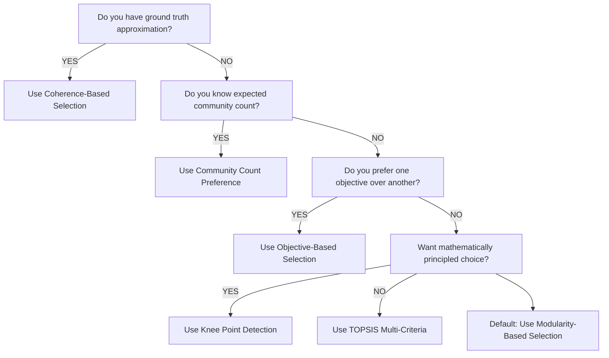

{}

# Understanding Pareto Front Selection

When using **HpMocd** for community detection, you often get multiple equally valid solutions along a **Pareto front**. Each solution represents a different trade-off between competing objectives (like intra-community cohesion vs. inter-community separation). This guide shows you how to systematically select the best solution for your specific needs.

{}

## Quick Start: Generate a Pareto Front

First, let's generate a Pareto front using the enhanced algorithm:

```python
import networkx as nx
import numpy as np
from pymocd import HpMocd
from sklearn.metrics import adjusted_rand_score
import matplotlib.pyplot as plt

G = nx.karate_club_graph()

def generate_robust_pareto_front(G, max_attempts=3):
    best_front = None
    best_size = 0

    for attempt in range(max_attempts):
        # Recommendation: Try different parameter combinations
        params = {
            'num_gens': [150, 200, 250][attempt],
            'pop_size': [120, 150, 100][attempt],
            'mut_rate': [0.2, 0.4, 0.8][attempt],
            'cross_rate': [0.9, 1.0, 0.8][attempt]
        }

        alg = HpMocd(G, **params)
        front = alg.generate_pareto_front()

        if len(front) > best_size:
            best_front = front
            best_size = len(front)

    return best_front

# Generate the front
pareto_front = generate_robust_pareto_front(G)
print(f"Generated {len(pareto_front)} Pareto-optimal solutions")
```

---

# (i) Coherence-Based Selection

**Use case**: When you have **an approximation** of the ground truth or domain knowledge about the expected community structure.

## Implementation

```python
def select_by_coherence(pareto_front, G, coherence_metric='adjusted_rand'):
    true_labels = []
    for node in sorted(G.nodes()):
        true_labels.append(0 if G.nodes[node]['club'] == 'Mr. Hi' else 1)

    best_solution = None
    best_coherence = -1
    coherence_scores = []

    for assignment, objectives in pareto_front:
        pred_labels = [assignment[node] for node in sorted(G.nodes())]

        if coherence_metric == 'adjusted_rand':
            coherence = adjusted_rand_score(true_labels, pred_labels)
        coherence_scores.append(coherence)

        if coherence > best_coherence:
            best_coherence = coherence
            best_solution = (assignment, objectives)

    return best_solution, best_coherence, coherence_scores

best_solution, coherence, all_coherences = select_by_coherence(pareto_front, G)
print(f"Best coherence: {coherence:.3f}")
print(f"Selected solution has {len(set(best_solution[0].values()))} communities")
```

## When to Use?

{}
{}
{}


### Problems that you may encounter.

{}

- Because the best ground truth solution, it is **not** a non-dominated solution;
- Your "best" solution probably had less intra or inter values, so, another one dominate it.

---

# (ii) Modularity-Based Selection

**Use case**: When you want to maximize the classical modularity (or another) metric, balancing internal connections vs. external connections.

## Implementation

```python
def select_by_modularity(pareto_front, G):
    best_solution = None
    best_modularity = -1
    modularity_scores = []

    for assignment, objectives in pareto_front:
        # Convert assignment to community structure
        communities = {}
        for node, comm_id in assignment.items():
            if comm_id not in communities:
                communities[comm_id] = []
            communities[comm_id].append(node)

        modularity = nx.community.modularity(G, communities.values())
        modularity_scores.append(modularity)
        if modularity > best_modularity:
            best_modularity = modularity
            best_solution = (assignment, objectives)

    return best_solution, best_modularity, modularity_scores

mod_solution, modularity, all_modularities = select_by_modularity(pareto_front, G)
print(f"Best modularity: {modularity:.3f}")
print(f"Selected solution has {len(set(mod_solution[0].values()))} communities")
```

### When to Use

{}
{}
{}

---

# (iii) Community Count Preference

**Use case**: When you have prior knowledge about the expected number of communities.

## Implementation

```python
def select_by_community_count(pareto_front, target_communities=None, strategy='closest'):
    community_counts = []
    for assignment, objectives in pareto_front:
        count = len(set(assignment.values()))
        community_counts.append(count)

    if strategy == 'max':
        # Solution with most communities (finest granularity)
        target_idx = np.argmax(community_counts)
    elif strategy == 'min':
        # Solution with fewest communities (coarsest granularity)
        target_idx = np.argmin(community_counts)
    elif strategy == 'closest' and target_communities:
        # Solution closest to target number
        distances = [abs(count - target_communities) for count in community_counts]
        target_idx = np.argmin(distances)
    elif strategy == 'range':
        # Show distribution of community counts
        from collections import Counter
        count_dist = Counter(community_counts)
        print("Community count distribution:", dict(sorted(count_dist.items())))
        return None, None
    else:
        raise ValueError("Invalid strategy or missing target_communities")

    selected_solution = pareto_front[target_idx]
    return selected_solution, community_counts[target_idx]

select_by_community_count(pareto_front, strategy='range')

targets = [2, 3, 4]
for target in targets:
    solution, actual_count = select_by_community_count(pareto_front, target, 'closest')
    if solution:
        print(f"Target: {target}, Actual: {actual_count}, Objectives: {solution[1]}")

for strategy in ['min', 'max']:
    solution, count = select_by_community_count(pareto_front, strategy=strategy)
    print(f"{strategy.capitalize()} communities: {count}, Objectives: {solution[1]}")
```

### When to Use?

{}
{}
{}
{}


---

# Recommendations

<br>



<br>

<center>
<br>

| Scenario | Recommended Approach |
|----------|---------------------|
| **Small networks** (<100 nodes) | Try all strategies, visual inspection |
| **Large networks** (>1000 nodes) | Focus on modularity or objectives |
| **Multiple runs** | Use ensemble: select most frequent choice |
| **Uncertain objectives** | Start with knee point, then refine |

<br>
</center>

Start with modularity or knee point detection, then refine based on your specific needs. Remember: the "best" solution is the one that works best for *your* application!

{}

---

## References

- **HpMocd Documentation**: [Basic Usage Guide](/docs/basic-usage)
- **NetworkX Community Detection**: [Community Detection Algorithms](https://networkx.org/documentation/stable/reference/algorithms/community.html)
- **TOPSIS Method**: Hwang, C.L. and Yoon, K. (1981). Multiple Attribute Decision Making
- **Pareto Optimality**: Miettinen, K. (2012). Nonlinear Multiobjective Optimization
