# PyMongoSQL Architecture & Class Diagram

## Overview

PyMongoSQL is a Python library that provides a SQL-to-MongoDB translation layer with DB API 2.0 compliance and SQLAlchemy integration. The architecture consists of three main layers:

1. **Database API Layer** - DB API 2.0 compliant interface (Connection, Cursor, ResultSet)
2. **SQL Processing Layer** - ANTLR4-based PartiQL parser with MongoDB execution builders
3. **Integration Layer** - SQLAlchemy dialect and Superset support

---

## Class Hierarchy Diagram

```mermaid
classDiagram
    %% ==================== DATABASE API LAYER ====================
    
    class Connection {
        -host: str
        -port: int
        -mongo_client: MongoClient
        -mode: str
        +cursor() Cursor
        +close()
        +commit()
        +rollback()
        +get_database() Database
    }
    
    class BaseCursor {
        <<abstract>>
        -connection: Connection
        -mode: str
        +execute(operation, parameters) ResultSet
        +fetchone() Sequence
        +fetchall() List[Sequence]
        +description: List
    }
    
    class Cursor {
        -result_set: ResultSet
        -current_execution_plan: ExecutionPlan
        -is_closed: bool
        +execute(operation, parameters)* ResultSet
        +executemany(operation, seq_of_params)
        +fetchone() Sequence
        +fetchall() List[Sequence]
        +fetchmany(size) List[Sequence]
        +close()
        +__iter__()
        +__next__() Sequence
    }
    
    class DictCursor {
        -result_set_class: DictResultSet
        +fetchone() Dict
        +fetchall() List[Dict]
    }
    
    class CursorIterator {
        -arraysize: int
        +__iter__()
        +__next__()
    }
    
    class ResultSet {
        -command_result: Dict
        -execution_plan: QueryExecutionPlan
        -raw_results: List
        -cached_results: List
        -column_names: List[str]
        -description: List
        +description
        +fetch(rows) Sequence
        +fetchone() Sequence
        +fetchall() List[Sequence]
        +fetchmany(size) List[Sequence]
        +close()
        +__iter__()
        +__next__()
    }
    
    class DictResultSet {
        -column_names: List[str]
        +fetch(rows) List[Dict]
        +fetchone() Dict
        +fetchall() List[Dict]
    }
    
    %% ==================== SQL PARSING LAYER ====================
    
    class SQLParser {
        -original_sql: str
        -preprocessed_sql: str
        -ast: Any
        -visitor: MongoSQLParserVisitor
        +parse() ExecutionPlan
        +get_prepared_statement() str
    }
    
    class ExecutionPlanFactory {
        +create_from_parsed() ExecutionPlan
    }
    
    class ExecutionPlan {
        <<abstract>>
        -collection: str
        +to_dict() Dict
        +validate() bool
        +copy() ExecutionPlan
    }
    
    class QueryExecutionPlan {
        -filter_stage: Dict
        -projection_stage: Dict
        -sort_stage: List
        -limit_stage: int
        -skip_stage: int
        +to_dict() Dict
        +validate() bool
    }
    
    class InsertExecutionPlan {
        -insert_documents: List[Dict]
        -parameter_style: str
        -parameter_count: int
        +to_dict() Dict
        +validate() bool
    }
    
    class UpdateExecutionPlan {
        -filter_stage: Dict
        -update_stage: Dict
        +to_dict() Dict
        +validate() bool
    }
    
    class DeleteExecutionPlan {
        -filter_stage: Dict
        +to_dict() Dict
        +validate() bool
    }
    
    %% ==================== SQL HANDLER LAYER ====================
    
    class MongoSQLParserVisitor {
        <<visitor>>
        +visitQuery() QueryExecutionPlan
        +visitInsert() InsertExecutionPlan
        +visitUpdate() UpdateExecutionPlan
        +visitDelete() DeleteExecutionPlan
        +visitWhere() Dict
        +visitExpression() Any
    }
    
    class QueryHandler {
        <<handler>>
        +create_execution_plan() QueryExecutionPlan
        +build_filter() Dict
        +build_projection() Dict
    }
    
    class InsertHandler {
        <<handler>>
        +create_execution_plan() InsertExecutionPlan
        +build_documents() List[Dict]
        +detect_parameter_style() str
    }
    
    class UpdateHandler {
        <<handler>>
        +create_execution_plan() UpdateExecutionPlan
        +build_update_doc() Dict
    }
    
    class DeleteHandler {
        <<handler>>
        +create_execution_plan() DeleteExecutionPlan
        +build_filter() Dict
    }
    
    class ContextUtilsMixin {
        <<mixin>>
        +get_context_text() str
        +get_context_type_name() str
        +has_children() bool
        +normalize_field_path() str
    }
    
    %% ==================== EXECUTION LAYER ====================
    
    class ExecutionContext {
        -query: str
        -execution_mode: str
        -parameters: Union[Sequence, Dict]
    }
    
    class ExecutionStrategy {
        <<abstract>>
        +execute_plan: ExecutionPlan
        +execute() Dict
    }
    
    class QueryExecutionStrategy {
        +execute() Dict
    }
    
    class InsertExecutionStrategy {
        +execute() Dict
    }
    
    class UpdateExecutionStrategy {
        +execute() Dict
    }
    
    class DeleteExecutionStrategy {
        +execute() Dict
    }
    
    class ExecutionPlanFactory {
        +create_from_operation() ExecutionPlan
        +create_query_plan() QueryExecutionPlan
        +create_insert_plan() InsertExecutionPlan
    }
    
    %% ==================== SQLALCHEMY INTEGRATION ====================
    
    class PyMongoSQLDialect {
        -execution_ctx_cls: ExecutionContext
        +initialize() Connection
        +create_connect_args() Dict
        +compiler_class: TypeCompiler
        +type_compiler_class: TypeCompiler
    }
    
    class PyMongoSQLIdentifierPreparer {
        <<preprocessor>>
        -reserved_words: Set[str]
        +quote_identifier() str
    }
    
    class PyMongoSQLTypeCompiler {
        <<compiler>>
        +process_result_value() Any
    }
    
    class PyMongoSQLStatementCompiler {
        <<compiler>>
        +visit_select() str
        +visit_insert() str
        +visit_update() str
        +visit_delete() str
    }
    
    %% ==================== ERROR HANDLING ====================
    
    class Error {
        <<exception>>
    }
    
    class DatabaseError {
        <<exception>>
    }
    
    class OperationalError {
        <<exception>>
    }
    
    class ProgrammingError {
        <<exception>>
    }
    
    class SqlSyntaxError {
        <<exception>>
    }
    
    class NotSupportedError {
        <<exception>>
    }
    
    %% ==================== HELPER CLASSES ====================
    
    class ConnectionHelper {
        +parse_connection_string() Dict
        +extract_mode() str
        +get_database_config() Dict
    }
    
    class SQLHelper {
        +prepare_statement() str
        +detect_parameter_style() str
        +bind_parameters() str
    }
    
    %% ==================== RELATIONSHIPS ====================
    
    %% Database API Layer
    Connection --> BaseCursor: creates
    Cursor --|> BaseCursor
    DictCursor --|> BaseCursor
    CursorIterator <|-- Cursor
    CursorIterator <|-- ResultSet
    Cursor --> ResultSet: manages
    Cursor --> ExecutionContext: creates
    Cursor --> ExecutionPlanFactory: uses
    ResultSet --> QueryExecutionPlan: uses
    
    %% SQL Parsing Layer
    SQLParser --> ExecutionPlanFactory: uses
    SQLParser --> MongoSQLParserVisitor: uses
    ExecutionPlan <|-- QueryExecutionPlan
    ExecutionPlan <|-- InsertExecutionPlan
    ExecutionPlan <|-- UpdateExecutionPlan
    ExecutionPlan <|-- DeleteExecutionPlan
    
    %% SQL Handler Layer
    MongoSQLParserVisitor --> QueryHandler: delegates to
    MongoSQLParserVisitor --> InsertHandler: delegates to
    MongoSQLParserVisitor --> UpdateHandler: delegates to
    MongoSQLParserVisitor --> DeleteHandler: delegates to
    ContextUtilsMixin <|-- MongoSQLParserVisitor
    ContextUtilsMixin <|-- QueryHandler
    
    %% Execution Layer
    ExecutionStrategy <|-- QueryExecutionStrategy
    ExecutionStrategy <|-- InsertExecutionStrategy
    ExecutionStrategy <|-- UpdateExecutionStrategy
    ExecutionStrategy <|-- DeleteExecutionStrategy
    ExecutionContext --> ExecutionStrategy: drives
    ExecutionPlanFactory --> ExecutionPlan: produces
    
    %% SQLAlchemy Integration
    PyMongoSQLDialect --> Connection: creates
    PyMongoSQLDialect --> PyMongoSQLIdentifierPreparer: uses
    PyMongoSQLDialect --> PyMongoSQLTypeCompiler: uses
    PyMongoSQLDialect --> PyMongoSQLStatementCompiler: uses
    PyMongoSQLStatementCompiler --> SQLParser: uses
    
    %% Error Handling
    Error <|-- DatabaseError
    Error <|-- OperationalError
    Error <|-- ProgrammingError
    Error <|-- SqlSyntaxError
    Error <|-- NotSupportedError
    
    %% Helpers
    Connection --> ConnectionHelper: uses
    Cursor --> SQLHelper: uses
```



---

## Layer Details

### 1. Database API Layer (DB API 2.0 Compliant)

**Purpose**: Provides a standard Python database interface similar to PyMySQL, psycopg2, etc.

| Class | Responsibility | Key Methods |
|-------|----------------|------------|
| `Connection` | Manages MongoDB connection; creates cursors | `cursor()`, `close()`, `commit()`, `rollback()` |
| `BaseCursor` | Abstract base for cursor implementations | `execute()`, `fetchone()`, `fetchall()` |
| `Cursor` | Standard cursor with sequence results | `fetchone()`, `fetchall()`, `executemany()` |
| `DictCursor` | Cursor returning dictionaries instead of tuples | `fetchone()` → `Dict` |
| `ResultSet` | Manages query result caching and fetching | `fetch()`, `fetchone()`, `fetchall()` |
| `DictResultSet` | ResultSet variant for dictionary-based results | Inherits from `ResultSet` |

### 2. SQL Processing Layer (ANTLR4 PartiQL Parser)

**Purpose**: Parses SQL/PartiQL statements and builds execution plans for MongoDB.

| Class | Responsibility | Key Attributes |
|-------|----------------|-----------------|
| `SQLParser` | Main parser entry point; orchestrates ANTLR parsing | `_ast`, `_visitor`, `_preprocessed_sql` |
| `ExecutionPlanFactory` | Factory pattern for creating execution plans | Creates typed plans from parsed AST |
| `ExecutionPlan` | Abstract base for all execution plans | `collection`, `validate()`, `to_dict()` |
| `QueryExecutionPlan` | Execution plan for SELECT queries | `filter_stage`, `projection_stage`, `sort_stage` |
| `InsertExecutionPlan` | Execution plan for INSERT operations | `insert_documents`, `parameter_style` |
| `UpdateExecutionPlan` | Execution plan for UPDATE operations | `filter_stage`, `update_stage` |
| `DeleteExecutionPlan` | Execution plan for DELETE operations | `filter_stage` |

### 3. SQL Handler Layer (Visitor Pattern)

**Purpose**: Translates parsed AST nodes into MongoDB operations using visitor pattern.

| Class | Responsibility | Key Methods |
|-------|----------------|------------|
| `MongoSQLParserVisitor` | Main visitor; delegates to specific handlers | `visitQuery()`, `visitInsert()`, `visitUpdate()`, `visitDelete()` |
| `QueryHandler` | Handles SELECT statement parsing | `build_filter()`, `build_projection()` |
| `InsertHandler` | Handles INSERT statement parsing | `build_documents()`, `detect_parameter_style()` |
| `UpdateHandler` | Handles UPDATE statement parsing | `build_update_doc()` |
| `DeleteHandler` | Handles DELETE statement parsing | `build_filter()` |
| `ContextUtilsMixin` | Shared utility methods for AST traversal | `get_context_text()`, `normalize_field_path()` |

### 4. Execution Layer

**Purpose**: Executes parsed plans against MongoDB.

| Class | Responsibility | Key Methods |
|-------|----------------|------------|
| `ExecutionContext` | Holds query execution metadata | `query`, `execution_mode`, `parameters` |
| `ExecutionStrategy` | Abstract strategy for query execution | `execute()` |
| `QueryExecutionStrategy` | Executes SELECT queries | Returns result set |
| `InsertExecutionStrategy` | Executes INSERT operations | Returns insert result |
| `UpdateExecutionStrategy` | Executes UPDATE operations | Returns update result |
| `DeleteExecutionStrategy` | Executes DELETE operations | Returns delete result |

### 5. SQLAlchemy Integration Layer

**Purpose**: Provides SQLAlchemy dialect for ORM and SQLAlchemy Core support.

| Class | Responsibility | Key Role |
|-------|----------------|----------|
| `PyMongoSQLDialect` | Main dialect implementation | Inherits from `sqlalchemy.engine.default.DefaultDialect` |
| `PyMongoSQLIdentifierPreparer` | Handles MongoDB identifier quoting | Reserved word checking |
| `PyMongoSQLTypeCompiler` | Type mapping SQL↔MongoDB | Converts between SQL and BSON types |
| `PyMongoSQLStatementCompiler` | Compiles SQLAlchemy AST to SQL | `visit_select()`, `visit_insert()`, etc. |

### 6. Error Handling

**Purpose**: Provides DB API 2.0 compliant exception hierarchy.

```
Error (base)
├── DatabaseError
├── OperationalError
├── ProgrammingError
├── SqlSyntaxError
└── NotSupportedError
```

---

## Data Flow Diagrams

### Query Execution Flow

```
User Code
    ↓
Cursor.execute(sql_string, parameters)
    ↓
ExecutionContext (holds query + params)
    ↓
SQLParser.parse()
    ├─→ ANTLR lexer/parser
    ├─→ MongoSQLParserVisitor
    └─→ Handlers (Query/Insert/Update/Delete)
    ↓
ExecutionPlan (QueryExecutionPlan, InsertExecutionPlan, etc.)
    ↓
ExecutionStrategy (QueryExecutionStrategy, InsertExecutionStrategy, etc.)
    ↓
MongoDB Collection Operations
    ├─→ collection.find() [SELECT]
    ├─→ collection.insert_many() [INSERT]
    ├─→ collection.update_many() [UPDATE]
    └─→ collection.delete_many() [DELETE]
    ↓
MongoDB Command Result
    ↓
ResultSet (caches and iterates results)
    ↓
Cursor.fetchone()/fetchall()/fetchmany()
    ↓
User receives Sequence or Dict
```

### SQLAlchemy Integration Flow

```
SQLAlchemy Core/ORM Code
    ↓
PyMongoSQLDialect
    ├─→ PyMongoSQLStatementCompiler.visit_select()
    ├─→ PyMongoSQLStatementCompiler.visit_insert()
    ├─→ PyMongoSQLStatementCompiler.visit_update()
    └─→ PyMongoSQLStatementCompiler.visit_delete()
    ↓
Generated SQL String
    ↓
Cursor.execute(sql_string)
    ↓
SQLParser + Handlers + ExecutionStrategies
    ↓
MongoDB Results
    ↓
ResultSet
    ↓
SQLAlchemy ORM/Core Result Proxy
    ↓
User receives ORM objects or rows
```

---

## Superset Integration

PyMongoSQL provides specialized support for Apache Superset with a **two-stage execution strategy**:

### Key Points

- **Connection Mode**: Use `mode='superset'` for complex SQL support
  ```python
  conn = Connection(uri="mongodb://localhost:27017/mydb?mode=superset")
  ```

- **Two-Stage Execution**:
  1. **Stage 1**: Execute subquery on MongoDB (translate SQL to aggregation pipeline)
  2. **Stage 2**: Cache results in temporary SQLite3 table, execute complex SQL (GROUP BY, HAVING, window functions)

- **Query Detection** (`SubqueryDetector`):
  - Detects wrapped subqueries: `SELECT ... FROM (SELECT ... FROM collection) AS alias`
  - Falls back to direct MongoDB execution for simple queries

- **Core Classes**:
  | Class | Purpose |
  |-------|---------|
  | `SupersetExecution` | Two-stage execution strategy |
  | `SubqueryDetector` | Analyzes query structure |
  | `QueryDBSQLite` | In-memory SQLite3 backend for intermediate results |

- **Benefits**: Native MongoDB support in Superset dashboards with full SQL capability
- **Limitations**: Single collection queries, session-scoped caching, performance depends on result set size
