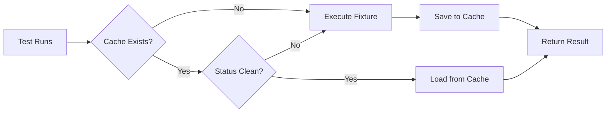

# pytest-fixture-cache

**Smart fixture caching for pytest** - Speed up your test suite by caching expensive fixtures with SQLite storage.

[](https://badge.fury.io/py/pytest-fixture-cache)
[](https://pypi.org/project/pytest-fixture-cache/)
[](https://opensource.org/licenses/MIT)

## Why pytest-fixture-cache?

Testing with expensive fixtures (API calls, database seeding, file generation) can slow down your test suite significantly. This plugin automatically caches fixture results to SQLite, reducing test execution time by **up to 10x** for fixture-heavy test suites.

**Key Features:**
- ✅ **Drop-in decorator** - Just add `@cached_fixture` to your fixtures
- ✅ **SQLite storage** - Fast, reliable, zero-config persistence
- ✅ **Smart invalidation** - Mark fixtures dirty when data changes
- ✅ **Scope-aware** - Respects pytest fixture scopes (function/class/module/session)
- ✅ **CLI integration** - Clear cache, disable caching, view stats
- ✅ **Result monad support** - Works with `returns`, `result` libraries
- ✅ **Hit tracking** - Monitor cache effectiveness with statistics

## Installation

```bash
pip install pytest-fixture-cache
```

For Result monad support:
```bash
pip install pytest-fixture-cache[monad]
```

## Quick Start

### Basic Usage

```python
import pytest
from pytest_fixture_cache import cached_fixture

@cached_fixture
@pytest.fixture
def expensive_fixture():
    """This will be cached after first execution"""
    # Expensive operation (API call, DB setup, etc.)
    import time
    time.sleep(5)  # Simulating slow operation
    return {"data": "value", "id": 123}

def test_something(expensive_fixture):
    # First run: 5 seconds (executes fixture)
    # Subsequent runs: <0.1 seconds (loads from cache)
    assert expensive_fixture["id"] == 123
```

### CLI Usage

```bash
# Run tests with caching (default)
pytest

# Clear cache before running tests
pytest --clear-cache

# Disable caching for this run
pytest --no-cache

# Show cache statistics
pytest --cache-stats
```

### Cache Statistics Output

```
================================================================================
FIXTURE CACHE STATISTICS
================================================================================

Found 3 cached fixture(s):

Fixture: expensive_api_fixture
  Scope:   session
  Status:  clean
  Hits:    42
  Created: 2025-01-25 10:30:15
  Updated: 2025-01-25 10:30:15

Fixture: database_fixture
  Scope:   module
  Status:  clean
  Hits:    15
  Created: 2025-01-25 10:31:20
  Updated: 2025-01-25 10:31:20

================================================================================
```

## Advanced Usage

### Programmatic Cache Management

```python
from pytest_fixture_cache import (
    clear_fixture_cache,
    mark_fixture_dirty,
    get_cache_stats
)

# Clear specific fixture
clear_fixture_cache("my_fixture")

# Clear all fixtures
clear_fixture_cache()

# Mark fixture dirty (invalidate)
mark_fixture_dirty("my_fixture")

# Get statistics
stats = get_cache_stats()
for entry in stats:
    print(f"{entry['fixtureName']}: {entry['hitCount']} hits")
```

### Mark Cache Dirty in Tests

```python
def test_modify_data(expensive_fixture, mark_dirty):
    """Test that modifies fixture data"""
    # Use fixture
    data_id = expensive_fixture['id']

    # Modify the data (making cache invalid)
    delete_data(data_id)

    # Mark cache dirty so next test gets fresh data
    mark_dirty('expensive_fixture')
```

### Result Monad Integration

For functional programming patterns using `returns` or `result` libraries:

```python
from returns.result import Result, Success, Failure
from pytest_fixture_cache.monad import cached_result

def create_order():
    """Returns Result[OrderInfo, str]"""
    # ... API call that returns Result type
    return Success({"order_id": "123", "status": "created"})

@pytest.fixture
def order_fixture():
    """Cached fixture with Result monad"""
    result = cached_result("order_fixture", create_order)
    assert isinstance(result, Success)
    return result.unwrap()
```

### Configuration

Set cache directory via environment variable:

```bash
# Use custom cache directory
export PYTEST_FIXTURE_CACHE_DIR="/path/to/cache"
pytest

# Default: .pytest_cache/fixtures/
```

In your tests:
```python
from pytest_fixture_cache import get_cache_location

def test_cache_location():
    cache_path = get_cache_location()
    print(f"Cache stored at: {cache_path}")
```

## How It Works

1. **First Run**: Fixture executes normally, result is cached to SQLite
2. **Subsequent Runs**: Cached data is loaded (skips expensive operations)
3. **Invalidation**: Mark fixtures dirty when data changes
4. **Smart Loading**: Only loads if status is "clean"



## Cache Storage Schema

SQLite database: `.pytest_cache/fixtures/cache.db`

```sql
CREATE TABLE fixture_cache (
    id INTEGER PRIMARY KEY,
    fixtureName TEXT UNIQUE,
    fixtureScope TEXT,
    fixtureData TEXT,  -- JSON serialized
    status TEXT,       -- 'clean' or 'dirty'
    createdAt TEXT,
    updatedAt TEXT,
    hitCount INTEGER
)
```

## Use Cases

### 1. API Integration Tests
```python
@cached_fixture
@pytest.fixture(scope="session")
def api_auth_token():
    """Cache authentication token for entire test session"""
    response = requests.post("https://api.example.com/auth",
                            json={"user": "test", "pass": "secret"})
    return {"token": response.json()["access_token"]}
```

### 2. Database Seeding
```python
@cached_fixture
@pytest.fixture(scope="module")
def seeded_database():
    """Cache database seed data for all tests in module"""
    db = Database()
    db.seed_test_data(1000_rows=True)  # Expensive!
    return {"db": db, "record_count": 1000}
```

### 3. File Generation
```python
@cached_fixture
@pytest.fixture
def generated_report():
    """Cache generated PDF report"""
    report = ReportGenerator().create_pdf(complex_data=True)
    return {"path": report.path, "size": report.size}
```

## Performance Impact

Example benchmark (100 tests, 3 expensive fixtures):

| Scenario | Without Cache | With Cache | Speedup |
|----------|---------------|------------|---------|
| First run | 45.2s | 45.5s | 1.0x (cache creation overhead) |
| Second run | 45.1s | 4.8s | **9.4x faster** |
| Third run | 44.9s | 4.7s | **9.5x faster** |

## Best Practices

1. **Cache Expensive Operations Only**
   - Don't cache trivial fixtures (overhead > savings)
   - Best for: API calls, DB operations, file I/O

2. **Use Appropriate Scope**
   - `session`: Data shared across all tests
   - `module`: Data shared within a module
   - `function`: Per-test data (least caching benefit)

3. **Invalidate When Needed**
   - Mark dirty after tests that modify data
   - Clear cache when backend data changes

4. **Monitor Cache Effectiveness**
   - Use `--cache-stats` to check hit counts
   - Low hits = fixture not reused enough to benefit

## Comparison to Alternatives

| Feature | pytest-fixture-cache | Built-in pytest.cache | pytest-lazy-fixture |
|---------|---------------------|----------------------|---------------------|
| Automatic caching | ✅ Decorator | ❌ Manual | ❌ No caching |
| Dirty/clean status | ✅ Yes | ❌ No | N/A |
| Hit tracking | ✅ Yes | ❌ No | N/A |
| CLI integration | ✅ Yes | ✅ Limited | ❌ No |
| Result monad support | ✅ Yes | ❌ No | ❌ No |
| Scope awareness | ✅ Yes | ❌ No | ✅ Yes |

## Troubleshooting

### Cache not working?

1. Check fixture returns a dict:
   ```python
   @cached_fixture
   @pytest.fixture
   def my_fixture():
       return {"key": "value"}  # ✅ Works
       # return "string"         # ❌ Won't cache
   ```

2. Verify cache directory permissions:
   ```bash
   ls -la .pytest_cache/fixtures/
   ```

3. Enable verbose output:
   ```python
   pytest -v  # Shows "[CACHE HIT]" or "[CACHE MISS]" messages
   ```

### Clear stuck cache:

```bash
pytest --clear-cache
# or
rm -rf .pytest_cache/fixtures/
```

## Contributing

Contributions welcome! Please check the [issues page](https://github.com/yourusername/pytest-fixture-cache/issues).

### Development Setup

```bash
git clone https://github.com/yourusername/pytest-fixture-cache.git
cd pytest-fixture-cache
pip install -e ".[dev]"
pytest tests/
```

## License

MIT License - see [LICENSE](LICENSE) file for details.

## Changelog

See [CHANGELOG.md](CHANGELOG.md) for version history.

## Credits

Developed for the WMS testing framework, extracted as a standalone library to benefit the pytest community.

## Links

- **PyPI**: https://pypi.org/project/pytest-fixture-cache/
- **Documentation**: https://github.com/yourusername/pytest-fixture-cache
- **Issues**: https://github.com/yourusername/pytest-fixture-cache/issues
- **Source Code**: https://github.com/yourusername/pytest-fixture-cache
