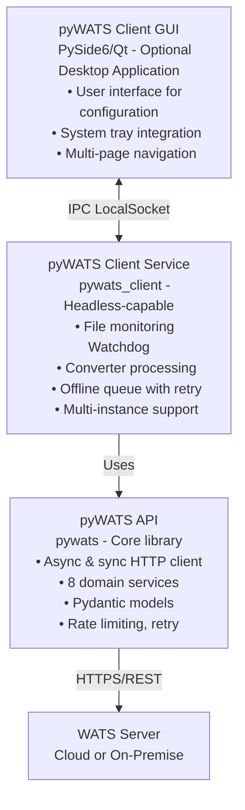
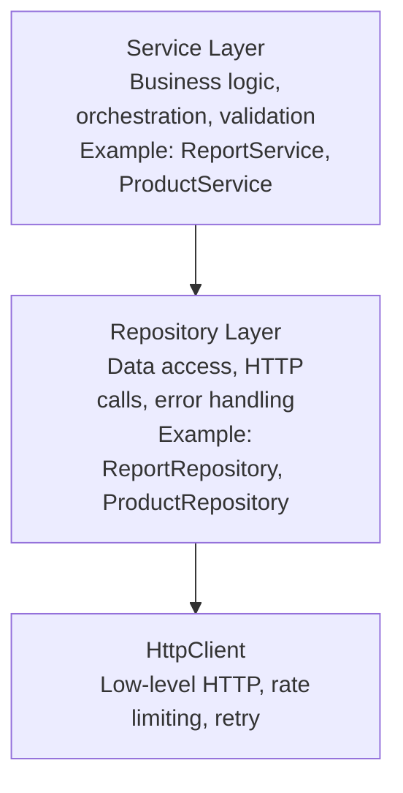
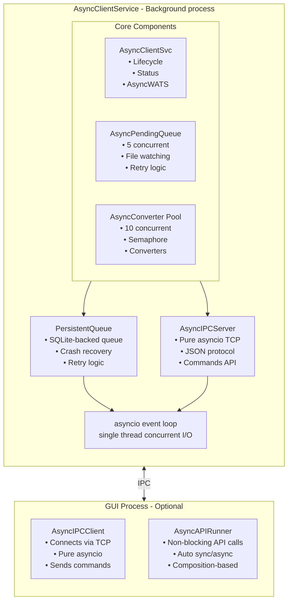

# pyWATS System Architecture

**Version:** 1.3.0  
**Last Updated:** January 2026  
**Audience:** Developers, integrators, contributors

---

## Overview

pyWATS is a **three-layer Python system** for connecting manufacturing test stations to WATS (Web-based Automatic Test System) servers. It provides both a programmatic API for test automation and a client application for test station deployment.



**Key Features:**
- **Dual API modes:** Async (`AsyncWATS`) for high-performance concurrent operations, Sync (`pyWATS`) for simple scripting
- **Headless operation:** Client runs without GUI on servers, Raspberry Pi, embedded systems
- **Offline resilience:** Queue and retry reports when network is unavailable
- **Multi-instance:** Run multiple clients on same machine with separate configurations
- **Extensible:** Custom converters, custom domains, plugin architecture

---

## Table of Contents

1. [System Layers](#system-layers)
2. [pyWATS API Layer](#pywats-api-layer)
3. [pyWATS Client Layer](#pywats-client-layer)
4. [pyWATS GUI Layer](#pywats-gui-layer)
5. [Configuration Management](#configuration-management)
6. [Async vs Sync Usage](#async-vs-sync-usage)
7. [Extension Points](#extension-points)
8. [Deployment Modes](#deployment-modes)
9. [Dependencies](#dependencies)

---

## System Layers

### Layer 1: pyWATS API (`src/pywats/`)

**Purpose:** Foundation library for REST API communication with WATS servers

**Responsibility:**
- HTTP/HTTPS communication with authentication
- Domain-specific business logic (8 domains)
- Pydantic model validation
- Rate limiting and retry logic
- Error handling and responses

**Used by:** Test automation scripts, client service, custom integrations

**Entry point:** `pyWATS` (sync) or `AsyncWATS` (async)

### Layer 2: pyWATS Client Service (`src/pywats_client/`)

**Purpose:** Background service for test station automation

**Responsibility:**
- File system monitoring (Watchdog)
- Converter execution (file → report transformation)
- Offline queue management with persistence
- Connection health monitoring
- Process/product data synchronization
- Multi-instance coordination

**Modes:** Headless daemon, Windows/Linux/macOS service, foreground process

**Entry point:** `python -m pywats_client service`

### Layer 3: pyWATS GUI (`src/pywats_client/gui/`)

**Purpose:** Optional desktop application for client configuration

**Responsibility:**
- User-friendly configuration interface
- Visual status monitoring
- Log viewing and troubleshooting
- System tray integration

**Technology:** PySide6 (Qt6 for Python)

**Entry point:** `python -m pywats_client gui`

---

## pyWATS API Layer

### Architecture Pattern

Each domain follows a **three-layer pattern**:



### Core Components

#### HttpClient (`core/client.py`)

**Both sync and async implementations:**
- `HttpClient` - Synchronous (uses `requests`)
- `AsyncHttpClient` - Asynchronous (uses `httpx`)

**Features:**
- Basic authentication (username + API token)
- Automatic response wrapping with `Response` model
- JSON serialization/deserialization
- No exception raising for HTTP errors (repositories handle errors)
- Built-in rate limiting integration
- Automatic retry for transient failures

**Response Model:**
```python
class Response:
    status_code: int
    data: Any              # Parsed JSON
    headers: Dict[str, str]
    raw: bytes
    
    # Computed properties
    is_success: bool       # 2xx
    is_client_error: bool  # 4xx
    is_server_error: bool  # 5xx
    is_not_found: bool     # 404
    error_message: Optional[str]
```

#### Rate Limiting (`core/throttle.py`)

**Thread-safe sliding window rate limiter:**
- Default: 500 requests per 60 seconds
- Configurable via `configure_throttling()`
- Automatic wait when limit reached
- Statistics tracking (total requests, throttle count, wait time)

**Configuration:**
```python
from pywats.core.throttle import configure_throttling

configure_throttling(
    max_requests=500,
    window_seconds=60,
    enabled=True
)
```

#### Retry Logic (`core/retry.py`)

**Automatic retry with exponential backoff:**
- Default: 3 attempts, 1s base delay, 30s max delay
- Retries on: `ConnectionError`, `TimeoutError`, HTTP 429/5xx
- Respects `Retry-After` header for HTTP 429
- Does NOT retry: POST (not idempotent), HTTP 4xx errors
- Configurable per client instance

**Configuration:**
```python
from pywats import pyWATS, RetryConfig

config = RetryConfig(
    max_attempts=5,
    base_delay=2.0,
    max_delay=60.0,
    jitter=True
)
api = pyWATS(..., retry_config=config)
```

#### Error Handling (`core/exceptions.py`, `shared/result.py`)

**Two error handling modes:**

1. **ErrorMode.STRICT** (default) - Raises exceptions
   - `NotFoundError` for HTTP 404
   - `ValidationError` for HTTP 400
   - `AuthenticationError` for HTTP 401
   - `AuthorizationError` for HTTP 403
   - `ServerError` for HTTP 5xx

2. **ErrorMode.LENIENT** - Returns `None` for errors
   - No exceptions raised
   - Repository methods return `None` on 404
   - Suitable for optional data fetching

**Result Pattern (advanced):**
```python
from pywats.shared.result import Result

result = await api.product.get_product_async("PRODUCT-123")
if result.is_success:
    print(result.value)  # Product object
else:
    print(result.error)  # ErrorCode.NOT_FOUND
```

### Domain Services

**8 domains available:**

| Domain | Service | Purpose |
|--------|---------|---------|
| **Report** | `ReportService` | Submit test reports (UUT/UUR), query results |
| **Product** | `ProductService` | Manage products, revisions, BOMs |
| **Asset** | `AssetService` | Track equipment, calibration, maintenance |
| **Production** | `ProductionService` | Unit lifecycle, serial numbers, assembly |
| **Analytics** | `AnalyticsService` | Yield analysis, measurements, Cpk |
| **Software** | `SoftwareService` | Package management, distribution |
| **RootCause** | `RootCauseService` | Issue tracking, defect management |
| **Process** | `ProcessService` | Test/repair operations, caching |

**Access pattern:**
```python
from pywats import pyWATS

api = pyWATS(
    base_url="https://company.wats.com",
    token="your-api-token"
)

# Access services
api.report.submit_report(report_data)
api.product.get_product("PRODUCT-123")
api.production.allocate_serial_numbers(...)
```

### Station Identity (`core/station.py`)

**Station concept for report attribution:**
```python
from pywats.core.station import Station

station = Station(
    name="STATION-ICT-01",      # machineName in reports
    location="Building A",
    purpose="Production"         # or "Development"
)

api = pyWATS(..., station=station)
```

**Multi-station support (hub mode):**
```python
from pywats.core.station import StationRegistry

registry = StationRegistry()
registry.add("ict", Station("ICT-01", ...))
registry.add("fct", Station("FCT-01", ...))

registry.set_active("ict")
current = registry.get_active()  # Station("ICT-01", ...)
```

---

## pyWATS Client Layer

### Service Architecture (New in v1.4 - Async-First)

The client uses an **async-first architecture** with asyncio for efficient concurrent I/O:



**Key components:**

1. **AsyncClientService** - Main async service controller
   - AsyncServiceStatus states: STOPPED, START_PENDING, RUNNING, STOP_PENDING, PAUSED, ERROR
   - Uses AsyncWATS for non-blocking API calls
   - Manages lifecycle with asyncio tasks

2. **AsyncPendingQueue** - Concurrent report uploads
   - 5 concurrent uploads (configurable via semaphore)
   - Async file watching for new reports
   - Automatic retry with exponential backoff
   - Graceful shutdown (completes in-flight uploads)

3. **AsyncConverterPool** - Concurrent file conversion
   - 10 concurrent conversions (configurable via semaphore)
   - Uses asyncio.to_thread() for CPU-bound converter code
   - Async file I/O for efficiency

4. **PersistentQueue** - SQLite-backed queue
   - States: pending, processing, completed, failed
   - Automatic crash recovery (processing → pending on restart)
   - Retry logic with configurable attempts

5. **AsyncIPCServer** - Inter-process communication
   - Pure asyncio (TCP on Windows, Unix sockets on Linux/macOS)
   - Socket name: `pyWATS_Service_{instance_id}`
   - JSON protocol for commands and responses
   - No Qt dependency - enables true headless mode

6. **AsyncAPIRunner** - GUI async helper (composition)
   - Non-blocking API calls via `run_api_call()`
   - Auto-detects sync/async API client
   - Callback-based result handling

### Core Services

#### File Monitor (`service/file_monitor.py`)

**File system watching using Watchdog:**
- Monitors configured watch folders
- Pattern matching (`*.csv`, `*.xml`, etc.)
- Debouncing (waits for file write completion)
- Async event processing
- Callbacks for file events

**Monitor rules:**
```python
class MonitorRule:
    path: str                    # Folder to watch
    converter_type: str          # Which converter to use
    recursive: bool              # Watch subdirectories
    file_pattern: str            # Glob pattern
    delete_after_convert: bool   # Auto-cleanup
```

#### Converter System (`converters/`)

**Three converter types:**

1. **FileConverter** - One file → one report
2. **FolderConverter** - Entire folder → one report (batch processing)
3. **ScheduledConverter** - Timer-based execution

**Base classes:**
```python
from pywats_client.converters import FileConverter, ConverterSource

class MyConverter(FileConverter):
    @property
    def name(self) -> str:
        return "My Test Converter"
    
    @property
    def file_patterns(self) -> List[str]:
        return ["*.csv", "*.txt"]
    
    def convert(self, source: ConverterSource, context) -> ConverterResult:
        # Parse file
        data = self._parse_file(source.read_text())
        
        # Build report using ReportBuilder
        builder = ReportBuilder(
            part_number=data["part_number"],
            serial_number=data["serial_number"]
        )
        
        for test in data["tests"]:
            builder.add_step(
                name=test["name"],
                value=test["value"],
                limits=(test["low"], test["high"])
            )
        
        return ConverterResult.success(builder.to_dict())
```

**Converter lifecycle:**
1. File created/modified event detected
2. Debounce wait (ensure write complete)
3. Pattern match check
4. Load converter module dynamically
5. Call `convert(source, context)`
6. Submit result to queue or upload directly
7. Post-processing (move/delete/archive based on config)

#### Configuration (`config.py`)

**ClientConfig structure:**
- Instance identity (ID, name)
- Server connection (URL, token, username)
- Station identification
- Serial number handler settings
- Proxy configuration
- Sync settings (interval, enabled)
- Offline queue settings
- Converter configurations
- GUI tab visibility
- Logging configuration

**Encryption:**
- API tokens encrypted with machine-specific key
- Uses `cryptography.fernet` (symmetric encryption)
- Machine ID from system (Windows Registry, `/etc/machine-id`, IOPlatformUUID)
- Tokens cannot be moved between machines

**Configuration locations:**
```
Windows: %APPDATA%\pyWATS_Client\
Linux:   ~/.config/pywats_client/
macOS:   ~/Library/Application Support/pywats_client/

Structure:
  config.json                 # Default instance
  config_{instance_id}.json   # Named instances
  client.log                  # Application log
  cache/
    processes_cache.json      # Synced reference data
  reports/
    pending/                  # Queued for upload
    processing/               # Currently uploading
    completed/                # Successfully uploaded
    failed/                   # Max retries exceeded
```

#### Instance Management (`service/instance_manager.py`)

**Multi-instance support:**
- File-based locking (`.lock` files in temp directory)
- Lock contains: instance_id, name, PID, started timestamp
- Stale lock detection (checks if PID still running)
- Each instance has separate:
  - Configuration file
  - Queue directory
  - Log file
  - IPC socket name

**Use case:** Multiple test processes on same machine (e.g., ICT + FCT + EOL on one PC)

---

## pyWATS GUI Layer

### Application Structure

```
src/pywats_client/gui/
├── app.py                 # Main entry point, QApplication setup
├── login_window.py        # Pre-authentication dialog
├── main_window.py         # Main application window
├── settings_dialog.py     # Settings configuration
├── styles.py              # Dark theme stylesheet
├── pages/                 # Stacked widget pages
│   ├── base.py           # BasePage abstract class
│   ├── setup.py          # Initial configuration
│   ├── connection.py     # Server connection status
│   ├── converters.py     # Converter management
│   ├── sn_handler.py     # Serial number handling
│   ├── software.py       # Software distribution
│   ├── about.py          # Version info
│   └── log.py            # Application logs
└── widgets/              # Reusable UI components
```

### Communication with Service

**IPC Protocol (Pure asyncio TCP/Unix sockets):**
```python
# GUI → Service (Commands)
{
    "command": "get_status" | "get_config" | "start" | "stop" | "ping",
    "request_id": "uuid",
    "args": {...}
}

# Service → GUI (Responses)
{
    "success": true,
    "data": {...},
    "error": null,
    "request_id": "uuid"
}
```

**AsyncIPCClient** in GUI connects to **AsyncIPCServer** in service.
- Windows: TCP localhost on deterministic port (derived from instance_id hash)
- Linux/macOS: Unix domain sockets at `/tmp/pywats_service_{instance_id}.sock`

### User Workflow

1. **First launch:**
   - LoginWindow shown (no stored credentials)
   - Enter server URL + password/token
   - Authenticate → token encrypted and saved
   - MainWindow opens

2. **Subsequent launches:**
   - Auto-connect using stored encrypted token
   - MainWindow opens directly if valid
   - LoginWindow only if authentication fails

3. **Main window:**
   - Sidebar navigation (Dashboard, General, Connection, API Settings, Log, Converters, SN Handler, Software)
   - Page content area (QStackedWidget)
   - Status bar (connection status, instance info)
   - System tray icon (minimize to tray option)

---

## Configuration Management

### Configuration Hierarchy

```
1. Environment Variables (highest priority)
   PYWATS_SERVER_URL
   PYWATS_API_TOKEN
   PYWATS_INSTANCE_ID

2. Command-line Arguments
   --server-url
   --instance-id
   --config-file

3. Configuration File (config.json)
   All settings stored in JSON

4. Defaults (hardcoded in dataclasses)
```

### Dynamic Configuration

**Runtime credential override:**
```python
# In ClientConfig
def get_runtime_credentials(self):
    """Check environment variables for debug/override"""
    url = os.getenv('PYWATS_SERVER_URL') or self.service_address
    token = os.getenv('PYWATS_API_TOKEN') or self.api_token
    return url, token
```

**Use case:** Development/testing without modifying config files

---

## Async vs Sync Usage

### Sync API (`pyWATS`)

**Best for:**
- Simple scripts
- Sequential operations
- Learning/prototyping
- Single-threaded applications

**Example:**
```python
from pywats import pyWATS

api = pyWATS(
    base_url="https://company.wats.com",
    token="your-token"
)

# Blocking calls
product = api.product.get_product("PRODUCT-123")
reports = api.report.get_reports(limit=10)
```

### Async API (`AsyncWATS`)

**Best for:**
- High-performance applications
- Concurrent operations
- Batch processing
- Server applications

**Example:**
```python
import asyncio
from pywats import AsyncWATS

async def main():
    api = AsyncWATS(
        base_url="https://company.wats.com",
        token="your-token"
    )
    
    # Concurrent requests
    products = await asyncio.gather(
        api.product.get_product_async("PROD-1"),
        api.product.get_product_async("PROD-2"),
        api.product.get_product_async("PROD-3")
    )

asyncio.run(main())
```

**Performance benefit:** 5-100x speedup for batch operations

### When to Use Each

| Scenario | Recommendation |
|----------|----------------|
| CLI tool | Sync (`pyWATS`) |
| Test automation script | Sync (`pyWATS`) |
| Web server integration | Async (`AsyncWATS`) |
| Batch data migration | Async (`AsyncWATS`) |
| Processing 1000s of reports | Async (`AsyncWATS`) |
| Simple report submission | Sync (`pyWATS`) |

---

## Extension Points

### 1. Custom Converters

**Create custom file format converter:**
```python
from pywats_client.converters import FileConverter
from pywats.tools import ReportBuilder

class MyCustomConverter(FileConverter):
    @property
    def name(self) -> str:
        return "Custom Format Converter"
    
    @property
    def file_patterns(self) -> List[str]:
        return ["*.custom"]
    
    def convert(self, source, context):
        data = self._parse_custom_format(source.read_text())
        builder = ReportBuilder(
            part_number=data["part"],
            serial_number=data["sn"]
        )
        # Add steps...
        return ConverterResult.success(builder.to_dict())
```

**Register in config:**
```json
{
  "converters": [{
    "name": "My Custom Converter",
    "module_path": "converters.my_custom_converter.MyCustomConverter",
    "watch_folder": "C:\\TestData\\Custom",
    "file_patterns": ["*.custom"]
  }]
}
```

### 2. Custom Domains

**Extend pyWATS API with custom domain:**
```python
from pywats.core.base_repository import BaseRepository

class CustomRepository(BaseRepository):
    def get_custom_data(self, id: str):
        response = self._http_client.get(f"/api/Custom/{id}")
        return self._error_handler.handle_response(
            response, operation="get_custom_data"
        )

class CustomService:
    def __init__(self, repository: CustomRepository):
        self._repo = repository
    
    def get_data(self, id: str):
        return self._repo.get_custom_data(id)

# Register with pyWATS
api.custom = CustomService(CustomRepository(...))
```

### 3. Custom Report Steps

**Create domain-specific step types:**
```python
from pywats.tools import ReportBuilder

builder = ReportBuilder(...)

# Custom step with specialized validation
builder.add_custom_step(
    step_type="SpecializedTest",
    properties={
        "custom_field_1": value1,
        "custom_field_2": value2
    }
)
```

### 4. Scheduled Tasks

**Implement periodic data sync:**
```python
from pywats_client.converters import ScheduledConverter

class DataSyncConverter(ScheduledConverter):
    schedule_interval_seconds = 300  # Every 5 minutes
    
    def execute(self, context):
        # Fetch data from external source
        # Build report
        # Return result
        pass
```

---

## Deployment Modes

### 1. **GUI Mode** (Desktop)
```bash
python -m pywats_client gui
# or
pywats-client
```
**Use case:** Lab stations, operator-facing stations

### 2. **Headless Service Mode**
```bash
python -m pywats_client service --daemon
```
**Use case:** Production servers, headless test stations

### 3. **Docker Container**
```bash
docker run -d \
  -v /path/to/config:/app/config \
  -v /path/to/data:/app/data \
  ghcr.io/olreppe/pywats:latest
```
**Use case:** Cloud deployments, Kubernetes, server racks

### 4. **Windows Service**
```powershell
pywats-client install-service --instance-id production
```
**Use case:** Auto-start on boot, production environments

### 5. **Linux systemd**
```bash
sudo systemctl enable pywats-client@default
sudo systemctl start pywats-client@default
```
**Use case:** Server deployments, Raspberry Pi, embedded Linux

### 6. **macOS launchd**
```bash
launchctl load ~/Library/LaunchAgents/com.pywats.client.plist
```
**Use case:** Mac-based test stations

### 7. **Programmatic API**
```python
from pywats import pyWATS

api = pyWATS(...)
api.report.submit_report(...)
```
**Use case:** Test automation scripts, custom applications

---

## Dependencies

### Core Dependencies

**pyWATS API:**
- `httpx` (async HTTP client)
- `requests` (sync HTTP client)
- `pydantic` (data validation)
- `pydantic-settings` (configuration management)

**pyWATS Client:**
- All API dependencies
- `watchdog` (file system monitoring)
- `cryptography` (token encryption)
- `apscheduler` (scheduled tasks)

**pyWATS GUI:**
- All client dependencies
- `PySide6` (Qt6 for Python)

### Optional Dependencies

**Performance:**
- `orjson` or `msgpack` (faster serialization)
- `uvloop` (faster async event loop on Linux/Mac)

**Packaging:**
- `PyInstaller` (standalone executables)
- `pyinstaller-versionfile` (Windows version info)

**Development:**
- `pytest` (testing)
- `pytest-asyncio` (async test support)
- `pytest-cov` (coverage reporting)

---

## Design Principles

1. **Separation of Concerns**
   - API layer: communication only
   - Service layer: business logic
   - Repository layer: data access
   - GUI layer: presentation

2. **Offline-First**
   - Queue reports when network unavailable
   - Local caching of reference data
   - Persistent storage with crash recovery

3. **Configurability**
   - Everything configurable via JSON
   - Environment variable overrides
   - Command-line arguments

4. **Extensibility**
   - Custom converters via Python modules
   - Custom domains via inheritance
   - Plugin architecture for future enhancements

5. **Reliability**
   - Automatic retry with exponential backoff
   - Rate limiting to prevent server overload
   - Error handling with detailed diagnostics
   - Health monitoring and auto-reconnection

6. **Performance**
   - Async support for concurrent operations
   - Connection pooling
   - Optional MessagePack for faster serialization
   - Batch operations where possible

---

## Further Reading

- **[Getting Started Guide](getting-started.md)** - Installation and basic usage
- **[Client Architecture](client-architecture.md)** - Detailed client design
- **[Integration Patterns](integration-patterns.md)** - Common scenarios and workflows
- **[Thread Safety Guide](thread-safety.md)** - Threading and concurrency patterns
- **[Error Catalog](error-catalog.md)** - Error codes and remediation
- **[Docker Deployment](installation/docker.md)** - Container deployment guide
- **Domain Guides:** [Report](../domains/report.md), [Product](../domains/product.md), [Asset](../domains/asset.md), etc.

---

**Last Updated:** January 26, 2026  
**Version:** 1.3.0 (separate service/GUI architecture)
