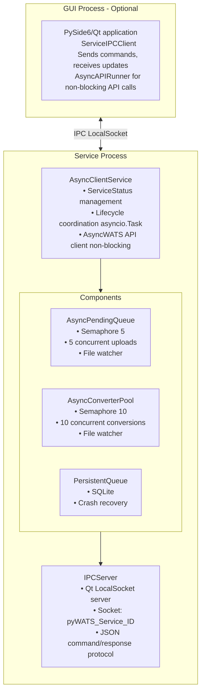
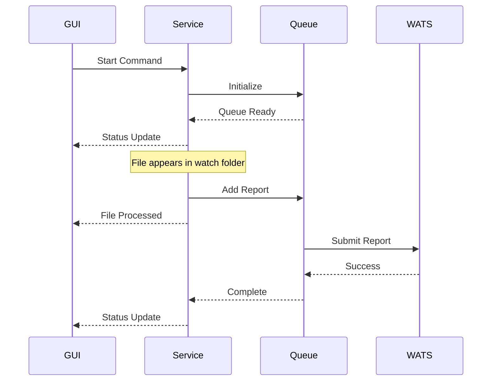
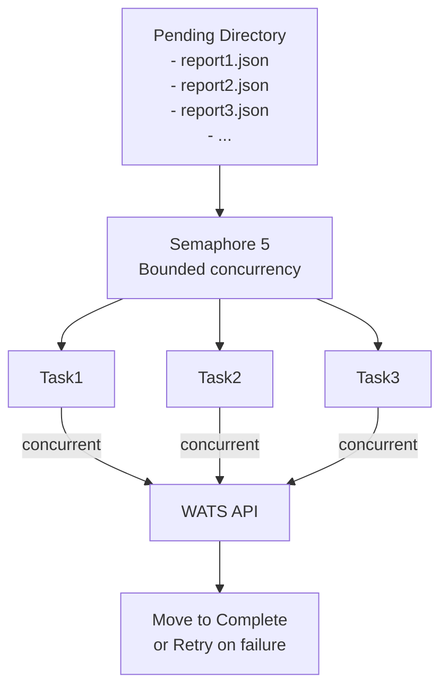
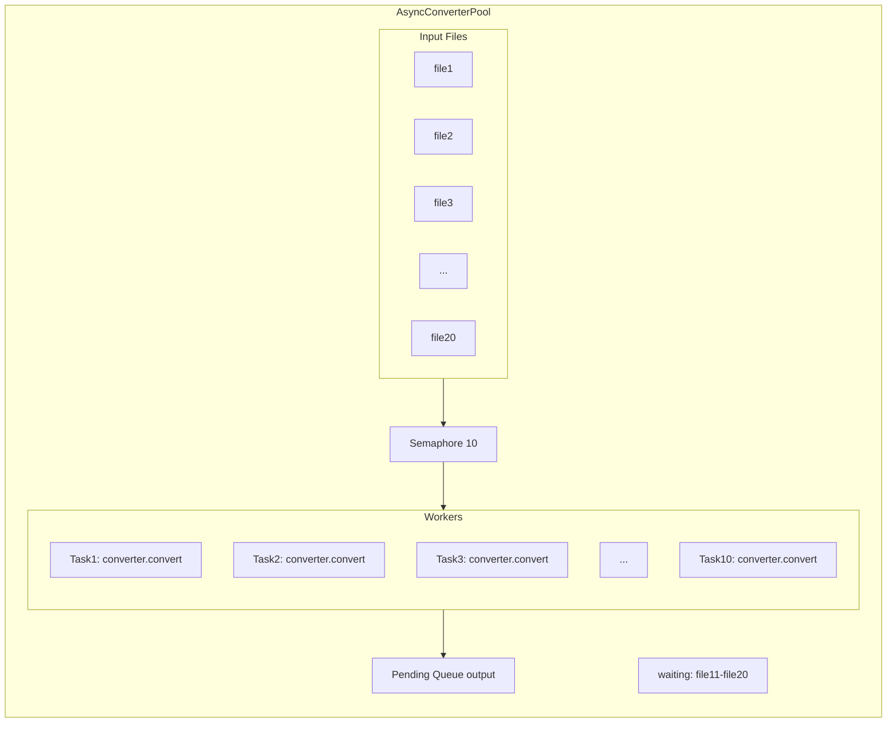
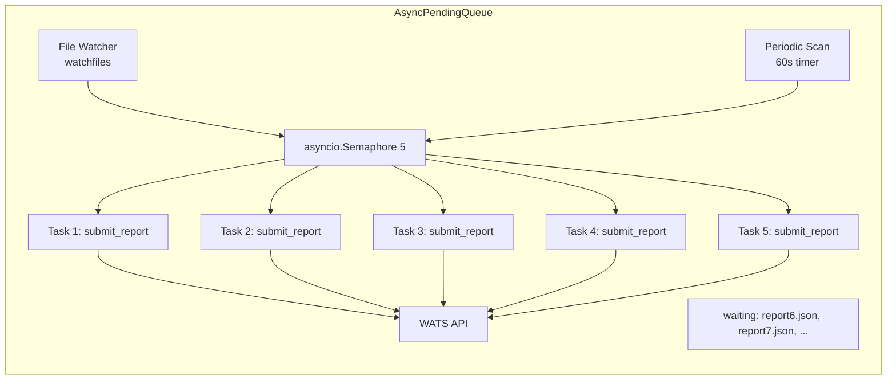
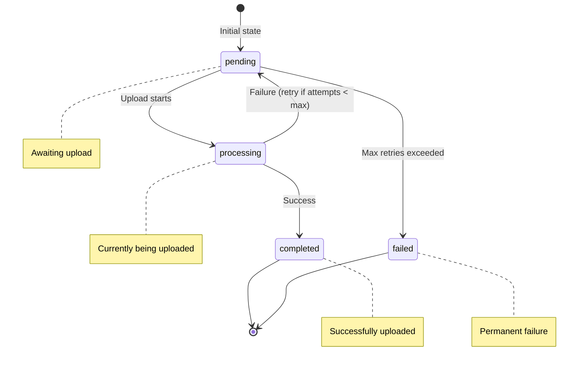
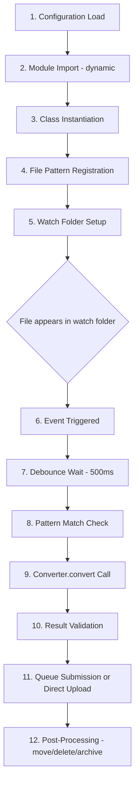

# pyWATS Client Architecture

**Version:** 1.4.0 (Async-First Architecture)  
**Last Updated:** January 2026  
**Audience:** Client developers, advanced users, troubleshooters

---

## Overview

The pyWATS Client is a **background service** with optional **GUI frontend** for managing test station automation. Starting with v1.4.0, the client uses an **async-first architecture** with Python's `asyncio` for efficient concurrent I/O. The service and GUI remain separate with inter-process communication (IPC), enabling true headless operation and better reliability.

**Key Features:**
- **Async-first:** Non-blocking I/O with asyncio, concurrent uploads/conversions
- **Headless operation:** Service runs independently without GUI
- **IPC communication:** GUI communicates with service via Qt LocalSocket
- **Multi-instance:** Run multiple isolated clients on same machine
- **Crash resilience:** Service continues running even if GUI crashes
- **Platform support:** Windows, Linux, macOS, Docker

---

## Table of Contents

1. [Architecture Overview](#architecture-overview)
2. [Service Components](#service-components)
3. [Async Architecture](#async-architecture) *(NEW)*
4. [IPC Communication](#ipc-communication)
5. [Queue System](#queue-system)
6. [Converter System](#converter-system)
7. [File Monitoring](#file-monitoring)
8. [Instance Management](#instance-management)
9. [Configuration System](#configuration-system)
10. [Service Modes](#service-modes)
11. [Testing Architecture](#testing-architecture)

---

## Architecture Overview

### Layered Design



### Component Interactions



---

## Service Components

### AsyncClientService

**Purpose:** Main async service controller and lifecycle manager

**Location:** `src/pywats_client/service/async_client_service.py`

**ServiceStatus States:**
- `STOPPED` - Not running
- `START_PENDING` - Initializing
- `RUNNING` - Active and operational
- `STOP_PENDING` - Shutting down
- `PAUSED` - Temporarily paused (reserved for future use)

**Key Responsibilities:**
1. Initialize and coordinate all components using asyncio
2. Manage service lifecycle with async context managers
3. Provide AsyncWATS API client access (non-blocking)
4. Track connection status
5. Handle start/stop/pause commands

**Code Structure:**
```python
class AsyncClientService:
    def __init__(self, config: ClientConfig):
        self.config = config
        self.status = ServiceStatus.STOPPED
        self._api: Optional[AsyncWATS] = None
        self._pending_queue: Optional[AsyncPendingQueue] = None
        self._converter_pool: Optional[AsyncConverterPool] = None
        self._tasks: List[asyncio.Task] = []
    
    async def run(self):
        """Run the service (blocks until shutdown)"""
        self.status = ServiceStatus.START_PENDING
        
        # Initialize async API client
        self._api = AsyncWATS(
            url=self.config.wats_url,
            token=self.config.token
        )
        
        # Start concurrent components
        self._pending_queue = AsyncPendingQueue(api=self._api, ...)
        self._converter_pool = AsyncConverterPool(api=self._api, ...)
        
        self._tasks = [
            asyncio.create_task(self._pending_queue.run()),
            asyncio.create_task(self._converter_pool.run()),
            asyncio.create_task(self._api_status_loop()),
        ]
        
        self.status = ServiceStatus.RUNNING
        
        # Wait until stopped
        await asyncio.gather(*self._tasks, return_exceptions=True)
    
    async def stop(self):
        """Stop the service gracefully"""
        self.status = ServiceStatus.STOP_PENDING
        
        # Cancel all tasks
        for task in self._tasks:
            task.cancel()
        
        self.status = ServiceStatus.STOPPED
```

**API Status Tracking:**
```python
async def _api_status_loop(self):
    """Periodically check API connection"""
    while True:
        try:
            version = await self._api.app.get_version()
            self._api_status = "Online"
        except Exception:
            self._api_status = "Offline"
        await asyncio.sleep(60)
```

### AsyncPendingQueue

**Purpose:** Monitor and submit queued reports with concurrent uploads

**Location:** `src/pywats_client/service/async_pending_queue.py`

**Key Features:**
1. **File system monitoring:** Watches pending reports directory
2. **Concurrent uploads:** Up to 5 simultaneous uploads via semaphore
3. **Periodic checking:** Timer-based check every 60 seconds
4. **Non-blocking:** All I/O operations are async

**Workflow:**


**Code Structure:**
```python
class AsyncPendingQueue:
    def __init__(self, api: AsyncWATS, reports_dir: Path, max_concurrent: int = 5):
        self._api = api
        self._reports_dir = reports_dir
        self._semaphore = asyncio.Semaphore(max_concurrent)
        self._stopped = False
    
    async def run(self):
        """Main run loop"""
        tasks = [
            asyncio.create_task(self._watch_directory()),
            asyncio.create_task(self._periodic_scan()),
        ]
        await asyncio.gather(*tasks)
    
    async def _submit_report(self, report_path: Path):
        """Submit a single report (respects semaphore)"""
        async with self._semaphore:  # Limits to max_concurrent
            async with aiofiles.open(report_path) as f:
                data = json.loads(await f.read())
            
            await self._api.report.create_report(data)
            
            # Move to completed
            report_path.rename(self._reports_dir / "completed" / report_path.name)
    
    async def stop(self):
        """Signal shutdown"""
        self._stopped = True
```

### AsyncConverterPool

**Purpose:** Manage concurrent file conversions with bounded parallelism

**Location:** `src/pywats_client/service/async_converter_pool.py`

**Configuration:**
- `max_concurrent`: 1-50 (default: 10)
- Concurrency bounded via `asyncio.Semaphore` to prevent resource exhaustion

**Responsibilities:**
1. Watch input directories for new files
2. Execute converters concurrently (up to max_concurrent)
3. Move converted files to pending queue
4. Handle converter errors and retries

**Code Structure:**
```python
class AsyncConverterPool:
    def __init__(self, config: ClientConfig, api: AsyncWATS, max_concurrent: int = 10):
        self._config = config
        self._api = api
        self._semaphore = asyncio.Semaphore(max_concurrent)
        self._converters: List[Converter] = []
        self._stopped = False
    
    def add_converter(self, converter: Converter):
        """Register a converter"""
        self._converters.append(converter)
    
    async def run(self):
        """Main run loop - watch and convert files"""
        tasks = [
            asyncio.create_task(self._watch_input()),
            asyncio.create_task(self._periodic_scan()),
        ]
        await asyncio.gather(*tasks)
    
    async def _convert_file(self, file_path: Path, converter: Converter):
        """Execute conversion (respects semaphore)"""
        async with self._semaphore:  # Limits concurrent conversions
            try:
                # Run converter (may be sync, use run_in_executor)
                loop = asyncio.get_event_loop()
                result = await loop.run_in_executor(
                    None,
                    lambda: converter.convert(ConverterSource(file_path), {})
                )
                
                if result.success:
                    # Move to pending queue
                    await self._move_to_pending(result.report)
                return result
            except Exception as e:
                return ConverterResult.failure(str(e))
    
    async def stop(self):
        """Signal shutdown"""
        self._stopped = True
```

**Concurrency Model:**


---

## Async Architecture

Starting with v1.4.0, pyWATS Client includes an **async-first architecture** as an alternative to the traditional threading-based approach. The async architecture uses Python's `asyncio` for efficient concurrent I/O with a single thread.

### Benefits

| Aspect | Threading (Traditional) | Asyncio (New) |
|--------|------------------------|---------------|
| Concurrency | Thread pool (1-50 workers) | Single thread, async tasks |
| API Calls | Blocking, one per thread | Non-blocking, multiplexed |
| Resource Usage | Higher (thread overhead) | Lower (coroutines are lightweight) |
| Complexity | Race conditions, locks | Event loop, no locks |
| GUI Integration | QThread signals | qasync event loop |

### Async Components

#### AsyncClientService

**Location:** `src/pywats_client/service/async_client_service.py`

The main async service controller, replacing `ClientService` for async-first deployments.

```python
from pywats_client.service import AsyncClientService

# Create and run the async service
service = AsyncClientService()
await service.run()  # Blocks until shutdown
```

**Key Features:**
- Uses `AsyncWATS` instead of `pyWATS` for non-blocking API calls
- All timers run as `asyncio.Task` instead of `QTimer`
- Configuration hot-reload via async file watcher
- Graceful shutdown with task cancellation

#### AsyncPendingQueue

**Location:** `src/pywats_client/service/async_pending_queue.py`

Concurrent report upload queue with bounded parallelism.

```python
from pywats_client.service import AsyncPendingQueue

queue = AsyncPendingQueue(
    api=async_wats,
    reports_dir=Path("/var/lib/pywats/pending"),
    max_concurrent=5  # 5 concurrent uploads
)
await queue.run()
```

**Concurrency Model:**


#### AsyncConverterPool

**Location:** `src/pywats_client/service/async_converter_pool.py`

Concurrent file conversion with semaphore-limited workers.

```python
from pywats_client.service import AsyncConverterPool

pool = AsyncConverterPool(
    config=client_config,
    api=async_wats,
    max_concurrent=10  # 10 concurrent conversions
)
await pool.run()
```

**Features:**
- Watches input directories for new files
- Runs converters concurrently (up to max_concurrent)
- Auto-moves converted files to pending queue
- Supports all converter types (Python, DLL, process)

### GUI Integration (qasync)

The GUI uses `qasync` to integrate Python's asyncio event loop with Qt's event loop,
enabling non-blocking async operations directly in the GUI without freezing the UI.

**Application Startup (`gui/app.py`):**

```python
import qasync
from PySide6.QtWidgets import QApplication

def run_gui(config):
    qt_app = QApplication(sys.argv)
    
    # Setup window, config, etc.
    window = MainWindow(config)
    window.show()
    
    # Use qasync for asyncio integration
    loop = qasync.QEventLoop(qt_app)
    asyncio.set_event_loop(loop)
    
    with loop:
        return loop.run_forever()
```

**GUI Pages with Async Operations:**

GUI pages can use `asyncio.create_task()` directly for non-blocking operations:

```python
class ConnectionPage(BasePage):
    def _on_test_connection(self) -> None:
        """Handle test button click"""
        self._test_btn.setEnabled(False)
        self._test_btn.setText("Testing...")
        
        # Run async test - doesn't block UI
        asyncio.create_task(self._run_connection_test())
    
    async def _run_connection_test(self) -> None:
        """Test connection asynchronously"""
        async with httpx.AsyncClient(follow_redirects=True) as client:
            response = await client.get(f"{url}/api/Report/wats/info")
            # Update UI based on response
            self._show_test_result(response.status_code == 200)
```

**Auto-Test on Startup:**

The Connection page automatically tests the connection when first displayed:

```python
def showEvent(self, event) -> None:
    """Called when page becomes visible"""
    super().showEvent(event)
    if self._auto_test_pending and self.config.service_address:
        self._auto_test_pending = False
        asyncio.create_task(self._run_connection_test(auto=True))
```

#### AsyncAPIRunner

Helper class for GUI pages to make async API calls without blocking the UI (composition pattern):

```python
# Example: a page using async API calls
class MyDomainPage(BasePage):
    def __init__(self, config, main_window=None, parent=None):
        super().__init__(config, parent, async_api_runner=getattr(main_window, 'async_api_runner', None))
    
    def _fetch_data(self, query: str):
        # Automatically handles async/sync detection
        if self.async_api:
            self.async_api.run(
                self,
                api_call=lambda api: api.some_domain.query(query),
                on_success=self._on_fetch_success,
                on_error=self._on_fetch_error
            )
```

> **Note:** Domain-specific pages (Asset, Product, Production, RootCause) are available
> in `pywats_client.gui.pages.unused` for reference but are not currently active in the UI.

### Migration Path

To migrate from sync to async architecture:

1. **Replace imports:**
   ```python
   # Before
   from pywats import pyWATS
   from pywats_client.service import ClientService
   
   # After
   from pywats import AsyncWATS
   from pywats_client.service import AsyncClientService
   ```

2. **Update entry point:**
   ```python
   # Before (threading)
   service = ClientService()
   service.start()
   
   # After (asyncio)
   service = AsyncClientService()
   asyncio.run(service.run())
   ```

3. **GUI pages:** Use `AsyncAPIRunner` (composition) for non-blocking API calls

### Migrated GUI Pages

The following GUI pages now use `AsyncAPIRunner` for non-blocking API calls:

| Page | File | Status |
|------|------|--------|
| Production | `production.py` | ✅ Uses composition |
| Asset | `asset.py` | ✅ Uses composition |
| Product | `product.py` | ✅ Uses composition |
| RootCause | `rootcause.py` | ✅ Uses composition |

Pages that don't make API calls (settings pages, dashboard, etc.) don't need async migration.

### When to Use Async

| Use Case | Recommendation |
|----------|---------------|
| Headless service | ✅ AsyncClientService |
| High-volume uploads | ✅ AsyncPendingQueue (5 concurrent) |
| Many converters | ✅ AsyncConverterPool |
| GUI application | ✅ With qasync |
| Legacy integration | Consider traditional ClientService |

---

## IPC Communication

### Protocol Overview

**Transport:** Qt LocalSocket (named pipe on Windows, Unix socket on Linux/Mac)

**Socket Name:** `pyWATS_Service_{instance_id}`
- Example: `pyWATS_Service_default`
- Example: `pyWATS_Service_production`

**Message Format:** JSON

### Command Structure

**Request (GUI → Service):**
```json
{
  "command": "get_status",
  "request_id": "uuid-here",
  "args": {
    "param1": "value1"
  }
}
```

**Response (Service → GUI):**
```json
{
  "success": true,
  "data": {
    "status": "RUNNING",
    "api_status": "Online",
    "pending_count": 5
  },
  "error": null,
  "request_id": "uuid-here"
}
```

### Supported Commands

| Command | Args | Response | Purpose |
|---------|------|----------|---------|
| `get_status` | None | ServiceStatus, API status | Check service state |
| `get_config` | None | ClientConfig | Get current configuration |
| `start` | None | Success/error | Start service |
| `stop` | None | Success/error | Stop service gracefully |
| `restart` | None | Success/error | Restart service |
| `ping` | None | "pong" | Health check |
| `get_queue_stats` | None | Pending/failed counts | Queue status |

### IPCServer Implementation

**Location:** `src/pywats_client/service/ipc_server.py`

**Code Structure:**
```python
class IPCServer(QObject):
    def __init__(self, instance_id: str, service: ClientService):
        super().__init__()
        self.instance_id = instance_id
        self.service = service
        self._server = QLocalServer()
        self._clients: List[QLocalSocket] = []
    
    def start(self) -> bool:
        """Start IPC server"""
        socket_name = f"pyWATS_Service_{self.instance_id}"
        
        # Remove stale socket
        QLocalServer.removeServer(socket_name)
        
        # Start listening
        if not self._server.listen(socket_name):
            return False
        
        self._server.newConnection.connect(self._on_new_connection)
        return True
    
    def _on_new_connection(self):
        """Handle new client connection"""
        client = self._server.nextPendingConnection()
        client.readyRead.connect(lambda: self._on_data_ready(client))
        self._clients.append(client)
    
    def _on_data_ready(self, client: QLocalSocket):
        """Process incoming command"""
        data = client.readAll().data().decode('utf-8')
        request = json.loads(data)
        
        # Dispatch command
        response = self._handle_command(request)
        
        # Send response
        client.write(json.dumps(response).encode('utf-8'))
        client.flush()
    
    def _handle_command(self, request: dict) -> dict:
        """Execute command and return response"""
        command = request.get("command")
        
        if command == "get_status":
            return {
                "success": True,
                "data": {
                    "status": self.service.status.name,
                    "api_status": self.service.get_api_status()
                },
                "request_id": request.get("request_id")
            }
        
        elif command == "ping":
            return {
                "success": True,
                "data": "pong",
                "request_id": request.get("request_id")
            }
        
        # ... other commands
```

### ServiceIPCClient (GUI Side)

**Location:** `src/pywats_client/gui/ipc_client.py`

**Code Structure:**
```python
class ServiceIPCClient(QObject):
    status_changed = Signal(str)
    
    def __init__(self, instance_id: str):
        super().__init__()
        self.instance_id = instance_id
        self._socket = QLocalSocket()
    
    def connect_to_service(self) -> bool:
        """Connect to service IPC socket"""
        socket_name = f"pyWATS_Service_{self.instance_id}"
        self._socket.connectToServer(socket_name)
        
        if not self._socket.waitForConnected(5000):
            return False
        
        self._socket.readyRead.connect(self._on_data_ready)
        return True
    
    def send_command(self, command: str, args: dict = None) -> dict:
        """Send command and wait for response"""
        request = {
            "command": command,
            "request_id": str(uuid.uuid4()),
            "args": args or {}
        }
        
        # Send request
        data = json.dumps(request).encode('utf-8')
        self._socket.write(data)
        self._socket.flush()
        
        # Wait for response
        if not self._socket.waitForReadyRead(10000):
            raise TimeoutError("No response from service")
        
        response_data = self._socket.readAll().data().decode('utf-8')
        return json.loads(response_data)
    
    def get_status(self) -> dict:
        """Get service status"""
        return self.send_command("get_status")
```

---

## Queue System

### PersistentQueue Architecture

**Purpose:** SQLite-backed report queue with crash recovery

**Location:** `src/pywats_client/queue/persistent_queue.py`

**Database Schema:**
```sql
CREATE TABLE reports (
    id TEXT PRIMARY KEY,
    report_data TEXT NOT NULL,
    status TEXT NOT NULL,
    created_at TIMESTAMP,
    updated_at TIMESTAMP,
    attempts INTEGER DEFAULT 0,
    error TEXT,
    CHECK(status IN ('pending', 'processing', 'completed', 'failed'))
);

CREATE INDEX idx_status ON reports(status);
CREATE INDEX idx_created_at ON reports(created_at);
```

### Queue States



### Crash Recovery

**On service startup:**
1. Scan database for reports in `processing` state
2. Reset to `pending` state (interrupted uploads)
3. Increment attempt counter
4. Add to retry queue

**Implementation:**
```python
class PersistentQueue:
    def __init__(self, queue_dir: Path):
        self.queue_dir = queue_dir
        self.db_path = queue_dir / "queue.db"
        self._init_database()
        self._recover_crashed_reports()
    
    def _recover_crashed_reports(self):
        """Reset processing reports to pending on startup"""
        conn = sqlite3.connect(self.db_path)
        cursor = conn.cursor()
        
        cursor.execute("""
            UPDATE reports 
            SET status = 'pending',
                attempts = attempts + 1,
                updated_at = ?
            WHERE status = 'processing'
        """, (datetime.now(),))
        
        recovered = cursor.rowcount
        conn.commit()
        conn.close()
        
        if recovered > 0:
            logger.info(f"Recovered {recovered} crashed reports")
    
    def add(self, report_data: dict) -> str:
        """Add report to queue"""
        report_id = str(uuid.uuid4())
        
        conn = sqlite3.connect(self.db_path)
        cursor = conn.cursor()
        
        cursor.execute("""
            INSERT INTO reports (id, report_data, status, created_at, updated_at)
            VALUES (?, ?, 'pending', ?, ?)
        """, (report_id, json.dumps(report_data), datetime.now(), datetime.now()))
        
        conn.commit()
        conn.close()
        
        return report_id
    
    def get_pending(self, limit: int = 10) -> List[QueuedReport]:
        """Get pending reports for upload"""
        conn = sqlite3.connect(self.db_path)
        cursor = conn.cursor()
        
        cursor.execute("""
            SELECT id, report_data, attempts
            FROM reports
            WHERE status = 'pending'
            ORDER BY created_at
            LIMIT ?
        """, (limit,))
        
        reports = [
            QueuedReport(
                id=row[0],
                report_data=json.loads(row[1]),
                attempts=row[2]
            )
            for row in cursor.fetchall()
        ]
        
        conn.close()
        return reports
    
    def mark_processing(self, report_id: str):
        """Mark report as being uploaded"""
        self._update_status(report_id, 'processing')
    
    def mark_completed(self, report_id: str):
        """Mark report as successfully uploaded"""
        self._update_status(report_id, 'completed')
    
    def mark_failed(self, report_id: str, error: str, max_attempts: int = 3):
        """Mark report as failed, retry if attempts < max"""
        conn = sqlite3.connect(self.db_path)
        cursor = conn.cursor()
        
        cursor.execute("""
            UPDATE reports
            SET status = CASE
                    WHEN attempts >= ? THEN 'failed'
                    ELSE 'pending'
                END,
                error = ?,
                attempts = attempts + 1,
                updated_at = ?
            WHERE id = ?
        """, (max_attempts, error, datetime.now(), report_id))
        
        conn.commit()
        conn.close()
```

### Retry Logic

**Configuration:**
- `max_retry_attempts`: Default 3
- `retry_interval_seconds`: Default 60

**Exponential Backoff:**
```python
def calculate_retry_delay(attempt: int) -> int:
    """Calculate delay with exponential backoff"""
    base_delay = 60  # 1 minute
    max_delay = 3600  # 1 hour
    
    delay = min(base_delay * (2 ** attempt), max_delay)
    return delay
```

---

## Converter System

### Converter Lifecycle



### FileConverter Base Class

**Location:** `src/pywats_client/converters/file_converter.py`

**Abstract Methods:**
```python
class FileConverter(ABC):
    @property
    @abstractmethod
    def name(self) -> str:
        """Converter display name"""
        pass
    
    @property
    @abstractmethod
    def version(self) -> str:
        """Converter version"""
        return "1.0.0"
    
    @property
    @abstractmethod
    def file_patterns(self) -> List[str]:
        """File patterns to match (glob)"""
        pass
    
    @abstractmethod
    def convert(self, source: ConverterSource, context: dict) -> ConverterResult:
        """Convert file to report"""
        pass
```

### Converter Configuration

```json
{
  "converters": [{
    "name": "CSV Converter",
    "module_path": "converters.csv_converter.CSVConverter",
    "watch_folder": "C:\\TestData\\Incoming",
    "done_folder": "C:\\TestData\\Done",
    "error_folder": "C:\\TestData\\Error",
    "file_patterns": ["*.csv"],
    "post_action": "move",
    "enabled": true,
    "arguments": {
      "delimiter": ",",
      "encoding": "utf-8"
    }
  }]
}
```

### Dynamic Loading

```python
def load_converter(module_path: str, arguments: dict) -> Converter:
    """Dynamically load converter class"""
    # Parse module path
    module_name, class_name = module_path.rsplit('.', 1)
    
    # Import module
    module = importlib.import_module(module_name)
    
    # Get class
    converter_class = getattr(module, class_name)
    
    # Instantiate with arguments
    converter = converter_class(**arguments)
    
    return converter
```

---

## File Monitoring

### Watchdog Integration

**Library:** `watchdog` (cross-platform file system events)

**Event Types:**
- `FileCreatedEvent` - New file appears
- `FileModifiedEvent` - File content changed
- `FileDeletedEvent` - File removed
- `FileMovedEvent` - File renamed/moved

### Debouncing

**Problem:** File system events fire multiple times during file write

**Solution:** Wait for write completion before processing

```python
class DebouncingEventHandler(FileSystemEventHandler):
    def __init__(self, callback, delay=0.5):
        self.callback = callback
        self.delay = delay  # 500ms
        self._timers = {}
    
    def on_created(self, event):
        if event.is_directory:
            return
        
        # Cancel previous timer
        if event.src_path in self._timers:
            self._timers[event.src_path].cancel()
        
        # Start new timer
        timer = Timer(self.delay, self._process_file, [event.src_path])
        self._timers[event.src_path] = timer
        timer.start()
    
    def _process_file(self, file_path):
        """Called after debounce delay"""
        self.callback(file_path)
        if file_path in self._timers:
            del self._timers[file_path]
```

---

## Instance Management

### Multi-Instance Support

**Use Case:** Multiple test processes on same machine

**Example:**
- Instance "ict" - ICT testing
- Instance "fct" - Functional testing
- Instance "eol" - End-of-line testing

### Instance Isolation

**Separate per instance:**
- Configuration file: `config_{instance_id}.json`
- Queue directory: `reports_{instance_id}/`
- Log file: `client_{instance_id}.log`
- IPC socket: `pyWATS_Service_{instance_id}`
- Lock file: `instance_{instance_id}.lock`

### Lock File Mechanism

**Location:** `%TEMP%\pyWATS_Client\instance_{id}.lock`

**Content:**
```json
{
  "instance_id": "production",
  "instance_name": "Production Station",
  "pid": 12345,
  "started": "2026-01-26T10:30:00Z"
}
```

**Stale Lock Detection:**
```python
def _is_process_running(pid: int) -> bool:
    """Check if PID is still alive"""
    try:
        if sys.platform == "win32":
            # Windows: Check with tasklist
            output = subprocess.check_output(
                ["tasklist", "/FI", f"PID eq {pid}"],
                text=True
            )
            return str(pid) in output
        else:
            # Unix: Send signal 0
            os.kill(pid, 0)
            return True
    except (subprocess.CalledProcessError, OSError):
        return False
```

---

## Configuration System

See [Configuration Management](architecture.md#configuration-management) in main architecture doc.

**Key Points:**
- JSON-based configuration
- Machine-specific encryption for API tokens
- Environment variable overrides
- Multi-instance support

---

## Service Modes

### 1. GUI Mode (Default)
```bash
python -m pywats_client gui
```
- Service + GUI in same process (legacy)
- Full user interface
- Best for: Development, troubleshooting

### 2. Service Mode (Headless)
```bash
python -m pywats_client service --daemon
```
- Service only, no GUI
- Runs in background
- Best for: Production, servers

### 3. Separate Service + GUI
```bash
# Terminal 1: Start service
python -m pywats_client service

# Terminal 2: Start GUI (connects to service)
python -m pywats_client gui --connect
```
- Service and GUI in separate processes
- GUI can crash without affecting service
- Best for: Reliability, debugging

### 4. Windows Service
```powershell
pywats-client install-service --instance-id production
Start-Service pyWATS-Client-production
```
- Installed as Windows service
- Auto-start on boot
- Best for: Production Windows stations

### 5. Linux systemd
```bash
sudo systemctl enable pywats-client@production
sudo systemctl start pywats-client@production
```
- Managed by systemd
- Auto-restart on failure
- Best for: Production Linux stations

### 6. Docker Container
```bash
docker run -d ghcr.io/olreppe/pywats:client-headless
```
- Containerized deployment
- Reproducible environment
- Best for: Cloud, Kubernetes, server racks

---

## Testing Architecture

### Test Suite Overview

**Location:** `api-tests/client/`

**Coverage:** 85 tests (100% passing)

**Test Categories:**
1. **Configuration (18 tests)** - Config validation, serialization, lifecycle
2. **Converters (10 tests)** - Base classes, validation, results
3. **Queue (21 tests)** - Persistence, crash recovery, retry
4. **Service (17 tests)** - AsyncClientService, AsyncPendingQueue, AsyncConverterPool
5. **IPC (10 tests)** - Communication, protocols, commands
6. **Integration (9 tests)** - End-to-end workflows

### Test Philosophy

**Principles:**
- Minimal mocking (use actual components where possible)
- Mock PySide6 at module level (avoid Qt runtime)
- Test business logic, not implementation details
- Focus on public interfaces

**Example Test:**
```python
def test_persistent_queue_crash_recovery(tmp_path):
    """Test that processing reports are recovered on restart"""
    queue = PersistentQueue(tmp_path)
    
    # Add report and mark as processing
    report_id = queue.add({"data": "test"})
    queue.mark_processing(report_id)
    
    # Simulate crash (create new queue instance)
    queue2 = PersistentQueue(tmp_path)
    
    # Verify report reset to pending
    pending = queue2.get_pending()
    assert len(pending) == 1
    assert pending[0].id == report_id
    assert pending[0].attempts == 1  # Incremented
```

### Running Tests

```bash
# Run all client tests
pytest api-tests/client/ -v

# Run specific category
pytest api-tests/client/test_service.py -v

# Run with coverage
pytest api-tests/client/ --cov=pywats_client --cov-report=html
```

---

## Troubleshooting

### Service Won't Start

**Check lock file:**
```bash
# Windows
dir "%TEMP%\pyWATS_Client\*.lock"

# Linux
ls /tmp/pyWATS_Client/*.lock
```

**Remove stale lock:**
```bash
python -m pywats_client unlock --instance-id production
```

### GUI Can't Connect to Service

**Verify service running:**
```bash
python -m pywats_client status --instance-id production
```

**Check socket address:**
```python
from pywats_client.service.async_ipc_server import get_socket_address

# Windows: TCP localhost on port 50000-59999 (derived from instance_id hash)
# Linux/macOS: Unix socket at /tmp/pywats_service_{instance_id}.sock
addr = get_socket_address("production")
print(f"Socket address: {addr}")
```

**Test IPC manually:**
```python
import asyncio
from pywats_client.service.async_ipc_client import AsyncIPCClient

async def test_ipc():
    client = AsyncIPCClient("production")
    if await client.connect():
        status = await client.get_status()
        print(f"Status: {status}")
        pong = await client.ping()
        print(f"Ping: {pong}")  # Should be True
        await client.disconnect()

asyncio.run(test_ipc())
```

### Queue Growing Too Large

**Check failed reports:**
```bash
python -m pywats_client queue stats --instance-id production
```

**Retry failed:**
```bash
python -m pywats_client queue retry --instance-id production
```

**Clear completed:**
```bash
python -m pywats_client queue clean --instance-id production
```

---

## See Also

- **[Architecture Overview](architecture.md)** - System-wide architecture
- **[Integration Patterns](integration-patterns.md)** - Common workflows
- **[Client Installation](installation/client.md)** - Installation guide
- **[Service Deployment](installation/windows-service.md)** - Service setup

---

**Last Updated:** January 26, 2026  
**Version:** 1.3.0 (Separate Service/GUI Architecture)
