# pyWATS Client/Service Architecture Diagrams

This document provides visual diagrams explaining how the pyWATS client and service processes work together, including data flows, timers, queues, and communication patterns.

## Table of Contents

1. [High-Level Architecture](#1-high-level-architecture)
2. [Service Process Components](#2-service-process-components)
3. [Service Lifecycle & Timers](#3-service-lifecycle--timers)
4. [Report Submission Flow (Pending Queue)](#4-report-submission-flow-pending-queue)
5. [Converter Pipeline](#5-converter-pipeline)
6. [GUI-Service Communication (IPC)](#6-gui-service-communication-ipc)
7. [Async Task System](#7-async-task-system)
8. [Event Bus & Signals](#8-event-bus--signals)
9. [Error Recovery & Retry Logic](#9-error-recovery--retry-logic)
10. [Complete Data Flow](#10-complete-data-flow)

---

## 1. High-Level Architecture

The pyWATS client uses a **two-process architecture**:


---

## 2. Service Process Components

```mermaid
flowchart TB
    subgraph AsyncClientService["AsyncClientService (Main Controller)"]
        direction TB
        
        subgraph State["Service State Machine"]
            STOPPED["STOPPED"]
            START_PENDING["START_PENDING"]
            RUNNING["RUNNING"]
            STOP_PENDING["STOP_PENDING"]
            
            STOPPED -->|"start()"| START_PENDING
            START_PENDING -->|"init complete"| RUNNING
            RUNNING -->|"stop()"| STOP_PENDING
            STOP_PENDING -->|"cleanup done"| STOPPED
        end
        
        subgraph Timers["Background Timers (asyncio Tasks)"]
            WD["🔄 Watchdog<br/>60s interval"]
            PING["📡 Ping<br/>5min interval"]
            REG["📋 Registration<br/>1hr interval"]
            CFW["📝 Config Watch<br/>5s interval"]
        end
        
        subgraph Components["Owned Components"]
            API["AsyncWATS API Client"]
            QUEUE["AsyncPendingQueue"]
            CONV["AsyncConverterPool"]
            IPC["AsyncIPCServer"]
            HEALTH["HealthServer :8080"]
        end
    end
    
    WD -->|"check health"| API
    WD -->|"check stuck files"| QUEUE
    PING -->|"verify connectivity"| API
    REG -->|"update status"| API
    CFW -->|"hot reload"| Components
    
    style AsyncClientService fill:#1a1a2e,stroke:#16213e,color:#fff
    style State fill:#16213e,stroke:#0f3460,color:#fff
    style Timers fill:#0f3460,stroke:#e94560,color:#fff
    style Components fill:#2d2d2d,stroke:#3c3c3c,color:#fff
```



---

## 3. Service Lifecycle & Timers


---

## 4. Report Submission Flow (Pending Queue)


### File State Machine


---

## 5. Converter Pipeline


### Converter Sequence


---

## 6. GUI-Service Communication (IPC)


### IPC Commands


---

## 7. Async Task System


### Task Execution Flow

```mermaid
sequenceDiagram
    participant Page as GUI Page
    participant Mixin as AsyncAPIMixin
    participant Runner as AsyncTaskRunner
    participant Loop as BG Event Loop
    participant API as AsyncWATS
    
    Page->>Mixin: run_api_call(lambda api: api.asset.get_assets())
    Mixin->>Mixin: Check API type (sync/async)
    
    alt Has Async API
        Mixin->>Runner: run_async(coro, name="Loading assets...")
        Runner->>Runner: Generate task_id
        Runner->>Loop: Submit via call_soon_threadsafe
        
        activate Loop
        Loop->>API: await api.asset.get_assets()
        API-->>Loop: [Asset, Asset, ...]
        deactivate Loop
        
        Loop->>Runner: Emit task_completed signal
        Runner->>Page: on_success(result)
    else Sync API only
        Mixin->>Runner: run_async(_execute_in_thread())
        Runner->>Loop: Submit wrapped sync call
        Loop->>Loop: asyncio.to_thread(sync_call)
        Loop->>Runner: Emit task_completed
        Runner->>Page: on_success(result)
    end
```

---

## 8. Event Bus & Signals


### Event Flow Example


---

## 9. Error Recovery & Retry Logic


### Retry Sequence


---

## 10. Complete Data Flow

```mermaid
flowchart TB
    subgraph External["🌍 External"]
        WATS["WATS Server"]
        TE["Test Equipment<br/>(creates files)"]
    end
    
    subgraph FileSystem["📁 File System"]
        WATCH["Watch Folders<br/>/results/*.csv"]
        QUEUE["Queue Folder<br/>/queue/*.queued"]
        CONFIG["Config<br/>/config/config.json"]
    end
    
    subgraph Service["🖥️ Service Process"]
        direction TB
        
        SVC["AsyncClientService"]
        
        subgraph Processing["Processing Pipeline"]
            CP["ConverterPool"]
            PQ["PendingQueue"]
        end
        
        subgraph Timers["Background Tasks"]
            T1["⏱️ Watchdog 60s"]
            T2["⏱️ Ping 5min"]
            T3["⏱️ Config 5s"]
        end
        
        API["AsyncWATS"]
        IPC["IPC Server"]
    end
    
    subgraph GUI["🖼️ GUI Process"]
        direction TB
        MW["MainWindow"]
        
        subgraph Pages["Pages"]
            DASH["Dashboard"]
            SETUP["Setup"]
            LOG["Log"]
            CONV_PAGE["Converters"]
        end
        
        CLIENT["IPC Client"]
        RUNNER["TaskRunner"]
    end
    
    %% File creation flow
    TE -->|"1. Create test file"| WATCH
    
    %% Converter flow
    WATCH -->|"2. Watchdog event"| CP
    CP -->|"3. Convert to JSON"| PQ
    
    %% Queue flow
    PQ -->|"4. Write .queued"| QUEUE
    QUEUE -->|"5. File event"| PQ
    PQ -->|"6. Submit"| API
    API -->|"7. HTTP POST"| WATS
    
    %% Config flow
    CONFIG -->|"Watch changes"| SVC
    SVC -->|"Hot reload"| Processing
    
    %% GUI flow
    MW --> CLIENT
    CLIENT <-->|"IPC"| IPC
    IPC --> SVC
    
    %% Timer flows
    T1 -->|"Health check"| API
    T2 -->|"Ping"| API
    T3 -->|"Reload"| CONFIG
    
    %% GUI page updates
    RUNNER --> Pages
    
    style External fill:#0f3460,stroke:#e94560,color:#fff
    style Service fill:#1a1a2e,stroke:#16213e,color:#fff
    style GUI fill:#16213e,stroke:#0f3460,color:#fff
    style FileSystem fill:#2d2d2d,stroke:#3c3c3c,color:#fff
```



---

## Timers & Intervals Summary

| Component | Interval | Purpose | Location |
|-----------|----------|---------|----------|
| **Watchdog** | 60s | Health checks, stuck file detection | `AsyncClientService._watchdog_loop()` |
| **Ping** | 5min | Verify WATS connectivity | `AsyncClientService._ping_loop()` |
| **Registration** | 1hr | Update client status on server | `AsyncClientService._registration_loop()` |
| **Config Watch** | 5s | Hot-reload configuration | `AsyncClientService._config_watch_loop()` |
| **Queue Check** | 60s | Process pending/error files | `AsyncPendingQueue._run_loop()` |
| **Error Retry** | 5min × 2^(n-1) | Exponential backoff for failed reports | `AsyncPendingQueue._process_error_files()` |
| **GUI Status** | 5s | Update service status display | `MainWindow._status_timer` |
| **Service Discovery** | 5s | Find running service instances | `ServiceDiscoveryAsync` |

---

## Key Concurrency Limits

| Component | Limit | Purpose |
|-----------|-------|---------|
| **PendingQueue** | 10 concurrent | Max simultaneous API submissions |
| **ConverterPool** | 10 concurrent | Max simultaneous file conversions |
| **IPC Clients** | Unlimited | No limit on GUI connections |
| **Watchdog Threads** | 1 per converter | File system monitoring |

---

## See Also

- [Component Architecture](component-architecture.md) - Package structure and dependencies
- [Client Architecture](client-architecture.md) - Technical implementation details
- [Troubleshooting Guide](../TROUBLESHOOTING.md) - Common issues and solutions
