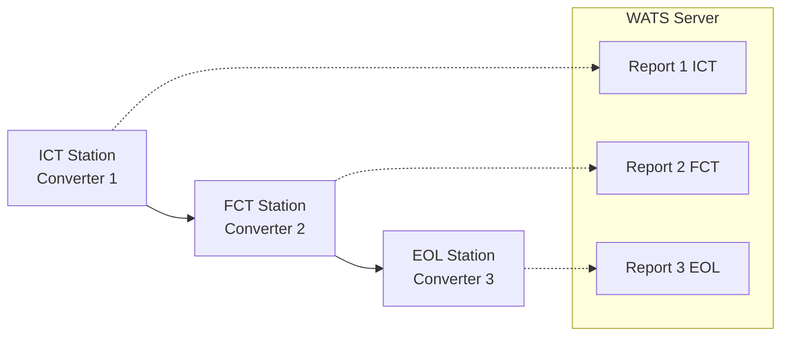

# Integration Patterns & Common Scenarios

**Purpose:** Practical guidance for integrating pyWATS into manufacturing test environments  
**Audience:** Integration engineers, test station setup technicians, developers  
**Last Updated:** January 2026

---

## Overview

This guide provides **complete workflows** and **proven patterns** for common pyWATS integration scenarios. Each pattern includes configuration examples, code snippets, and troubleshooting tips.

**Quick Links:**
- [Complete Station Setup](#complete-station-setup)
- [Multi-Process Workflows](#multi-process-workflows)
- [Error Recovery Patterns](#error-recovery-patterns)
- [Performance Optimization](#performance-optimization)
- [Common Scenarios](#common-scenarios)

---

## Table of Contents

1. [Complete Station Setup](#complete-station-setup)
2. [Multi-Process Workflows](#multi-process-workflows)
3. [Error Recovery Patterns](#error-recovery-patterns)
4. [Performance Optimization](#performance-optimization)
5. [Common Scenarios](#common-scenarios)
6. [Troubleshooting Guide](#troubleshooting-guide)

---

## Complete Station Setup

### Scenario: New Test Station from Scratch

**Goal:** Set up a production test station that automatically converts CSV test files and uploads to WATS.

#### Step 1: Install pyWATS Client

```bash
# Install from PyPI
pip install pywats-api[client]

# Or install from wheel
pip install pywats_api-1.3.0-py3-none-any.whl
```

**Verify installation:**
```bash
python -m pywats_client --version
```

#### Step 2: Initialize Configuration

**Option A: GUI mode (recommended for first setup)**
```bash
python -m pywats_client gui
```
- Complete login window (server URL + password)
- Configure station name and location
- Test connection

**Option B: Headless mode**
```bash
python -m pywats_client config init --instance-id production
```

Edit `%APPDATA%\pyWATS_Client\config_production.json`:
```json
{
  "instance_id": "production",
  "instance_name": "Station ICT-01",
  "service_address": "https://company.wats.com",
  "api_token": "",  // Will be encrypted after first auth
  "station_name": "ICT-STATION-01",
  "location": "Building A - Line 1",
  "purpose": "Production"
}
```

#### Step 3: Authenticate and Test

**GUI mode:** Already done in login window

**Headless mode:**
```python
from pywats_client.config import ClientConfig
from pywats import pyWATS

# Load config
config = ClientConfig.load_for_instance("production")

# Test connection
api = pyWATS(
    base_url=config.service_address,
    token=config.api_token or "YOUR_API_TOKEN_HERE"
)

# Test API call
version = api.app.get_version()
print(f"Connected to WATS {version}")
```

#### Step 4: Set Up Converter

**Create converter module** (`C:\Converters\csv_converter.py`):
```python
from pywats.tools import ReportBuilder
from pywats_client.converters import FileConverter, ConverterSource, ConverterResult
import csv

class CSVConverter(FileConverter):
    @property
    def name(self) -> str:
        return "CSV Test Converter"
    
    @property
    def file_patterns(self) -> List[str]:
        return ["*.csv"]
    
    def convert(self, source: ConverterSource, context) -> ConverterResult:
        try:
            # Parse CSV
            data = list(csv.DictReader(source.read_text().splitlines()))
            
            # Extract header info (first row)
            header = data[0]
            
            # Create report
            builder = ReportBuilder(
                part_number=header["PartNumber"],
                serial_number=header["SerialNumber"]
            )
            
            # Add test steps
            for row in data[1:]:  # Skip header row
                builder.add_step(
                    name=row["TestName"],
                    value=float(row["Value"]),
                    unit=row.get("Unit"),
                    limits=(
                        float(row["LowLimit"]) if row.get("LowLimit") else None,
                        float(row["HighLimit"]) if row.get("HighLimit") else None
                    )
                )
            
            return ConverterResult.success(builder.to_dict())
        
        except Exception as e:
            return ConverterResult.failure(str(e))
```

**Add to config:**
```json
{
  "converters": [{
    "name": "CSV Test Converter",
    "module_path": "csv_converter.CSVConverter",
    "watch_folder": "C:\\TestData\\Incoming",
    "done_folder": "C:\\TestData\\Done",
    "error_folder": "C:\\TestData\\Error",
    "file_patterns": ["*.csv"],
    "post_action": "move",
    "enabled": true
  }]
}
```

**Create directories:**
```powershell
New-Item -ItemType Directory -Force -Path "C:\TestData\Incoming"
New-Item -ItemType Directory -Force -Path "C:\TestData\Done"
New-Item -ItemType Directory -Force -Path "C:\TestData\Error"
```

#### Step 5: Enable Offline Queue

```json
{
  "offline_queue_enabled": true,
  "reports_folder": "C:\\TestData\\Queue",
  "max_retry_attempts": 5,
  "retry_interval_seconds": 60
}
```

**Queue directories created automatically:**
- `C:\TestData\Queue\pending\`
- `C:\TestData\Queue\processing\`
- `C:\TestData\Queue\completed\`
- `C:\TestData\Queue\failed\`

#### Step 6: Test with Sample Data

**Create test file** (`C:\TestData\Incoming\test.csv`):
```csv
PartNumber,SerialNumber,,,
WIDGET-100,SN-12345,,,
TestName,Value,Unit,LowLimit,HighLimit
Resistance,10.5,Ohm,9.0,12.0
Voltage,5.01,V,4.95,5.05
Current,0.998,A,0.95,1.05
```

**Monitor:**
- File should be moved to `Done\` folder
- Check queue: `C:\TestData\Queue\completed\`
- Verify in WATS: Search for `SN-12345`

#### Step 7: Deploy to Production

**Option A: Windows Service**
```powershell
# Install as service
python -m pywats_client install-service --instance-id production

# Start service
Start-Service pyWATS-Client-production

# Check status
Get-Service pyWATS-Client-production
```

**Option B: Linux systemd**
```bash
# Create service file
sudo nano /etc/systemd/system/pywats-client@.service

# Enable and start
sudo systemctl enable pywats-client@production
sudo systemctl start pywats-client@production

# Check status
sudo systemctl status pywats-client@production
```

**Option C: Docker**
```bash
docker run -d \
  --name pywats-client-production \
  --restart unless-stopped \
  -v /opt/pywats/config:/app/config \
  -v /opt/pywats/data:/app/data \
  -v /testdata:/testdata \
  ghcr.io/olreppe/pywats:client-headless
```

---

## Multi-Process Workflows

### Pattern: Sequential Testing (ICT → FCT → EOL)

**Scenario:** Product goes through multiple test stages, each stage submits separate report.

#### Architecture



#### Implementation

**Each station runs separate client instance:**

**ICT Station:**
```json
{
  "instance_id": "ict",
  "instance_name": "ICT Station",
  "station_name": "ICT-STATION-01",
  "converters": [{
    "name": "ICT Converter",
    "module_path": "converters.ict_converter.ICTConverter",
    "watch_folder": "C:\\TestData\\ICT\\Incoming",
    "file_patterns": ["*.ict"]
  }]
}
```

**FCT Station:**
```json
{
  "instance_id": "fct",
  "instance_name": "FCT Station",
  "station_name": "FCT-STATION-01",
  "converters": [{
    "name": "FCT Converter",
    "module_path": "converters.fct_converter.FCTConverter",
    "watch_folder": "C:\\TestData\\FCT\\Incoming",
    "file_patterns": ["*.fct"]
  }]
}
```

**Process in converter:**
```python
from pywats.tools import ReportBuilder

class FCTConverter(FileConverter):
    def convert(self, source, context):
        data = self._parse_file(source.read_text())
        
        builder = ReportBuilder(
            part_number=data["part_number"],
            serial_number=data["serial_number"]
        )
        
        # Set operation type (test_operation in WATS)
        builder.set_operation_type("FCT")  # or "Functional Test"
        
        # Important: Each station creates separate report
        # WATS links them by serial_number
        
        return ConverterResult.success(builder.to_dict())
```

**Querying multi-process results:**
```python
from pywats import pyWATS

api = pyWATS(...)

# Get all reports for a serial number
reports = api.report.get_reports(
    serial_number="SN-12345",
    limit=100
)

# Filter by operation type
ict_reports = [r for r in reports if r.operation_type == "ICT"]
fct_reports = [r for r in reports if r.operation_type == "FCT"]
eol_reports = [r for r in reports if r.operation_type == "EOL"]
```

### Pattern: Parallel Testing (Multiple Stations, Same Process)

**Scenario:** 5 FCT stations running in parallel, all uploading to same WATS instance.

**Configuration: Same across all stations**
```json
{
  "station_name": "FCT-STATION-${NUMBER}",  // FCT-STATION-01, 02, 03...
  "location": "Building A - Line 1"
}
```

**Station identification:**
```python
import platform

# Auto-detect station name from hostname
station_name = platform.node()  // "FCT-STATION-03"
```

**Rate limiting consideration:**
```python
from pywats.core.throttle import configure_throttling

# Share rate limit across all stations
# 500 req/min default = ~100 req/min per station with 5 stations
configure_throttling(max_requests=100, window_seconds=60)
```

---

## Error Recovery Patterns

### Pattern: Network Failure Handling

**Scenario:** Test station loses network connection mid-shift, queue reports, auto-upload when back online.

#### Configuration

```json
{
  "offline_queue_enabled": true,
  "max_retry_attempts": 5,
  "retry_interval_seconds": 60,
  "auto_reconnect": true,
  "health_check_interval": 30
}
```

#### How It Works

1. **Network goes down:**
   - Client detects connection failure
   - Switches to OFFLINE status
   - Reports queue to `pending/` folder

2. **Network returns:**
   - Health check succeeds
   - Client reconnects automatically
   - Queued reports upload in order
   - Successful uploads move to `completed/`

3. **Monitoring queue:**
```python
from pywats_client.queue import PersistentQueue

queue = PersistentQueue("/path/to/queue")

# Check status
pending = queue.get_pending_count()
failed = queue.get_failed_count()

print(f"Pending: {pending}, Failed: {failed}")

# Retry failed reports manually
failed_reports = queue.get_failed_reports()
for report in failed_reports:
    queue.retry(report.id)
```

### Pattern: Authentication Expiration

**Scenario:** API token expires or is revoked.

#### Detection

```python
from pywats.exceptions import AuthenticationError

try:
    api.report.submit_report(report_data)
except AuthenticationError as e:
    print(f"Authentication failed: {e}")
    # Trigger re-authentication flow
```

#### Auto-renewal (GUI mode)

```python
# GUI detects auth failure
# Shows login dialog
# User re-enters credentials
# Token updated and encrypted
# Operations resume
```

#### Manual renewal (headless mode)

```bash
# Update token in environment
export PYWATS_API_TOKEN="new-token-here"

# Or update config file
pywats-client config set --api-token "new-token"

# Restart service
systemctl restart pywats-client@production
```

### Pattern: Converter Failures

**Scenario:** Converter crashes or produces invalid data.

#### Error Handling in Converter

```python
class RobustConverter(FileConverter):
    def convert(self, source, context):
        try:
            # Parse file
            data = self._parse_file(source.read_text())
            
            # Validate data
            if not self._validate(data):
                return ConverterResult.failure(
                    "Validation failed: Missing required fields"
                )
            
            # Build report
            builder = ReportBuilder(...)
            return ConverterResult.success(builder.to_dict())
        
        except ValueError as e:
            # Data format error
            return ConverterResult.failure(f"Parse error: {e}")
        
        except Exception as e:
            # Unexpected error
            context.log_error(f"Converter crash: {e}")
            return ConverterResult.failure(f"Internal error: {e}")
```

#### File Routing

```
Success → done_folder/
Failure → error_folder/
```

**Review failures:**
```powershell
# Check error folder
Get-ChildItem "C:\TestData\Error" -Recurse

# Read error log
Get-Content "C:\TestData\Error\test.csv.error"
```

### Pattern: Crash Recovery

**Scenario:** Power failure or system crash during report upload.

#### PersistentQueue Behavior

**On startup:**
1. Scan queue database (SQLite)
2. Find reports in `processing` state
3. Reset to `pending` state
4. Retry upload

**Example recovery:**
```python
# Automatic on service start
# No manual intervention needed

# To verify recovery:
from pywats_client.queue import PersistentQueue

queue = PersistentQueue(...)
queue.recover_crashed_reports()

# Check recovery log
print(queue.get_recovery_stats())
```

---

## Performance Optimization

### Pattern: Batch Operations

**Scenario:** Upload 1000 reports from historical data.

#### Async Batch Submission

```python
import asyncio
from pywats import AsyncWATS

async def batch_upload(reports):
    api = AsyncWATS(
        base_url="https://company.wats.com",
        token="your-token"
    )
    
    # Concurrent upload (limit concurrency)
    semaphore = asyncio.Semaphore(10)  # Max 10 concurrent
    
    async def upload_one(report):
        async with semaphore:
            try:
                result = await api.report.submit_report_async(report)
                return ("success", result)
            except Exception as e:
                return ("error", str(e))
    
    # Execute all uploads
    results = await asyncio.gather(*[upload_one(r) for r in reports])
    
    # Analyze results
    successes = sum(1 for r in results if r[0] == "success")
    failures = sum(1 for r in results if r[0] == "error")
    
    print(f"Success: {successes}, Failures: {failures}")

# Run
reports = load_reports_from_files()
asyncio.run(batch_upload(reports))
```

**Performance:** ~100x faster than sequential uploads

### Pattern: Connection Pooling

**Scenario:** Multiple test scripts running on same machine.

#### Shared HTTP Client

```python
from pywats import pyWATS
import atexit

# Global client instance (reuses connections)
_api_client = None

def get_api():
    global _api_client
    if _api_client is None:
        _api_client = pyWATS(
            base_url="https://company.wats.com",
            token="your-token"
        )
        # Clean up on exit
        atexit.register(_api_client.close)
    return _api_client

# Usage in multiple scripts
api = get_api()
api.report.submit_report(report1)

# Another script
api = get_api()  # Reuses same connection
api.report.submit_report(report2)
```

### Pattern: Caching Reference Data

**Scenario:** Lookups for product info, process names performed frequently.

#### Process Sync Cache

```python
from pywats_client.service.process_sync import ProcessSyncService

# Automatic caching (runs in client service)
sync = ProcessSyncService(api_client)
sync.start()  # Syncs every 5 minutes

# Access cached data (no network call)
processes = sync.get_processes()
levels = sync.get_levels()
product_groups = sync.get_product_groups()
```

#### Manual Caching

```python
import json
from functools import lru_cache

@lru_cache(maxsize=100)
def get_product_cached(api, part_number):
    return api.product.get_product(part_number)

# First call: network request
product1 = get_product_cached(api, "WIDGET-100")

# Second call: cached (instant)
product2 = get_product_cached(api, "WIDGET-100")
```

### Pattern: MessagePack Serialization

**Scenario:** Large reports (1000s of steps) submitted frequently.

#### Configuration

```python
from pywats import pyWATS

api = pyWATS(
    base_url="https://company.wats.com",
    token="your-token",
    use_msgpack=True  # 2-5x faster than JSON
)

# Submit large report
builder = ReportBuilder(...)
for i in range(10000):
    builder.add_step(...)

api.report.submit_report(builder.to_dict())
```

**Performance:** 2-5x smaller payload, 2-3x faster serialization

---

## Common Scenarios

### Scenario: Report Submission with Retry

```python
from pywats import pyWATS, RetryConfig

api = pyWATS(
    base_url="https://company.wats.com",
    token="your-token",
    retry_config=RetryConfig(
        max_attempts=5,
        base_delay=2.0
    )
)

# Automatic retry on transient failures
try:
    result = api.report.submit_report(report_data)
    print(f"Report submitted: {result.id}")
except Exception as e:
    print(f"Failed after retries: {e}")
```

### Scenario: Process Synchronization

```python
from pywats import pyWATS

api = pyWATS(...)

# Fetch all processes
processes = api.process.get_processes()

# Cache locally
with open("processes_cache.json", "w") as f:
    json.dump([p.model_dump() for p in processes], f)

# Use cached data offline
with open("processes_cache.json") as f:
    processes = json.load(f)
```

### Scenario: Serial Number Allocation

```python
from pywats import pyWATS

api = pyWATS(...)

# Allocate batch of serial numbers
sns = api.production.allocate_serial_numbers(
    product_name="WIDGET-100",
    product_revision="A",
    quantity=100,
    prefix="WGT-",
    start_index=1000
)

print(sns)  # ["WGT-1000", "WGT-1001", ..., "WGT-1099"]
```

### Scenario: Attachment Handling

```python
from pywats import pyWATS

api = pyWATS(...)

# Submit report
result = api.report.submit_report(report_data)
report_id = result.id

# Add attachment (image, log file, etc.)
with open("test_image.jpg", "rb") as f:
    api.report.post_attachment(
        uut_id=report_id,
        file_name="test_image.jpg",
        file_content=f.read(),
        description="Test setup photo"
    )
```

### Scenario: Box Build Assembly

```python
from pywats import pyWATS
from pywats.tools import ReportBuilder

api = pyWATS(...)

# Main unit report
builder = ReportBuilder(
    part_number="BOX-ASSEMBLY",
    serial_number="BOX-SN-001"
)

# Add subunits
builder.add_subunit(
    part_number="PCB-MAIN",
    serial_number="PCB-001"
)
builder.add_subunit(
    part_number="POWER-SUPPLY",
    serial_number="PSU-001"
)

# Add assembly tests
builder.add_step(
    name="Power-On Test",
    status="Passed"
)

# Submit
api.report.submit_report(builder.to_dict())
```

---

## Troubleshooting Guide

### Issue: Reports Not Uploading

**Check connection status:**
```bash
python -m pywats_client status
```

**Check queue:**
```bash
# Windows
dir "%APPDATA%\pyWATS_Client\reports\pending"

# Linux
ls ~/.config/pywats_client/reports/pending
```

**Check logs:**
```bash
# Windows
Get-Content "%APPDATA%\pyWATS_Client\client.log" -Tail 50

# Linux
tail -f ~/.config/pywats_client/client.log
```

**Manual retry:**
```python
from pywats_client.queue import PersistentQueue

queue = PersistentQueue("path/to/queue")
queue.retry_all_failed()
```

### Issue: Converter Not Triggering

**Verify file patterns:**
```json
{
  "file_patterns": ["*.csv"]  // Must match file extension
}
```

**Check watch folder:**
```powershell
# Ensure folder exists and is writable
Test-Path "C:\TestData\Incoming" -PathType Container
```

**Test converter manually:**
```python
from converters.my_converter import MyConverter

converter = MyConverter()
result = converter.convert_file("C:\\TestData\\test.csv")
print(result.success)
print(result.data or result.error)
```

### Issue: Authentication Failures

**Verify credentials:**
```bash
# Test API access
curl -H "Authorization: Basic YOUR_BASE64_TOKEN" \
  https://company.wats.com/api/App/Version
```

**Check token encryption:**
```python
from pywats_client.config import ClientConfig

config = ClientConfig.load()
print(f"Token present: {bool(config.api_token)}")
print(f"Server URL: {config.service_address}")
```

**Re-authenticate:**
```bash
python -m pywats_client config reset
python -m pywats_client gui  # Re-enter credentials
```

### Issue: High CPU/Memory Usage

**Check converter count:**
```json
{
  "max_converter_workers": 5  // Reduce if needed (default: 10)
}
```

**Disable unnecessary features:**
```json
{
  "process_sync_enabled": false,  // If not needed
  "converters_enabled": false     // Temporarily disable
}
```

**Monitor resources:**
```powershell
# Windows
Get-Process | Where-Object {$_.Name -like "*python*"}

# Linux
top -p $(pgrep -f pywats_client)
```

---

## Best Practices

### 1. **Always Enable Offline Queue**
```json
{
  "offline_queue_enabled": true
}
```
**Why:** Prevents data loss during network outages

### 2. **Use Descriptive Station Names**
```json
{
  "station_name": "Building-A_Line-1_ICT-01",
  "location": "Building A, Line 1"
}
```
**Why:** Easier troubleshooting and reporting

### 3. **Set Appropriate Retry Limits**
```json
{
  "max_retry_attempts": 5,       // Balance persistence vs. queue growth
  "retry_interval_seconds": 60   // Avoid hammering server
}
```

### 4. **Use Converter Validation**
```python
def convert(self, source, context):
    data = self._parse(source)
    
    # Validate before building report
    if not self._validate(data):
        return ConverterResult.failure("Validation failed")
    
    # ... build report
```

### 5. **Monitor Failed Reports**
```bash
# Set up daily check
cron: 0 9 * * * python check_failed_reports.py
```

```python
# check_failed_reports.py
from pywats_client.queue import PersistentQueue

queue = PersistentQueue(...)
failed = queue.get_failed_count()

if failed > 10:
    send_alert(f"Warning: {failed} failed reports in queue")
```

### 6. **Use Async for Batch Operations**
```python
# DON'T: Sequential (slow)
for report in reports:
    api.report.submit_report(report)

# DO: Async batch (fast)
await asyncio.gather(*[
    api.report.submit_report_async(r) for r in reports
])
```

---

## See Also

- **[Architecture Overview](architecture.md)** - System design and components
- **[Client Architecture](client-architecture.md)** - Client service details
- **[Error Catalog](error-catalog.md)** - Error codes and remediation
- **[Docker Deployment](installation/docker.md)** - Container deployment guide
- **[Getting Started](getting-started.md)** - Installation and basics
- **Domain Guides:** [Report](../domains/report.md), [Product](../domains/product.md), [Production](../domains/production.md)

---

**Last Updated:** January 26, 2026  
**Feedback:** Report issues or suggest improvements via GitHub Issues
