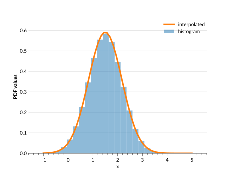

# Basic Usage

## Introduction to the Ensemble

The main object of `qp` is the {py:class}`qp.Ensemble`. This is a data structure that can store one or more distributions with the same type, or **parameterization**. A **parameterization** is defined in this package as the way that the distribution is represented, for example a histogram represents a data set using bins and values inside those bins.

An Ensemble object has three main components, which exist as dictionaries:

**Metadata** ({py:attr}`qp.Ensemble.metadata`)
: This tells you the parameters shared by all distributions in the Ensemble, including the name of the parameterization, the version, and the coordinates of that parameterization (i.e. bins for a histogram).

**Data values** ({py:attr}`qp.Ensemble.objdata`)
: Contains the data values for each distribution in the Ensemble, where each row in a value's array corresponds to a distribution.

_(optional)_ **Ancillary data table** ({py:attr}`qp.Ensemble.ancil`)
: Contains any additional parameters pertaining to the data, where there is one value or row per distribution. The arrays for each parameter must have the same first dimension as the number of distributions. For example, in an Ensemble of galaxy redshifts, the ancillary data table could have each galaxy's magnitudes.

```{note}
The exact configuration of the data within these dictionaries differs for each parameterization, so see <project:datastructure.md> for more details.
```

(creating-ensembles)=

## Creating an Ensemble

There are three available methods to create an Ensemble from in-memory data, as well as the ability to read in an Ensemble from file.

(creating-ensemble-memory)=

### Creating an Ensemble from in-memory data

The first method is to use the `create_ensemble()` function that exists for each parameterization. This function will take as arguments the required metadata coordinates and data values for the parameterization, as well as the argument `ancil` for any ancillary data.

For example, to create an interpolated parameterization, where the distributions are given by a set of $x$ and $y$ values, you can use {py:meth}`qp.interp.create_ensemble() <qp.interp_gen.create_ensemble>`, where the data is passed as arguments to the function. Below, we do just that. First we have to set up a distribution with $x$ and $y$ values, which we do by using the <inv:scipy#scipy.stats.norm> distribution:

```{doctest}

>>> import qp
>>> import numpy as np
>>> from scipy import stats
>>> npdf = 3 # number of distributions to create
>>> nvals = 50 # number of values per distribution
>>> xvals = np.linspace(-1,5,nvals) # x values for all distributions
>>> loc = np.linspace(1., 2., npdf)
>>> scale = np.linspace(0.2, 1.15, npdf)

# changing array shapes to (npdf, 1)
>>> loc = loc.reshape(-1,1)
>>> scale = scale.reshape(-1,1)

# getting the pdf values at each x value
>>> yvals = stats.norm(loc=loc, scale=scale).pdf(xvals)
>>> ancil = {'ids':[5,8,10]}

```

Then we use this data to create our Ensemble:

```{doctest}

>>> ens = qp.interp.create_ensemble(xvals, yvals, ancil=ancil)
>>> ens
Ensemble(the_class=interp,shape=(3, 50))

```

Note that the representation of the Ensemble tells us what the parameterization is, and the shape of the Ensemble (also available via {py:attr}`qp.Ensemble.shape`). The first value is the number of distributions and the second value is the number of data values per distribution, which in this case is equal to the number of $xvals$.

#### Alternate creation methods

Another method is to use {py:meth}`qp.create() <qp.factory.Factory.create>`, which allows you to create an Ensemble of any parameterization type. The function requires the parameterization type as an argument, as well as a dictionary of the necessary data, and an optional `ancil` argument for any ancillary data. So to create an Ensemble using the same data above, you would use the following commands:

```{doctest}

>>> data = {"xvals": xvals, "yvals": yvals}
>>> ens = qp.create('interp', data=data, ancil=ancil)
>>> ens
Ensemble(the_class=interp,shape=(3, 50))

```

Finally, you can instantiate the Ensemble class directly by using {py:class}`qp.Ensemble`, which takes the same arguments as the {py:meth}`qp.create() <qp.factory.Factory.create>` method, except the parameterization argument must be the actual class, instead of the string name of the class:

```{doctest}

>>> ens = qp.Ensemble(qp.interp, data=data,ancil=ancil)
>>> ens
Ensemble(the_class=interp,shape=(3, 50))

```

### Reading an Ensemble from file

An Ensemble can be read from a file as well, if the file is in the appropriate format. To check if a file can be read in as an Ensemble, you can use {py:meth}`qp.is_qp_file() <qp.factory.Factory.is_qp_file>`, which returns `True` if it is in a compatible format. Once you have a file that can be read it, you can use {py:meth}`qp.read() <qp.factory.Factory.read>` as shown in the example below:

```{doctest}

>>> ens = qp.read("ensemble.hdf5")
>>> ens
Ensemble(the_class=interp,shape=(3, 50))

```

Alternatively, if you have multiple Ensembles to read in from an HDF5 file, you can use {py:meth}`qp.read_dict() <qp.factory.Factory.read_dict>`:

```{doctest}

>>> ens_dict = qp.read_dict("multiple_ensembles.hdf5")
>>> type(ens_dict)
dict

```

## Working with an Ensemble

What can we do with our Ensemble? <project:methods.md> lists all of the available methods of an Ensemble object, and links to their docstrings. Or you can see the [API documentation of the class](#qp.core.ensemble.Ensemble) for a complete list of its attributes and methods all in one place. Here we will go over a few of the most commonly-used methods and attributes.

### Getting basic properties

We can check the data an Ensemble contains using {py:attr}`qp.Ensemble.metadata` or {py:attr}`qp.Ensemble.objdata`. These show the dictionaries of data that define our Ensemble. To select one or more of the distributions in our Ensemble, you can easily slice the Ensemble object itself, for example `ens[0]` will yield an Ensemble object with just the data for the first distribution. Another way to select just the data for a specific distribution is to slice the `objdata` dictionary, i.e. `ens.objdata["yvals"][0]` as used below.

Let's use these data dictionaries to quickly plot one of our distributions (for more details on plotting distributions see <project:./cookbook/ensemblemanipulation.md#plotting-using-x_samples>):

```{doctest}

>>> plt.plot(ens.metadata["xvals"],ens.objdata["yvals"][2])
>>> plt.show()

```

```{image} ../assets/basic_usage_plot_data.svg
:alt: plot-ensemble-data
:width: 80%
:align: center
```

:::{warning}

Note that `objdata` and `metadata` do not store the exact input data. Instead they store what represents the Ensemble. For example, if you input a distribution that is not normalized, by default most parameterizations will normalize the data, and they store the normalized data in `objdata`. For a quick example, we create a new Ensemble below:

```{doctest}

>>> xvals_2 = np.array([0,0.5,1,1.5,2])
>>> yvals_2 = np.array([0.01,0.2,0.3,0.2,0.01])
>>> ens_2 = qp.interp.create_ensemble(xvals_2,yvals_2)
>>> ens_2.objdata
{'yvals': array([[0.02816901, 0.56338028, 0.84507042, 0.56338028,
0.02816901],
        [0.3       , 0.83333333, 0.66666667, 0.33333333,
0.03333333]])}

```

Note that the $y_{vals}$ in `objdata` are different than the ones given to the `create_ensemble()` function.

:::

An Ensemble also has other attributes that provide information about it. Some useful ones are:

- {py:attr}`qp.Ensemble.npdf`: the number of distributions in the Ensemble
- {py:attr}`qp.Ensemble.shape`: ($n_{pdf}$, $n_{data}$), where $n_{data}$ is the number of values that each distribution has, usually corresponding in some way to the number of coordinates in the metadata. For our sample Ensemble, $n_{data}$ is equal to the number of $x_{vals}$.

A complete list of attributes can be found in the [API class documentation](#qp.core.ensemble.Ensemble).

### Statistical methods

One of the main functions of an Ensemble is the ability to calculate the probability distribution function (PDF) or cumulative distribution function (CDF) of the distributions. This can be done via the {py:meth}`qp.Ensemble.pdf` and {py:meth}`qp.Ensemble.cdf` methods, which return values that correspond to the given $x$ values for each distribution. For example, to get the value of the PDFs at a specific $x$ value, one can do the following:

```{doctest}

>>> ens.pdf(1.2)
array([[1.20683683],
       [0.53529521],
       [0.27484342]])

```

This returns an array of shape ($n_{pdf}$, $n$), where $n$ is the number of $x$ values given to the function.

### Converting between parameterizations

It is possible to convert an Ensemble of distributions to a different parameterization. There are two main methods for conversion:

- {py:meth}`qp.convert() <qp.factory.Factory.convert>`: takes as arguments the Ensemble to convert and the name of the parameterization we want to convert to (i.e. 'hist').
- {py:meth}`qp.Ensemble.convert_to`: takes as an argument the class object for the parameterization we want to convert to (i.e. `qp.hist`)

Both functions also allow you to provide a specific conversion method via the `method` keyword, if the parameterization has more than one conversion method. Most conversion methods also have additional required arguments, which differ between parameterizations. To get more information about the conversion methods for a specific parameterization, see the documentation page for that parameterization. For some more detailed examples of conversion and a look at how it affects the distributions, see <project:./cookbook/conversion.md#converting-ensembles-between-parameterizations>.

:::{note}

You can only convert to a parameterization that has a conversion method. This means that you cannot convert to any of the analytic parameterizations from SciPy (i.e. any parameterization that starts with `qp.stats` -- see <project:./parameterizations/index.md> for more information about these parameterizations).

:::

For example, let's say we wanted to convert our Ensemble from an interpolation to a histogram ({py:class}`qp.hist <qp.parameterizations.hist.hist.hist_gen>`). The [histogram parameterization](./parameterizations/hist.md#conversion) has two conversion methods, {py:func}`extract_hist_values() <qp.parameterizations.hist.hist_utils.extract_hist_values>` and {py:func}`extract_hist_samples() <qp.parameterizations.hist.hist_utils.extract_hist_samples>`. For this example we'll use `extract_hist_values`, which requires the `bins` argument.

```{doctest}

>>> bins = np.linspace(-1,5,26)
>>> ens_h = qp.convert(ens, 'hist', bins=bins)
>>> ens_h
Ensemble(the_class=hist,shape=(3, 25))

```

[Our new Ensemble has a different class and a different shape, since now instead of 50 $x$ values we have 25 bins (and 26 bin edges). Let's plot them both to compare:]{#plotting-interp-ensemble}

```{doctest}

>>> plt.bar(ens_h.x_samples(),ens_h[1].objdata["pdfs"],
... width=ens_h.x_samples()[1]-ens_h.x_samples()[0], alpha=0.5, color = colours[0])
>>> plt.plot(ens.metadata["xvals"],ens[1].objdata["yvals"],c=colours[1])
>>> plt.show()

```



Overall they match up quite well. However, converting an Ensemble does not guarantee that the converted Ensemble will have _exactly_ the same distribution shape. For example, we can compare the value of the PDF at $x=1.2$ in the histogram Ensemble to that of the interpolated Ensemble:

```{doctest}

>>> ens_h.pdf(1.2)
array([[0.81902906],
       [0.55474111],
       [0.28733705]])

>>> ens.pdf(1.2)
array([[1.20683683],
       [0.53529521],
       [0.27484342]])

```

These values are slightly different, even though the distributions match up quite well. Depending on the scenario there can be even more significant differences in distribution shape. Typically, ensuring that your Ensemble has a high density of coordinate values, and that the parameters you convert to have similarly high density, will aid in producing converted distributions that match their initial distributions more closely.

**Make sure to check your converted Ensemble looks the way you expect it to.**

## Writing an Ensemble to file

Once you're done working with your Ensemble, you can write it to a `qp` file. The main method to use for this is {py:meth}`qp.Ensemble.write_to`. This uses {py:meth}`qp.Ensemble.build_tables` to turn the three data tables, metadata, objdata and ancil into one `TableDict-like` object (essentially a dictionary of tables), and then uses [`tables_io`](https://tables-io.readthedocs.io/en/latest/#) to write it to one of the compatible file types.

The available file formats are given in the table below. The recommended file type is **HDF5** (suffix 'hdf5'), as this requires no in-memory conversion or additional packages.

| File format name | File suffix    | Produced by                                                                            |
| ---------------- | -------------- | -------------------------------------------------------------------------------------- |
| astropyFits      | 'fits'         | [`astropy.io.fits`](https://docs.astropy.org/en/stable/io/fits/index.html)             |
| astropyHDF5      | 'hf5'          | [`astropy`](https://docs.astropy.org/en/stable/io/unified.html#hdf5)                   |
| **numpyHDF5**    | 'hdf5'         | [`h5py`](https://docs.h5py.org/en/stable/quick.html#appendix-creating-a-file)          |
| numpyFits        | 'fit'          | [`astropy.io.fits`](https://docs.astropy.org/en/stable/io/fits/index.html)             |
| pyarrowHDF5      | 'hd5'          | [`pyarrow`](https://arrow.apache.org/docs/python/getstarted.html)                      |
| pandasHDF5       | 'h5'           | [`pandas`](https://pandas.pydata.org/pandas-docs/stable/user_guide/io.html#io-hdf5)    |
| pandaParquet     | 'parq' or 'pq' | [`pandas`](https://pandas.pydata.org/pandas-docs/stable/user_guide/10min.html#parquet) |
| pyarrowParquet   | 'parquet'      | [`pyarrow`](https://arrow.apache.org/docs/python/parquet.html)                         |

:::{tip}
See the [`tables_io` documentation](https://tables-io.readthedocs.io/en/latest/#) for more details about the file formats or the write functionality.
:::

As an example, let's write our interpolated Ensemble to an HDF5 file:

```{doctest}

>>> ens.write_to("interp_ens.hdf5")

```

Now we can make sure that it wrote out properly by checking it's a `qp` file:

```{doctest}

>>> qp.is_qp_file("interp_ens.hdf5")
True

```

If we wanted to write both of our Ensembles to the same file, we can use method {py:meth}`qp.write_dict() <qp.factory.Factory.write_dict>`.

```{doctest}

>>> ens_dict = {'ens_i': ens, 'ens_h': ens_h}
>>> qp.write_dict("ensemble_file.hdf5", ens_dict)

```

This function **only** writes to HDF5 files.

It is also possible to iteratively write a chunk of an Ensemble at a time to an HDF5 file. For a more detailed example of this, see <project:./cookbook/ensemblemanipulation.md#iterating-over-hdf5-files>.
