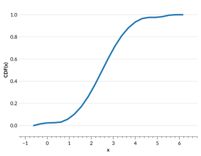

# Ensemble manipulation

This page covers examples of Ensemble creation and some basic usage.

(creating-an-ensemble-from-a-qp-stats-distribution)=

## Creating an Ensemble from a parameterization inherited from SciPy

The `create_ensemble` function for the `qp.stats` distributions is slightly different than for the other parameterizations, as it requires a dictionary of the data to create the Ensemble, instead of being able to take individual arguments. See below for an example using the `qp.stats.norm` distribution:

```{doctest}

>>> import qp
>>> import numpy as np
>>> loc = np.linspace(0.5,1,3)
>>> scale = np.linspace(0.25,0.75,3)
>>> data = {"loc": loc, "scale":scale}
>>> ens_n = qp.stats.norm.create_ensemble(data)
>>> ens_n
Ensemble(the_class=norm, shape=(3,1))

```

We provided an array of 3 values each for 'loc' and 'scale' and ended up with an Ensemble with 3 distributions. This is due to the automatic reshaping of the input arrays that `qp` does to ensure that the resulting Ensemble looks and behaves like the other Ensemble types.

`qp.stats` distributions only require one value per parameter per distribution. So you can input the data either as 1D arrays with shape ($n$,) (above), or as 2D arrays with shape ($n$,1) (below), and both result in the same outcome. Additionally, any arrays input with other shapes will be reshaped to 2D arrays of shape ($n$,1), where $n$ is the number of elements in the input array.

```{doctest}

>>> loc = np.array([[0.5],[0.75],[1.0]])
>>> scale = np.array([[0.25],[0.5],[0.75]])
>>> data = {"loc": loc, "scale":scale}
>>> ens_n = qp.stats.norm.create_ensemble(data)
>>> ens_n
Ensemble(the_class=norm, shape=(3,1))

```

## Sampling

Sampling from an Ensemble can be done easily using the {py:meth}`qp.Ensemble.rvs` method. Below is an example sampling from our example Ensemble from the <project:../basicusage.md> documentation, which has 3 distributions:

```{doctest}

>>> import qp
>>> import numpy as np
>>> samples = ens.rvs(10)
>>> samples.shape
(3, 10)

```

You now have `samples`, which contains a set of $x$ values that are randomly drawn from each distribution in the Ensemble.

## Appending an Ensemble to another Ensemble of the same type

If you have created multiple Ensembles with the same parameterization, it can be easier to handle if they are all part of one Ensemble. You can use the {py:meth}`qp.Ensemble.append` method of the Ensemble to add an Ensemble of the same type to an existing Ensemble. This can only be done if the metadata for both Ensembles are the same. In particular, the coordinates (i.e. "xvals" or "bins") must be the same for both Ensembles. For example, to append two histogram Ensembles together, first we create the two separate Ensembles:

```{doctest}

>>> import qp
>>> import numpy as np
>>> # create first Ensemble
>>> bins = np.linspace(0,2,9)
>>> pdfs = np.array([1,2,4,3,3.5,2,1,0.5])
>>> ens_1 = qp.hist.create_ensemble(bins=bins,pdfs=pdfs)
>>> ens_1
Ensemble(the_class=hist,shape=(1,8))
>>> # create second Ensemble
>>> pdfs_2 = np.array([0.5,0.9,1.5,3,4.5,3,1.5,0.5])
>>> ens_2 = qp.hist.create_ensemble(bins=bins,pdfs=pdfs_2)
>>> ens_2
Ensemble(the_class=hist,shape=(1,8))

```

Now that we have our Ensembles, we can append the second one to the first using {py:meth}`qp.Ensemble.append`:

```{doctest}

>>> ens.append(ens_2)
>>> ens
Ensemble(the_class=hist,shape=(2,8))

```

Our new Ensemble now contains both distributions.

## Concatenating a list of Ensembles of the same type

If you have created multiple Ensembles with the same parameterization, it can be easier to handle if they are all part of one Ensemble. You can use the {py:meth}`qp.concatenate() <qp.core.factory.Factory.concatenate>` method to add multiple Ensembles of the same type together. This can only be done if the metadata for all Ensembles are the same. In particular, the coordinates (i.e. "xvals" or "bins") must be the same for both Ensembles. For example, to append three interpolated Ensembles together, first we create the three separate Ensembles:

```{doctest}

>>> import qp
>>> import numpy as np
>>> # create first Ensemble
>>> xvals = np.linspace(0,2,9)
>>> yvals = np.array([1,2,4,3,3.5,2,1.5,1,0.5])
>>> ens_1 = qp.interp.create_ensemble(xvals=xvals,yvals=yvals)
>>> ens_1
Ensemble(the_class=interp,shape=(1,9))
>>> # create second Ensemble
>>> yvals_2 = np.array([0.5,0.9,1.5,3,4.5,3,1.5,1.,0.5])
>>> ens_2 = qp.interp.create_ensemble(xvals=xvals,yvals=yvals_2)
>>> ens_2
Ensemble(the_class=interp,shape=(1,9))
>>> # create third Ensemble
>>> yvals_3 = np.array([0.3,0.5,0.9,1.2,2,2.5,2,1.5,0.5])
>>> ens_3 = qp.interp.create_ensemble(xvals=xvals,yvals=yvals_3)
>>> ens_3
Ensemble(the_class=interp,shape=(1,9))

```

Then we use {py:meth}`qp.concatenate() <qp.core.factory.Factory.concatenate>` to put them all into one Ensemble.

```{doctest}

>>> ens_all = qp.concatenate([ens, ens_2, ens_3])
>>> ens_all.npdf
3

```

```{note}

There is no way to concatenate Ensembles of different types together. You can [convert](./conversion) all of the Ensembles to the same parameterization first and then concatenate.

```

## Iterating over HDF5 files

This tutorial notebook covers the use of the {py:meth}`qp.iterator() <qp.factory.Factory.iterator>` function to read in Ensembles from a file, as well as how to iteratively write Ensembles to HDF5 files in series and in parallel: <project:../../nb/iterator_demo.md> (download {download}`here <../../nb/iterator_demo.ipynb>`).

### Parallelizing iteration via MPI

The {py:meth}`qp.iterator() <qp.factory.Factory.iterator>` function can also be used in parallel, allowing for each process to iterate through some of the distributions. Let's test this out on a sample file of Ensembles. First we need to know how many distributions are in the file:

```{doctest}

>>> import qp
>>> filename = "../../assets/test.hdf5"
>>> qp.data_length(filename)
100

```

We can now decide on a chunk size. Let's say that we're using 4 cores, so each core will have access to 25 distributions. So let's go with a chunk size of 5, so the data is easily divisible by the chunk size. Now we can write our little program to iterate through the data (you can download the file {download}`here <../../assets/mpi-example.py>`):

```{literalinclude} ../../assets/mpi-example.py

```

This will have each process iterate through chunks of 5 distributions at a time. However, each process will not necessarily iterate through a contiguous chunk of distributions. Try running the program to see what happens for yourself, using the command:

```python
mpiexec -n 4 python mpi-example.py
```

You may need to edit the file path in the example program above.

## Plotting using x_samples

A useful method for quickly plotting a distribution or distributions in your Ensemble is the {py:meth}`qp.Ensemble.x_samples` method. This is meant to provide a series of $x$ values that should cover the range of data given in all distributions in the Ensemble, which can be provided to the appropriate method ({py:meth}`qp.Ensemble.pdf` for most parameterizations, {py:meth}`qp.Ensemble.cdf` for quantiles) to get the relevant $y$ values.

:::{note}
The {py:meth}`qp.Ensemble.x_samples` method only works properly for the five main supported parameterizations. For the rest it returns just a default set of points between a given minimum and maximum value.
:::

As an example, let's take a look at the output of {py:meth}`qp.Ensemble.x_samples` and plot a CDF from a [quantile distribution](../parameterizations/quant.md):

```{doctest}

>>> import qp
>>> import numpy as np
>>> import matplotlib.pyplot as plt
>>> # create a quantile Ensemble by converting from a normal Ensemble
>>> ens_n = qp.stats.norm.create_ensemble({"loc": np.array([2.5, 3.5]),
... "scale": np.array([1.,0.85])})
>>> quants = np.linspace(0.001,0.999,10)
>>> ens_q = qp.convert(ens_n, "quant", quants=quants)
>>> # take a look at the Ensemble data values
>>> ens_q.x_samples()
array([-0.6071293 , -0.30039342,  0.00634245,  0.31307832,  0.61981419,
        0.92655007,  1.23328594,  1.54002181,  1.84675769,  2.15349356,
        2.46022943,  2.7669653 ,  3.07370118,  3.38043705,  3.68717292,
        3.99390879,  4.30064467,  4.60738054,  4.91411641,  5.22085228,
        5.52758816,  5.83432403,  6.1410599 ])
>>> ens_q.objdata["locs"]
array([[-0.6071293 , -0.59023231,  1.28345605,  1.73715452,  2.07018928,
         2.36057094,  2.63942906,  2.92981072,  3.26284548,  3.71654395,
         5.59023231,  5.6071293 ],
       [ 0.8589401 ,  0.87330254,  2.46593764,  2.85158134,  3.13466089,
         3.3814853 ,  3.6185147 ,  3.86533911,  4.14841866,  4.53406236,
         6.12669746,  6.1410599 ]])

```

You can see that for the quantile parameterization, {py:meth}`qp.Ensemble.x_samples` returns a set of values that are evenly spaced between the minimum and the maximum value of the 'locs' for all distributions in the Ensemble. Now let's use this array to plot the first distribution in the Ensemble:

```{doctest}
>>> plt.plot(ens_q.x_samples(), ens_q[0].cdf(ens_q.x_samples()))
>>> plt.xlabel("x")
>>> plt.ylabel("CDF(x)")
>>> plt.show()

```



For an example of plotting an interpolated Ensemble, see [the Basic Usage documentation](../basicusage.md#converting-between-parameterizations).
