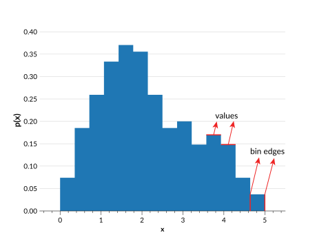

# Histogram

Histograms are defined with:

- **Bin edges** (`bins`): $n+1$ ordered values represented the edges of $n$ bins (they do not have to have the same width).
- **Values** (`pdfs`): $n$ values corresponding to the probability associated with each bin



## Use Cases

The histogram parameterization is ideal for distributions derived from real data, particularly those that do not follow a smooth curved line. However, a histogram distribution is highly dependent on the bin widths. In an Ensemble all distributions must have the same bins, so keep in mind that the bins of an Ensemble must work well for **all** its distributions.

## Behaviour

Histogram Ensembles operate in the following way:

- `Ensemble.pdf(x)` provides the bin value for the bin containing $x$, or 0 if $x$ is outside of the bins. No interpolation takes place.
- `Ensemble.cdf(x)` provides values that are linearly interpolated using <inv:#scipy.interpolate.interp1d> across the bins, and return either 0 or 1 as appropriate outside of the bins.
- `Ensemble.ppf(x)` provides values within the bin edges, e.g. `Ensemble.ppf(0)` returns the first bin edge, and `Ensemble.ppf(1)` returns the last bin edge.
- `Ensemble.x_samples()` provides the $n$ bin centers of the existing bin edges in the metadata.

## Data structure

See <project:../datastructure.md> for general details on the data structure of Ensembles.

### Metadata Dictionary

| Key           | Example value      | Description                                            |
| ------------- | ------------------ | ------------------------------------------------------ |
| "pdf_name"    | `array(b["hist"])` | The parameterization type                              |
| "pdf_version" | `array([0])`       | Version of parameterization type used                  |
| "bins"        | `array([0,1,2,3])` | The bin edges, with shape $n+1$ ($n$ = number of bins) |

### Data Dictionary

| Key    | Example value                      | Description                                           |
| ------ | ---------------------------------- | ----------------------------------------------------- |
| "pdfs" | `array([[4,5,6],[1,2,3],[7,8,9]])` | The values within each bin, of shape ($n_{pdf}$, $n$) |

```{note}

Here $n_{pdf}$ is the number of distributions, and $n$ is the number of bins for each distribution.

```

## Ensemble Creation

```{doctest}

>>> import qp
>>> import numpy as np
>>> bins = np.linspace(0,1,5)
>>> pdfs = np.array([0.1,0.2,0.2,0.1])
>>> ens = qp.hist.create_ensemble(bins=bins,pdfs=pdfs)
>>> ens
Ensemble(the_class=hist,shape=(1,4))

```

**Required parameters:**

- `bins`: The array containing the ($n+1$) bin edges
- `pdfs`: The array containing the ($n_{pdf}$, $n$) bin values ($n_{pdf}$ is the number of distributions)

**Optional parameters:**

- `ancil`: The dictionary of arrays of additional data containing $n_{pdf}$ values
- `norm`: If True, normalizes the input distributions. If False, assumes the given distributions are already normalized. By default True.
- `warn`: If True, raises warnings if input is not valid PDF data (i.e. if data is negative). If False, no warnings are raised. By default True.

For more details on creating an Ensemble, see <project:../basicusage.md#creating-an-ensemble>, and for more details on this function see its [API documentation](#qp.hist_gen.create_ensemble).

## Conversion

When converting an Ensemble of another type to a histogram, you must provide a set of bin edges. There are no checks during conversion that these bins cover the full range of the data in the input distribution, so keep in mind that it is up to you to ensure that the bin edges provided cover the full range of the input data distributions. Otherwise, the converted distributions will have altered data, as the new Ensemble of histograms will be normalized by default.

There are two methods that can be used to convert an Ensemble to this parameterization:

- [default method](#qp.parameterizations.hist.hist_utils.extract_hist_values)
- [samples](#qp.parameterizations.hist.hist_utils.extract_hist_samples)

### Default method ({py:meth}`extract_hist_values <qp.parameterizations.hist.hist_utils.extract_hist_values>`)

```{doctest}
>>> ens_h = qp.convert(ens, 'hist', bins=np.linspace(0,5,21))
>>> ens_h
Ensemble(the_class=hist,shape=(3,20))
```

**Required argument:** `bins`, where `bins` are the bin edges of the histogram.

The default method works by taking the current distribution, getting the CDF values at each of the bin edges, and then taking the difference across the bins to get the value for each bin. This method works well if the CDF of the input distribution is well defined, but if it has been interpolated across widely spaced values the second method may give better results.

### Samples method ({py:meth}`extract_hist_samples <qp.parameterizations.hist.hist_utils.extract_hist_samples>`)

```{doctest}
>>> ens_h = qp.convert(ens, 'hist', method='samples', bins=np.linspace(0,5,21), size=2000)
>>> ens_h
Ensemble(the_class=hist,shape=(3,20))
```

**Required argument:** `bins`, where `bins` are the bin edges of the histogram.

**Optional argument:** `size`, which is the number of values to sample from the distribution.

This method samples from the input distribution, and then uses <inv:#numpy.histogram> to create a histogram from these samples, using the provided `bins` as bin edges. This does mean that too few samples may result in quite a different distribution, so it is recommended to use a large number of samples.
