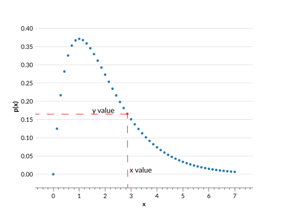

# Interpolation

Interpolated distributions are defined with:

- **$x$ values** (`xvals`): $n$ **ordered** values representing points on the distribution.
- **$y$ values** (`yvals`): $n$ values that correspond to the probability associated with each $x$ value.



## Use cases

The interpolation parameterization works well for most distributions, provided there is a high enough density of $x$ values. It linearly interpolates between each point, so it does a poor job of reproducing curves. Keep in mind that all distributions in an Ensemble must have the same $x$ values, so the $x$ values have both the range and the density necessary to represent **all** of the distributions.

To get around this requirement, you can use the <project:irregularinterp.md> parameterization, though this will significantly slow down code performance for large datasets.

## Behaviour

Interpolated Ensembles operate in the following ways:

- `Ensemble.pdf(x)` uses <inv:#scipy.interpolate.interp1d> to linearly interpolate the PDF inside the range of given `xvals`, and returns 0 outside that range.
- `Ensemble.cdf(x)` uses <inv:#scipy.interpolate.interp1d> to linearly interpolate the CDF from the cumulative sum at the given `xvals`. It is not the direct integral of `Ensemble.pdf()`. Outside the range of given `xvals` it returns 0 or 1 as appropriate.
- `Ensemble.ppf(x)` uses <inv:#scipy.interpolate.interp1d> to linearly interpolate based on the cumulative sum at the given `xvals`, with the $x$ and $y$ inputs inverted.
- `Ensemble.x_samples()` returns the $x$ values from the metadata.

## Data structure

See <project:../datastructure.md> for general details on the data structure of Ensembles.

### Metadata Dictionary

| Key           | Example value        | Description                                                  |
| ------------- | -------------------- | ------------------------------------------------------------ |
| "pdf_name"    | `array(b["interp"])` | The parameterization type                                    |
| "pdf_version" | `array([0])`         | Version of parameterization type used                        |
| "xvals"       | `array([0,1,2])`     | The $x$ values shared for all distributions, with $n$ values |

### Data Dictionary

| Key     | Example value                      | Description                                                           |
| ------- | ---------------------------------- | --------------------------------------------------------------------- |
| "yvals" | `array([[4,5,6],[1,2,3],[7,8,9]])` | The values corresponding to each $x$ value, of shape ($n_{pdf}$, $n$) |

```{note}
$n_{pdf}$ is the number of distributions in an Ensemble.
```

## Ensemble creation

```{doctest}

>>> import qp
>>> import numpy as np
>>> xvals = np.linspace(0,1,5)
>>> yvals = np.random.rand(2,5)
>>> ens = qp.interp.create_ensemble(xvals=xvals, yvals=yvals)
>>> ens
Ensemble(the_class=interp,shape=(2,5))

```

**Required parameters:**

- `xvals`: The array containing the $n$ $x$ values shared by all of the distributions
- `yvals`: The array containing the ($n_{pdf}$,$n$) probability values corresponding to each $x$ values

**Optional parameters:**

- `ancil`: The dictionary of arrays of additional data containing $n_{pdf}$ values
- `norm`: If True, normalizes the input distributions. If False, assumes the given distributions are already normalized. By default True.
- `warn`: If True, raises warnings if input is not valid PDF data (i.e. if data is negative). If False, no warnings are raised. By default True.

For more details on creating an Ensemble, see <project:../basicusage.md#creating-an-ensemble>, and for more details on this function see its [API documentation](#qp.interp_gen.create_ensemble).

## Conversion

There method used to convert an Ensemble to this parameterization is: {py:func}`extract_vals_at_x() <qp.parameterizations.interp.interp_utils.extract_vals_at_x>`.

**Example:**

```{doctest}

>>> ens_i = qp.convert(ens, 'interp', xvals=np.linspace(0,1,5))
>>> ens_i
Ensemble(the_class=interp,shape=(2,5))

```

**Required argument:** `xvals`, where `xvals` are the $x$ points at which to calculate the value of the PDF for each distribution.

Make sure that the range of the $x$ values covers the full range of data in the input distributions, or the converted data will be inaccurate. The conversion process includes an automatic normalization of the data, which will change the input distributions if they are missing data points.

Conversion to an interpolation is quite simple. It calls the {py:meth}`qp.Ensemble.pdf` function of the input Ensemble with the given `xvals`, and creates the new interpolated Ensemble from using the given `xvals` and the PDF values as `yvals`.
