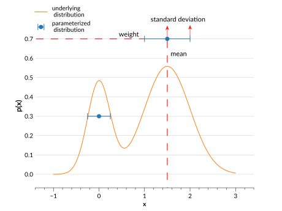

# Gaussian Mixture Model

Gaussian mixture models are defined with:

- **Means** (`means`): The means for each of the $n$ Gaussians that makes up a distribution.
- **Standard deviations** (`stds`): The standard deviations for each of the $n$ Gaussians that makes up a distribution.
- **Weights** (`weights`): The relative weight given to each of the $n$ Gaussians that make up a distribution.



## Use cases

Gaussian mixture models are well suited to fitting real data distributions with multiple distinct modes. They can be represented with only a few parameters, and so are a more efficient way to store large numbers of distributions at a time than parameterizations like histograms or interpolations.

## Behaviour

Gaussian mixture model Ensembles operate in the following ways:

- `Ensemble.pdf(x)` and `Ensemble.cdf(x)` are computed as a weighted sum of each of the component Gaussian's `pdf(x)` and `cdf(x)`.
- `Ensemble.ppf(x)` is calculated from a fixed grid of `cdf()` values that are interpolated linearly using <inv:#scipy.interpolate.interp1d>. `ppf(0)` returns negative infinity, and `ppf(1)` returns positive infinity.
- `Ensemble.x_samples()` returns a range of $x$ values that should plot the majority of all the distributions. It may exclude the tail of some distributions. The minimum of the range is calculated as the lowest mean minus the largest standard deviation, and the maximum is calculated as the reverse.

## Data structure

See <project:../datastructure.md> for general details on the data structure of Ensembles.

### Metadata Dictionary

| Key           | Example value        | Description                           |
| ------------- | -------------------- | ------------------------------------- |
| "pdf_name"    | `array(b["mixmod"])` | The parameterization type             |
| "pdf_version" | `array([0])`         | Version of parameterization type used |

### Data Dictionary

| Key       | Example value                                        | Description                                                         |
| --------- | ---------------------------------------------------- | ------------------------------------------------------------------- |
| "means"   | `array([[1,2,3],[0.5,1,1.5],[-1,0,1]])`              | The means of each Gaussian, of shape ($n_{pdf}$, $n$)               |
| "stds"    | `array([[0.4,0.5,0.6],[0.1,0.2,0.3],[0.7,0.8,0.9]])` | The standard deviations of each Gaussian, of shape ($n_{pdf}$, $n$) |
| "weights" | `array([[0.3,0.3,0.4],[0.1,0.5,0.4],[0.2,0.5,0.3]])` | The weight given to each Gaussian, of shape ($n_{pdf}$, $n$)        |

```{note}

Here $n_{pdf}$ is the number of distributions, and $n$ is the number of Gaussians for each distribution.

```

## Ensemble Creation

```{doctest}

>>> import qp
>>> import numpy as np
>>> means = np.linspace(-1,1,5)
>>> stds = np.linspace(0.1,0.8,5)
>>> weights = np.array([0.1,0.3,0.2,0.2,0.2])
>>> ens = qp.mixmod.create_ensemble(means=means,stds=stds,weights=weights)
>>> ens
Ensemble(the_class=mixmod,shape=(1,5))

```

**Required parameters**:

- `means`: The array of means of the component Gaussians, with shape ($n_{pdf}$,$n$).
- `stds`: The array of standard deviations of the component Gaussians, with shape ($n_{pdf}$, $n$).
- `weights`: The array of weights for each of the component Gaussians. The weights should add to 1, or they will be normalized. They have shape ($n_{pdf}$, $n$).

**Optional parameters:**

- `ancil`: The dictionary of arrays of additional data containing $n_{pdf}$ values
- `warn`: If True, raises warnings if input is not valid PDF data (i.e. if input is not finite). If False, no warnings are raised. By default True.

## Conversion

The method used to convert an Ensemble to this parameterization is: {py:func}`extract_mixmod_fit_samples() <qp.parameterizations.mixmod.mixmod_utils.extract_mixmod_fit_samples>`.

**Example:**

```{doctest}

>>> ens_m = qp.convert(ens, 'mixmod', ncomps=2)
>>> ens_m
Ensemble(the_class=mixmod,shape=(1,5))

```

**Optional arguments:**

- `ncomps`: The number of component Gaussians to use for all the distributions, by default 3.
- `nsamples`: The number of samples to generate from each distribution, by default 1000.
- `random_state`: The random state to provide to {py:meth}`qp.Ensemble.rvs`, by default None.

This conversion method uses {py:meth}`qp.Ensemble.rvs` to sample `nsamples` data points from each of the input distributions. Then it uses <inv:#sklearn.mixture.GaussianMixture.fit> to estimate the parameters of a Gaussian mixture model distribution for each of the distributions.

## Known issues

Currently the `rvs()` method of the Gaussian mixed model parameterization is not functional. This also means that converting Gaussian mixed model Ensembles to other types of Ensembles via conversion methods that use sampling will not work (i.e. converting to a histogram via the 'samples' method).
