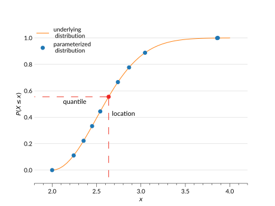

# Quantile

Quantile distributions are parameterized by values from the CDF. They have:

- **quantiles** (`quants`): $n$ ordered quantiles of the distribution, from 0 to 1. These are evenly spaced cumulative probabilities (i.e. the probability $x \leq$ some value.)
- **locations** (`locs`): The $n$ locations ($x$ values), on the distribution's CDF where the quantiles are reached.



## Use cases

The quantile parameterization works well for data that has a well-behaved CDF. As well, it is easier to represent distributions that may be spread out in the $x$ coordinate space with this parameterization than with interpolation or histogram parameterizations, as all distributions will fall into the same range of quantiles.

One thing to note when using this parameterization is that it does not require that the PDF be positive. So the interpolation of the PDFs can become negative, particularly in areas where the CDF is flat or close to flat, which may not be desirable in certain use cases.

## Behaviour

Quantile parameterized Ensembles behave in the following ways:

- `Ensemble.cdf(x)` is created by interpolating quadratically between the quantiles using <inv:#scipy.interpolate.interp1d>.
- `Ensemble.ppf(0)` returns negative infinity and `Ensemble.ppf(1)` returns positive infinity.
- `Ensemble.pdf(x)` is calculated in a variety of ways depending on the PDF constructor used (`pdf_constructor_name`, described below).
  - **piecewise_linear** (_Default_): Takes the numerical derivative of the CDF and linearly interpolates between those points. See {py:class}`PiecewiseLinear <qp.parameterizations.quant.piecewise_linear.PiecewiseLinear>` for more details.
  - **piecewise_constant**: Calculates the numerical derivative of the CDF. Assumes a constant value between points on the derivative to interpolate. See {py:class}`PiecewiseConstant <qp.parameterizations.quant.piecewise_constant.PiecewiseConstant>` for more details.
  - **cdf_spline_derivative**: Uses <inv:#scipy.interpolate.InterpolatedUnivariateSpline> to fit a cubic spline to quantiles and locations, and then gets the derivative of that spline which provides the PDF values. See {py:class}`CdfSplineDerivative <qp.parameterizations.quant.cdf_spline_derivative.CdfSplineDerivative>` for more details.
  - **dual_spline_average**: Solves for the PDF with a stepwise algorithm, then uses these values to create an upper bound and lower bound cubic spline of the PDF, which are then averaged to produce the PDF. See {py:class}`DualSplineAverage <qp.parameterizations.quant.dual_spline_average.DualSplineAverage>` for more details.
- `Ensemble.x_samples()` returns a range of $x$ values that can be used to plot all of the distributions. The range is calculated using <inv:#numpy.linspace>, with a step size that is the median of the existing step sizes between the locations in the distributions, unless this gives more than 10 000 points, in which case the step size that returns 10 000 points is used.

## Data structure

See <project:../datastructure.md> for general details on the data structure of Ensembles.

### Metadata Dictionary

| Key                    | Example value                  | Description                                                 |
| ---------------------- | ------------------------------ | ----------------------------------------------------------- |
| "pdf_name"             | `array(b["quant"])`            | The parameterization type                                   |
| "pdf_version"          | `array([0])`                   | Version of parameterization type used                       |
| "pdf_constructor_name" | `array(b["piecewise_linear"])` | Version of the PDF constructor algorithm used.              |
| "ensure_extent"        | `array([True])`                | If the extent of the quantiles was forced to be from [0,1]. |
| "quants"               | `array([0,0.25,0.5,0.75,1.])`  | The $n$ quantiles shared across all distributions.          |

### Data Dictionary

| Key    | Example value                                          | Description                                                          |
| ------ | ------------------------------------------------------ | -------------------------------------------------------------------- |
| "locs" | `array([[2,4,5,6,8],[0.5,1,2,3,3.5],[6.8,7,8,9,9.5]])` | The values corresponding to each quantile, of shape ($n_{pdf}$, $n$) |

```{note}
$n_{pdf}$ is the number of distributions in an Ensemble.
```

## Ensemble creation

```{doctest}

>>> import qp
>>> import numpy as np
>>> quants = np.linspace(0,1,5)
>>> locs = np.array([np.linspace(1,3,5),np.linspace(5,7,5)])
>>> ens = qp.quant.create_ensemble(quants=quants,locs=locs)
>>> ens
Ensemble(the_class=quant,shape=(2,5))

```

**Required parameters**:

- `quants`: The array containing the $n$ quantiles to use for each distribution.
- `locs`: The array containing the ($n_{pdf}$, $n$) $x$ values or coordinates where the quantiles are reached.

**Optional parameters**:

- `ancil`: The dictionary of arrays of additional data containing $n_{pdf}$ values
- `pdf_constructor_name`: The construction algorithm used to create the PDF, by default "piecewise_linear". The options are:
  - "piecewise_linear"
  - "piecewise_constant"
  - "cdf_spline_derivative"
  - "dual_spline_average"
- `ensure_extent`: If True, ensures that the quants start at 0 and end at 1 by linearly interpolating data points at the edges of the given data as necessary until the quants extend from 0 to 1. By default True.
- `warn`: If True, raises warnings if input is not valid PDF data (i.e. if data is negative). If False, no warnings are raised. By default True.

For more details on creating an Ensemble, see <project:../basicusage.md#creating-an-ensemble>, and for more details on this function see its [API documentation](#qp.quant_gen.create_ensemble).

## Conversion

The method used to convert an Ensemble to this parameterization is: {py:func}`extract_quantiles() <qp.parameterizations.quant.quant_utils.extract_quantiles>`.

**Example:**

```{doctest}

>>> ens_q = qp.convert(ens, 'quant', quants=np.linspace(0.001,0.999,5))
>>> ens_q
Ensemble(the_class=quant,shape=(2,5))

```

**Required argument:** `quants`, the $n$ quantiles at which to evaluate each distribution.

The conversion function calls the {py:meth}`qp.Ensemble.ppf()` method of the input Ensemble at the given quantiles, and then uses the returned values with the given quantiles to create a new quantile parameterized Ensemble. This will use all of the defaults for optional parameters.

```{warning}

We recommend you do not include 0 and 1 in your input quantiles for conversion from **most** parameterizations. All of the `qp` exclusive parameterizations return infinite values at `ppf(0)` and `ppf(1)`, and many of the <inv:#scipy.stats.rv_continuous> distributions do as well (i.e. a normal distribution). Instead, do as in the example above and input quantiles that extend from some value close to 0 to a value close to 1. The parameterization will automatically interpolate the data out to 0 and 1 as explained in <project:#ensemble-creation>.

```

## Known issues

- The interpolated PDF is not constrained to have only positive values, so it may contain negative values. This is particularly likely with the "cdf_spline_derivative" and "dual_spline_average" PDF constructors.
