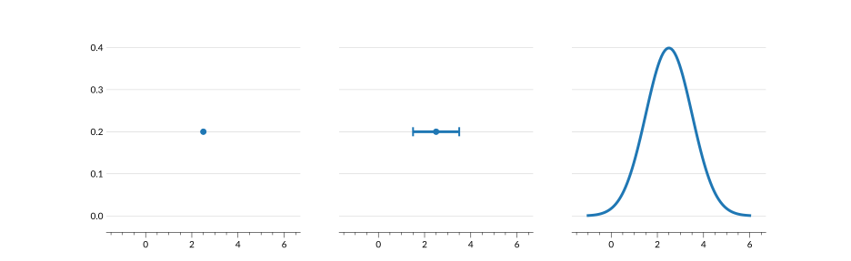
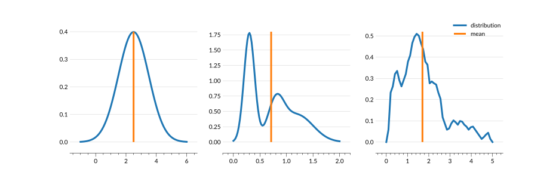
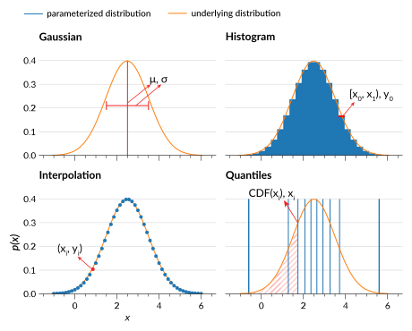

# `qp` Primer

Often data is provided as a single number, or a number with some error bars, but in reality that number could be a variety of possible values with different probabilities. For example, in the plot below we see how a data point with error bars could be representing the underlying Gaussian distribution, which itself represents all of the values the data point could possibly take.



While there exist a variety of simple formulae to describe the distribution of outcomes in certain specific situations, for example the Gaussian used above, more complex situations require more complex representations. Real life data is messy and cannot always be reduced down to a simple function. Representing such a complex distribution with "single-point statistics" like the mean, median, and mode, cannot provide the full picture. In fact, these measures can even be misleading.



To represent such complex distributions can then become a hassle, requiring you to keep track of multiple numbers per distribution. `qp` helps you tackle this complexity by providing you with a number of ways to represent large numbers of real-life distributions in a consistent way.

## Statistics Refresher

The power of `qp` is that regardless of how you parameterize your distribution, you will be able to access common statistical properties in the same way.

The underlying information about a distribution within `qp` is data that represents either a **Probability Density Function (PDF)** or **Cumulative Distribution Function (CDF)**.

```{figure} ../assets/primer-PDF-norm.svg
:alt: Plot of the PDF of a normal distribution
```

The PDF gives the probability of a random variable falling within a range of values. For a given outcome range {math}`(x_0, x_1)`:

```{math}
P = \int_{x_0}^{x_1} p(x') dx'

```

is the relative probability that a random variable would provide an outcome within that range. Such a function has the following qualities:

- always be positive, since an outcome can't have a negative probability
- normalized, because the overall probability that one of the outcomes happens is 1

For a more detailed explanation see [the Wikipedia page](https://en.wikipedia.org/wiki/Probability_density_function).

```{figure} ../assets/primer-CDF-norm.svg
:alt: Plot of the CDF of a normal distribution
```

The CDF is essentially the integral of the PDF. The CDF at a given $x$ value is the probability that the outcome is less than or equal to {math}`x` as described by:

```{math}
P(x) = \int_{-\infty}^{x} p (x')dx'
```

Thus the minimum of the CDF is 0 at the minimum $x$ value, and from there it must be a non-decreasing, one-to-one function that reaches its maximum value of 1 at the maximum $x$ value. For a more detailed explanation see [the Wikipedia page](https://en.wikipedia.org/wiki/Cumulative_distribution_function).

### Other Useful Distribution Properties

While the PDF and the CDF are the main methods used in `qp` to parameterize a distribution, there are other functions that can be derived for these distributions that are useful, and are available in `qp`. We provide a quick explanation of these functions below:

- [percent point function (PPF)](#ppf)
- [survival function (SF)](#sf)
- [inverse survival function (ISF)](#isf)

(ppf)=

#### Percent Point Function (PPF)

The percent point function (PPF) is the inverse of the CDF, which is defined as $CDF^{-1}(x)$. It returns the outcome {math}`x` which has a probability less than or equal to the given probability, essentially reversing the independent and dependent variables from the CDF. This means that the distribution of input values is limited to the range [0,1]. This function can be easily used to return the quantiles of a given distribution. For more details see [the Wikipedia page](https://en.wikipedia.org/wiki/Quantile_function).

```{warning}

Within the `qp` code, values returned at PPF(0) and PPF(1) are set as the *possible* boundaries of the distributions, and will not correspond to individual distributions. For example, PPF(0) of a normal distribution is always negative infinity.

```

```{figure} ../assets/primer-PPF-norm.svg
:alt: Plot of the PPF of a normal distribution
```

(sf)=

#### Survival Function (SF)

The survival function (SF) is also known as the complementary cumulative distribution function. It is defined as {math}`SF(x) = 1 - CDF(x)`, so that it returns the probability that an outcome is greater than the given outcome {math}`x`. For a more detailed explanation see [the Wikipedia page](https://en.wikipedia.org/wiki/Survival_function).

```{figure} ../assets/primer-SF-norm.svg
:alt: Plot of the SF of a normal distribution
```

(isf)=

#### Inverse Survival Function (ISF)

The inverse survival function (ISF) serves the same purpose for the survival function as the PPF does for the CDF. It provides the outcome {math}`x` that has a probability greater than the given probability. The ISF is equivalent to {math}`CDF(1-p)`, where {math}`p` is the given probability.

```{figure} ../assets/primer-ISF-norm.svg
:alt: Plot of the ISF of a normal distribution
```

## Parameterizations

A **parameterization** in `qp` refers to how a distribution of outcomes is represented. For example, in the above sample plots, the distribution functions (PDF, CDF, etc) are applied to an analytic function called the normal distribution. This analytic parameterization is one way of representing this distribution of outcomes, and has parameters "mean" and "standard deviation". However, there are other ways to parameterize the same distribution.

The figure below shows the same normal distribution parameterized in each of the four ways supported by `qp`:



Gaussian mixture model
: parameters are means and standard deviations of each Gaussian component

Histogram
: parameters are bin edges and bin values

Interpolation
: parameters are a set of $x$ and $y$ values

Quantiles
: parameters are the quantiles and the corresponding locations or $x$ values

In the case of a normal distribution, the analytic parameterization is clearly superior, as it contains the most accurate information in the least number of parameters. However, for the more complex, real-life distributions, the other parameterizations can provide more accuracy than attempting to fit to an analytic function. There is a trade-off for all of these parameterizations in that the more parameters, the more accurately your distribution will be represented, but the slower those distributions will be to work with and store.

For a more detailed discussion of the workings of each of the main parameterizations and their pros and cons, see their documentation pages:

- [**Gaussian mixture model**](./parameterizations/mixmod.md)
- [**Histogram**](./parameterizations/hist.md)
- [**Interpolation**](./parameterizations/interp.md)
- [**Irregular Interpolation**](./parameterizations/irregularinterp.md)
- [**Quantiles**](./parameterizations/quant.md)

`qp` also supports all of the continuous <inv:#scipy.stats> distributions, as described in more detail in <project:./parameterizations/index.md>. For more information on a specific distribution and its parameters, see its <inv:#scipy.stats> documentation.

```{note}

There exist additional parameterizations, however they are in various stages of completeness and are not guaranteed to work with all of the functions described in the documentation. For more information about these parameterizations see the parameterization [API documentation](#qp.parameterizations.hist.hist.hist_gen).

```
