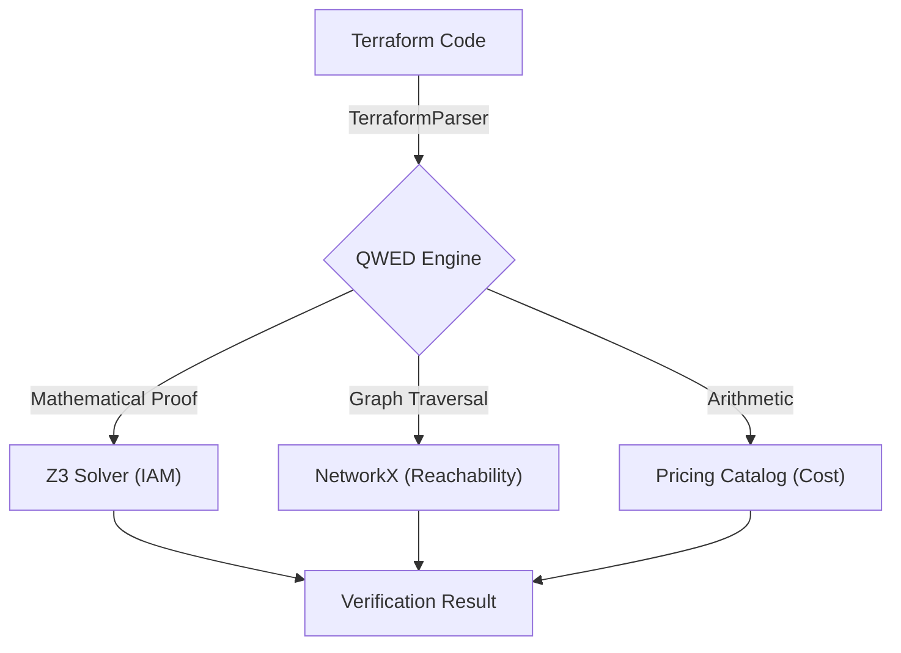

# QWED-Infra ☁️🛡️

**Deterministic Verification for Infrastructure as Code (IaC)**

[](https://github.com/QWED-AI/qwed-infra)
[](https://pypi.org/project/qwed-infra/)
[](LICENSE)
[](https://www.python.org/)

> Part of the [QWED Ecosystem](https://github.com/QWED-AI) - Verification Infrastructure for AI

---

## 🎯 What is QWED-Infra?

`qwed-infra` is a Python library that uses **Formal Methods (Z3 Solver)** and **Graph Theory** to mathematically prove the security and compliance of detailed infrastructure definitions (Terraform, AWS IAM, Kubernetes). It prevents AI agents (like Devin or Copilot Workspace) from deploying insecure or expensive infrastructure.

---

## 🚀 Features

### 1. 🛡️ IamGuard (Implemented)
Verifies AWS IAM Policies using the **Z3 Theorem Prover**.
Instead of regex matching, it converts policies into logical formulas to prove reachability.

- **Wildcard Logic:** Correctly handles `s3:*`, `bucket/*`.
- **Conditions:** Supports `aws:SourceIp` (CIDR), `aws:CurrentTime` (Date), `StringEquals`.
- **Deny Overrides:** Proves that explicit Deny statements always override Allows.
- **Least Privilege:** Mathematically proves if a policy allows stronger permissions than intended.

### 2. 🌐 NetworkGuard (Implemented)
Verifies Network Reachability using **Graph Theory** (NetworkX).

- **Public Access Check:** Validates if `Internet -> IGW -> Route -> Security Group -> Instance` path exists.
- **Port Verification:** Ensures critical ports (22, 3389) are not exposed to 0.0.0.0/0.

### 3. 💰 CostGuard (Implemented)
Deterministic Cloud Cost estimation before deployment.

- **Budget Enforcement:** Blocks deployment if estimated monthly cost > Budget.
- **GPU Control:** Detects expensive instances (e.g., `p4d.24xlarge`) to prevent $20k+ surprises.
- **Static Pricing:** Embedded pricing catalog for standard AWS types.

---

## 📦 Installation

```bash
pip install qwed-infra
```

---

## ⚡ Usage

### 1. Parsing Real Terraform Files

```python
from qwed_infra import TerraformParser, IamGuard 

# Parse a real Terraform directory
parser = TerraformParser()
resources = parser.parse_directory("./terraform/prod")

# Verify IAM Policies found in Terraform
guard = IamGuard()

for policy in resources.get("policies", []):
    # Context-Aware Verification
    result = guard.verify_access(
        policy, 
        action="s3:GetObject", 
        resource="*",
        context={"aws:SourceIp": "192.168.1.5"} # Corporate VPN Only
    )
    print(f"Policy {policy['id']} allows VPN access? {result.allowed}")
```

### 2. Verifying Cloud Costs

```python
from qwed_infra import CostGuard

cost = CostGuard()

# Define resources (or parse from Terraform)
resources = {
    "instances": [
        {"id": "web-cluster", "instance_type": "t3.micro", "count": 2},
        {"id": "gpu-trainer", "instance_type": "p4d.24xlarge", "count": 1} # $32/hr!
    ]
}

# Check against budget
result = cost.verify_budget(resources, budget_monthly=500.0)

print(f"Within Budget? {result.within_budget}") # -> False
print(f"Total: ${result.total_monthly_cost:.2f}") # -> ~$23,900
print(f"Reason: {result.reason}")
```

### 3. Verifying Network Reachability

```python
from qwed_infra import NetworkGuard

net_guard = NetworkGuard()

# Graph-based Verification
# (Normally parsed from TF, here shown as dict structure)
infra = {
    "subnets": [
        {"id": "public-subnet", "security_groups": ["sg-web"]}
    ],
    "route_tables": [
        {"subnet_id": "public-subnet", "routes": {"0.0.0.0/0": "igw-main"}}
    ],
    "security_groups": {
        "sg-web": {"ingress": [{"port": 80, "cidr": "0.0.0.0/0"}]}
    }
}

# Is Web Accessible?
res = net_guard.verify_reachability(infra, "internet", "public-subnet", 80)
print(f"Internet Reachable? {res.reachable}") # -> True
```

---

## 🏗️ Architecture



---

## 🤝 Contributing

We welcome contributions! Please see `CONTRIBUTING.md`.

---

## 📄 License

Apache 2.0 - See [LICENSE](LICENSE)

---

<div align="center">

**Built with ❤️ by [QWED-AI](https://github.com/QWED-AI)**

[](https://x.com/rahuldass29)

</div>
