<div align="center">

# 💸 QWED-Tax
**Deterministic Verification for Payroll, Tax, and Compliance**

> "Death, Taxes, and Deterministic Verification."

[](https://github.com/QWED-AI/qwed-tax)
[](https://pypi.org/project/qwed-tax/)
[](LICENSE)
[](https://www.python.org/)

</div>

---

## 🚨 The Problem: AI Hallucinations in Tax
AI agents are handling payroll and tax, but **LLMs are largely illiterate in tax law.**

## 🏗️ Architecture: The "Swiss Cheese" Defense

```mermaid
graph TD
    A["🤖 AI Agent"] -->|"1. Intent (Pay/Tax)"| B{"🛡️ QWED-Tax Pre-Flight"}
    B -->|Check| C[ClassificationGuard]
    B -->|Check| D[NexusGuard]
    B -->|Check| E[PayrollGuard]
    C & D & E -->|"2. Audit Result"| B
    B -- "✅ Verified" --> F["🚀 Fintech API (Avalara/Gusto)"]
    B -- "🛑 Blocked" --> G["🚫 Stop & Throw Error"]
    
    style B fill:#00C853,stroke:#333,stroke-width:2px,color:white
    style G fill:#ff4444,stroke:#333,stroke-width:2px,color:white
```



### ⚔️ Why QWED-Tax?
Unlike calculators (Avalara) or executors (Gusto), QWED is a **Verifier**. We sit *between* the AI and the Execution.

### ⚔️ Why QWED-Tax?

| Solution | What They Do | The Risk | QWED's Role |
| :--- | :--- | :--- | :--- |
| **Avalara / Stripe** | **Calculate** tax based on inputs. | Garbage In, Garbage Out. If AI sends wrong input, tax is wrong. | **The Filter:** We verify inputs *before* API calls. |
| **Gusto / Check** | **Execute** payments and filings. | They execute erroneous commands (e.g., paying a W-2 as 1099). | **The Shield:** We block illegal payments *before* execution. |
| **Blue J / ChatGPT** | **Research** tax law. | Hallucination (85% accuracy). | **The Proof:** We verify the math & logic deterministically. |

### 📊 Real World Failures We Blocked (From Audit Logs)
| Scenario | LLM Hallucinations | QWED Verdict |
| :--- | :--- | :--- |
| **Senior Citizen FD** | "Base 7% + 0.5% = 7.50000001%" (Float Error) | 🛑 **BLOCKED** (Exact 7.50%) |
| **Loss Set-Off** | "Set off Intraday Loss against Salary" | 🛑 **BLOCKED** (Illegal Inter-head adjustment) |
| **Crypto Tax** | "Deduct Bitcoin loss from Business Profit" | 🛑 **BLOCKED** (Sec 115BBH violation) |
| **Payroll** | "FICA Tax on $500k = $31,000" | 🛑 **BLOCKED** (Limit is $176k / ~$10k tax) |

## 💡 What QWED-Tax Is
A deterministic verification layer for tax logic supported by `z3-solver` and `python-decimal`. It supports multiple jurisdictions.

| Feature | US Jurisdiction (IRS) 🇺🇸 | India Jurisdiction (CBDT) 🇮🇳 |
| :--- | :--- | :--- |
| **Engine** | `z3` (ABC Test), `decimal` | `z3` (Intraday Rules), `decimal` |
| **Key Guards** | Payroll, FICA Limit, W-2/1099 | Sec 115BBH (Crypto), GST (RCM) |
| **Status** | ✅ Production Ready | ✅ Production Ready |

## 🛡️ The Guards

### 🇺🇸 United States (IRS)
1.  **PayrollGuard**: Verifies Gross-to-Net logic and enforces **2025 FICA Limit** ($176,100).
2.  **ClassificationGuard (IRS Common Law)**: Uses deterministic rules to verify W-2 vs 1099 status.
3.  **ReciprocityGuard**: Deterministically verifies state tax withholding (NY vs NJ rules).
4.  **NexusGuard**: Verifies **Economic Nexus** thresholds ($100k/$500k sales) to catch missing tax liabilities.

### 🇮🇳 India (Income Tax / GST)
1.  **CryptoTaxGuard**: Enforces **Section 115BBH** (No set-off of VDA losses).
2.  **InvestmentGuard**: Distinguishes **Intraday (Speculative)** from **Delivery (Capital Gains)** using strict rules.
3.  **GSTGuard**: Verifies **Reverse Charge Mechanism (RCM)** for GTA/Legal services.

## 📦 Installation

```bash
pip install qwed-tax
```

## ⚡ Usage
```python
from qwed_tax.verifier import TaxVerifier

# 1. US FICA Check
us_tax = TaxVerifier(jurisdiction="US")
# ... usage (facade methods to be added or verified) ...
# Note: For strict typing, direct guard access is also fine.

from qwed_tax.jurisdictions.us import PayrollGuard
pg = PayrollGuard()
result = pg.verify_fica_tax(gross_ytd=180000, current=5000, claimed_tax=310)
print(result.message) 
# -> "❌ FICA Error: Expected $68.20 (Hit Limit)"

# 2. India Crypto Check
in_tax = TaxVerifier(jurisdiction="INDIA")
res = in_tax.verify_india_crypto(losses={"VDA": -5000}, gains={"BUSINESS": 50000})
print(res.message) 
# -> "⚠️ Section 115BBH Alert: VDA loss cannot be set off."

# 3. Pre-Flight Check (Agentic Finance)
from qwed_tax.verifier import TaxPreFlight

preflight = TaxPreFlight()
report = preflight.audit_transaction({
    "worker_type": "1099",
    "worker_facts": {"provides_tools": True, "reimburses_expenses": True}, # Employee traits
    "state": "NY", 
    "sales_data": {"amount": 600000} # Crosses Nexus
})

if not report["allowed"]:
    print(f"🛑 BLOCKED: {report['blocks']}")
```
