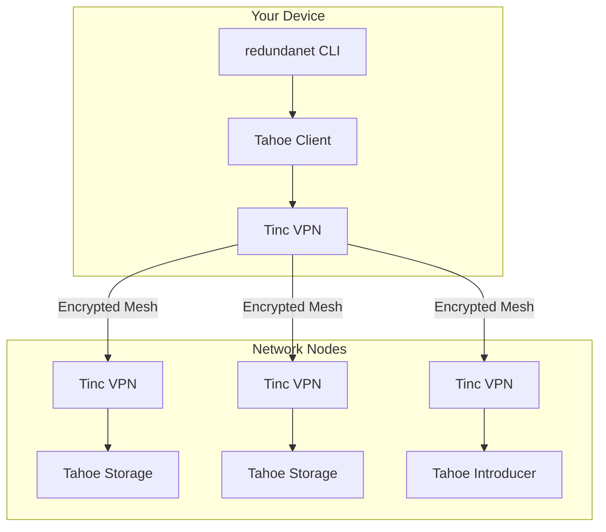

# RedundaNet - Distributed Encrypted Storage Network

[](https://github.com/adefilippo83/redundanet/actions/workflows/ci.yml)
[](https://pypi.org/project/redundanet/)
[](LICENSE)

RedundaNet is a distributed, encrypted storage system built on a secure mesh VPN network. It enables users to contribute storage resources to a collective grid while maintaining privacy through end-to-end encryption.

**Website**: [https://redundanet.com](https://redundanet.com)

## Features

- **Decentralized Architecture**: No central authority or single point of failure
- **End-to-End Encryption**: Data is encrypted before leaving your device using Tahoe-LAFS
- **GPG-Based Authentication**: Secure node identity verification via public keyservers
- **Private Networking**: Secure Tinc mesh VPN isolates the storage network
- **Erasure Coding**: Data is split and distributed across multiple nodes (3-of-10 scheme)
- **Open Membership**: Anyone can apply to join the network
- **Containerized Deployment**: Easy setup with Docker Compose
- **Raspberry Pi Ready**: Pre-built images for ARM devices

## How It Works

```
┌─────────────────────────────────────────────────────────────────────────┐
│                         RedundaNet Network                              │
│                                                                         │
│    Your File                                                            │
│        │                                                                │
│        ▼                                                                │
│   ┌─────────┐     Encrypted      ┌─────────┐                           │
│   │ Encrypt │ ──────────────────►│  Split  │                           │
│   │  (AES)  │                    │(Erasure)│                           │
│   └─────────┘                    └────┬────┘                           │
│                                       │                                 │
│              ┌────────────────────────┼────────────────────────┐       │
│              ▼            ▼           ▼           ▼            ▼       │
│         ┌───────┐    ┌───────┐   ┌───────┐   ┌───────┐    ┌───────┐   │
│         │Share 1│    │Share 2│   │Share 3│   │  ...  │    │Share10│   │
│         └───┬───┘    └───┬───┘   └───┬───┘   └───┬───┘    └───┬───┘   │
│             │            │           │           │            │        │
│             ▼            ▼           ▼           ▼            ▼        │
│         ┌───────┐    ┌───────┐   ┌───────┐   ┌───────┐    ┌───────┐   │
│         │Node A │    │Node B │   │Node C │   │Node D │    │Node E │   │
│         │ (VPN) │◄──►│ (VPN) │◄─►│ (VPN) │◄─►│ (VPN) │◄──►│ (VPN) │   │
│         └───────┘    └───────┘   └───────┘   └───────┘    └───────┘   │
│                                                                         │
│         Only 3 of 10 shares needed to reconstruct your file            │
└─────────────────────────────────────────────────────────────────────────┘
```

**Key Concepts:**
- **Your data is encrypted** on your device before upload - nodes cannot read your files
- **Erasure coding** splits data across nodes - any 3 of 10 nodes can reconstruct your file
- **Mesh VPN** connects all nodes securely - no central server required
- **GPG keys** verify node identity - published to public keyservers

## Join the Network

Want to contribute storage and join RedundaNet? Here's how:

### 1. Generate and Publish Your GPG Key

```bash
# Install the CLI
pip install redundanet

# Generate a GPG key for your node
redundanet node keys generate --name my-node --email you@example.com

# Publish your key to public keyservers
redundanet node keys publish --key-id YOUR_KEY_ID
```

### 2. Submit Your Application

Visit [redundanet.com/join.html](https://redundanet.com/join.html) and fill out the application form with:
- Your GPG Key ID
- Storage contribution (how much space you'll share)
- Your region
- Device type

This creates a GitHub issue that's automatically processed.

### 3. Wait for Approval

A maintainer will review your application and merge the PR that adds your node to the network manifest.

### 4. Set Up Your Node

Once approved:

```bash
# Clone the repository
git clone https://github.com/adefilippo83/redundanet.git
cd redundanet

# Initialize your node (use the name assigned to you)
redundanet init --name node-XXXXXXXX

# Sync the manifest
redundanet sync

# Start services
docker compose up -d

# Check status
redundanet status
```

## Quick Start (Existing Network Members)

### Prerequisites

- Python 3.11+
- Docker and Docker Compose
- GPG (for key management)

### Installation

```bash
pip install redundanet
```

### Start Services

```bash
# As a storage node (contributes storage)
docker compose --profile storage up -d

# As a client only (uses storage)
docker compose --profile client up -d
```

### Upload and Download Files

```bash
# Upload a file
redundanet storage upload /path/to/file.txt
# Returns: URI:CHK:abc123...

# Download a file
redundanet storage download URI:CHK:abc123... /path/to/output.txt
```

## CLI Commands

```
redundanet --help

Commands:
  init        Initialize a new node
  status      Show node and network status
  sync        Sync manifest from repository
  validate    Validate manifest file

  node        Node management commands
    list      List all nodes in the network
    info      Show detailed node information
    add       Add a new node to manifest
    remove    Remove a node from manifest
    keys      Manage GPG keys (generate, export, import, publish, fetch, list)

  network     Network management
    join      Join an existing network
    leave     Leave the network
    peers     Show connected peers
    vpn       VPN management (start/stop/status)

  storage     Storage management
    status    Show storage status
    mount     Mount Tahoe filesystem
    unmount   Unmount filesystem
    upload    Upload a file
    download  Download a file
```

## Raspberry Pi

Pre-built images are available for Raspberry Pi:

1. Download from [GitHub Releases](https://github.com/adefilippo83/redundanet/releases)
2. Flash to SD card using Raspberry Pi Imager
3. Boot and SSH in: `ssh redundanet@redundanet.local` (password: `redundanet`)
4. Run `redundanet init` to configure

## Architecture



**Components:**
- **Tinc VPN**: Creates encrypted mesh network between all nodes
- **Tahoe-LAFS**: Handles encryption, erasure coding, and distributed storage
- **GPG**: Authenticates node identity via public keyservers
- **Manifest**: YAML file in Git defining network configuration

## Documentation

- [Installation Guide](docs/installation.md)
- [Quick Start Guide](docs/quickstart.md)
- [Configuration Reference](docs/configuration.md)
- [Architecture Overview](docs/architecture.md)

## Development

```bash
# Clone repository
git clone https://github.com/adefilippo83/redundanet.git
cd redundanet

# Install dependencies
make install

# Run tests
make test

# Run linting
make lint

# Run type checking
make type-check
```

## Contributing

1. Fork the repository
2. Create a feature branch (`git checkout -b feature/amazing-feature`)
3. Make your changes
4. Run tests (`make test`) and linting (`make lint`)
5. Commit your changes
6. Push to the branch (`git push origin feature/amazing-feature`)
7. Open a Pull Request

## License

This project is licensed under the MIT License - see the [LICENSE](LICENSE) file for details.

## Acknowledgments

- [Tahoe-LAFS](https://tahoe-lafs.org/) - Distributed storage system
- [Tinc VPN](https://www.tinc-vpn.org/) - Mesh VPN daemon
- [Typer](https://typer.tiangolo.com/) - CLI framework
