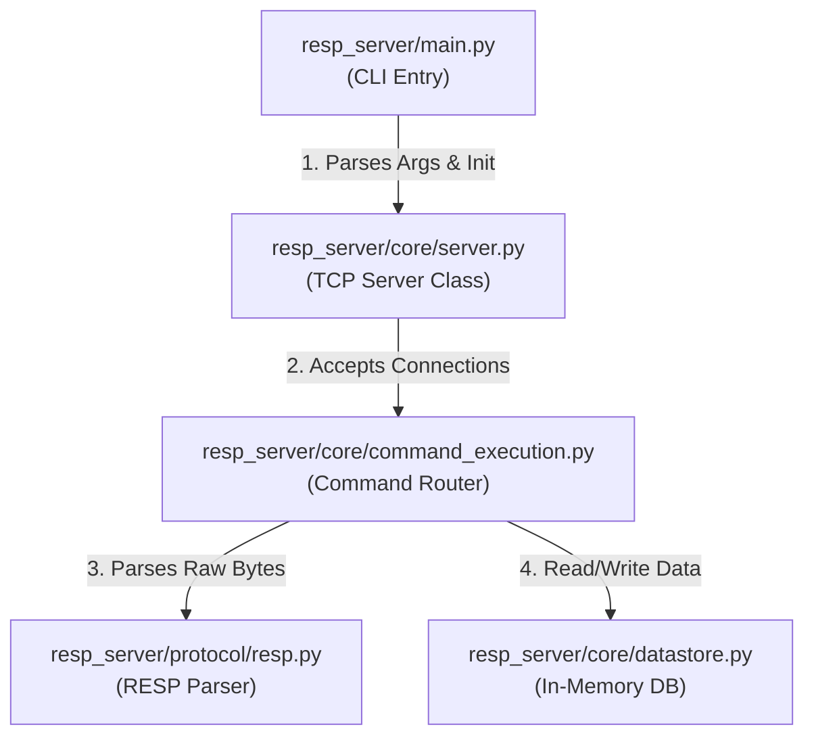

# RESP Server - Embeddable Redis-Compatible Server for Python

[](https://pypi.org/project/resp-server/)
[](https://www.python.org/downloads/)
[](https://github.com/alwaysvivek/redis-python/actions/workflows/ci.yml)
[](https://opensource.org/licenses/MIT)

A lightweight, pure-Python implementation of a Redis-compatible server, designed primarily for **local development and unit testing**.

> [!NOTE]
> **Use Case**: This is an **embedded server** (like SQLite) for your tests. It complements `redis-py` (the client) by giving you a zero-dependency server to connect to without Docker.

## Features

*   **Minimal Dependencies**: Uses `click` for CLI (pure-Python standard library otherwise).
*   **Embeddable**: Run it inside your `pytest` suite without Docker or external Redis installation.
*   **RESP Compatible**: Works with any Redis client library (`redis-py`, `node-redis`, `go-redis`, etc.).
*   **Lite**: Supports Strings, Lists, Streams, Pub/Sub, and Expiration  (Lazy).

## Installation

```bash
pip install resp-server
```

## Quick Start

### 1. Run as a Standalone Server

```bash
# Starts server on port 6379
resp-server --port 6379
```

### 2. Embed in Python Tests (Pytest Example)

You can spin up the server programmatically in your tests/fixtures:

```python
import pytest
import threading
from resp_server.core.server import Server
import redis

@pytest.fixture(scope="session")
def redis_server():
    # Start server in a background thread
    server = Server(port=6399)
    t = threading.Thread(target=server.start, daemon=True)
    t.start()
    yield server
    server.stop()

def test_my_app(redis_server):
    # Connect using standard client
    r = redis.Redis(port=6399, decode_responses=True)
    r.set("foo", "bar")
    assert r.get("foo") == "bar"
```

## Architecture

### Directory Structure

```
resp_server/
├── main.py                      # CLI Entry point
├── core/
│   ├── server.py                # Server Class & TCP logic
│   ├── command_execution.py     # Command Router
│   ├── datastore.py             # In-Memory DB
├── protocol/
│   ├── resp.py                  # RESP Parser
```

### Codebase Structure & Module Interaction



---

## Features & Internals

This section explains *what* each feature is, *how* it works internally, and *how* to use it.

### 1. Redis Serialization Protocol (RESP)
*   **What it is**: The binary-safe protocol Redis uses to communicate.
*   **How it works**: The `RESP Parser` (`resp_server/protocol/resp.py`) reads bytes from the TCP socket, identifying types by their first byte (`+` for strings, `$` for bulk strings, `*` for arrays). It recursively parses nested arrays.
*   **Usage**: Transparent to the user. All clients (`redis-py`, `node-redis`, etc.) speak this automatically.

### 2. Strings & Expiration
*   **What it is**: Basic key-value storage with Time-To-Live (TTL).
*   **How it works**: Values are stored in `DATA_STORE` wrapper dicts: `{'value': ..., 'expiry': timestamp}`. The `get_data_entry` function checks the timestamp on every access (lazy expiry) and deletes the key if expired.
*   **Usage**:
    ```python
    r.set("mykey", "Hello World", px=5000)  # Set with 5s expiry
    r.get("mykey")  # Returns "Hello World"
    ```

### 3. Lists
*   **What it is**: Ordered collections of strings.
*   **How it works**: Stored as Python lists in `DATA_STORE`. Supports push/pop operations from both ends.
*   **Usage**:
    ```python
    r.rpush("mylist", "A", "B", "C")
    r.lrange("mylist", 0, -1)  # Returns ['A', 'B', 'C']
    ```

### 4. Streams
*   **What it is**: An append-only log data structure.
*   **How it works**: Stored in `STREAMS` as a list of entries. `XADD` validates IDs (must be incremental). `XREAD` supports blocking by using a `threading.Condition` variable to put the client thread to sleep until new data arrives.
*   **Usage**:
    ```python
    r.xadd("mystream", {"sensor-id": "1234", "temperature": "19.8"})
    r.xrange("mystream", "-", "+")
    ```

### 5. Pub/Sub
*   **What it is**: Real-time messaging where publishers send messages to channels and subscribers receive them.
*   **How it works**: 
    *   `CHANNEL_SUBSCRIBERS` maps channel names to a Set of client sockets.
    *   When `PUBLISH` is called, the server iterates through the socket list for that channel and writes the message directly to them.
*   **Usage**:
    ```python
    # Client A
    p = r.pubsub()
    p.subscribe("mychannel")
    
    # Client B
    r.publish("mychannel", "Hello Subscribers!")
    ```

### 6. Utility Commands
*   **PING**: Returns `PONG`. Used to test connection health.
*   **ECHO**: Returns the given string. Useful for debugging connectivity.
*   **TYPE**: Returns the type of value stored at a key (`string`, `list`, `stream`, etc.).
*   **KEYS**: Returns a list of keys matching a pattern (only `*` wildcard supported).
*   **CONFIG**: Supports `GET` for retrieving server configuration (e.g., `dir`, `dbfilename`).

---

## Production Readiness Assessment

### ⚠️ Current Status: Embedded / Development Use Only
This project is designed as an **embedded server** for local development and unit testing, similar to SQLite. It is **Not Production Ready** for critical business data.

| Criteria | Status | Notes |
|----------|--------|-------|
| **Stability** | ✅ High | Passes standard `redis-py` integration tests for supported features. |
| **Concurrency** | ⚠️ Medium | Uses threads (good for I/O), but limited by Python GIL for CPU-bound tasks. |
| **Persistence** | ⚠️ Partial | Loads RDB files but does not currently implement background saving (BGSAVE). |
| **Security** | ❌ None | No password authentication (AUTH) or TLS encryption implemented. |
| **Scalability** | ❌ Low | Single-threaded event loop (conceptually) via Python threads; not async/await based. |

---

## Usage Examples

Here are real sample outputs from running the server with `redis-py`:

### Starting the Server

```bash
$ python3 -m resp_server.main --port 6399
RDB file not found at ./dump.rdb, starting with empty DATA_STORE.
Server: Starting server on localhost:6399...
Server: Listening for connections...
```

### Basic Operations with redis-py

```python
import redis
import time

r = redis.Redis(port=6399, decode_responses=True)

# Connection test
print(f'PING -> {r.ping()}')
# Output: PING -> True

# String operations
print(f'SET mykey "Hello World" -> {r.set("mykey", "Hello World")}')
# Output: SET mykey "Hello World" -> True

print(f'GET mykey -> {r.get("mykey")}')
# Output: GET mykey -> Hello World

# Expiration
print(f'SET temp "I expire in 2s" PX 2000 -> {r.set("temp", "I expire in 2s", px=2000)}')
# Output: SET temp "I expire in 2s" PX 2000 -> True

print(f'GET temp -> {r.get("temp")}')
# Output: GET temp -> I expire in 2s

time.sleep(2.1)
print(f'GET temp (after 2.1s) -> {r.get("temp")}')
# Output: GET temp (after 2.1s) -> None

# List operations
print(f'RPUSH mylist A B C -> {r.rpush("mylist", "A", "B", "C")}')
# Output: RPUSH mylist A B C -> 3

print(f'LRANGE mylist 0 -1 -> {r.lrange("mylist", 0, -1)}')
# Output: LRANGE mylist 0 -1 -> ['A', 'B', 'C']
```

---

## Testing

Run the test suite to verify functionality:

```bash
# Install test dependencies
pip install pytest redis

# Run tests
pytest tests/
```

**Sample Output:**
```
============================= test session starts ==============================
collected 13 items

tests/test_datastore.py ........                                         [ 61%]
tests/test_integration.py ...                                            [ 84%]
tests/test_protocol.py ..                                                [100%]

============================== 13 passed in 2.45s ===============================
```

---

## Project Origin

This project was built as part of the [CodeCrafters Redis Challenge](https://codecrafters.io/challenges/redis), extended with additional features for portfolio purposes.

## License

MIT License - see [LICENSE](LICENSE) file for details.

## Changelog

### v0.2.3
*   Refactored CLI to use `click` library for robust argument parsing.

