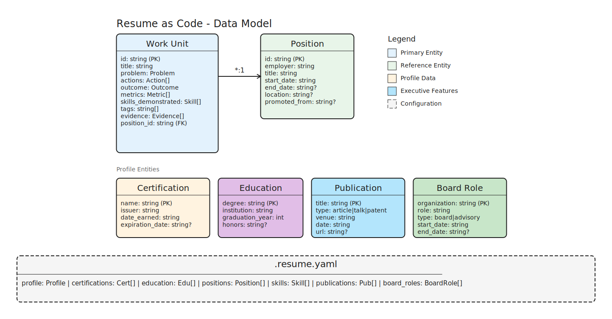

# Data Model Reference

This document describes the entities that power Resume as Code. Each entity is stored in YAML format and validated against a Pydantic schema.

---

## Entity Overview

| Entity | Storage | Purpose |
|--------|---------|---------|
| [Work Unit](#work-unit) | `work-units/*.yaml` | Individual accomplishments |
| [Position](#position) | `positions.yaml` | Employment history |
| [Profile](#profile) | `profile.yaml` | Contact and header info |
| [Certification](#certification) | `certifications.yaml` | Professional credentials |
| [Education](#education) | `education.yaml` | Academic credentials |
| [Publication](#publication) | `publications.yaml` | Articles and speaking |
| [Board Role](#board-role) | `board-roles.yaml` | Advisory positions |
| [Career Highlight](#career-highlight) | `highlights.yaml` | Executive summary bullets |

> **Note**: As of schema v3.0.0, resume data is stored in separate YAML files rather than embedded in `.resume.yaml`. Run `resume migrate` to upgrade existing projects.



---

## Work Unit

The **Work Unit** is the core entity — a documented instance of applied capability. It captures what you did, why it mattered, and what resulted.

### File Location

```
work-units/
├── wu-2024-06-15-cicd-pipeline.yaml
├── wu-2024-03-22-security-audit.yaml
└── wu-2023-11-08-team-scaling.yaml
```

### Schema

```yaml
# Required fields
id: wu-2024-06-15-cicd-pipeline      # Pattern: wu-YYYY-MM-DD-slug
title: "Reduced deployment time by 80%"  # 10-200 characters
problem:
  statement: "Manual deployment took 4 hours"  # Min 20 chars
  constraints: []                               # Optional
  context: null                                 # Optional
actions:
  - "Designed CI/CD pipeline with GitHub Actions"  # Min 10 chars each
outcome:
  result: "Deployment time reduced to 48 minutes"  # Min 10 chars
  quantified_impact: "80% reduction"               # Optional
  business_value: "Daily deploys vs weekly"        # Optional
  confidence: exact                                # Optional: exact|estimated|approximate|order_of_magnitude
  confidence_note: "Measured via CI logs"          # Optional

# Optional time range
time_started: 2024-03-01
time_ended: 2024-06-15

# Position reference (for grouping under employer)
position_id: pos-techcorp-senior-engineer

# Skills and metadata
skills_demonstrated:
  - name: "CI/CD"
    onet_element_id: "2.A.1.a"    # O*NET taxonomy ID
    proficiency_level: 6          # 1-7 scale
tags:
  - devops
  - automation
  - github-actions
confidence: high                   # Overall: high|medium|low
evidence:
  - type: git_repo
    url: https://github.com/example/cicd
    branch: main
    commit_sha: abc123
    description: "Pipeline implementation"

# Executive-level fields
scope:
  budget_managed: "$2M"
  team_size: 12
  revenue_influenced: null
  geographic_reach: "North America"
impact_category:
  - operational
  - financial
metrics:
  baseline: "4 hours"
  outcome: "48 minutes"
  percentage_change: -80.0
framing:
  action_verb: "Accelerated"
  strategic_context: "Digital transformation initiative"

schema_version: "1.0.0"
```

### Key Concepts

**PAR Framework**: Every Work Unit follows Problem-Action-Result:

| Component | Purpose | Example |
|-----------|---------|---------|
| **Problem** | Context and challenge | "Manual deployments took 4 hours" |
| **Actions** | Your specific contributions | "Built CI/CD pipeline" |
| **Outcome** | Quantified results | "80% time reduction" |

**Position Reference**: Work Units link to Positions via `position_id`. This enables grouping accomplishments under employers in the rendered resume.

**Evidence**: Supports multiple evidence types for verification:
- `git_repo` — Code repository links
- `metrics` — Dashboard/metric references
- `document` — Publications, RFCs
- `artifact` — Releases, packages
- `other` — Catch-all

---

## Position

**Positions** represent your employment history — employers, titles, and dates. Work Units reference positions to group achievements by employer.

### File Location

```
positions.yaml   # Single file with all positions
```

### Schema

```yaml
- id: pos-techcorp-senior-engineer     # Unique identifier
  employer: "TechCorp Industries"
  title: "Senior Platform Engineer"
  location: "Austin, TX"               # Optional
  start_date: "2022-01"                # YYYY-MM format
  end_date: null                       # null = current position
  employment_type: full-time           # full-time|part-time|contract|consulting|freelance
  promoted_from: pos-techcorp-engineer # For tracking promotions
  description: "Led platform team..."  # Optional summary

  # Executive scope indicators
  scope:
    revenue: "$500M"
    team_size: 150
    direct_reports: 8
    budget: "$50M"
    pl_responsibility: "$200M"
    geography: "Global"
    customers: "Fortune 500"
```

### Relationship to Work Units

```
Position (1) ←── references ──← Work Units (*)
```

The resume generator groups Work Units under their positions:

```
TechCorp Industries - Senior Platform Engineer (2022-Present)
• Achievement from work unit 1
• Achievement from work unit 2
• Achievement from work unit 3
```

### Position ID Convention

Auto-generated as `pos-{employer-slug}-{title-slug}`:

| Employer | Title | Generated ID |
|----------|-------|--------------|
| TechCorp Industries | Senior Engineer | `pos-techcorp-senior-engineer` |
| Startup XYZ | Software Developer | `pos-startup-xyz-software-developer` |

---

## Profile

**Profile** stores your contact information and professional header.

### File Location

```
profile.yaml
```

### Schema

```yaml
name: "Joshua Magady"
email: "joshua@example.com"
phone: "+1-555-123-4567"
location: "Austin, TX"
linkedin: https://linkedin.com/in/jmagady
github: https://github.com/jmagady
website: https://jmagady.dev
title: "Chief Technology Officer"
summary: "Technology executive with 15+ years..."
```

### Required Fields

Only `name` is required. All other fields are optional.

---

## Certification

**Certifications** store professional credentials with expiration tracking.

### File Location

```
certifications.yaml
```

### Schema

```yaml
- name: "CISSP"
    issuer: "ISC2"
    date: "2023-06"           # YYYY-MM
    expires: "2026-06"        # YYYY-MM, optional
    credential_id: "123456"   # Optional
    url: https://isc2.org/... # Optional verification link
    display: true             # Hide without deleting
```

### Expiration Status

The `list certifications` command shows status based on expiration:

| Status | Condition |
|--------|-----------|
| **Active** | No expiration or > 90 days remaining |
| **Expires Soon** | Within 90 days |
| **Expired** | Past expiration date |

### Display Format

```
CISSP (ISC2, 2023 - expires 2026)
AWS Solutions Architect (Amazon, 2024)
```

---

## Education

**Education** stores academic credentials.

### File Location

```
education.yaml
```

### Schema

```yaml
- degree: "BS Computer Science"
    institution: "UT Austin"
    year: "2012"              # YYYY format
    honors: "Magna Cum Laude" # Optional
    gpa: "3.8/4.0"            # Optional
    display: true             # Hide without deleting
```

### Display Format

```
BS Computer Science, UT Austin, 2012 - Magna Cum Laude
MBA, Harvard Business School, 2018
```

---

## Publication

**Publications** store articles, conference talks, and other thought leadership.

### File Location

```
publications.yaml
```

### Schema

```yaml
- title: "Building Resilient CI/CD Pipelines"
    type: conference         # conference|article|whitepaper|book|podcast|webinar
    venue: "DevOpsDays Austin"
    date: "2024-03"          # YYYY-MM
    url: https://...         # Optional
    display: true            # Hide without deleting
```

### Publication Types

| Type | Category | Display Format |
|------|----------|----------------|
| `conference` | Speaking | "DevOpsDays Austin (2024) - Building Resilient CI/CD" |
| `podcast` | Speaking | "Podcast Name (2024) - Episode Title" |
| `webinar` | Speaking | "Platform (2024) - Topic" |
| `article` | Written | "Article Title, Publication Name (2024)" |
| `whitepaper` | Written | "Paper Title, Publisher (2024)" |
| `book` | Written | "Book Title, Publisher (2024)" |

---

## Board Role

**Board Roles** store board and advisory positions for executive resumes.

### File Location

```
board-roles.yaml
```

### Schema

```yaml
- organization: "TechStars Austin"
    role: "Technical Advisor"
    type: advisory           # director|advisory|committee
    start_date: "2023-01"    # YYYY-MM
    end_date: null           # null = current
    focus: "Security mentorship"  # Optional
    display: true            # Hide without deleting
```

### Board Role Types

| Type | Description |
|------|-------------|
| `director` | Board of Directors member |
| `advisory` | Advisory board member |
| `committee` | Committee membership |

---

## Career Highlight

**Career Highlights** store top-line achievements for executive summary sections.

### File Location

```
highlights.yaml
```

### Schema

```yaml
- text: "Led $500M digital transformation across 3 business units"
- text: "Built and scaled engineering org from 15 to 150 engineers"
- text: "Achieved 99.99% platform availability for Fortune 100 clients"
```

---

## Configuration (.resume.yaml)

The `.resume.yaml` file contains project settings and preferences. As of v3.0.0, resume data (profile, certifications, etc.) is stored in separate files.

### Full Schema

```yaml
# Schema version (required for v3+)
schema_version: "3.0.0"

# Output settings
output_dir: ./dist
default_format: both         # pdf|docx|both
default_template: modern

# Work unit location
work_units_dir: ./work-units

# Position storage
positions_path: ./positions.yaml

# Ranking algorithm weights
scoring_weights:
  bm25_weight: 1.0           # Keyword matching weight
  semantic_weight: 1.0       # Semantic similarity weight
  title_weight: 1.0          # Title field boost
  skills_weight: 1.0         # Skills field boost
  experience_weight: 1.0     # Experience field boost

# Selection defaults
default_top_k: 8             # Work units to select

# Editor for interactive mode
editor: vim                  # Falls back to $EDITOR

# Skills curation
skills:
  max_display: 15            # Max skills to show
  exclude:                   # Skills to never show
    - "Microsoft Office"
  prioritize:                # Skills to show first
    - "Kubernetes"
    - "AWS"

# Publication curation
curation:
  publications_max: 3        # Max publications to include
  min_relevance_score: 0.1   # Minimum score threshold

# Employment continuity mode
employment_continuity: minimum_bullet  # minimum_bullet|allow_gaps

# Template options
template_options:
  group_employer_positions: true  # Group multiple positions at same employer

# Tailored resume notice
tailored_notice: false
tailored_notice_text: null   # Custom notice text
```

### Data Files (v3.0.0+)

Resume data is stored in these separate files:

| File | Content |
|------|---------|
| `profile.yaml` | Contact info, title, summary |
| `certifications.yaml` | Professional credentials |
| `education.yaml` | Academic credentials |
| `publications.yaml` | Articles and speaking |
| `board-roles.yaml` | Advisory positions |
| `highlights.yaml` | Career summary bullets |

### Migration from v2

Projects with embedded data in `.resume.yaml` should migrate:

```bash
# Check migration status
resume migrate --status

# Preview changes (dry run)
resume migrate --dry-run

# Apply migration
resume migrate
```

The migration:
1. Creates backup of existing files
2. Extracts embedded data to separate files
3. Updates schema_version to 3.0.0
4. Removes data from .resume.yaml (keeps config only)

### Backward Compatibility

The data loader supports cascading lookup:
1. Check dedicated file (e.g., `profile.yaml`)
2. Fall back to embedded in `.resume.yaml` (v2 style)

This allows gradual migration.

---

## Entity Relationships

```
.resume.yaml (config only)
└── schema_version, output settings, scoring weights

profile.yaml ─────────────── Resume header/contact
certifications.yaml ─────── Professional credentials
education.yaml ─────────────── Academic credentials
publications.yaml ─────────── Articles and speaking
board-roles.yaml ───────────── Advisory positions
highlights.yaml ────────────── Career summary bullets

positions.yaml
└── positions (*) ←─── references ───┐
                                     │
work-units/*.yaml                    │
└── work_units (*) ──────────────────┘
         │
         └── position_id
```

### Key Relationships

1. **Work Unit → Position**: Work Units reference positions via `position_id` for grouping
2. **Position → Position**: Positions can reference `promoted_from` for career progression
3. **Data Files**: Each data type has its own file, loaded by the data_loader module

---

## Validation

All entities are validated against Pydantic schemas:

```bash
# Validate all Work Units
resume validate

# Include position reference validation
resume validate --check-positions

# Validate content quality (weak verbs, quantification)
resume validate --content-quality
```

### Common Validation Errors

| Error | Cause | Fix |
|-------|-------|-----|
| `id pattern mismatch` | Invalid Work Unit ID format | Use `wu-YYYY-MM-DD-slug` |
| `statement too short` | Problem statement < 20 chars | Add more context |
| `action too short` | Action < 10 characters | Be more specific |
| `date format invalid` | Date not in YYYY-MM | Convert to YYYY-MM |
| `position_id not found` | Referenced position missing | Create position first |

---

*Next: [Workflow Guide](./workflow.md) — Learn the Capture → Build pipeline.*
