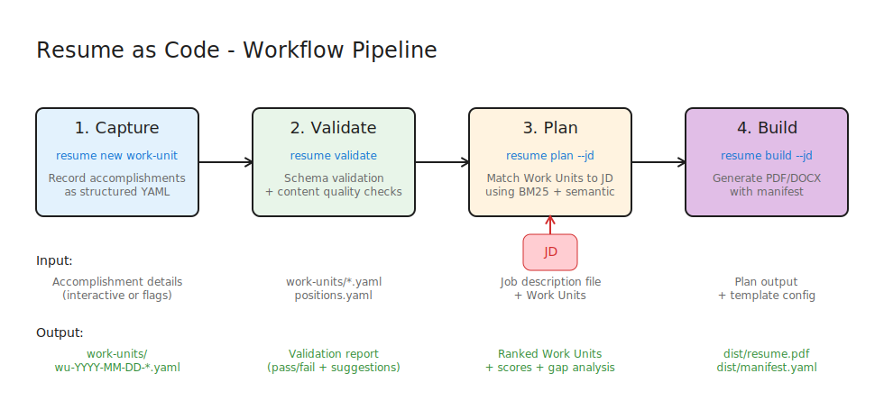

# Workflow Guide

Resume as Code follows a four-stage pipeline: **Capture → Validate → Plan → Build**. This guide walks through each stage.



---

## Pipeline Overview

| Stage | Command | Purpose |
|-------|---------|---------|
| **Capture** | `resume new work-unit` | Record accomplishments as structured data |
| **Validate** | `resume validate` | Verify data quality and completeness |
| **Plan** | `resume plan --jd file.txt` | Select and rank Work Units for a job |
| **Build** | `resume build --jd file.txt` | Generate tailored PDF/DOCX output |

---

## Stage 1: Capture

**Goal**: Record accomplishments right after they happen, while details are fresh.

### When to Capture

The best time to create a Work Unit is immediately after an accomplishment:
- Shipped a major feature
- Led a successful project
- Resolved a critical incident
- Achieved measurable results

### Commands

```bash
# Interactive mode (opens editor with template)
resume new work-unit

# With archetype template for common scenarios
resume new work-unit --archetype greenfield
resume new work-unit --archetype incident
resume new work-unit --archetype optimization

# Quick capture with key fields
resume new work-unit \
  --title "Reduced API latency by 60%" \
  --problem "P99 latency exceeded SLO" \
  --action "Implemented Redis caching layer" \
  --result "Latency dropped from 500ms to 200ms"
```

### Creating Positions First

Work Units reference Positions. Create positions before work units:

```bash
# Create a new position
resume new position "TechCorp|Senior Engineer|2022-01|"

# Or interactively
resume new position

# Then create work unit linked to position
resume new work-unit \
  --position-id pos-techcorp-senior-engineer \
  --title "Led cloud migration"
```

### Inline Position Creation

For convenience, create both in one command:

```bash
resume new work-unit \
  --position "Acme Corp|Platform Lead|2023-06|" \
  --title "Built multi-region deployment system"
```

### Archetype Templates

Archetypes provide pre-filled templates for common achievement types:

| Archetype | Use Case |
|-----------|----------|
| `greenfield` | New system/feature built from scratch |
| `incident` | Production incident response |
| `optimization` | Performance or cost optimization |
| `migration` | System/data migration projects |
| `leadership` | Team building and mentorship |
| `transformation` | Large-scale organizational change |
| `strategic` | Strategic initiatives and planning |
| `cultural` | Culture and values initiatives |
| `minimal` | Quick capture with basic structure |

### Output

Work Units are saved as individual YAML files:

```
work-units/
└── wu-2024-06-15-cloud-migration.yaml
```

---

## Stage 2: Validate

**Goal**: Ensure all Work Units meet quality standards before generating resumes.

### Commands

```bash
# Basic schema validation
resume validate

# Validate specific directory
resume validate ./work-units/

# Include content quality checks
resume validate --content-quality

# Validate position references exist
resume validate --check-positions
```

### Validation Levels

| Flag | Checks |
|------|--------|
| *(default)* | Schema compliance, required fields, formats |
| `--content-quality` | Weak verbs, quantification, bullet length |
| `--content-density` | Bullet point character limits |
| `--check-positions` | Position ID references exist |

### Example Output

```
Validating Work Units...
✓ wu-2024-06-15-cicd-pipeline.yaml
✓ wu-2024-03-22-security-audit.yaml
⚠ wu-2023-11-08-team-scaling.yaml
  └─ Warning: Action uses weak verb "managed"

Validation complete: 3 files, 0 errors, 1 warning
```

### Common Warnings

| Warning | Cause | Fix |
|---------|-------|-----|
| Weak verb detected | Uses "managed", "helped", etc. | Use "orchestrated", "spearheaded", etc. |
| Missing quantification | No metrics in outcome | Add specific numbers/percentages |
| Action too short | Less than 10 characters | Add more detail |
| Position not found | `position_id` doesn't exist | Create position first |

---

## Stage 3: Plan

**Goal**: See which Work Units will be selected for a specific job application.

### How It Works

The `plan` command is a **query** against your capability graph:

1. Parses the job description to extract requirements
2. Ranks all Work Units using BM25 + semantic matching
3. Fuses rankings with Reciprocal Rank Fusion (RRF)
4. Shows selected Work Units with relevance scores

### Commands

```bash
# Plan for a job description
resume plan --jd senior-platform-engineer.txt

# Adjust selection count
resume plan --jd job.txt --top-k 10

# Output as JSON for programmatic use
resume --json plan --jd job.txt
```

### Example Output

```
Planning Resume for: Senior Platform Engineer

Job Requirements Detected:
• CI/CD and deployment automation
• Kubernetes and container orchestration
• Security best practices
• Team leadership experience

Selected Work Units (8):
┌────────┬─────────────────────────────────────────┬───────┐
│ Rank   │ Work Unit                               │ Score │
├────────┼─────────────────────────────────────────┼───────┤
│ 1      │ wu-2024-06-15-cicd-pipeline             │ 0.87  │
│ 2      │ wu-2024-03-22-security-audit            │ 0.82  │
│ 3      │ wu-2023-11-08-team-scaling              │ 0.75  │
│ 4      │ wu-2023-05-14-k8s-migration             │ 0.71  │
│ ...    │ ...                                     │ ...   │
└────────┴─────────────────────────────────────────┴───────┘

Skill Coverage:
✓ CI/CD (2 work units)
✓ Kubernetes (2 work units)
✓ Security (1 work unit)
✓ Leadership (1 work unit)
⚠ Monitoring (gap detected)

Excluded Work Units:
• wu-2022-01-15-frontend-rewrite (Score: 0.23 - below threshold)
• wu-2021-09-08-mobile-app (Score: 0.15 - not relevant)
```

### Ranking Algorithm

Resume as Code uses a hybrid ranking approach:

| Algorithm | Strengths |
|-----------|-----------|
| **BM25** | Keyword matching, exact term overlap |
| **Semantic** | Meaning similarity, synonym handling |
| **RRF Fusion** | Combines both for robust ranking |

Configure weights in `.resume.yaml`:

```yaml
scoring_weights:
  bm25_weight: 1.0      # Increase for keyword-heavy JDs
  semantic_weight: 1.0   # Increase for semantic matching
```

### Plan Persistence

The plan is saved for the build stage:

```
dist/
└── plan.yaml
```

---

## Stage 4: Build

**Goal**: Generate tailored resume documents from the planned selection.

### Commands

```bash
# Build using saved plan
resume build --jd job.txt

# Specify output formats
resume build --jd job.txt --format pdf
resume build --jd job.txt --format docx
resume build --jd job.txt --format both

# Use specific template
resume build --jd job.txt --template executive
resume build --jd job.txt --template modern
```

### Output Files

```
dist/
├── resume.pdf           # PDF output
├── resume.docx          # Word output
├── plan.yaml            # Selection plan
└── manifest.yaml        # Generation metadata
```

### Manifest (Provenance)

The manifest provides full traceability:

```yaml
# dist/manifest.yaml
generated: 2024-06-15T14:32:00Z
target_position: "Senior Platform Engineer"
job_description_hash: abc123...
work_units_included:
  - id: wu-2024-06-15-cicd-pipeline
    score: 0.87
    position: "TechCorp - Senior Engineer"
  - id: wu-2024-03-22-security-audit
    score: 0.82
    position: "TechCorp - Senior Engineer"
selection_method: "BM25 + semantic, RRF fusion"
template: modern
profile_name: "Joshua Magady"
```

### Templates

| Template | Use Case |
|----------|----------|
| `modern` | Clean, ATS-friendly format |
| `executive` | CTO/VP-level with career highlights |
| `technical` | Detailed technical focus |

---

## Complete Workflow Example

### 1. Set Up Profile

```bash
# Edit .resume.yaml with your contact info
vim .resume.yaml
```

### 2. Create Position History

```bash
# Add your employment history
resume new position "TechCorp|Senior Platform Engineer|2022-01|"
resume new position "StartupXYZ|Software Engineer|2019-06|2021-12"
```

### 3. Capture Accomplishments

```bash
# Add work units for recent achievements
resume new work-unit \
  --position-id pos-techcorp-senior-platform-engineer \
  --archetype optimization

# Repeat for each significant accomplishment
```

### 4. Validate Data

```bash
# Check everything is valid
resume validate --check-positions --content-quality
```

### 5. Plan for Target Job

```bash
# Download job description to file
# Then run plan
resume plan --jd senior-engineer-google.txt
```

### 6. Review and Adjust

```bash
# Review the plan output
# Adjust scoring weights if needed
# Re-run plan to see changes
```

### 7. Generate Resume

```bash
# Build final output
resume build --jd senior-engineer-google.txt

# Check dist/ folder for output files
```

---

## Best Practices

### Capture Early and Often

Don't wait until job searching to document achievements. Capture Work Units:
- Right after project completion
- When metrics become available
- After positive feedback or recognition

### Keep Work Units Atomic

Each Work Unit should represent one accomplishment. If you find yourself writing multiple outcomes, split into separate Work Units.

### Include Metrics

Quantified results are more compelling:
- **Weak**: "Improved performance"
- **Strong**: "Reduced latency by 60% (500ms → 200ms)"

### Use the PAR Framework

Every Work Unit should answer:
1. What **Problem** existed?
2. What **Actions** did you take?
3. What **Results** did you achieve?

### Tag Strategically

Tags enable filtering and discovery:
```yaml
tags:
  - devops
  - aws
  - cost-optimization
  - team-lead
```

### Validate Before Building

Always run validation before generating resumes:
```bash
resume validate --check-positions --content-quality
```

---

*Back to: [Philosophy](./philosophy.md) | [Data Model](./data-model.md)*
