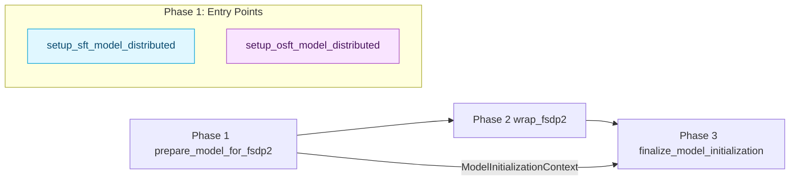
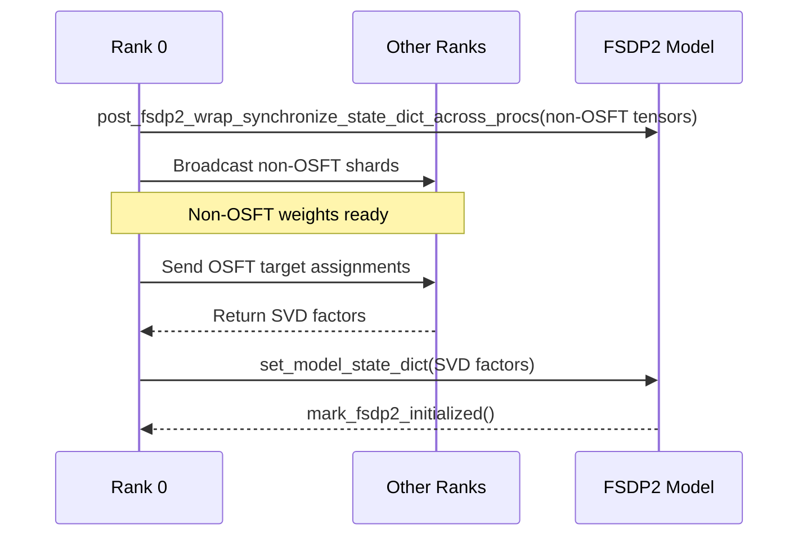

## Distributed Initialization (SFT & OSFT)

Mini Trainer exposes a memory-efficient loading strategy for large models by splitting initialization into three phases. This document focuses on the contributor-facing details behind the lazy-init + FSDP2 flow used by both SFT and OSFT.

### Overview



1. **Phase 1 – `prepare_model_for_fsdp2`**
   - Detects whether the model was created via `setup_sft_model_distributed` (SFT) or `setup_osft_model_distributed` (OSFT).
   - Rank 0 loads the full checkpoint on CPU, records the state dict + buffers, and stores that payload inside `ModelInitializationContext`.
   - All other ranks instantiate the model on the `meta` device and rely on the context for later population.
2. **Phase 2 – `wrap_fsdp2`**
   - Applies activation checkpointing to each transformer block, builds the device mesh, and calls `fully_shard` on both individual blocks and the top-level module.
   - No weight loading happens here; it only prepares the structure for sharded weights.
3. **Phase 3 – `finalize_model_initialization`**
   - Consumes the context from Phase 1 to populate the sharded parameters:
     - SFT: broadcasts the entire state dict after performing dtype conversions on rank 0.
     - OSFT: handles non-OSFT tensors first, then launches distributed SVD to populate OSFT factors.

### SFT Path

- Entry point: [`setup_sft_model_distributed`](../src/mini_trainer/setup_model_for_training.py)
- Rank 0 loads the pretrained model, aligns tokenizer tokens, saves `state_dict` + buffers, then deletes the large model to free memory.
- `_synchronize_state_dict_fsdp2` is used in Phase 3 to broadcast the state dict through the FSDP2 shards. Once finished, all tensor references are released to keep the memory footprint flat.

### OSFT Path

- Entry point: [`setup_osft_model_distributed`](../src/mini_trainer/setup_model_for_training.py)
- The OSFT wrapper (`create_osft_model_class`) creates meta tensors, registers logical keys, and retains rank 0’s dense parameters inside `model._lazy_init_og_state_dict`.
- During finalization:
  1. `post_fsdp2_wrap_synchronize_state_dict_across_procs` broadcasts every **non-OSFT** tensor (embedding tables, layer norms, etc.).
  2. `compute_distributed_svd` carves out each OSFT target from the rank‑0 payload, assigns shards of work to every rank, and returns the SVD factor tensors to rank 0.
  3. The caller feeds those factors into `set_model_state_dict`, ensuring each shard receives the appropriate high-/low-rank parameters.
  4. `mark_fsdp2_initialized` clears the lazy flags so optimizers and checkpoint saves treat the model as fully materialized.



### Putting It Together

Most training scripts follow the template below:

```python
context = prepare_model_for_fsdp2(model, tokenizer, base_model_args, ...)
model = wrap_fsdp2(model)
model = finalize_model_initialization(model, context)
```

Switch between SFT and OSFT by toggling the CLI flags (`--osft`, `--osft-unfreeze-rank-ratio`, etc.). Both paths reuse the same Phase 2/3 implementation, so the rest of the training loop stays identical.
