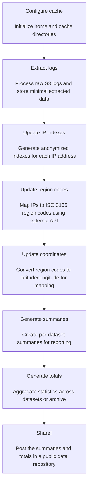

<div align="center">
  <picture>
    
  </picture>

<h1>S3 Log Extraction</h1>
<p>
    <a href="https://pypi.org/project/s3-log-extraction/"></a>
    <a href="https://pypi.org/project/s3-log-extraction/"></a>
    <a href="https://codecov.io/github/dandi/s3-log-extraction?branch=main"></a>
    <a href="https://github.com/dandi/s3-log-extraction/actions/workflows/daily_tests.yml/badge.svg"></a>
    <a href="https://github.com/dandi/s3-log-extraction/actions/workflows/daily_remote_tests.yml/badge.svg"></a>
</p>
<p>
    <a href="https://pypi.org/project/s3-log-extraction/"></a>
    <a href="https://github.com/dandi/s3-log-extraction/blob/main/LICENSE.txt"></a>
    <a href="https://zenodo.org/badge/latestdoi/826995164"></a>
</p>
<p>
    <a href="https://github.com/psf/black"></a>
    <a href="https://github.com/astral-sh/ruff"></a>
</p>
</div>

Fast extraction of access summary data from S3 logs.

Originally developed for the [DANDI Archive](https://dandiarchive.org/).

Read more about [S3 logging on AWS](https://web.archive.org/web/20240807191829/https://docs.aws.amazon.com/AmazonS3/latest/userguide/LogFormat.html).

⚠️ This package currently only supports processing of access data (`GET`-type requests); if you wish to use this package for other types of requests (`PUT`/`DELETE`/`HEAD`, etc.) please reach out by raising an issue. ⚠️


## Installation

```bash
pip install s3-log-extraction
```

**Note for Windows users:** This package requires GAWK and is not natively supported on Windows. Windows users should use [Windows Subsystem for Linux (WSL)](https://docs.microsoft.com/en-us/windows/wsl/install) to run this package.


# Workflow




## Generic Usage

[Optional] Configure a non-default cache directory on a mounted disk that has sufficient space (the default is placed under `~/.cache`). This will be the main location where extracted logs and other useful information will be stored.

```bash
s3logextraction config cache set <new cache directory>
```

To extract the logs:

```bash
s3logextraction extract <log directory>
```

**NOTE**: If you feel like this command is taking a long time on your system, DO NOT interrupt it via `ctrl+C` or `pkill`. Instead, you can safely interrupt it by running:

```bash
s3logextraction stop
```

This will allow it to finish processing the current batch of logs and then exit gracefully.

After your logs are extracted, generate anonymized indexes for each IP address:

```bash
s3logextraction update ip indexes
````

Next, ensure some required environment variables related to external services are set:

1. **IPINFO_API_KEY**
   - Access token for the [ipinfo.io](https://ipinfo.io) service.
   - Extracts geographic region information in ISO 3166 format (e.g. "US/California") for anonymized statistics.
2. **OPENCAGE_API_KEY**
   - Access token for the [opencagedata.com](https://opencagedata.com/) service.
   - Maps the ISO 3166 codes from the first step to latitude and longitude coordinates for the geographic heat maps used in visualizations.

```bash
export IPINFO_API_KEY="your_token_here"
export OPENCAGE_API_KEY="your_token_here"
```

To update the region codes and their coordinates:

```bash
s3logextraction update ip regions
s3logextraction update ip coordinates
```

To generate top-level summaries and totals (that is, per dataset):

```bash
s3logextraction update summaries
s3logextraction update totals
```

Finally, to generate archive-wide summaries and totals:

```bash
s3logextraction update summaries --mode archive
s3logextraction update totals --mode archive
```


## How to Setup Logging

If you're new to using AWS S3 buckets and haven't yet enabled the logging this project utilizes, you can follow these simple instructions to get started.

1) Log into your AWS console.
2) Create a new **PRIVATE** S3 bucket - typically the name of the new bucket is the name of the one you wish to enable logging on with `-logs` added to the end. For example, `dandiarchive-logs`.
   - **NEVER** share this bucket publicly as it contains sensitive information.
3) Navigate back to the S3 bucket you wish to enable logging on.
4) Under the `Properties` tab, scroll down to the section called `Server access logging` and select `Edit`.
5) Toggle the selection to `Enable`, then specify the destination where logs will be stored as the new S3 bucket you created in step (2).
6) Recommended:
   - Specify the `Log object key format` as the nested pattern shown below.
   - Ensure the `Source of date used in log object key format` is the `S3 event time`.
    


## Developer Notes

Throughout the codebase, various processes are referred to in the following ways:

- parallelized: The process can be run in parallel across multiple workers, which increases throughput.
- interruptible: The process can be safely interrupted (`ctrl+C` or `pkill`) with only a very low chance of causing corruption. For parallelized interruption you may have to either `pkill` the main dispatch process or spam `ctrl+C` multiple times.
- updatable: The process can be resumed from the last checkpoint without losing any progress. It can also be run fresh at different times, such as on a CRON cycle, and it will only interact with unprocessed data.

### Performance

By leveraging `GAWK`, this version of the S3 log handling is considerably more efficient than the previous attempts.

The previous attempt used a multistep process which took several days to run (even on multiple workers). It also required an additional ~200 GB cache to allow lazy updates of the per-object bins.

This version requires no intermediate cache, stores only the minimal amount of data to be shared, and takes less than a day to do a fresh run (and is also lazy regarding daily CRON updates).

### Validation

In lieu of attempting fully validated parsing of each and every line from the log files (which is a hard, unsolved problem - see [s3-log-parser](https://github.com/dandi/s3-log-parser)), we instead validate the heuristics in a targeted manner through specific validation scripts.

These can also be used to verify the current state of the extraction process, such as warning about corrupt records or incomplete cache files.

### Submission of line decoding errors

Should you discover any lines in your S3 log files that cause failures in the codebase, please email them to the core maintainer (cody.c.baker.phd@gmail.com) before raising issues or submitting PRs contributing them as examples, to more easily correct any aspects that might require anonymization.
