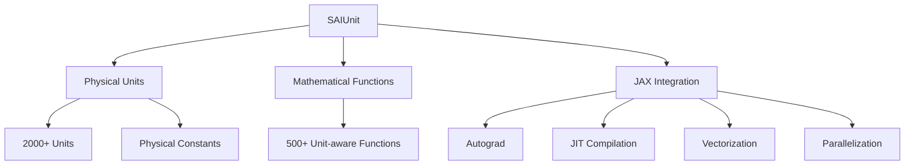

<p align="center">
  	
</p> 


<p align="center">
	<a href="https://pypi.org/project/saiunit/"></a>
	<a href="https://github.com/chaobrain/saiunit/blob/main/LICENSE"></a>
    <a href='https://saiunit.readthedocs.io/?badge=latest'>
        
    </a>  	
    <a href="https://badge.fury.io/py/saiunit"></a>
    <a href="https://github.com/chaobrain/saiunit/actions/workflows/CI.yml"></a>
    <a href="https://pepy.tech/projects/saiunit"></a>
</p>


## Motivation

[SAIUnit](https://github.com/chaobrain/saiunit) (/saɪ ˈjuːnɪt/) is designed to provide physical units and unit-aware mathematical systems tailored for **S**cientific **AI** within JAX. In this context, Scientific AI refers to the use of AI models or tools to advance scientific computations. SAIUnit evolves from our [BrainUnit](https://github.com/chaobrain/brainunit), a unit framework originally developed for brain dynamics modeling, extending its capabilities to support a broader range of scientific computing applications. SAIUnit is committed to providing rigorous and automatic physical unit conversion and analysis system for general AI-driven scientific computing. 


## Features

Compared to existing unit libraries, such as [Quantities](https://github.com/python-quantities/python-quantities) and [Pint](https://github.com/hgrecco/pint), SAIUnit introduces a rigorous physical unit system specifically designed to support AI computations (e.g., automatic differentiation, just-in-time compilation, and parallelization). Its unique advantages include:

- Integration of over 2,000 commonly used physical units and constants
- Implementation of more than 500 unit-aware mathematical functions
- Deep integration with JAX, providing comprehensive support for modern AI framework features including automatic differentiation (autograd), just-in-time compilation (JIT), vectorization, and parallel computation
- Unit conversion and analysis are performed at compilation time, resulting in zero runtime overhead
- Strict physical unit type checking and dimensional inference system, detecting unit inconsistencies during compilation




We hope these features establish SAIUnit as a reliable physical unit handling solution for general AI-driven scientific computing scenarios.

A quick example:

```python

import saiunit as u

# Define a physical quantity
x = 3.0 * u.meter
x
# [out] 3. * meter

# autograd
f = lambda x: x ** 3
u.autograd.grad(f)(x)
# [out] 27. * meter2 


# JIT
import jax
jax.jit(f)(x)
# [out] 27. * klitre

# vmap
jax.vmap(f)(u.math.arange(0. * u.mV, 10. * u.mV, 1. * u.mV))
# [out]  ArrayImpl([  0.,   1.,   8.,  27.,  64., 125., 216., 343., 512., 729.]) * mvolt3
```


## Installation

``saiunit`` has been well tested on ``python>=3.9`` + ``jax>=0.4.30`` environments, and can be installed on Windows, Linux, and MacOS.

You can install ``saiunit`` via pip:

```bash
pip install saiunit --upgrade
```

which should install in about 1 minute. If you want to install the latest version from the source, you can clone the repository and install it:

```bash
git clone https://github.com/chaobrain/saiunit.git
cd saiunit
pip install -e .
```

Alternatively, you can install `BrainX`, which bundles `saiunit` with other compatible packages for a comprehensive brain modeling ecosystem:

```bash
pip install BrainX -U
```

## Documentation

The official documentation is hosted on Read the Docs: [https://saiunit.readthedocs.io](https://saiunit.readthedocs.io)


## Citation

```bibtex
@article{wang2025integrating,
  title={Integrating physical units into high-performance AI-driven scientific computing},
  author={Wang, Chaoming and He, Sichao and Luo, Shouwei and Huan, Yuxiang and Wu, Si},
  journal={Nature Communications},
  volume={16},
  number={1},
  pages={3609},
  year={2025},
  publisher={Nature Publishing Group UK London},
  url={https://doi.org/10.1038/s41467-025-58626-4}
}
```


## Ecosystem

`saiunit` has been deeply integrated into following diverse projects, such as:

- [``brainstate``](https://github.com/chaobrain/brainstate): A State-based Transformation System for Program Compilation and Augmentation
- [``braintaichi``](https://github.com/chaobrain/braintaichi): Leveraging Taichi Lang to customize brain dynamics operators
- [``braintools``](https://github.com/chaobrain/braintools): The Common Toolbox for Brain Dynamics Programming.
- [``dendritex``](https://github.com/chaobrain/dendritex): Dendritic Modeling in JAX
- [``pinnx``](https://github.com/chaobrain/pinnx): Physics-Informed Neural Networks for Scientific Machine Learning in JAX.


Other unofficial projects include:

- [``diffrax``](https://github.com/chaoming0625/diffrax): Numerical differential equation solvers in JAX.
- [``jax-md``](https://github.com/Routhleck/jax-md): Differentiable Molecular Dynamics in JAX
- [``Catalax``](https://github.com/Routhleck/Catalax): JAX-based framework to model biological systems
- ...


## Acknowledgement

The initial version of the project benefited a lot from the following projects:

- [``astropy.units``](https://docs.astropy.org/en/stable/units/index.html): physical units in ``astropy``.
- [``brian2.units``](https://brian2.readthedocs.io/en/stable/user/units.html): physical units in ``brian2``.

